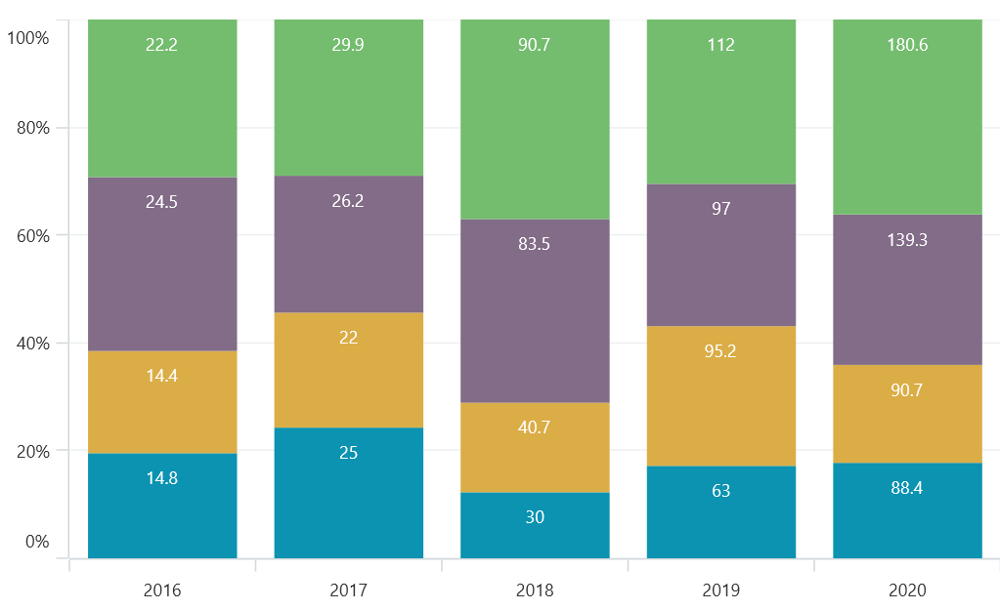

# Column Chart in .NET MAUI Chart

## Column Chart

Column chart is used to plot discrete rectangles for the given data point values. To render a column chart, create an instance of [ColumnSeries](https://help.syncfusion.com/cr/maui/Syncfusion.Maui.Charts.ColumnSeries.html?tabs=tabid-1), and add it to the [Series](https://help.syncfusion.com/cr/maui/Syncfusion.Maui.Charts.SfCartesianChart.html#Syncfusion_Maui_Charts_SfCartesianChart_Series) collection property of [SfCartesianChart](https://help.syncfusion.com/cr/maui/Syncfusion.Maui.Charts.SfCartesianChart.html?tabs=tabid-1).

N> The cartesian chart has [Series](https://help.syncfusion.com/cr/maui/Syncfusion.Maui.Charts.SfCartesianChart.html#Syncfusion_Maui_Charts_SfCartesianChart_Series) as its default content.





<chart:SfCartesianChart>

    <chart:SfCartesianChart.XAxes>
        <chart:CategoryAxis />
    </chart:SfCartesianChart.XAxes>

    <chart:SfCartesianChart.YAxes>
        <chart:NumericalAxis />
    </chart:SfCartesianChart.YAxes>   

    <chart:ColumnSeries ItemsSource="{Binding Data}"
						XBindingPath="XValue"
						YBindingPath="YValue"/>

</chart:SfCartesianChart>





SfCartesianChart chart = new SfCartesianChart();
CategoryAxis primaryAxis = new CategoryAxis();
chart.XAxes.Add(primaryAxis);
NumericalAxis secondaryAxis = new NumericalAxis();
chart.YAxes.Add(secondaryAxis);

ColumnSeries series = new ColumnSeries()
{
    ItemsSource = new ViewModel().Data,
    XBindingPath = "XValue",
    YBindingPath = "YValue",
};

chart.Series.Add(series);
this.Content = chart;





### Spacing and Width

The [Spacing](https://help.syncfusion.com/cr/maui/Syncfusion.Maui.Charts.ColumnSeries.html#Syncfusion_Maui_Charts_ColumnSeries_Spacing) property is used to change the spacing between two segments. The default value of spacing is 0, and the value ranges from 0 to 1. Here, 1 and 0 correspond to 100% and 0% of the available space, respectively. 

The [Width](https://help.syncfusion.com/cr/maui/Syncfusion.Maui.Charts.ColumnSeries.html#Syncfusion_Maui_Charts_ColumnSeries_Width) property is used to change the width of the rectangle. The default value of the width is 0.8, and the value ranges from 0 to 1.





<chart:SfCartesianChart>

    <chart:SfCartesianChart.XAxes>
        <chart:CategoryAxis />
    </chart:SfCartesianChart.XAxes>

    <chart:SfCartesianChart.YAxes>
        <chart:NumericalAxis />
    </chart:SfCartesianChart.YAxes>  

    <chart:ColumnSeries ItemsSource="{Binding Data}"
						XBindingPath="XValue"
						YBindingPath="YValue"
						Spacing="0.5"
						Width="0.6"/>

</chart:SfCartesianChart>





SfCartesianChart chart = new SfCartesianChart();
CategoryAxis primaryAxis = new CategoryAxis();
chart.XAxes.Add(primaryAxis);
NumericalAxis secondaryAxis = new NumericalAxis();
chart.YAxes.Add(secondaryAxis);

ColumnSeries series = new ColumnSeries()
{
    ItemsSource = new ViewModel().Data,
    XBindingPath = "XValue",
    YBindingPath = "YValue",
    Spacing = 0.5,
    Width = 0.6
};

chart.Series.Add(series);
this.Content = chart;





## Range Column Chart

Range Column Chart is used to visualize data points with columns, with the height of each column representing the difference between the lowest and highest values of the data point. 

To render a range column chart, create an instance of [RangeColumnSeries](https://help.syncfusion.com/cr/maui/Syncfusion.Maui.Charts.RangeColumnSeries.html), and add it to the [Series](https://help.syncfusion.com/cr/maui/Syncfusion.Maui.Charts.SfCartesianChart.html#Syncfusion_Maui_Charts_SfCartesianChart_Series) collection property of [SfCartesianChart](https://help.syncfusion.com/cr/maui/Syncfusion.Maui.Charts.SfCartesianChart.html?tabs=tabid-1).

Since the [RangeColumnSeries](https://help.syncfusion.com/cr/maui/Syncfusion.Maui.Charts.RangeColumnSeries.html) requires two Y values for each point, your data should contain both the high and low values. These high and low values specify the maximum and minimum ranges of the point.

N> The Cartesian chart has [Series](https://help.syncfusion.com/cr/maui/Syncfusion.Maui.Charts.SfCartesianChart.html#Syncfusion_Maui_Charts_SfCartesianChart_Series) as its default content.





<chart:SfCartesianChart>

    <chart:SfCartesianChart.XAxes>
        <chart:CategoryAxis />
    </chart:SfCartesianChart.XAxes>

    <chart:SfCartesianChart.YAxes>
        <chart:NumericalAxis />
    </chart:SfCartesianChart.YAxes>   

    <chart:RangeColumnSeries ItemsSource="{Binding Data}"
			     XBindingPath="XValue"
                             High="HighValue"
			     Low="LowValue"/>

</chart:SfCartesianChart>





SfCartesianChart chart = new SfCartesianChart();
CategoryAxis primaryAxis = new CategoryAxis();
chart.XAxes.Add(primaryAxis);
NumericalAxis secondaryAxis = new NumericalAxis();
chart.YAxes.Add(secondaryAxis);

RangeColumnSeries series = new RangeColumnSeries()
{
    ItemsSource = new ViewModel().Data,
    XBindingPath = "XValue",
    High="HighValue",
    Low="LowValue",
};

chart.Series.Add(series);
this.Content = chart;





### Spacing and Width

The [Spacing](https://help.syncfusion.com/cr/maui/Syncfusion.Maui.Charts.RangeColumnSeries.html#Syncfusion_Maui_Charts_RangeColumnSeries_Spacing) property is used to change the spacing between two segments. The default value of spacing is 0, and the value ranges from 0 to 1. Here, 1 and 0 correspond to 100% and 0% of the available space, respectively. 

The [Width](https://help.syncfusion.com/cr/maui/Syncfusion.Maui.Charts.RangeColumnSeries.html#Syncfusion_Maui_Charts_RangeColumnSeries_Width) property is used to change the width of the segment. The default value of the width is 0.8, and the value ranges from 0 to 1.





<chart:SfCartesianChart>

    <chart:SfCartesianChart.XAxes>
        <chart:CategoryAxis />
    </chart:SfCartesianChart.XAxes>

    <chart:SfCartesianChart.YAxes>
        <chart:NumericalAxis />
    </chart:SfCartesianChart.YAxes>  
    
    <chart:RangeColumnSeries ItemsSource="{Binding Data}"
			     XBindingPath="XValue"
                             High="HighValue"
			     Low="LowValue"
                             Spacing="0.3"
		             Width="0.7"/>
</chart:SfCartesianChart>





SfCartesianChart chart = new SfCartesianChart();
CategoryAxis primaryAxis = new CategoryAxis();
chart.XAxes.Add(primaryAxis);
NumericalAxis secondaryAxis = new NumericalAxis();
chart.YAxes.Add(secondaryAxis);

RangeColumnSeries series = new RangeColumnSeries()
{
    ItemsSource = new ViewModel().Data,
    XBindingPath = "XValue",
    High="HighValue",
    Low="LowValue",
    Spacing = 0.3,
    Width = 0.7,
};

chart.Series.Add(series);
this.Content = chart;





## Stacked Column 

The stacked column chart represents data values in a stacked format, where the columns are stacked on each other to indicate the cumulative value of the data points.

To render a stacked column chart, create an instance of the [StackingColumnSeries](https://help.syncfusion.com/cr/maui/Syncfusion.Maui.Charts.StackingColumnSeries.html) and add it to the [Series](https://help.syncfusion.com/cr/maui/Syncfusion.Maui.Charts.SfCartesianChart.html#Syncfusion_Maui_Charts_SfCartesianChart_Series) collection property of the [SfCartesianChart](https://help.syncfusion.com/cr/maui/Syncfusion.Maui.Charts.SfCartesianChart.html?tabs=tabid-1).

N> The Cartesian chart has [Series](https://help.syncfusion.com/cr/maui/Syncfusion.Maui.Charts.SfCartesianChart.html#Syncfusion_Maui_Charts_SfCartesianChart_Series) as its default content.





<chart:SfCartesianChart>

    <chart:SfCartesianChart.XAxes>
    <chart:CategoryAxis />
    </chart:SfCartesianChart.XAxes>

    <chart:SfCartesianChart.YAxes>
        <chart:NumericalAxis />
    </chart:SfCartesianChart.YAxes>

    <chart:StackingColumnSeries ItemsSource="{Binding Data}"
                                XBindingPath="Name"
                                YBindingPath="Value"        
    </chart:StackingColumnSeries>

    <chart:StackingColumnSeries ItemsSource="{Binding Data1}"
                                XBindingPath="Name"
                                YBindingPath="Value"         
    </chart:StackingColumnSeries>

</chart:SfCartesianChart>





SfCartesianChart chart = new SfCartesianChart();
CategoryAxis primaryAxis = new CategoryAxis();
chart.XAxes.Add(primaryAxis);
NumericalAxis secondaryAxis = new NumericalAxis();
chart.YAxes.Add(secondaryAxis);

StackingColumnSeries  series = new  StackingColumnSeries()
{
    XBindingPath = "Name",
    YBindingPath = "Value",
    ItemsSource = new ViewModel().Data
};
StackingColumnSeries series1 = new StackingColumnSeries()
{
    XBindingPath = "Name",
    YBindingPath = "Value",
    ItemsSource = new ViewModel().Data1
};

chart.Series.Add(series);
chart.Series.Add(series1);     
this.Content = chart;





### Grouping Series

Each series in a stacked chart with several series may be difficult to compare. To solve that problem, grouping is used.
The [GroupingLabel](https://help.syncfusion.com/cr/maui/Syncfusion.Maui.Charts.StackingSeriesBase.html#Syncfusion_Maui_Charts_StackingSeriesBase_GroupingLabel) property used to group the series, which allows users to assign a label to each stacked column series. This label identifies the specific group to which the stacked column series belongs and can be used to group similar series.

N> If the [GroupingLabel](https://help.syncfusion.com/cr/maui/Syncfusion.Maui.Charts.StackingSeriesBase.html#Syncfusion_Maui_Charts_StackingSeriesBase_GroupingLabel) is not provided, the stacked column will consider all series as a single group.





<chart:SfCartesianChart>
   
    ....

    <chart:StackingColumnSeries XBindingPath="Name"
                                YBindingPath="Value"
                                ItemsSource="{Binding Data}"
                                GroupingLabel="GroupOne"
    </chart:StackingColumnSeries>

    <chart:StackingColumnSeries XBindingPath="Name"
                                YBindingPath="Value"
                                ItemsSource="{Binding Data1}"
                                GroupingLabel="GroupTwo"
    </chart:StackingColumnSeries>

    <chart:StackingColumnSeries XBindingPath="Name"
                                YBindingPath="Value"
                                ItemsSource="{Binding Data2}"
                                GroupingLabel="GroupOne"
    </chart:StackingColumnSeries>

</chart:SfCartesianChart>





SfCartesianChart chart = new SfCartesianChart();
CategoryAxis primaryAxis = new CategoryAxis();
chart.XAxes.Add(primaryAxis);
NumericalAxis secondaryAxis = new NumericalAxis();
chart.YAxes.Add(secondaryAxis);

StackingColumnSeries  series = new  StackingColumnSeries()
{
    XBindingPath = "Name",
    YBindingPath = "Value",
    ItemsSource = new ViewModel().Data,
    GroupingLabel="GroupOne"
};
StackingColumnSeries series1 = new StackingColumnSeries()
{
    XBindingPath = "Name",
    YBindingPath = "Value",
    ItemsSource = new ViewModel().Data1,
    GroupingLabel="GroupTwo"
};
StackingColumnSeries  series = new  StackingColumnSeries()
{
    XBindingPath = "Name",
    YBindingPath = "Value",
    ItemsSource = new ViewModel().Data2,
    GroupingLabel="GroupOne"
};

chart.Series.Add(series);
chart.Series.Add(series1);     
this.Content = chart;





### Appearance customization

* [Spacing](https://help.syncfusion.com/cr/maui/Syncfusion.Maui.Charts.StackingColumnSeries.html#Syncfusion_Maui_Charts_StackingColumnSeries_Spacing) of the `Double` type is used to change the spacing between two segments. The default spacing value is 0, ranging from 0 to 1.
* [Width](https://help.syncfusion.com/cr/maui/Syncfusion.Maui.Charts.StackingColumnSeries.html#Syncfusion_Maui_Charts_StackingColumnSeries_Width) of the `Double` type is used to change the width of the rectangle. The default value of the width is 0.8, and the value ranges from 0 to 1.
* [CornerRadius](https://help.syncfusion.com/cr/maui/Syncfusion.Maui.Charts.StackingColumnSeries.html#Syncfusion_Maui_Charts_StackingColumnSeries_CornerRadius) of the type `CornerRadius`, indicates the rounded corner for the stacked column.
* [Stroke](https://help.syncfusion.com/cr/maui/Syncfusion.Maui.Charts.StackingColumnSeries.html#Syncfusion_Maui_Charts_StackingColumnSeries_Stroke) of the type `Brush` indicates the brush used to paint the border of the stacked column.
* [StrokeWidth](https://help.syncfusion.com/cr/maui/Syncfusion.Maui.Charts.XYDataSeries.html#Syncfusion_Maui_Charts_XYDataSeries_StrokeWidth) of the type `Double` indicates the width of the stacked segment.

## StackedColumn100 Chart 

The Stacked column 100 % series chart is a type of Stacked chart that is used to display the proportion of different categories within a single column. The columns are stacked on top of each other, and a cumulative portion of each stacked element always comes to a total of 100%.

To render the StackedColumn100 chart, create an instance of the [StackingColumn100Series](https://help.syncfusion.com/cr/maui/Syncfusion.Maui.Charts.StackingColumn100Series.html), and add it to the [Series](https://help.syncfusion.com/cr/maui/Syncfusion.Maui.Charts.SfCartesianChart.html#Syncfusion_Maui_Charts_SfCartesianChart_Series) collection property of the [SfCartesianChart](https://help.syncfusion.com/cr/maui/Syncfusion.Maui.Charts.SfCartesianChart.html?tabs=tabid-1).

N> The cartesian chart has [Series](https://help.syncfusion.com/cr/maui/Syncfusion.Maui.Charts.SfCartesianChart.html#Syncfusion_Maui_Charts_SfCartesianChart_Series) as its default content.





<chart:SfCartesianChart>

    <chart:SfCartesianChart.XAxes>
        <chart:CategoryAxis/>
    </chart:SfCartesianChart.XAxes>

    <chart:SfCartesianChart.YAxes>
        <chart:NumericalAxis/>
    </chart:SfCartesianChart.YAxes>   

    <chart:StackingColumn100Series ItemsSource="{Binding Data}"
                                   XBindingPath="Name"
                                   YBindingPath="Value"/>

    <chart:StackingColumn100Series ItemsSource="{Binding Data1}"
                                   XBindingPath="Name"
                                   YBindingPath="Value"/>

    <chart:StackingColumn100Series ItemsSource="{Binding Data2}"
                                   XBindingPath="Name"
                                   YBindingPath="Value"/>

</chart:SfCartesianChart>





    SfCartesianChart chart = new SfCartesianChart();
    CategoryAxis primaryAxis = new CategoryAxis();
    chart.XAxes.Add(primaryAxis);
    NumericalAxis secondaryAxis = new NumericalAxis();
    chart.YAxes.Add(secondaryAxis);

    StackingColumn100Series series = new StackingColumn100Series()
    {
        ItemsSource = new ViewModel().Data,
        XBindingPath = "Name",
        YBindingPath = "Value",
    };
    StackingColumn100Series series1 = new StackingColumn100Series()
    {
        ItemsSource = new ViewModel().Data1,
        XBindingPath = "Name",
        YBindingPath = "Value",
    };
    StackingColumn100Series series2 = new StackingColumn100Series()
    {
        ItemsSource = new ViewModel().Data2,
        XBindingPath = "Name",
        YBindingPath = "Value",
    };
 
    chart.Series.Add(series);
    chart.Series.Add(series1);
    chart.Series.Add(series2);
    this.Content = chart;





### Grouping Series 

We can group and stack the similar stacked column 100 series type using the [GroupingLabel](https://help.syncfusion.com/cr/maui/Syncfusion.Maui.Charts.StackingSeriesBase.html#Syncfusion_Maui_Charts_StackingSeriesBase_GroupingLabel) property. 





<chart:SfCartesianChart>

    <chart:SfCartesianChart.XAxes>
        <chart:CategoryAxis/>
    </chart:SfCartesianChart.XAxes>

    <chart:SfCartesianChart.YAxes>
        <chart:NumericalAxis/>
    </chart:SfCartesianChart.YAxes>   

    <chart:StackingColumn100Series ItemsSource="{Binding Data}"
                                   XBindingPath="XValue"
                                   YBindingPath="YValue"
                                   GroupingLabel="GroupOne"/>

    <chart:StackingColumn100Series ItemsSource="{Binding Data1}"
                                   XBindingPath="XValue"
                                   YBindingPath="YValue"
                                   GroupingLabel="GroupOne"/>

    <chart:StackingColumn100Series ItemsSource="{Binding Data2}"
                                   XBindingPath="XValue"
                                   YBindingPath="YValue"
                                   GroupingLabel="GroupTwo"/>

    <chart:StackingColumn100Series ItemsSource="{Binding Data3}"
                                   XBindingPath="XValue"
                                   YBindingPath="YValue"
                                   GroupingLabel="GroupTwo"/>

</chart:SfCartesianChart>





    SfCartesianChart chart = new SfCartesianChart();
    CategoryAxis primaryAxis = new CategoryAxis();
    chart.XAxes.Add(primaryAxis);
    NumericalAxis secondaryAxis = new NumericalAxis();
    chart.YAxes.Add(secondaryAxis);

    StackingColumn100Series series = new StackingColumn100Series()
    {
        ItemsSource = new ViewModel().Data,
        XBindingPath = "XValue",
        YBindingPath = "YValue",
        GroupingLabel="GroupOne"
    };
    StackingColumn100Series series1 = new StackingColumn100Series()
    {
        ItemsSource = new ViewModel().Data1,
        XBindingPath = "XValue",
        YBindingPath = "YValue",
        GroupingLabel="GroupOne"
    };
    StackingColumn100Series series2 = new StackingColumn100Series()
    {
        ItemsSource = new ViewModel().Data2,
        XBindingPath = "XValue",
        YBindingPath = "YValue",
        GroupingLabel="GroupTwo"
    };
    StackingColumn100Series series3 = new StackingColumn100Series()
    {
        ItemsSource = new ViewModel().Data3,
        XBindingPath = "XValue",
        YBindingPath = "YValue",
        GroupingLabel="GroupTwo"
    };

    chart.Series.Add(series);
    chart.Series.Add(series1);
    chart.Series.Add(series2);
    chart.Series.Add(series3);
    this.Content = chart;



