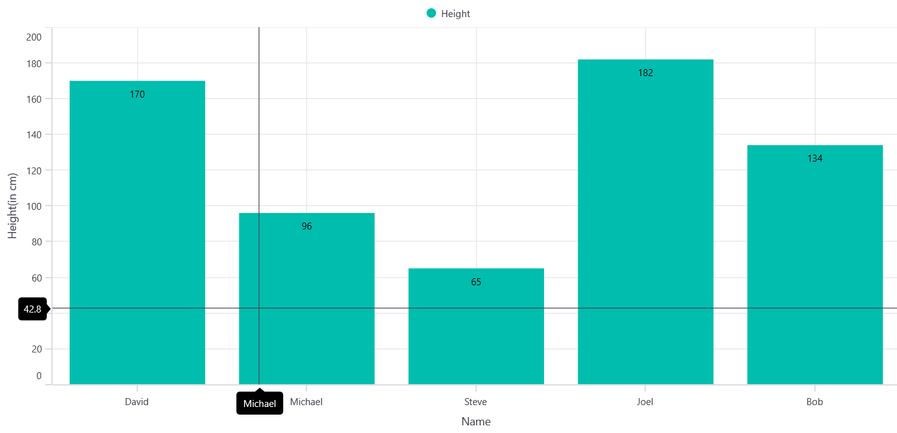
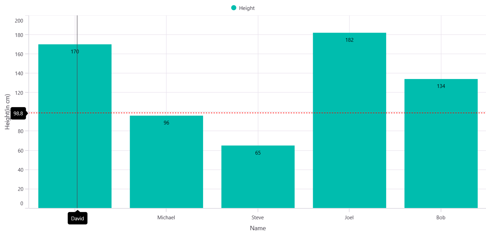
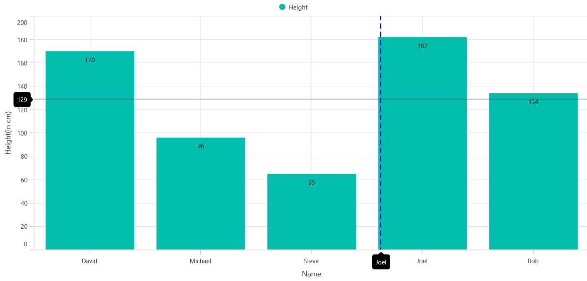
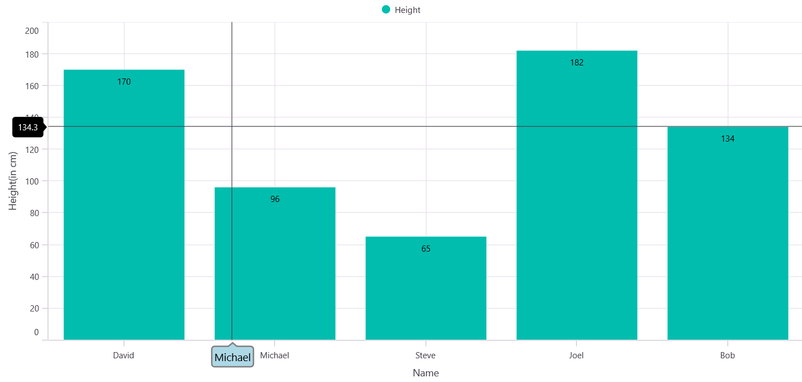

# Crosshair in .NET MAUI Cartesian Chart

Crosshair allows you to view exact values on the chart by showing vertical and horizontal lines at the interaction point. These lines help you read the corresponding axis values clearly. On mobile, long‑press the chart to show the crosshair and drag to change its position. On desktop, move the cursor over the chart area to display the crosshair.

## Enable Crosshair

To enable the crosshair in the chart, create an instance of the [ChartCrosshairBehavior](https://help.syncfusion.com/cr/maui/Syncfusion.Maui.Charts.ChartCrosshairBehavior.html) and set it to the [CrosshairBehavior](https://help.syncfusion.com/cr/maui/Syncfusion.Maui.Charts.SfCartesianChart.html#Syncfusion_Maui_Charts_SfCartesianChart_CrosshairBehavior) property of [SfCartesianChart](https://help.syncfusion.com/cr/maui/Syncfusion.Maui.Charts.SfCartesianChart.html).

N> **Prerequisite:** Ensure that the required NuGet package is installed, the necessary namespaces are imported, and the **SfCartesianChart** control is properly configured in your application. For detailed setup and configuration instructions, refer to the **[Getting Started](https://help.syncfusion.com/maui/cartesian-charts/getting-started)** guide.





<chart:SfCartesianChart>
    <!-- code omitted for brevity -->
    <chart:SfCartesianChart.CrosshairBehavior>
        <chart:ChartCrosshairBehavior/>
    </chart:SfCartesianChart.CrosshairBehavior>
</chart:SfCartesianChart>





SfCartesianChart chart = new SfCartesianChart();

ChartCrosshairBehavior crosshair = new ChartCrosshairBehavior();
chart.CrosshairBehavior = crosshair;
// code omitted for brevity
this.Content = chart;





## Show crosshair axis labels

To view the axis labels, set the [ShowTrackballLabel](https://help.syncfusion.com/cr/maui/Syncfusion.Maui.Charts.ChartAxis.html#Syncfusion_Maui_Charts_ChartAxis_ShowTrackballLabel) property to `true` as shown in the following code snippet. The default value of the [ChartAxis.ShowTrackballLabel](https://help.syncfusion.com/cr/maui/Syncfusion.Maui.Charts.ChartAxis.html#Syncfusion_Maui_Charts_ChartAxis_ShowTrackballLabel) is `false`.





<chart:SfCartesianChart>
    <!-- code omitted for brevity -->
    <chart:SfCartesianChart.CrosshairBehavior>
        <chart:ChartCrosshairBehavior/>
    </chart:SfCartesianChart.CrosshairBehavior> 
   
    <chart:SfCartesianChart.XAxes>
        <chart:CategoryAxis ShowTrackballLabel="True"/>
    </chart:SfCartesianChart.XAxes>

    <chart:SfCartesianChart.YAxes>
        <chart:NumericalAxis ShowTrackballLabel="True"/>
    </chart:SfCartesianChart.YAxes>
    <!-- code omitted for brevity -->
</chart:SfCartesianChart>





SfCartesianChart chart = new SfCartesianChart();

ChartCrosshairBehavior crosshair = new ChartCrosshairBehavior();
chart.CrosshairBehavior = crosshair;

CategoryAxis chartXAxis = new CategoryAxis()
{
    ShowTrackballLabel = true
};

NumericalAxis chartYAxis = new NumericalAxis()
{
    ShowTrackballLabel = true
};
chart.XAxes.Add(chartXAxis);
chart.YAxes.Add(chartYAxis);
// code omitted for brevity
this.Content = chart;





## Horizontal and Vertical Line Customization

When you add the [ChartCrosshairBehavior](https://help.syncfusion.com/cr/maui/Syncfusion.Maui.Charts.ChartCrosshairBehavior.html) to a chart, horizontal and vertical lines appear. These lines can be customized individually using the [HorizontalLineStyle](https://help.syncfusion.com/cr/maui/Syncfusion.Maui.Charts.ChartCrosshairBehavior.html#Syncfusion_Maui_Charts_ChartCrosshairBehavior_HorizontalLineStyle) and [VerticalLineStyle](https://help.syncfusion.com/cr/maui/Syncfusion.Maui.Charts.ChartCrosshairBehavior.html#Syncfusion_Maui_Charts_ChartCrosshairBehavior_VerticalLineStyle) properties.

The appearance of the crosshair lines can be customized using the following properties. These properties apply to both the horizontal and vertical line styles.

* [StrokeWidth](https://help.syncfusion.com/cr/maui/Syncfusion.Maui.Charts.ChartLineStyle.html#Syncfusion_Maui_Charts_ChartLineStyle_StrokeWidth), of type `double`, used to change the stroke width of the line.
* [Stroke](https://help.syncfusion.com/cr/maui/Syncfusion.Maui.Charts.ChartLineStyle.html#Syncfusion_Maui_Charts_ChartLineStyle_Stroke), of type `Brush`, used to change the stroke color of the line.
* [StrokeDashArray](https://help.syncfusion.com/cr/maui/Syncfusion.Maui.Charts.ChartLineStyle.html#Syncfusion_Maui_Charts_ChartLineStyle_StrokeDashArray), of type `DoubleCollection`, specifies the dashes to be applied on the line.

### HorizontalLineStyle

The following code snippet demonstrates how to configure the line style for the horizontal line in the crosshair.





<chart:SfCartesianChart>
    <!-- code omitted for brevity -->
    <chart:SfCartesianChart.CrosshairBehavior>
        <chart:ChartCrosshairBehavior>
            <chart:ChartCrosshairBehavior.HorizontalLineStyle>
                 <chart:ChartLineStyle 
                    Stroke="Red" 
                    StrokeWidth="1.5"
                    StrokeDashArray="2,2"/>
            </chart:ChartCrosshairBehavior.HorizontalLineStyle>
        </chart:ChartCrosshairBehavior>
    </chart:SfCartesianChart.CrosshairBehavior>
    <!-- code omitted for brevity -->
</chart:SfCartesianChart>





SfCartesianChart chart = new SfCartesianChart();

ChartCrosshairBehavior crosshair = new ChartCrosshairBehavior();
chart.CrosshairBehavior = crosshair;

DoubleCollection doubleCollection = new DoubleCollection();
doubleCollection.Add(2);
doubleCollection.Add(2);

ChartLineStyle horizontalLineStyle = new ChartLineStyle()
{
    Stroke = Colors.Red,
    StrokeWidth = 1.5,
    StrokeDashArray = doubleCollection
};
crosshair.HorizontalLineStyle = horizontalLineStyle;
// code omitted for brevity
this.Content = chart;





### VerticalLineStyle

The following code snippet demonstrates how to configure the line style for the vertical line in the crosshair.





<chart:SfCartesianChart>
    <!-- code omitted for brevity -->
    <chart:SfCartesianChart.CrosshairBehavior>
        <chart:ChartCrosshairBehavior>
            <chart:ChartCrosshairBehavior.VerticalLineStyle>
                 <chart:ChartLineStyle 
                    Stroke="Blue" 
                    StrokeWidth="2"
                    StrokeDashArray="5,3"/>
            </chart:ChartCrosshairBehavior.VerticalLineStyle>
        </chart:ChartCrosshairBehavior>
    </chart:SfCartesianChart.CrosshairBehavior>
    <!-- code omitted for brevity -->
</chart:SfCartesianChart>





SfCartesianChart chart = new SfCartesianChart();

ChartCrosshairBehavior crosshair = new ChartCrosshairBehavior();
chart.CrosshairBehavior = crosshair;

DoubleCollection doubleCollection = new DoubleCollection();
doubleCollection.Add(5);
doubleCollection.Add(3);

ChartLineStyle verticalLineStyle = new ChartLineStyle()
{
    Stroke = Colors.Blue,
    StrokeWidth = 2,
    StrokeDashArray = doubleCollection
};
crosshair.VerticalLineStyle = verticalLineStyle;
// code omitted for brevity
this.Content = chart;





## Crosshair axis labels customization

The [LabelStyle](https://help.syncfusion.com/cr/maui/Syncfusion.Maui.Charts.ChartTrackballBehavior.html#Syncfusion_Maui_Charts_ChartTrackballBehavior_LabelStyle) property allows you to customize the appearance of crosshair axis labels. These options are:

* [Background](https://help.syncfusion.com/cr/maui/Syncfusion.Maui.Charts.ChartLabelStyle.html#Syncfusion_Maui_Charts_ChartLabelStyle_Background), of type `Brush`, used to change the label background color.
* [Margin](https://help.syncfusion.com/cr/maui/Syncfusion.Maui.Charts.ChartLabelStyle.html#Syncfusion_Maui_Charts_ChartLabelStyle_Margin), of type `Thickness`, used to change the margin of the label.
* [TextColor](https://help.syncfusion.com/cr/maui/Syncfusion.Maui.Charts.ChartLabelStyle.html#Syncfusion_Maui_Charts_ChartLabelStyle_TextColor), of type `Color`, used to change the text color.
* [StrokeWidth](https://help.syncfusion.com/cr/maui/Syncfusion.Maui.Charts.ChartLabelStyle.html#Syncfusion_Maui_Charts_ChartLabelStyle_StrokeWidth), of type `double`, used to change the stroke thickness of the label.
* [Stroke](https://help.syncfusion.com/cr/maui/Syncfusion.Maui.Charts.ChartLabelStyle.html#Syncfusion_Maui_Charts_ChartLabelStyle_Stroke), of type `Brush`, used to customize the border of the label.
* [LabelFormat](https://help.syncfusion.com/cr/maui/Syncfusion.Maui.Charts.ChartLabelStyle.html#Syncfusion_Maui_Charts_ChartLabelStyle_LabelFormat), of type `string`, used to change the format of the label.
* [FontFamily](https://help.syncfusion.com/cr/maui/Syncfusion.Maui.Charts.ChartLabelStyle.html#Syncfusion_Maui_Charts_ChartLabelStyle_FontFamily), of type `string`, used to change the font family for the crosshair label.
* [FontAttributes](https://help.syncfusion.com/cr/maui/Syncfusion.Maui.Charts.ChartLabelStyle.html#Syncfusion_Maui_Charts_ChartLabelStyle_FontAttributes), of type `FontAttributes`, used to change the font style for the crosshair label.
* [FontSize](https://help.syncfusion.com/cr/maui/Syncfusion.Maui.Charts.ChartLabelStyle.html#Syncfusion_Maui_Charts_ChartLabelStyle_FontSize), of type `double`, used to change the font size for the crosshair label.
* [CornerRadius](https://help.syncfusion.com/cr/maui/Syncfusion.Maui.Charts.ChartLabelStyle.html#Syncfusion_Maui_Charts_ChartLabelStyle_CornerRadius), of type `CornerRadius`, used to set the rounded corners for labels.





<chart:SfCartesianChart>
    <!-- code omitted for brevity -->
    <chart:CategoryAxis>
        <chart:CategoryAxis.TrackballLabelStyle>
            <chart:ChartAxisLabelStyle Background="LightBlue"   
                                       FontSize="15" 
                                       CornerRadius="5"
                                       StrokeWidth="2" 
                                       Stroke="Gray"/>
        </chart:CategoryAxis.TrackballLabelStyle>
    </chart:CategoryAxis>
    <!-- code omitted for brevity -->
</chart:SfCartesianChart>





SfCartesianChart chart = new SfCartesianChart();

ChartCrosshairBehavior crosshair = new ChartCrosshairBehavior();
chart.CrosshairBehavior = crosshair;

CategoryAxis categoryAxis = new CategoryAxis();
ChartAxisLabelStyle axisLabelStyle = new ChartAxisLabelStyle()
{
    Background = Colors.LightBlue,
    FontSize = 15,
    CornerRadius = 5,
    StrokeWidth = 2,
    Stroke = Colors.Gray
};
categoryAxis.TrackballLabelStyle = axisLabelStyle;
// code omitted for brevity
this.Content = chart;





