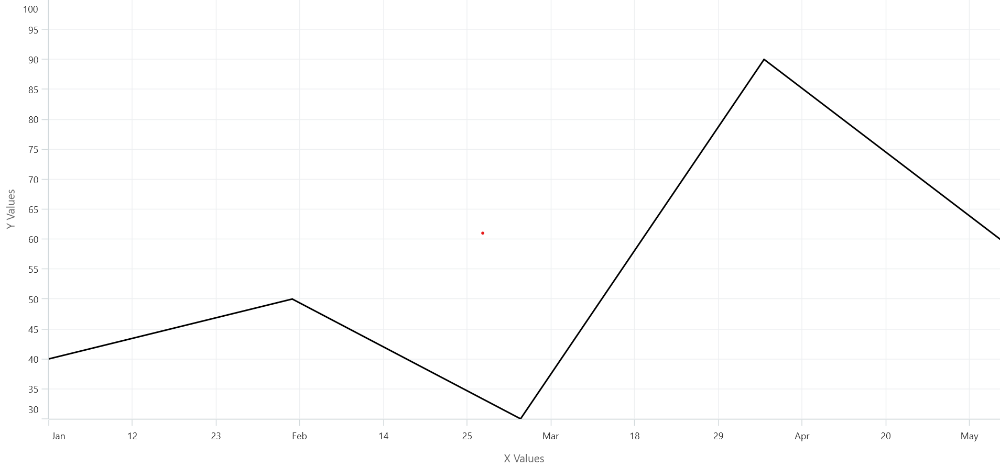

# Customize each chart axis label using the callback event

The [`LabelCreated`](https://help.syncfusion.com/cr/maui/Syncfusion.Maui.Charts.ChartAxis.html#Syncfusion_Maui_Charts_ChartAxis_LabelCreated) event is triggered upon label creation in a chart axis, providing the option to customize chart axis labels.

The following code sample demonstrates this:





<chart:SfCartesianChart>
    . . .
    <chart:SfCartesianChart.XAxes>
        <chart:NumericalAxis LabelCreated="XAxes_LabelCreated"/>
    </chart:SfCartesianChart.XAxes>
    . . .
</chart:SfCartesianChart>





SfCartesianChart chart = new SfCartesianChart();
. . .
NumericalAxis primaryAxis = new NumericalAxis();
primaryAxis.LabelCreated += XAxes_LabelCreated;
chart.XAxes.Add(primaryAxis);
. . .
    








int month = 0;

//Customize each axis label achieved by displaying the first label of each month with a month format,
//while other labels within the same month are formatted with a day format in the DateTimeAxis of the chart.

private void XAxes_LabelCreated(object sender, ChartAxisLabelEventArgs e)
{
    DateTime date = DateTime.Parse(e.Label);

    if (month != date.Month)
    {
        e.Label = date.ToString("MMM");
        month = date.Month;
    }
    else
        e.Label = date.Day.ToString();
}
    




