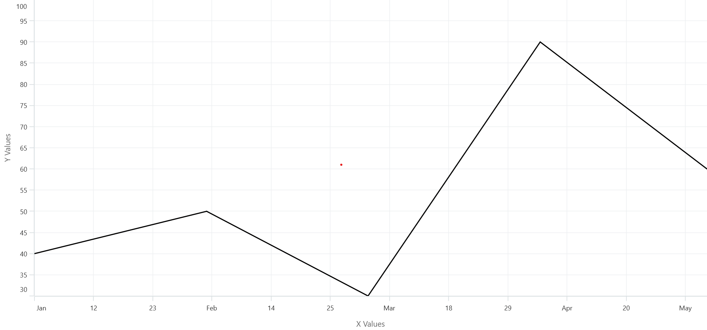

# Customize each chart axis label using the callback event

The [LabelCreated](https://help.syncfusion.com/cr/maui/Syncfusion.Maui.Charts.ChartAxis.html#Syncfusion_Maui_Charts_ChartAxis_LabelCreated) event is triggered upon label creation in a chart axis, providing the option to customize chart axis labels. The event handler receives a [ChartAxisLabelEventArgs](https://help.syncfusion.com/cr/maui/Syncfusion.Maui.Charts.ChartAxisLabelEventArgs.html) object, which exposes the [Label](https://help.syncfusion.com/cr/maui/Syncfusion.Maui.Charts.ChartAxisLabelEventArgs.html#Syncfusion_Maui_Charts_ChartAxisLabelEventArgs_Label) property that can be modified to change the displayed label text.

N> **Prerequisite:** Ensure that the required NuGet package is installed, the necessary namespaces are imported, and the **SfCartesianChart** control is properly configured in your application. For detailed setup and configuration instructions, refer to the **[Getting Started](https://help.syncfusion.com/maui/cartesian-charts/getting-started)** guide.

N> This example uses a [DateTimeAxis](https://help.syncfusion.com/cr/maui/Syncfusion.Maui.Charts.DateTimeAxis.html), which is required for the label parsing logic to work correctly.

The following code sample demonstrates how to wire the `LabelCreated` event in XAML and C#.





<chart:SfCartesianChart>

    <chart:SfCartesianChart.XAxes>
        <chart:DateTimeAxis LabelCreated="XAxes_LabelCreated"/>
    </chart:SfCartesianChart.XAxes>
    <!-- code omitted for brevity -->
</chart:SfCartesianChart>





SfCartesianChart chart = new SfCartesianChart();

DateTimeAxis primaryAxis = new DateTimeAxis();
primaryAxis.LabelCreated += XAxes_LabelCreated;
chart.XAxes.Add(primaryAxis);
// code omitted for brevity
this.Content = chart;
    




## Event handler

The following event handler displays the first label of each month as a month name, while other labels within the same month are shown as day numbers.





int month = 0;

private void XAxes_LabelCreated(object sender, ChartAxisLabelEventArgs e)
{
    DateTime date = DateTime.Parse(e.Label);

    if (month != date.Month)
    {
        e.Label = date.ToString("MMM");
        month = date.Month;
    }
    else
    {
        e.Label = date.Day.ToString();
    }
}
    




