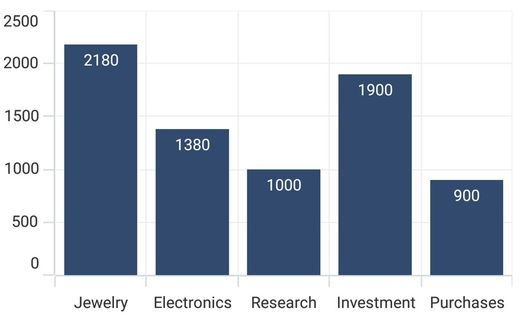
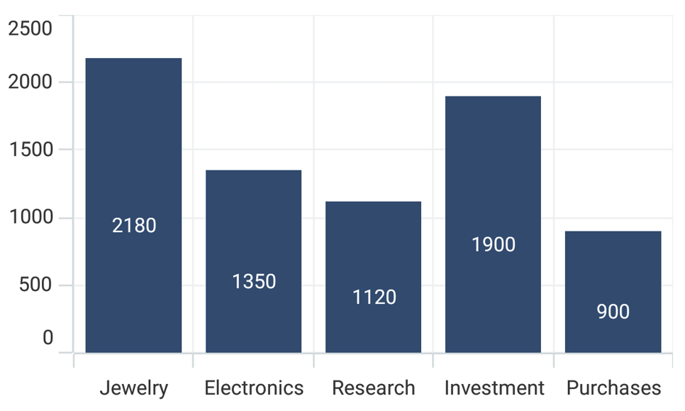
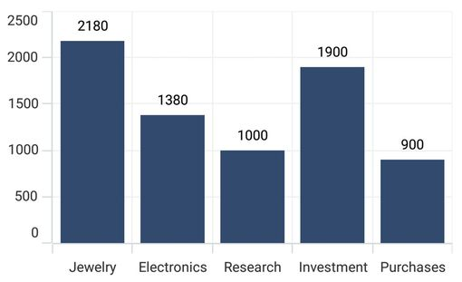
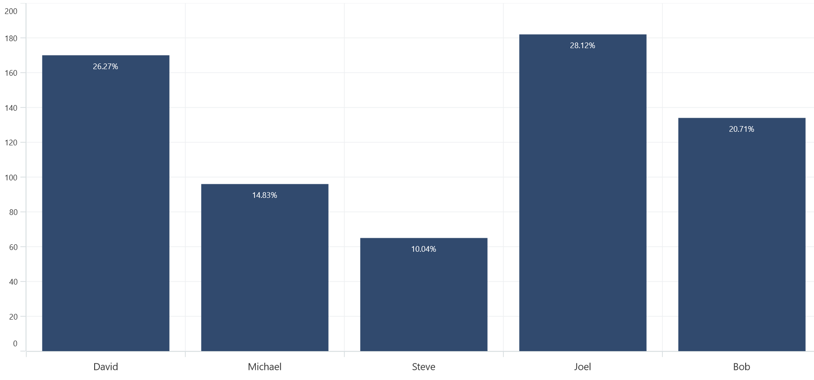
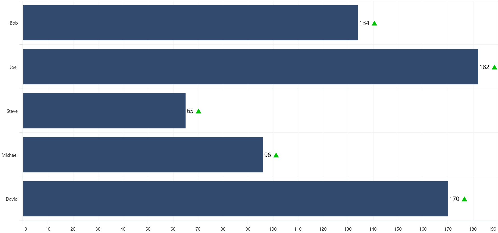

# Data labels in .NET MAUI Cartesian Chart

Data labels are used to display values related to a chart segment. Values from data point(x, y) or other custom properties from a data source can be displayed. 

Each data label can be represented by the following:

* Label - displays the segment label content at the (X, Y) point.

To learn how to customize the data labels in .NET MAUI Cartesian Charts quickly, you can check the following video.



## Enable data labels 

The [ShowDataLabels](https://help.syncfusion.com/cr/maui/Syncfusion.Maui.Charts.ChartSeries.html#Syncfusion_Maui_Charts_ChartSeries_ShowDataLabels) property of the series is used to enable the data labels.

N> **Prerequisite:** Ensure that the required NuGet package is installed, the necessary namespaces are imported, and the **SfCartesianChart** control is properly configured in your application. For detailed setup and configuration instructions, refer to the **[Getting Started](https://help.syncfusion.com/maui/cartesian-charts/getting-started)** guide.





<chart:SfCartesianChart>
    <!-- code omitted for brevity -->
    <chart:ColumnSeries ItemsSource="{Binding Data}" 
                        XBindingPath="Category"
                        YBindingPath="Value" ShowDataLabels="True">
    </chart:ColumnSeries>
</chart:SfCartesianChart>





SfCartesianChart chart = new SfCartesianChart();
//code omitted for brevity
ColumnSeries series = new ColumnSeries()
{
    ItemsSource = new ViewModel().Data,
    XBindingPath = "Category",
    YBindingPath = "Value",
    ShowDataLabels = true
};

chart.Series.Add(series);
this.Content = chart;





Data labels can be customized by using the [DataLabelSettings](https://help.syncfusion.com/cr/maui/Syncfusion.Maui.Charts.CartesianSeries.html#Syncfusion_Maui_Charts_CartesianSeries_DataLabelSettings) property of the chart series. To customize, create an instance of [CartesianDataLabelSettings](https://help.syncfusion.com/cr/maui/Syncfusion.Maui.Charts.CartesianDataLabelSettings.html) and set it to the [DataLabelSettings](https://help.syncfusion.com/cr/maui/Syncfusion.Maui.Charts.CartesianSeries.html#Syncfusion_Maui_Charts_CartesianSeries_DataLabelSettings) property. The following properties are used to customize the data labels, which are available in [CartesianDataLabelSettings](https://help.syncfusion.com/cr/maui/Syncfusion.Maui.Charts.CartesianDataLabelSettings.html).

* [BarAlignment](https://help.syncfusion.com/cr/maui/Syncfusion.Maui.Charts.CartesianDataLabelSettings.html#Syncfusion_Maui_Charts_CartesianDataLabelSettings_BarAlignment) - Gets or sets the data label alignment top, middle or bottom.
* [LabelPlacement](https://help.syncfusion.com/cr/maui/Syncfusion.Maui.Charts.ChartDataLabelSettings.html#Syncfusion_Maui_Charts_ChartDataLabelSettings_LabelPlacement) - Gets or sets the data label position inside, outside or default.
* [LabelStyle](https://help.syncfusion.com/cr/maui/Syncfusion.Maui.Charts.ChartDataLabelSettings.html#Syncfusion_Maui_Charts_ChartDataLabelSettings_LabelStyle) - Gets or sets the options for customizing the data labels. 
* [UseSeriesPalette](https://help.syncfusion.com/cr/maui/Syncfusion.Maui.Charts.ChartDataLabelSettings.html#Syncfusion_Maui_Charts_ChartDataLabelSettings_UseSeriesPalette) - Gets or sets a value indicating whether the data label should reflect the series interior.

 

## Data label alignment

The alignment of data labels inside the series is defined by using the [BarAlignment](https://help.syncfusion.com/cr/maui/Syncfusion.Maui.Charts.CartesianDataLabelSettings.html#Syncfusion_Maui_Charts_CartesianDataLabelSettings_BarAlignment) property. 

* [Top](https://help.syncfusion.com/cr/maui/Syncfusion.Maui.Charts.DataLabelAlignment.html#Syncfusion_Maui_Charts_DataLabelAlignment_Top) - Positions the data label at the top edge point of a chart segment.
* [Middle](https://help.syncfusion.com/cr/maui/Syncfusion.Maui.Charts.DataLabelAlignment.html#Syncfusion_Maui_Charts_DataLabelAlignment_Middle) - Positions the data label at the center point of a chart segment.
* [Bottom](https://help.syncfusion.com/cr/maui/Syncfusion.Maui.Charts.DataLabelAlignment.html#Syncfusion_Maui_Charts_DataLabelAlignment_Bottom) - Positions the data label at the bottom edge point of a chart segment.

N> This behavior varies based on the chart series type.





<chart:SfCartesianChart>
    <!-- code omitted for brevity -->
    <chart:ColumnSeries ShowDataLabels="True">
        <chart:ColumnSeries.DataLabelSettings>
            <chart:CartesianDataLabelSettings BarAlignment="Middle"/>
        </chart:ColumnSeries.DataLabelSettings>
    </chart:ColumnSeries>
</chart:SfCartesianChart>





SfCartesianChart chart = new SfCartesianChart();
//code omitted for brevity
ColumnSeries series = new ColumnSeries()
{
    ShowDataLabels = true,
};
series.DataLabelSettings = new CartesianDataLabelSettings()
{
    BarAlignment = DataLabelAlignment.Middle,
};

chart.Series.Add(series);
this.Content = chart;





## Label placement

In addition to the alignment options above, the chart provides an additional customization option to position the data labels. 

The [LabelPlacement](https://help.syncfusion.com/cr/maui/Syncfusion.Maui.Charts.ChartDataLabelSettings.html#Syncfusion_Maui_Charts_ChartDataLabelSettings_LabelPlacement) property is used to position the data labels at [Center](https://help.syncfusion.com/cr/maui/Syncfusion.Maui.Charts.DataLabelPlacement.html#Syncfusion_Maui_Charts_DataLabelPlacement_Center), [Inner](https://help.syncfusion.com/cr/maui/Syncfusion.Maui.Charts.DataLabelPlacement.html#Syncfusion_Maui_Charts_DataLabelPlacement_Inner) and [Outer](https://help.syncfusion.com/cr/maui/Syncfusion.Maui.Charts.DataLabelPlacement.html#Syncfusion_Maui_Charts_DataLabelPlacement_Outer) positions relative to the actual data point position. By default, labels are positioned based on the series types for better readability.





<chart:SfCartesianChart>
    <!-- code omitted for brevity -->
    <chart:ColumnSeries ShowDataLabels="True">
        <chart:ColumnSeries.DataLabelSettings>
            <chart:CartesianDataLabelSettings LabelPlacement="Outer"/>
        </chart:ColumnSeries.DataLabelSettings>
    </chart:ColumnSeries>
</chart:SfCartesianChart>





SfCartesianChart chart = new SfCartesianChart();
//code omitted for brevity
ColumnSeries series = new ColumnSeries()
{
    ShowDataLabels = true,
};
series.DataLabelSettings = new CartesianDataLabelSettings()
{
    LabelPlacement = DataLabelPlacement.Outer,
};

chart.Series.Add(series);
this.Content = chart;





## Applying series brush

The [UseSeriesPalette](https://help.syncfusion.com/cr/maui/Syncfusion.Maui.Charts.ChartDataLabelSettings.html#Syncfusion_Maui_Charts_ChartDataLabelSettings_UseSeriesPalette) property is used to set the interior of the series to the data marker background. 





<chart:SfCartesianChart>
    <!-- code omitted for brevity -->
    <chart:ColumnSeries ShowDataLabels="True">
        <chart:ColumnSeries.DataLabelSettings>
            <chart:CartesianDataLabelSettings UseSeriesPalette="False"/>
        </chart:ColumnSeries.DataLabelSettings>
    </chart:ColumnSeries>
</chart:SfCartesianChart>





SfCartesianChart chart = new SfCartesianChart();
ColumnSeries series = new ColumnSeries()
{
    ShowDataLabels = true,
};
series.DataLabelSettings = new CartesianDataLabelSettings()
{
    UseSeriesPalette = false,
};

chart.Series.Add(series);
this.Content = chart;





## Formatting label context

The content of the label can be customized using the [LabelContext](https://help.syncfusion.com/cr/maui/Syncfusion.Maui.Charts.LabelContext.html) property. The following two options are supported:

* [Percentage](https://help.syncfusion.com/cr/maui/Syncfusion.Maui.Charts.LabelContext.html#Syncfusion_Maui_Charts_LabelContext_Percentage) - Shows the percentage value of the corresponding data point Y value.

* [YValue](https://help.syncfusion.com/cr/maui/Syncfusion.Maui.Charts.LabelContext.html#Syncfusion_Maui_Charts_LabelContext_YValue) - Shows the corresponding Y value.

N> The `Percentage` option is supported only for stacked series types (e.g., `StackedColumnSeries`, `StackedBarSeries`).





<chart:SfCartesianChart IsTransposed="True">
    <!-- code omitted for brevity -->
    <chart:ColumnSeries ItemsSource="{Binding Data}" 
                        XBindingPath="XValue"
                        YBindingPath="YValue" 
                        ShowDataLabels="True"
                        LabelContext="Percentage"/>
</chart:SfCartesianChart>





SfCartesianChart chart = new SfCartesianChart();
chart.IsTransposed = true;
//code omitted for brevity
ColumnSeries series = new ColumnSeries()
{
    ItemsSource = new ViewModel().Data,
    XBindingPath = "XValue",
    YBindingPath = "YValue",
    ShowDataLabels = true,
    LabelContext = LabelContext.Percentage,
};

chart.Series.Add(series);
this.Content = chart;
        




## Label template

The [SfCartesianChart](https://help.syncfusion.com/cr/maui/Syncfusion.Maui.Charts.SfCartesianChart.html) provides support to customize the appearance of the data labels using the [LabelTemplate](https://help.syncfusion.com/cr/maui/Syncfusion.Maui.Charts.ChartSeries.html#Syncfusion_Maui_Charts_ChartSeries_LabelTemplate) property.

N> The `arrow.png` image used in the following example must be added to the project's `Resources/Images` folder.





<chart:SfCartesianChart IsTransposed="True">
    <chart:SfCartesianChart.Resources>
        <DataTemplate x:Key="labelTemplate">
            <HorizontalStackLayout Spacing="5" WidthRequest="100">
                <Image Source="arrow.png" WidthRequest="15" HeightRequest="15"/>
                <Label Text="{Binding Item.Values}" VerticalOptions="Center" FontSize="15"/>               
            </HorizontalStackLayout>
        </DataTemplate>
    </chart:SfCartesianChart.Resources>
    <!-- code omitted for brevity -->
    <chart:ColumnSeries ItemsSource="{Binding Data}" 
                        XBindingPath="Name"
                        YBindingPath="Values" 
                        LabelTemplate="{StaticResource labelTemplate}"
                        ShowDataLabels="True">

        <chart:ColumnSeries.DataLabelSettings>
            <chart:CartesianDataLabelSettings LabelPlacement="Outer"/>
        </chart:ColumnSeries.DataLabelSettings>

    </chart:ColumnSeries>
</chart:SfCartesianChart>





SfCartesianChart chart = new SfCartesianChart();
chart.IsTransposed = true;
//code omitted for brevity
ColumnSeries series = new ColumnSeries();
series.ItemsSource = new ViewModel().Data;
series.XBindingPath = "Name";
series.YBindingPath = "Values";
series.ShowDataLabels = true;
series.DataLabelSettings = new CartesianDataLabelSettings()
{
    LabelPlacement = DataLabelPlacement.Outer
};

DataTemplate labelTemplate = new DataTemplate(() =>
{
    HorizontalStackLayout horizontalStackLayout = new HorizontalStackLayout { Spacing = 5, WidthRequest = 100 };

    var label = new Label
    {
        VerticalOptions = LayoutOptions.Center,
        FontSize = 15
    };
    label.SetBinding(Label.TextProperty, "Item.Values");

    var image = new Image
    {
        Source = "arrow.png",
        WidthRequest = 15,
        HeightRequest = 15
    };
    
    horizontalStackLayout.Children.Add(image);
    horizontalStackLayout.Children.Add(label);
    
    return horizontalStackLayout;
});

series.LabelTemplate = labelTemplate;
chart.Series.Add(series);
this.Content = chart;
        




## Event

### DataLabelTapped

The [DataLabelTapped](https://help.syncfusion.com/cr/maui/Syncfusion.Maui.Charts.SfCartesianChart.html#Syncfusion_Maui_Charts_SfCartesianChart_DataLabelTapped) event occurs when a user taps on a data label in a chart series. The [DataLabelTappedEventArgs](https://help.syncfusion.com/cr/maui/Syncfusion.Maui.Charts.DataLabelTappedEventArgs.html) object exposes the following properties:

* `Series` - Gets the chart series associated with the tapped data label.
* `DataIndex` - Gets the zero-based index of the tapped data point in the series.
* `DataItem` - Gets the original data object from the series `ItemsSource`.
* `Position` - Gets the screen coordinates (X, Y) of the tap location in device-independent pixels.
* `Segment` - Gets the chart segment associated with the tapped data point. This value may be `null`.





<chart:SfCartesianChart DataLabelTapped="OnDataLabelTapped">

    <chart:SfCartesianChart.XAxes>
        <chart:CategoryAxis />
    </chart:SfCartesianChart.XAxes>

    <chart:SfCartesianChart.YAxes>
        <chart:NumericalAxis />
    </chart:SfCartesianChart.YAxes>

    <chart:ColumnSeries ItemsSource="{Binding Data}"
                        XBindingPath="Category"
                        YBindingPath="Value"
                        ShowDataLabels="True"/>
</chart:SfCartesianChart>





private void OnDataLabelTapped(object sender, DataLabelTappedEventArgs e)
{
    var series = e.Series;
    var dataIndex = e.DataIndex;
    var dataItem = e.DataItem;
    var tapPosition = e.Position;
    var segment = e.Segment;

    string message = $"Series: {series}\n" +
                     $"Segment: {segment}\n" +
                     $"Data Item: {dataItem}\n" +
                     $"Data Index: {dataIndex}\n" +
                     $"Tap Location: ({tapPosition.X:F0}, {tapPosition.Y:F0})";

    DisplayAlertAsync("Data Label Details", message, "OK");
}





N> The `DataLabelTapped` event is triggered only when the [ShowDataLabels](https://help.syncfusion.com/cr/maui/Syncfusion.Maui.Charts.ChartSeries.html#Syncfusion_Maui_Charts_ChartSeries_ShowDataLabels) property is set to `true`.

