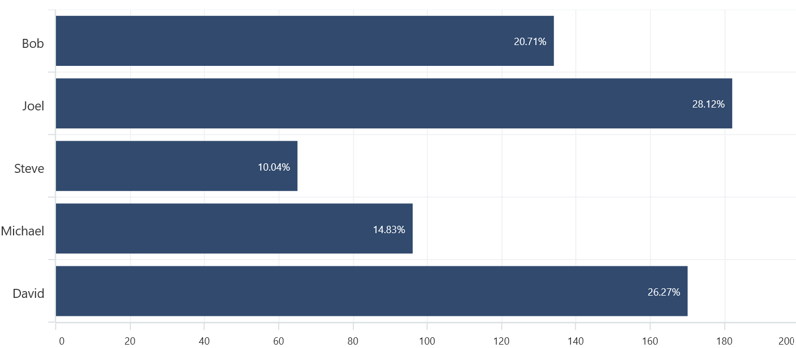

# Data Label in .NET MAUI Chart

Data labels are used to display values related to a chart segment. Values from data point(x, y) or other custom properties from a data source can be displayed. 

Each data label can be represented by the following:

* Label - displays the segment label content at the (X, Y) point.
* Connector line - used to connect the (X, Y) point and the label element.

## Enable Data Label 

The [ShowDataLabels](https://help.syncfusion.com/cr/maui/Syncfusion.Maui.Charts.ChartSeries.html#Syncfusion_Maui_Charts_ChartSeries_ShowDataLabels) property of series is used to enable the data labels.





<chart:SfCartesianChart>
    . . .
    <chart:ColumnSeries ItemsSource="{Binding Data}" 
                        XBindingPath="Category"
                        YBindingPath="Value" ShowDataLabels="True">
        </chart:ColumnSeries>
</chart:SfCartesianChart>





SfCartesianChart chart = new SfCartesianChart();
. . .
ColumnSeries series = new ColumnSeries()
{
    ItemsSource = viewModel.Data,
    XBindingPath = "Category",
    YBindingPath = "Value",
    ShowDataLabels = true
};

chart.Series.Add(series);





Data labels can be customized by using the [DataLabelSettings](https://help.syncfusion.com/cr/maui/Syncfusion.Maui.Charts.CartesianSeries.html#Syncfusion_Maui_Charts_CartesianSeries_DataLabelSettings) property of chart series. For customizing, need to create an instance of [CartesianDataLabelSettings](https://help.syncfusion.com/cr/maui/Syncfusion.Maui.Charts.CartesianDataLabelSettings.html) and set to the [DataLabelSettings](https://help.syncfusion.com/cr/maui/Syncfusion.Maui.Charts.CartesianSeries.html#Syncfusion_Maui_Charts_CartesianSeries_DataLabelSettings) property. Following properties are used to customize the data labels which are available in [CartesianDataLabelSettings](https://help.syncfusion.com/cr/maui/Syncfusion.Maui.Charts.CartesianDataLabelSettings.html).

* [BarAlignment](https://help.syncfusion.com/cr/maui/Syncfusion.Maui.Charts.CartesianDataLabelSettings.html#Syncfusion_Maui_Charts_CartesianDataLabelSettings_BarAlignment) - Gets or sets the data label alignment top, middle or bottom.
* [LabelPlacement](https://help.syncfusion.com/cr/maui/Syncfusion.Maui.Charts.ChartDataLabelSettings.html#Syncfusion_Maui_Charts_ChartDataLabelSettings_LabelPlacement) - Gets or sets the data label position inside, outside or default.
* [LabelStyle](https://help.syncfusion.com/cr/maui/Syncfusion.Maui.Charts.ChartDataLabelSettings.html#Syncfusion_Maui_Charts_ChartDataLabelSettings_LabelStyle) - Gets or sets the options for customizing the data labels. 
* [UseSeriesPalette](https://help.syncfusion.com/cr/maui/Syncfusion.Maui.Charts.ChartDataLabelSettings.html#Syncfusion_Maui_Charts_ChartDataLabelSettings_UseSeriesPalette) - Gets or sets a value indicating whether the data label should reflect the series interior.

 

## Data Label Alignment

The alignment of data labels inside the series is defined by using the [BarAlignment](https://help.syncfusion.com/cr/maui/Syncfusion.Maui.Charts.CartesianDataLabelSettings.html#Syncfusion_Maui_Charts_CartesianDataLabelSettings_BarAlignment) property. 

* [Top](https://help.syncfusion.com/cr/maui/Syncfusion.Maui.Charts.DataLabelAlignment.html#Syncfusion_Maui_Charts_DataLabelAlignment_Top) - Positions the data label at the top edge point of a chart segment.
* [Middle](https://help.syncfusion.com/cr/maui/Syncfusion.Maui.Charts.DataLabelAlignment.html#Syncfusion_Maui_Charts_DataLabelAlignment_Middle) - Positions the data label at the center point of a chart segment.
* [Bottom](https://help.syncfusion.com/cr/maui/Syncfusion.Maui.Charts.DataLabelAlignment.html#Syncfusion_Maui_Charts_DataLabelAlignment_Bottom) - Positions the data label at the bottom edge point of a chart segment.

N> This behavior varies based on the chart series type.





<chart:SfCartesianChart>
    . . .
    <chart:ColumnSeries ShowDataLabels="True">
        <chart:ColumnSeries.DataLabelSettings>
            <chart:CartesianDataLabelSettings BarAlignment="Middle"/>
        </chart:ColumnSeries.DataLabelSettings>
    </chart:ColumnSeries>
</chart:SfCartesianChart>





SfCartesianChart chart = new SfCartesianChart();
ColumnSeries series = new ColumnSeries();
. . .
series.DataLabelSettings = new CartesianDataLabelSettings()
{
    BarAlignment = DataLabelAlignment.Middle,
};

chart.Series.Add(series);





## LabelPlacement

Other than the above alignment options, Chart providing additional customization option to position the data labels. 

The [LabelPlacement](https://help.syncfusion.com/cr/maui/Syncfusion.Maui.Charts.ChartDataLabelSettings.html#Syncfusion_Maui_Charts_ChartDataLabelSettings_LabelPlacement) property is used to position the data labels at [Center](https://help.syncfusion.com/cr/maui/Syncfusion.Maui.Charts.DataLabelPlacement.html#Syncfusion_Maui_Charts_DataLabelPlacement_Center), [Inner](https://help.syncfusion.com/cr/maui/Syncfusion.Maui.Charts.DataLabelPlacement.html#Syncfusion_Maui_Charts_DataLabelPlacement_Inner) and [Outer](https://help.syncfusion.com/cr/maui/Syncfusion.Maui.Charts.DataLabelPlacement.html#Syncfusion_Maui_Charts_DataLabelPlacement_Outer) position of the actual data point position. By default, labels are positioned based on the series types for better readability.

## Applying Series Brush

[UseSeriesPalette](https://help.syncfusion.com/cr/maui/Syncfusion.Maui.Charts.ChartDataLabelSettings.html#Syncfusion_Maui_Charts_ChartDataLabelSettings_UseSeriesPalette) property is used to set the interior of the series to the data marker background. 





<chart:SfCartesianChart>
    . . .
    <chart:ColumnSeries ShowDataLabels="True">
        <chart:ColumnSeries.DataLabelSettings>
            <chart:CartesianDataLabelSettings  UseSeriesPalette="False"/>
        </chart:ColumnSeries.DataLabelSettings>
    </chart:ColumnSeries>
</chart:SfCartesianChart>





SfCartesianChart chart = new SfCartesianChart();
ColumnSeries series = new ColumnSeries();
. . .
series.DataLabelSettings = new CartesianDataLabelSettings()
{
    UseSeriesPalette = false,
};

chart.Series.Add(series);





## Formatting label context

You can customize the content of the label using [LabelContext]() property. Following are the two options that are supported now,

* [Percentage]() - This will show the percentage value of corresponding data point Y value

* [YValue]() - This will show the corresponding Y value.





    <chart:SfCartesianChart >

        <chart:ColumnSeries ItemsSource="{Binding Data}" 
                            ShowDataLabels="True"
                            XBindingPath="Name"
                            YBindingPath="Height" 
                            LabelContext="YValue"/>

    </chart:SfCartesianChart>





    SfCartesianChart chart = new SfCartesianChart();
    . . .
    ColumnSeries series1 = new ColumnSeries()
    {
        ItemsSource = new ViewModel().Data,
        XBindingPath = "Name",
        YBindingPath = "Height",
        ShowDataLabels = true,
        LabelContext = LabelContext.Percentage
    };

    chart.Series.Add(series1);
    this.Content = chart;
        




## Template

The [SfCartesianChart](https://help.syncfusion.com/cr/maui/Syncfusion.Maui.Charts.SfCartesianChart.html?tabs=tabid-1) provides support to customize the appearance of the datalabel by using the [LabelTemplate]() property.





    <chart:SfCartesianChart IsTransposed="True" >
        <chart:SfCartesianChart.Resources>
            <DataTemplate x:Key="LabelTemplate1">
                <HorizontalStackLayout Spacing="5">
                    <Label Text="{Binding Item.Values}" VerticalOptions="Center" FontSize = "15"/>
                    <Image Source="arrow.png" WidthRequest="15" HeightRequest="15"/>
                </HorizontalStackLayout>
            </DataTemplate>
        </chart:SfCartesianChart.Resources>
        . . .

        <chart:ColumnSeries ItemsSource="{Binding Data}" 
                            LabelTemplate="{StaticResource LabelTemplate1}"
                            XBindingPath="Name"
                            YBindingPath="Values" 
                            ShowDataLabels="True"/>

    </chart:SfCartesianChart>





    SfCartesianChart chart = new SfCartesianChart();
    chart.IsTransposed = true;
    . . .
    ColumnSeries series1 = new ColumnSeries()
    {
        ItemsSource = new ViewModel().Data,
        XBindingPath = "Name",
        YBindingPath = "Values",
        ShowDataLabels = true,
        LabelTemplate = chart.Resources["LabelTemplate1"] as DataTemplate
    };

    chart.Series.Add(series1);
    this.Content = chart;
        




