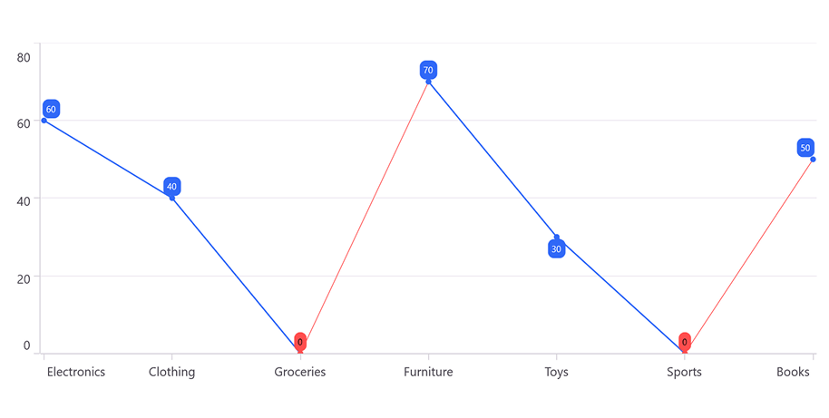
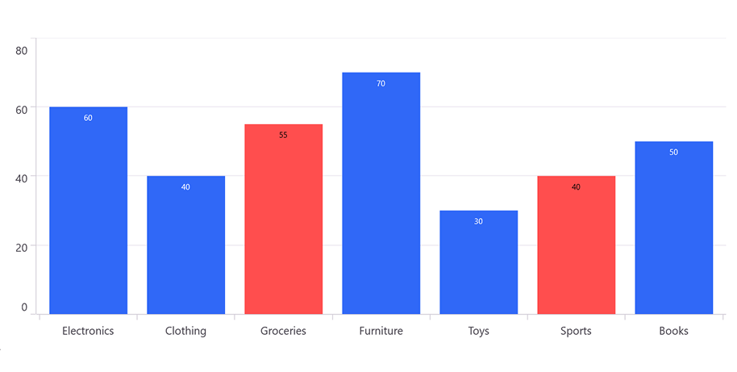

# Empty Points in .NET MAUI Chart

Empty Points are used to indicate missing or null data in a series. These empty points can occur when data is unavailable, improperly formatted, or explicitly set as null or double.NaN. The chart provides options to handle and customize these empty points to enhance visualization and maintain the integrity of data representation.

[SfCartesianChart](https://help.syncfusion.com/cr/maui/Syncfusion.Maui.Charts.SfCartesianChart.html) provides support for empty points, allowing users to handle missing data effectively.

The data collection that is passed to the chart can have NaN or Null values that are considered as empty points. The empty point can be defined as in the below code example.



ProductSales = new ObservableCollection<Model>();
ProductSales.Add(new Model() { Product = "Electronics", Sales = 60 });
ProductSales.Add(new Model() { Product = "Clothing", Sales = 40 });
ProductSales.Add(new Model() { Product = "Groceries", Sales = double.NaN });
ProductSales.Add(new Model() { Product = "Furniture", Sales = 70 });
ProductSales.Add(new Model() { Product = "Toys", Sales = 30 });
ProductSales.Add(new Model() { Product = "Sports", Sales = double.NaN });
ProductSales.Add(new Model() { Product = "Books", Sales = 50 });



By default, the [EmptyPointMode](https://help.syncfusion.com/cr/maui/Syncfusion.Maui.Charts.EmptyPointMode.html) property is [None](https://help.syncfusion.com/cr/maui/Syncfusion.Maui.Charts.EmptyPointMode.html#Syncfusion_Maui_Charts_EmptyPointMode_None). So the empty points will not be rendered as shown in the below.

## Empty Point Mode
The [EmptyPointMode](https://help.syncfusion.com/cr/maui/Syncfusion.Maui.Charts.EmptyPointMode.html) property of series specifies how empty points should be handled. 

This property provides the following options.

* **None** - Empty points are not rendered. This is the default behavior.
* **Zero** - Empty points will be replaced with zero.
* **Average** - Empty points will be replaced with the average value of the surrounding data points.

The following code example shows the [EmptyPointMode](https://help.syncfusion.com/cr/maui/Syncfusion.Maui.Charts.EmptyPointMode.html) as [Zero](https://help.syncfusion.com/cr/maui/Syncfusion.Maui.Charts.EmptyPointMode.html#Syncfusion_Maui_Charts_EmptyPointMode_Zero).





<chart:SfCartesianChart>
        
   .....
   <chart:LineSeries ItemsSource="{Binding ProductSales}"
                  XBindingPath="Product"
                  YBindingPath="Sales"
                  EmptyPointMode="Zero">
   </chart:LineSeries>

</chart:SfCartesianChart>





SfCartesianChart chart = new SfCartesianChart();

.....
LineSeries series = new LineSeries()
{
   ItemsSource = new ViewModel().ProductSales,
   XBindingPath = "Product",
   YBindingPath = "Sales",
   EmptyPointMode = EmptyPointMode.Zero
};

chart.Series.Add(series);
this.Content = chart;





The following code example shows the [EmptyPointMode](https://help.syncfusion.com/cr/maui/Syncfusion.Maui.Charts.EmptyPointMode.html) as [Average](https://help.syncfusion.com/cr/maui/Syncfusion.Maui.Charts.EmptyPointMode.html#Syncfusion_Maui_Charts_EmptyPointMode_Average).





<chart:SfCartesianChart>

   .....
   <chart:ColumnSeries ItemsSource="{Binding ProductSales}"
                  XBindingPath="Product"
                  YBindingPath="Sales"
                  EmptyPointMode="Average">
   </chart:ColumnSeries>

</chart:SfCartesianChart>





SfCartesianChart chart = new SfCartesianChart();

.....
ColumnSeries series = new ColumnSeries()
{
   ItemsSource = new ViewModel().ProductSales,
   XBindingPath = "Product",
   YBindingPath = "Sales",
   EmptyPointMode = EmptyPointMode.Average
};

chart.Series.Add(series);
this.Content = chart;





## Empty Point Customization
The [EmptyPointSettings](https://help.syncfusion.com/cr/maui/Syncfusion.Maui.Charts.EmptyPointSettings.html) property allows you to customize the appearance of empty points in a series. This enables you to adjust various visual aspects of empty points, making them more distinct from the other data points. You can modify the following properties within [EmptyPointSettings](https://help.syncfusion.com/cr/maui/Syncfusion.Maui.Charts.EmptyPointSettings.html).

* [Fill](https://help.syncfusion.com/cr/maui/Syncfusion.Maui.Charts.EmptyPointSettings.html#Syncfusion_Maui_Charts_EmptyPointSettings_FillProperty) - Gets or sets the fill color for the empty points.
* [Stroke](https://help.syncfusion.com/cr/maui/Syncfusion.Maui.Charts.EmptyPointSettings.html#Syncfusion_Maui_Charts_EmptyPointSettings_StrokeProperty) - Gets or sets the stroke color for empty points.
* [StrokeWidth](https://help.syncfusion.com/cr/maui/Syncfusion.Maui.Charts.EmptyPointSettings.html#Syncfusion_Maui_Charts_EmptyPointSettings_StrokeWidthProperty) - Gets or sets the stroke thickness for empty points.





<chart:SfCartesianChart>

   .....
   <chart:LineSeries ItemsSource="{Binding ProductSales}"
                  XBindingPath="Product"
                  YBindingPath="Sales"
                  Fill="#3068F7"
                  StrokeWidth="2"
                  ShowMarkers="True"
                  ShowDataLabels="True"
                  EmptyPointMode="Average">
        <chart:LineSeries.EmptyPointSettings>
            <chart:EmptyPointSettings Fill="Orange" StrokeWidth="2"/>
        </chart:LineSeries.EmptyPointSettings>
    </chart:LineSeries>

</chart:SfCartesianChart>





SfCartesianChart chart = new SfCartesianChart();

.....
LineSeries series = new LineSeries()
{
   ItemsSource = new ViewModel().ProductSales,
   XBindingPath = "Product",
   YBindingPath = "Sales",
   Fill = Color.FromArgb("#3068F7"),
   StrokeWidth = 2,
   ShowMarkers = true,
   ShowDataLabels = true,
   EmptyPointMode = EmptyPointMode.Average
};

EmptyPointSettings emptypointSettings = new EmptyPointSettings()
{
   Fill = Colors.Orange,
   StrokeWidth = 2
};

series.EmptyPointSettings = emptypointSettings;

chart.Series.Add(series);
this.Content = chart;





N> EmptyPoint support is not applicable for Histogram and BoxAndWhisker series.
