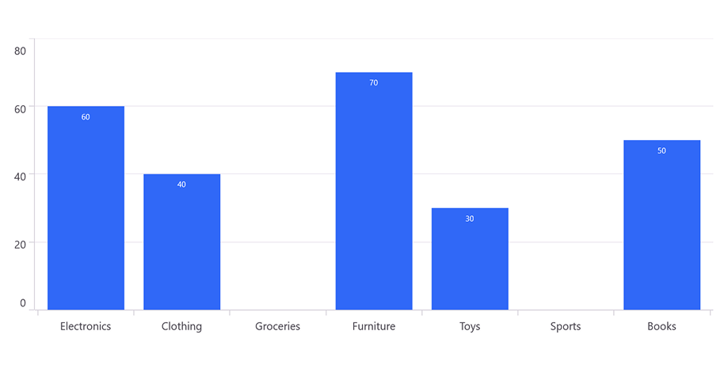
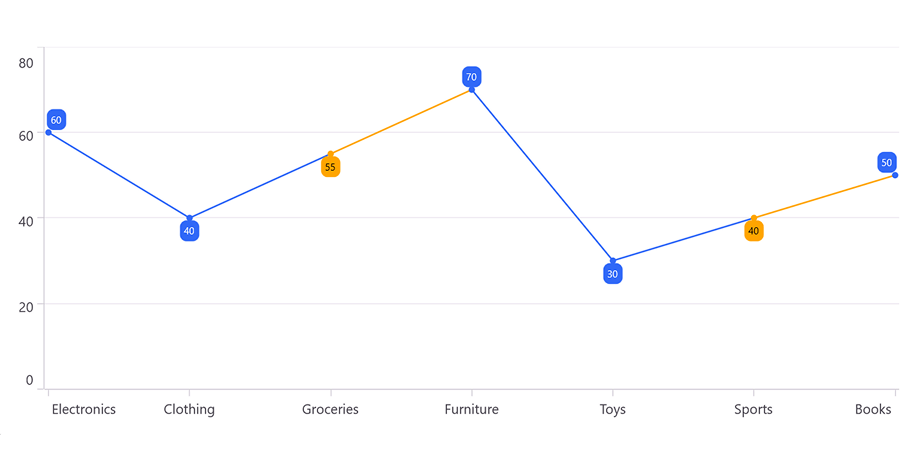

# Empty Points in .NET MAUI Chart
Empty Points are used to indicate missing or null data in a series. These empty points can occur when data is unavailable, improperly formatted, or explicitly set as null or Double.NaN. The chart provides options to handle and customize these empty points to enhance visualization and maintain the integrity of data representation.

[SfCartesianChart](https://help.syncfusion.com/cr/maui/Syncfusion.Maui.Charts.SfCartesianChart.html) provides support for empty points, allowing users to handle missing data effectively.

The data collection that is passed to the chart can have NaN or Null values that are considered as empty points. The empty point can be defined as in the below code example.



    MovieSales.Add(new Model() { Day = "Monday", TicketsSold = 60 });
    MovieSales.Add(new Model() { Day = "Tuesday", TicketsSold = 55 });
    MovieSales.Add(new Model() { Day = "Wednesday", TicketsSold = double.NaN });
    MovieSales.Add(new Model() { Day = "Thursday", TicketsSold = 62 });
    MovieSales.Add(new Model() { Day = "Friday", TicketsSold = 58 });
    MovieSales.Add(new Model() { Day = "Saturday", TicketsSold = double.NaN });
    MovieSales.Add(new Model() { Day = "Sunday", TicketsSold = 65 });



By default, the [ShowEmptyPoints]() property is false. So the empty points will not be rendered as shown in the below.

## Enable Empty Points
The [ShowEmptyPoints]() property of series determines whether empty points should be displayed on the chart.

N> The default value of the EmptyPointMode property is Zero.





    <chart:SfCartesianChart>

        .....

        <chart:ColumnSeries ItemsSource="{Binding MovieSales}"
                        XBindingPath="Day"
                        YBindingPath="TicketsSold"
                        Fill="#3068F7"
                        ShowDataLabels="True"
                        ShowEmptyPoints="True">
        </chart:ColumnSeries>
    </chart:SfCartesianChart>





    SfCartesianChart chart = new SfCartesianChart();

    .....

    ColumnSeries series = new ColumnSeries()
    {
        ItemsSource = new ViewModel().MovieSales,
        XBindingPath = "Day",
        YBindingPath = "TicketsSold",
        Fill = Color.FromArgb("#3068F7"),
        ShowDataLabels = true,
        ShowEmptyPoints = true,
    };

    chart.Series.Add(series);
    this.Content = chart;





## EmptyPointMode
The [EmptyPointMode]() property of series determines how empty points are handled when [ShowEmptyPoints]() is enabled.

This is an enum property with the following options:

* Zero - Empty points will be replaced with zero (0). This is the default behavior.
* Average - Empty points will be replaced with the average value of the surrounding data points.





    <chart:SfCartesianChart>

        .....

        <chart:ColumnSeries ItemsSource="{Binding MovieSales}"
                  XBindingPath="Day"
                  YBindingPath="TicketsSold"
                  Fill="#3068F7"
                  ShowDataLabels="True"
                  ShowEmptyPoints="True"
                  EmptyPointMode="Average">
        </chart:ColumnSeries>
    </chart:SfCartesianChart>





    SfCartesianChart chart = new SfCartesianChart();

    .....

    ColumnSeries series = new ColumnSeries()
    {
        ItemsSource = new ViewModel().MovieSales,
        XBindingPath = "Day",
        YBindingPath = "TicketsSold",
        Fill = Color.FromArgb("#3068F7"),
        ShowDataLabels = true,
        ShowEmptyPoints = true,
        EmptyPointMode = EmptyPointMode.Average
    };

    chart.Series.Add(series);
    this.Content = chart;





## Customizing Empty Points
The [EmptyPointSettings]() property allows you to customize the appearance of empty points in a chart. This enables you to adjust various visual aspects of empty points, making them more distinct from the other data points. You can modify the following properties within [EmptyPointSettings]().

* [Fill]() - Gets or sets the fill color for the empty points.
* [Type]() - Gets or sets the shape of the marker for empty points.
* [Stroke]() - Gets or sets the stroke color for empty points.
* [StrokeWidth]() - Gets or sets the stroke thickness for empty points.

N> The Type property is not supported for Area, WaterFall and FastLine series.





    <chart:SfCartesianChart>

        .....

        <chart:LineSeries ItemsSource="{Binding MovieSales}"
                    XBindingPath="Day"
                    YBindingPath="TicketsSold"
                    Fill="#3068F7"
                    StrokeWidth="2"
                    ShowEmptyPoints="True"
                    EmptyPointMode="Average">
            <chart:LineSeries.EmptyPointSettings>
                <chart:EmptyPointSettings Fill="Orange" 
                                    Type="Rectangle" 
                                    Stroke="Green" 
                                    StrokeWidth="3"/>
            </chart:LineSeries.EmptyPointSettings>
        </chart:LineSeries>
    </chart:SfCartesianChart>





    SfCartesianChart chart = new SfCartesianChart();

    .....

    LineSeries series = new LineSeries()
    {
        ItemsSource = new ViewModel().MovieSales,
        XBindingPath = "Day",
        YBindingPath = "TicketsSold",
        Fill = Color.FromArgb("#3068F7"),
        StrokeWidth = 2,
        ShowEmptyPoints = true,
        EmptyPointMode = EmptyPointMode.Average
    };

    EmptyPointSettings emptypointSettings = new EmptyPointSettings()
    {
        Fill = Colors.Orange,
        Type = EmptyPointType.Rectangle,
        Stroke = Colors.Green,
        StrokeWidth = 3
    };

    series.EmptyPointSettings = emptypointSettings;

    chart.Series.Add(series);
    this.Content = chart;





N> The EmptyPoints feature is not supported for Histogram and BoxAnd series.
