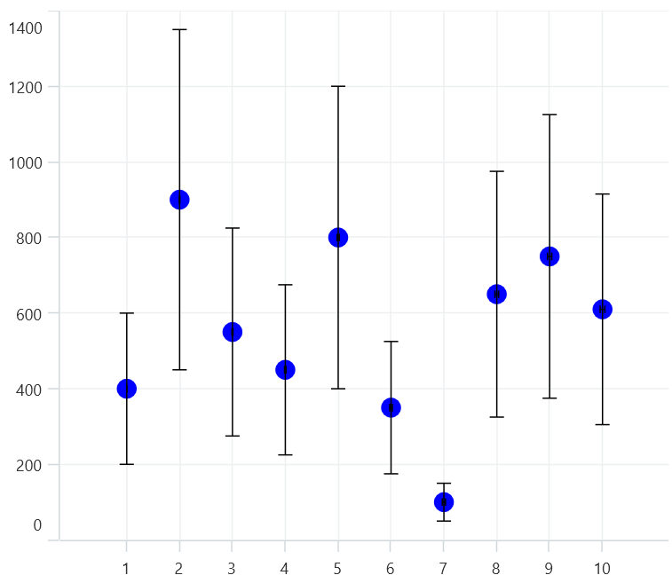
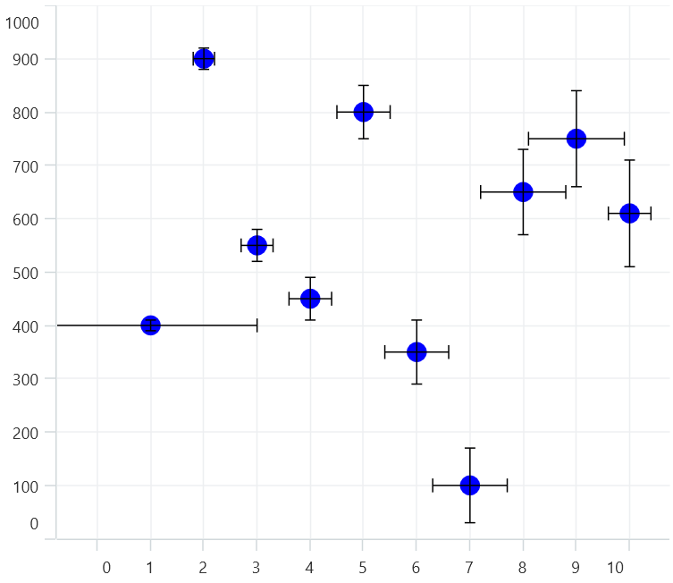

# Error Bar Series in .NET MAUI Chart

[ErrorBarSeries]() indicates the errors or uncertainty in reported values. This will find the possible variations in measurements, and in Chart control these values are displayed as data points.
The [HorizontalErrorValue]() and the [VerticalErrorValue]() is used to set the error value(variation) to the series.

N> The Error Bar Series Chart is not an individual Chart, it associate with a main Chart. Here, we use Scatter Series Chart as Main Chart with the Error Bar Series Chart Support

The following code examples illustrates how to create error bar series:




    <chart:SfCartesianChart>

    <chart:SfCartesianChart.XAxes>
        <chart:CategoryAxis />
    </chart:SfCartesianChart.XAxes>

    <chart:SfCartesianChart.YAxes>
        <chart:NumericalAxis />
    </chart:SfCartesianChart.YAxes>   

     </chart:SfCartesianChart.YAxes>
            <chart:ScatterSeries ItemsSource="{Binding EnergyProductions}" 
                                 XBindingPath="ID" 
                                 YBindingPath="Coal"
                                 PointHeight="20"
                                 PointWidth="20">
            </chart:ScatterSeries>
            <chart:ErrorBarSeries ItemsSource="{Binding EnergyProductions}"
                                  XBindingPath="ID"
                                  YBindingPath="Coal"
                                  VerticalErrorValue="50"
                                  HorizontalErrorValue="0.5">
            </chart:ErrorBarSeries>

    </chart:SfCartesianChart>





    ScatterSeries series = new ScatterSeries()
    {
        ItemsSource = new ViewModel().EnergyProductions,
        XBindingPath = "ID",
        YBindingPath = "Coal",
        PointWidth = 20,
        PointHeight = 20
    };

    ErrorBarSeries errorBar = new ErrorBarSeries()
    {
        ItemsSource = new ViewModel().EnergyProductions,
        XBindingPath = "ID",
        YBindingPath = "Coal",
        HorizontalErrorValue = 0.5,
        VerticalErrorValue = 50
    };

    chart.Series.Add(series);
    chart.Series.Add(errorBar);





## Mode 
This [Mode]() property defines whether to identify a horizontal error or vertical error. By default, the Mode value is [Both](), which will display both horizontal and vertical error values.

### Horizontal

To view horizontal error value, you can set the Mode as Horizontal as shown in the following code example.





    <chart:ErrorBarSeries ItemsSource="{Binding EnergyProductions}"
                          XBindingPath="ID"
                          YBindingPath="Coal"
                          VerticalErrorValue="50"
                          HorizontalErrorValue="0.5"
                          Mode="Horizontal">
    </chart:ErrorBarSeries>





    ErrorBarSeries errorBar = new ErrorBarSeries()
    {
        ItemsSource = new ViewModel().EnergyProductions,
        XBindingPath = "ID",
        YBindingPath = "Coal",
        HorizontalErrorValue = 0.5,
        VerticalErrorValue = 50,
        Mode= Horizontal
    };
    chart.Series.Add(series);
    chart.Series.Add(errorBar);





### Vertical

To view vertical error value, you can set the Mode as Vertical, as shown in the below code example.





    <chart:ErrorBarSeries ItemsSource="{Binding EnergyProductions}"
                          XBindingPath="ID"
                          YBindingPath="Coal"
                          VerticalErrorValue="50"
                          HorizontalErrorValue="0.5"
                          Mode="Vertical">              
    </chart:ErrorBarSeries>





    ErrorBarSeries errorBar = new ErrorBarSeries()
    {
        ItemsSource = new ViewModel().EnergyProductions,
        XBindingPath = "ID",
        YBindingPath = "Coal",
        HorizontalErrorValue = 0.5,
        VerticalErrorValue = 50,
        Mode= Vertical
    };
    chart.Series.Add(series);
    chart.Series.Add(errorBar);





## Direction 

[ErrorBar]() series allows you to view the horizontal and vertical error values in both positive and negative directions.

### Horizontal Direction

[HorizontalDirection]() property of the [ErrorBarSeries]() allows you to view the horizontal error value in the following type of directions:

*`Both` -  It indicates the actual data point value along with specific amount of positive and negative error values.

*`Plus` -  It indicates the actual data point value along with specific amount of positive error value.

*`Minus`-  It indicates the actual data point value along with specific amount of negative error value.

#### Both

The following code illustrates how to set the [HorizontalDirection]() value as both.





    <chart:ErrorBarSeries ItemsSource="{Binding EnergyProductions}"
                          XBindingPath="ID"
                          YBindingPath="Coal"
                          VerticalErrorValue="50"
                          HorizontalErrorValue="0.5"
                          HorizontalDirection="Both">
    </chart:ErrorBarSeries>





    ErrorBarSeries errorBar = new ErrorBarSeries()
    {
        ItemsSource = new ViewModel().EnergyProductions,
        XBindingPath = "ID",
        YBindingPath = "Coal",
        HorizontalErrorValue = 0.5,
        VerticalErrorValue = 50,
        HorizontalDirection="Both"
    };
    chart.Series.Add(series);
    chart.Series.Add(errorBar);





#### Plus

The following code illustrates how to set the [HorizontalDirection]() value as Plus.





    <chart:ErrorBarSeries ItemsSource="{Binding EnergyProductions}"
                          XBindingPath="ID"
                          YBindingPath="Coal"
                          VerticalErrorValue="50"
                          HorizontalErrorValue="0.5"
                          HorizontalDirection="Plus">
    </chart:ErrorBarSeries>





    ErrorBarSeries errorBar = new ErrorBarSeries()
    {
        ItemsSource = new ViewModel().EnergyProductions,
        XBindingPath = "ID",
        YBindingPath = "Coal",
        HorizontalErrorValue = 0.5,
        VerticalErrorValue = 50,
        HorizontalDirection="Plus"
    };
    chart.Series.Add(series);
    chart.Series.Add(errorBar);





#### Minus

The following code illustrates how to set the [HorizontalDirection]() value as Minus.





    <chart:ErrorBarSeries ItemsSource="{Binding EnergyProductions}"
                          XBindingPath="ID"
                          YBindingPath="Coal"
                          VerticalErrorValue="50"
                          HorizontalErrorValue="0.5"
                          HorizontalDirection="Minus">
    </chart:ErrorBarSeries>





    ErrorBarSeries errorBar = new ErrorBarSeries()
    {
        ItemsSource = new ViewModel().EnergyProductions,
        XBindingPath = "ID",
        YBindingPath = "Coal",
        HorizontalErrorValue = 0.5,
        VerticalErrorValue = 50,
        HorizontalDirection="Minus"
    };
    chart.Series.Add(series);
    chart.Series.Add(errorBar);





### Vertical Direction

[VerticalDirection]() property of the [ErrorBarSeries]() allows you to view the Vertical error value in the following type of directions:

*`Both` -  It indicates the actual data point value along with a specific amount of positive and negative error values.

*`Plus` -  It indicates the actual data point value along with a specific amount of positive error value.

*`Minus`-  It indicates the actual data point value along with a specific amount of negative error value.

#### Both

The following code illustrates how to set the [VerticalDirection]() value as both.





    <chart:ErrorBarSeries ItemsSource="{Binding EnergyProductions}"
                          XBindingPath="ID"
                          YBindingPath="Coal"
                          VerticalErrorValue="50"
                          HorizontalErrorValue="0.5"
                          VerticalDirection="Both">  
    </chart:ErrorBarSeries>





    ErrorBarSeries errorBar = new ErrorBarSeries()
    {
        ItemsSource = new ViewModel().EnergyProductions,
        XBindingPath = "ID",
        YBindingPath = "Coal",
        HorizontalErrorValue = 0.5,
        VerticalErrorValue = 50,
        VerticalDirection="Both"
    };
    chart.Series.Add(series);
    chart.Series.Add(errorBar);





#### Plus

The following code illustrates how to set the [VerticalDirection]() value as Plus.





    <chart:ErrorBarSeries ItemsSource="{Binding EnergyProductions}"
                          XBindingPath="ID"
                          YBindingPath="Coal"
                          VerticalErrorValue="50"
                          HorizontalErrorValue="0.5"
                          VerticalDirection="Plus">    
    </chart:ErrorBarSeries>





    ErrorBarSeries errorBar = new ErrorBarSeries()
    {
        ItemsSource = new ViewModel().EnergyProductions,
        XBindingPath = "ID",
        YBindingPath = "Coal",
        HorizontalErrorValue = 0.5,
        VerticalErrorValue = 50,
        VerticalDirection="Plus"
    };
    chart.Series.Add(series);
    chart.Series.Add(errorBar);





#### Minus

The following code illustrates how to set the [VerticalDirection]() value as Minus.





    <chart:ErrorBarSeries ItemsSource="{Binding EnergyProductions}"
                          XBindingPath="ID"
                          YBindingPath="Coal"
                          VerticalErrorValue="50"
                          HorizontalErrorValue="0.5"
                          VerticalDirection="Minus">
    </chart:ErrorBarSeries>





    ErrorBarSeries errorBar = new ErrorBarSeries()
    {
        ItemsSource = new ViewModel().EnergyProductions,
        XBindingPath = "ID",
        YBindingPath = "Coal",
        HorizontalErrorValue = 0.5,
        VerticalErrorValue = 50,
        VerticalDirection="Minus"
    };
    chart.Series.Add(series);
    chart.Series.Add(errorBar);





## Type

SfCartesianChart supports the following type of error bar series.

*`Fixed`

*`Percentage`

*`Standard Error`

*`Standard Percentage`

N> The default error bar series Type is Fixed.

### Fixed





    <chart:ErrorBarSeries ItemsSource="{Binding EnergyProductions}"
                          XBindingPath="ID"
                          YBindingPath="Coal"
                          VerticalErrorValue="50"
                          HorizontalErrorValue="0.5"
                          Type="Fixed">                             
    </chart:ErrorBarSeries>





ErrorBarSeries errorBar = new ErrorBarSeries()
{
    ItemsSource = new ViewModel().EnergyProductions,
    XBindingPath = "ID",
    YBindingPath = "Coal",
    HorizontalErrorValue = 0.5,
    VerticalErrorValue = 50,
    Type="Fixed"
};
chart.Series.Add(series);
chart.Series.Add(errorBar);





### Percentage





        <chart:ErrorBarSeries ItemsSource="{Binding EnergyProductions}"
                              XBindingPath="ID"
                              YBindingPath="Coal"
                              VerticalErrorValue="50"
                              HorizontalErrorValue="0.5"
                              Type="Percentage">
        </chart:ErrorBarSeries>





    ErrorBarSeries errorBar = new ErrorBarSeries()
    {
        ItemsSource = new ViewModel().EnergyProductions,
        XBindingPath = "ID",
        YBindingPath = "Coal",
        HorizontalErrorValue = 0.5,
        VerticalErrorValue = 50,
        Type="Percentage"
    };
    chart.Series.Add(series);
    chart.Series.Add(errorBar);





### Standard Error





    <chart:ErrorBarSeries ItemsSource="{Binding EnergyProductions}"
                          XBindingPath="ID"
                          YBindingPath="Coal"
                          VerticalErrorValue="50"
                          HorizontalErrorValue="0.5"
                          Type="StandardError">
    </chart:ErrorBarSeries>





    ErrorBarSeries errorBar = new ErrorBarSeries()
    {
        ItemsSource = new ViewModel().EnergyProductions,
        XBindingPath = "ID",
        YBindingPath = "Coal",
        HorizontalErrorValue = 0.5,
        VerticalErrorValue = 50,
        Type="StandardError"
    };
    chart.Series.Add(series);
    chart.Series.Add(errorBar);





### Standard Deviation





    <chart:ErrorBarSeries ItemsSource="{Binding EnergyProductions}"
                          XBindingPath="ID"
                          YBindingPath="Coal"
                          VerticalErrorValue="50"
                          HorizontalErrorValue="0.5"
                          Type="StandardDeviation">
    </chart:ErrorBarSeries>





    ErrorBarSeries errorBar = new ErrorBarSeries()
    {
        ItemsSource = new ViewModel().EnergyProductions,
        XBindingPath = "ID",
        YBindingPath = "Coal",
        HorizontalErrorValue = 0.5,
        VerticalErrorValue = 50,
        Type="StandardDeviation"
    };
    chart.Series.Add(series);
    chart.Series.Add(errorBar);





## Custom

If the Type is Custom, you have to bind the [HorizontalErrorPath]() and the [VerticalErrorPath]() as shown in the following code sample.





    <chart:ErrorBarSeries ItemsSource="{Binding EnergyProductions}"
                          XBindingPath="ID"
                          YBindingPath="Coal"
                          VerticalErrorValue="50"
                          HorizontalErrorValue="0.5"
                          Type="Custom"
                          HorizontalErrorPath="HorizontalErrorValue"
                          VerticalErrorPath="VerticalErrorValue">
    </chart:ErrorBarSeries>





    ErrorBarSeries errorBar = new ErrorBarSeries()
    {
        ItemsSource = new ViewModel().EnergyProductions,
        XBindingPath = "ID",
        YBindingPath = "Coal",
        HorizontalErrorValue = 0.5,
        VerticalErrorValue = 50,
        Type="Custom",
        HorizontalErrorPath="HorizontalErrorValue",
        VerticalErrorPath="VerticalErrorValue"
    };
    
    chart.Series.Add(series);
    chart.Series.Add(errorBar);





## Customization

### Line Style

You can define the LineStyle for the error bar lines using the [HorizontalLineStyle]() and the [VerticalLineStyle]() properties as in the following code examples.

#### Horizontal Line Style





    <chart:ErrorBarSeries.HorizontalLineStyle>
        <chart:ErrorBarLineStyle Stroke="Black"  StrokeThickness="2"  >
        </chart:ErrorBarLineStyle>
    </chart:ErrorBarSeries.HorizontalLineStyle>





    errorBarSeries.HorizontalLineStyle = new ErrorBarLineStyle()
    {
        Stroke = new SolidColorBrush(Colors.Red),
        StrokeThickness = 2
    };





#### Vertical Line Style





    <chart:ErrorBarSeries.VerticalLineStyle>
        <chart:ErrorBarLineStyle Stroke="Black"  StrokeThickness="2"  >
        </chart:ErrorBarLineStyle>
    </chart:ErrorBarSeries.VerticalLineStyle>





    errorBarSeries.VerticalLineStyle = new ErrorBarLineStyle()
    {
        Stroke = new SolidColorBrush(Colors.Red),
        StrokeThickness = 2
    };





### Cap Line Style

You can define the CapLineStyle for the error bar lines using the [HorizontalCapLineStyle]() and the[VerticalCapLineStyle]() properties as in the following code examples.

#### Horizontal Cap Line Style





    <chart:ErrorBarSeries.HorizontalCapLineStyle>
        <chart:ErrorBarCapLineStyle Stroke="Black"  
                                    StrokeThickness="2"
                                    CapLineSize="1" >
         
        </chart:ErrorBarCapLineStyle>
    </chart:ErrorBarSeries.HorizontalCapLineStyle>





    errorBarSeries.HorizontalCapLineStyle = new ErrorBarCapLineStyle()
    {
        Stroke = new SolidColorBrush(Colors.Red),
        StrokeThickness = 2,
        CapLineSize= 1
    };





#### Vertical Cap Line Style





    <chart:ErrorBarSeries.VerticalCapLineStyle>
    <chart:ErrorBarCapLineStyle Stroke="Black"  
                                StrokeThickness="2" 
                                CapLineSize="1" >
    </chart:ErrorBarCapLineStyle>
    </chart:ErrorBarSeries.VerticalCapLineStyle>





    errorBarSeries.VerticalCapLineStyle = new ErrorBarCapLineStyle()
    {
        Stroke = new SolidColorBrush(Colors.Red),
        StrokeThickness = 2,
        CapLineSize= 1
    };





