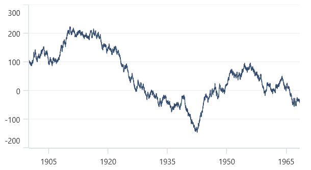
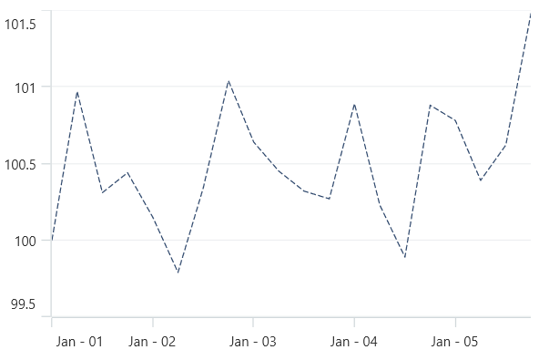

# Fast Line Chart in .NET MAUI Chart

## Fast Line Chart

The [FastLineSeries]() is a special kind of line series that can render a collection with huge number of datapoints. To render a fast line chart, create an instance of [FastLineSeries](), and add it to the [Series](https://help.syncfusion.com/cr/maui/Syncfusion.Maui.Charts.SfCartesianChart.html#Syncfusion_Maui_Charts_SfCartesianChart_Series) collection property of [SfCartesianChart](https://help.syncfusion.com/cr/maui/Syncfusion.Maui.Charts.SfCartesianChart.html?tabs=tabid-1). 





<chart:SfCartesianChart>
    <chart:SfCartesianChart.PrimaryAxis>
        <chart:DateTimeAxis ShowMinorGridLines="False" ShowMajorGridLines="False" IntervalType="Years"
                            Interval="15"/>
    </chart:SfCartesianChart.PrimaryAxis>

    <chart:SfCartesianChart.SecondaryAxis>
        <chart:NumericalAxis />
    </chart:SfCartesianChart.SecondaryAxis>  
                
    <chart:SfCartesianChart.Series>
        <chart:FastLineSeries ItemsSource="{Binding Data}" XBindingPath="XValue" YBindingPath="YValue"/>
    </chart:SfCartesianChart.Series>
</chart:SfCartesianChart>





SfCartesianChart chart = new SfCartesianChart();
DateTimeAxis primaryAxis = new DateTimeAxis();
primaryAxis.ShowMinorGridLines = false;
primaryAxis.ShowMajorGridLines = false;
primaryAxis.IntervalType = DateTimeIntervalType.Years;
primaryAxis.Interval = 15;
chart.PrimaryAxis = primaryAxis;
NumericalAxis secondaryAxis = new NumericalAxis();
chart.SecondaryAxis = secondaryAxis;

FastLineSeries series = new FastLineSeries()
{
    ItemsSource = new ViewModel().Data,
    XBindingPath = "XValue",
    YBindingPath = "YValue",
};

chart.Series.Add(series);
this.Content = chart;





### Dashed line

The [StrokeDashArray]() property of [FastLineSeries]() is used to render the fast line series with dashes. Odd value is considered as rendering size and even value is considered as gap.





<chart:SfCartesianChart>
    <chart:SfCartesianChart.Resources>
        <DoubleCollection x:Key="dashArray">
            <x:Double>5</x:Double>
            <x:Double>2</x:Double>
        </DoubleCollection>
    </chart:SfCartesianChart.Resources>

    <chart:SfCartesianChart.PrimaryAxis>
        <chart:chart:DateTimeAxis ShowMinorGridLines="False" ShowMajorGridLines="False" />
    </chart:SfCartesianChart.PrimaryAxis>

    <chart:SfCartesianChart.SecondaryAxis>
        <chart:NumericalAxis />
    </chart:SfCartesianChart.SecondaryAxis>  

    <chart:SfCartesianChart.Series>
        <chart:FastLineSeries ItemsSource="{Binding Data}" XBindingPath="XValue" YBindingPath="YValue" StrokeDashArray="{StaticResource dashArray}"/>
    </chart:SfCartesianChart.Series>
</chart:SfCartesianChart>





SfCartesianChart chart = new SfCartesianChart();
DateTimeAxis primaryAxis = new DateTimeAxis();
primaryAxis.ShowMinorGridLines = false;
primaryAxis.ShowMajorGridLines = false;
chart.PrimaryAxis = primaryAxis;
NumericalAxis secondaryAxis = new NumericalAxis();
chart.SecondaryAxis = secondaryAxis;

DoubleCollection doubleCollection = new DoubleCollection();
doubleCollection.Add(5);
doubleCollection.Add(2);
. . .
FastLineSeries series = new FastLineSeries()
{
    ItemsSource = new ViewModel().Data,
    XBindingPath = "XValue",
    YBindingPath = "YValue",
    StrokeDashArray = doubleCollection

};

chart.Series.Add(series);

this.Content = chart;





