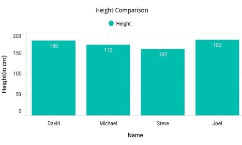

# Getting Started with .NET MAUI Cartesian Chart 

This section explains how to populate the Cartesian chart with data, a title, data labels, a legend, and tooltips, as well as the essential aspects for getting started with the chart.

To get start quickly with our [.NET MAUI Cartesian Chart](https://help.syncfusion.com/cr/maui/Syncfusion.Maui.Charts.SfCartesianChart.html), you can check the below video.






## Prerequisites

Before proceeding, ensure the following are set up:

1. Install [.NET 9 SDK](https://dotnet.microsoft.com/en-us/download/dotnet/9.0) or later.
2. Set up a .NET MAUI environment with Visual Studio 2022 v17.12 or later.

## Step 1: Create a new .NET MAUI project

1. Go to **File > New > Project** and choose the **.NET MAUI App** template.
2. Name the project and choose a location. Click **Next**.
3. Select the .NET framework version and click **Create**.

## Step 2: Install the Syncfusion® .NET MAUI Charts Package

1. In **Solution Explorer**, right-click the project and choose **Manage NuGet Packages**.
2. Search for [Syncfusion.Maui.Charts](https://www.nuget.org/packages/Syncfusion.Maui.Charts/) and install the latest version.
3. Ensure the necessary dependencies are installed correctly, and the project is restored.





## Prerequisites

Before proceeding, ensure the following are set up:

1. Install [.NET 9 SDK](https://dotnet.microsoft.com/en-us/download/dotnet/9.0) or later.
2. Set up a .NET MAUI environment with Visual Studio Code.
3. Ensure that the .NET MAUI workloads are installed and configured as described [here](https://learn.microsoft.com/en-us/dotnet/maui/get-started/installation?view=net-maui-9.0&tabs=visual-studio-code).

## Step 1: Create a new .NET MAUI project

1. Open the command palette by pressing `Ctrl+Shift+P` and type **.NET:New Project** and enter.
2. Choose the **.NET MAUI App** template.
3. Select the project location, type the project name and press **Enter.**
4. Then choose **Create project.**

## Step 2: Install the Syncfusion® .NET MAUI Charts Package

1. Press <kbd>Ctrl</kbd> + <kbd>`</kbd> (backtick) to open the integrated terminal in Visual Studio Code.
2. Ensure you're in the project root directory where your .csproj file is located.
3. Run the command `dotnet add package Syncfusion.Maui.Charts` to install the Syncfusion® .NET MAUI Charts NuGet package.
4. To ensure all dependencies are installed, run `dotnet restore`.





## Prerequisites

Before proceeding, ensure the following are set up:

1. Install [.NET 9 SDK](https://dotnet.microsoft.com/en-us/download/dotnet/9.0) or later.
2. Set up a .NET MAUI environment with JetBrains Rider 2024.3 or later.
3. Make sure the MAUI workloads are installed and configured as described [here.](https://www.jetbrains.com/help/rider/MAUI.html#before-you-start)

## Step 1: Create a new .NET MAUI Project

1. Go to **File > New Solution,** Select .NET (C#) and choose the .NET MAUI App template.
2. Enter the Project Name, Solution Name, and Location.
3. Select the .NET framework version and click Create.

## Step 2: Install the Syncfusion® MAUI Charts NuGet Package

1. In **Solution Explorer,** right-click the project and choose **Manage NuGet Packages.**
2. Search for [Syncfusion.Maui.Charts](https://www.nuget.org/packages/Syncfusion.Maui.Charts/) and install the latest version.
3. Ensure the necessary dependencies are installed correctly, and the project is restored. If not, Open the Terminal in Rider and manually run: `dotnet restore`





## Step 3: Register Syncfusion handler

Make sure to add the namespace.


using Syncfusion.Maui.Core.Hosting;
 

Register the Syncfusion core handler in your `CreateMauiApp` method of `MauiProgram.cs` file to use Syncfusion controls.


builder.ConfigureSyncfusionCore();
 

## Step 4: Define Model and View Model

Now, let us define a simple data model that represents a data point in the chart.

  



public class PersonModel      
{   
    public string Name { get; set; }
    public double Height { get; set; }
}

 

 

Next, create a `PersonViewModel` class and initialize a list of `PersonModel` objects as follows.

  



public class PersonViewModel  
{
    public List<PersonModel> Data { get; set; }      

    public PersonViewModel()       
    {
        Data = new List<PersonModel>()
        {
            new PersonModel { Name = "David", Height = 170 },
            new PersonModel { Name = "Michael", Height = 96 },
            new PersonModel { Name = "Steve", Height = 65 },
            new PersonModel { Name = "Joel", Height = 182 },
            new PersonModel { Name = "Bob", Height = 134 }
        }; 
    }
 }

 

 

## Step 5: Import the Cartesian Chart namespace

Add the following namespace in your XAML or C#.



xmlns:chart="clr-namespace:Syncfusion.Maui.Charts;assembly=Syncfusion.Maui.Charts"


using Syncfusion.Maui.Charts;



## Step 6: Add the Cartesian Chart component

Create an instance for the Chips control, and add it as content. Set the `PersonViewModel` instance as the `BindingContext` of your page to bind `PersonViewModel` properties to the chart. 
 
N> Add namespace of `PersonViewModel` class to your XAML Page, if you prefer to set `BindingContext` in XAML.

[ChartAxis](https://help.syncfusion.com/cr/maui/Syncfusion.Maui.Charts.ChartAxis.html) is used to locate the data points inside the chart area. The [XAxes](https://help.syncfusion.com/cr/maui/Syncfusion.Maui.Charts.SfCartesianChart.html#Syncfusion_Maui_Charts_SfCartesianChart_XAxes) and [YAxes](https://help.syncfusion.com/cr/maui/Syncfusion.Maui.Charts.SfCartesianChart.html#Syncfusion_Maui_Charts_SfCartesianChart_YAxes) collection of the chart is used to initialize the axis for the chart.

As we are going to visualize the comparison of heights in the data model, add [ColumnSeries](https://help.syncfusion.com/cr/maui/Syncfusion.Maui.Charts.ColumnSeries.html) to [Series](https://help.syncfusion.com/cr/maui/Syncfusion.Maui.Charts.SfCartesianChart.html#Syncfusion_Maui_Charts_SfCartesianChart_Series) property of chart, and then bind the `Data` property of the above `PersonViewModel` to the `ColumnSeries.ItemsSource` as follows.

N> The Cartesian chart has [Series](https://help.syncfusion.com/cr/maui/Syncfusion.Maui.Charts.SfCartesianChart.html#Syncfusion_Maui_Charts_SfCartesianChart_Series) as its default content.

N> You need to set [XBindingPath](https://help.syncfusion.com/cr/maui/Syncfusion.Maui.Charts.ChartSeries.html#Syncfusion_Maui_Charts_ChartSeries_XBindingPath) and [YBindingPath](https://help.syncfusion.com/cr/maui/Syncfusion.Maui.Charts.XYDataSeries.html#Syncfusion_Maui_Charts_XYDataSeries_YBindingPath)
 properties so that chart will fetch values from the respective properties in the data model to plot the series. 

 

    <chart:SfCartesianChart>

        <chart:SfCartesianChart.Title>
            <Label Text="Height Comparison"/>
        </chart:SfCartesianChart.Title>

        <chart:SfCartesianChart.Legend>
            <chart:ChartLegend/>
        </chart:SfCartesianChart.Legend>

        <chart:SfCartesianChart.XAxes>
            <chart:CategoryAxis>
                <chart:CategoryAxis.Title>
                    <chart:ChartAxisTitle Text="Name"/>
                </chart:CategoryAxis.Title>
            </chart:CategoryAxis>
        </chart:SfCartesianChart.XAxes>

        <chart:SfCartesianChart.YAxes>
            <chart:NumericalAxis>
                <chart:NumericalAxis.Title>
                    <chart:ChartAxisTitle Text="Height(in cm)"/>
                </chart:NumericalAxis.Title>
            </chart:NumericalAxis>
        </chart:SfCartesianChart.YAxes>

        <!--Initialize the series for chart-->
        <chart:ColumnSeries ItemsSource="{Binding Data}"
                            XBindingPath="Name" 
                            YBindingPath="Height"
                            EnableTooltip="True"
                            ShowDataLabels="True"
                            Label="Height">
            <chart:ColumnSeries.DataLabelSettings>
                <chart:CartesianDataLabelSettings LabelPlacement="Inner"/>
            </chart:ColumnSeries.DataLabelSettings>
        </chart:ColumnSeries>

        <chart:SfCartesianChart.BindingContext>
			<model:PersonViewModel/>
		</chart:SfCartesianChart.BindingContext>

    </chart:SfCartesianChart>




    this.BindingContext = new PersonViewModel();   
    SfCartesianChart chart = new SfCartesianChart();

    chart.Title = new Label()
    {
        Text = "Height Comparison"
    };

    chart.Legend = new ChartLegend ();

    // Initializing primary axis
    CategoryAxis primaryAxis = new CategoryAxis();
    primaryAxis.Title = new ChartAxisTitle()
    {
        Text = "Name",
    };
    chart.XAxes.Add(primaryAxis);

    //Initializing secondary Axis
    NumericalAxis secondaryAxis = new NumericalAxis();
    secondaryAxis.Title = new ChartAxisTitle()
    {
        Text= "Height(in cm)",
    };
    chart.YAxes.Add(secondaryAxis);

    //Initialize the two series for SfChart
    ColumnSeries series = new ColumnSeries()
    {
        ItemsSource = (new PersonViewModel()).Data,
        XBindingPath = "Name",
        YBindingPath = "Height",
        ShowDataLabels = true,
        EnableTooltip = true,
        Label = "Height",
        DataLabelSettings = new CartesianDataLabelSettings()
        {
            LabelPlacement = DataLabelPlacement.Inner
        }              
    };  

    //Adding Series to the Chart Series Collection
    chart.Series.Add(series);
    this.Content = chart;




The following screenshot illustrates the result of the above code.

You can download the Cartesian Chart Getting Started sample from [GitHub](https://github.com/SyncfusionExamples/GettingStarted_CartesianChart_MAUI).