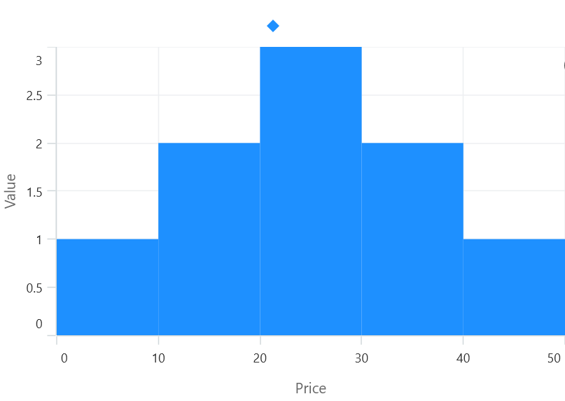
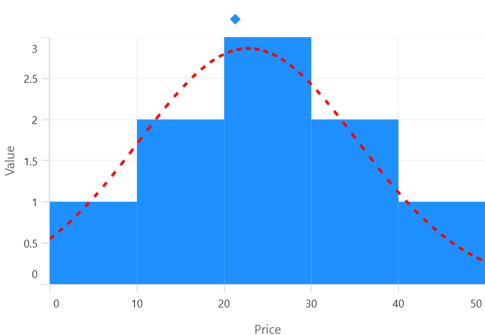

# Histogram Chart in .NET MAUI Chart

A [histogram]() is a chart that displays numerical data by showing the number of observations within each specified range of values (called bins). It is a graph that shows the frequency distribution of a set of continuous or discrete data.

The following code example shows how to add the HistogramSeries

N> By Default, [ShowDistributionCurve]() value will be true.





<chart:SfCartesianChart>

    <chart:SfCartesianChart.XAxes>
        <chart:NumericalAxis />
    </chart:SfCartesianChart.XAxes>

    <chart:SfCartesianChart.YAxes>
        <chart:NumericalAxis />
    </chart:SfCartesianChart.YAxes>   

    <chart:ColumnSeries ItemsSource="{Binding Product}"
						XBindingPath="Price"
						YBindingPath="Value"
                        HistogramInterval="10" 
                       />

</chart:SfCartesianChart>





    SfCartesianChart chart = new SfCartesianChart();
    NumericalAxis primaryAxis = new NumericalAxis();
    chart.XAxes.Add(primaryAxis);
    NumericalAxis secondaryAxis = new NumericalAxis();
    chart.YAxes.Add(secondaryAxis);

    HistogramSeries series = new HistogramSeries()
    {
        ItemsSource = new ViewModel().Product,
        XBindingPath = "Price",
        YBindingPath = "Value",
        HistogramInterval="10"       
    };

    chart.Series.Add(series);
    this.Content = chart;





You can customize interval using [HistogramInterval]() property and the normal distribution curve can be collapsed using [ShowNormalDistributionCurve]().

N> The x-axis of the histogram shows the bins(Interval), and the y-axis shows the frequency of observations(Count) in each bin.





    <chart:SfCartesianChart>

        <chart:SfCartesianChart.XAxes>
            <chart:NumericalAxis />
        </chart:SfCartesianChart.XAxes>

        <chart:SfCartesianChart.YAxes>
            <chart:NumericalAxis />
        </chart:SfCartesianChart.YAxes>  

        <chart:HistogramSeries ItemsSource="{Binding Data}"
                               XBindingPath="Price"
                               YBindingPath="Value"
                               HistogramInterval="10"   ShowDistributionCurve="false"/>
                            
    </chart:SfCartesianChart>





    SfCartesianChart chart = new SfCartesianChart();
    NumericalAxis primaryAxis = new NumericalAxis();
    chart.XAxes.Add(primaryAxis);
    NumericalAxis secondaryAxis = new NumericalAxis();
    chart.YAxes.Add(secondaryAxis);

    HistogramSeries series = new HistogramSeries()
    {
        ItemsSource = new ViewModel().Product,
        XBindingPath = "Price",
        YBindingPath = "Value",
        HistogramInterval=10,
        ShowDistributionCurve=false
    };

    chart.Series.Add(series);
    this.Content = chart;





## CurveLineStyle

You might choose to display the CurveLines as solid lines, dashed lines, dotted lines, or a combination of these. You can also specify the thickness of the lines and the color of the lines.

You can customize the normal distribution curve by using the [CurveLineStyle]() property.





    <chart:SfCartesianChart>

        <chart:SfCartesianChart.XAxes>
            <chart:NumericalAxis />
        </chart:SfCartesianChart.XAxes>

        <chart:SfCartesianChart.YAxes>
            <chart:NumericalAxis />
        </chart:SfCartesianChart.YAxes>  

        <chart:HistogramSeries ItemsSource="{Binding Product}"
                               XBindingPath="Price"
                               YBindingPath="Value"
                               ShowDistributionCurve="false"
                               HistogramInterval="10">
                    <chart:HistogramSeries.CurveLineStyle>
                        
                    </chart:HistogramSeries.CurveLineStyle>
        </chart:HistogramSeries>
                            
    </chart:SfCartesianChart>





    SfCartesianChart chart = new SfCartesianChart();
    NumericalAxis primaryAxis = new NumericalAxis();
    chart.XAxes.Add(primaryAxis);
    NumericalAxis secondaryAxis = new NumericalAxis();
    chart.YAxes.Add(secondaryAxis);

    HistogramSeries series = new HistogramSeries()
    {
        ItemsSource = new ViewModel().Product,
        XBindingPath = "Price",
        YBindingPath = "Value",
        HistogramInterval=10,
        ShowDistributionCurve=false
        Style style=new Style(typeof(Line));
        style.Setters.Add(new Setter(Line.StrokeProperty, new SolidColorBrush(Colors.Red)));
        style.Setters.Add(new Setter(Line.StrokeDashArrayProperty, new DoubleCollection() { 4 }));
        style.Setters.Add(new Setter(Line.StrokeThicknessProperty, 3));
        series.CurveLneStyle=style;
    };

    chart.Series.Add(series);
    this.Content = chart;





