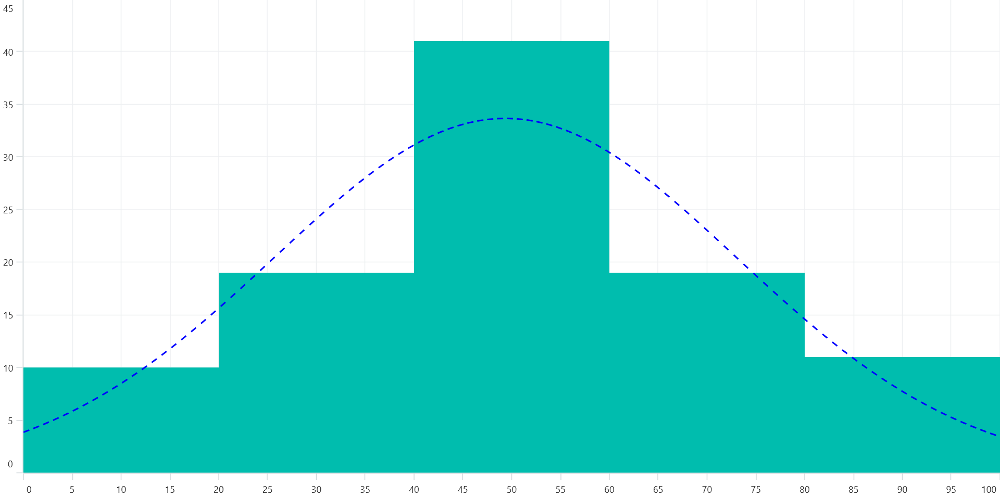

# Histogram Chart in .NET MAUI Chart
[Histogram chart]() is a graphical representation that organizes a group of data points into user-specified ranges. It is similar in appearance to a column chart.

Customize histogram intervals using the [HistogramInterval]() property and normal distribution curve can be collapsed using the [ShowNormalDistributionCurve]() property. 





    <chart:SfCartesianChart>
        <chart:SfCartesianChart.XAxes>
            <chart:NumericalAxis />
        </chart:SfCartesianChart.XAxes>

        <chart:SfCartesianChart.YAxes>
            <chart:NumericalAxis />
        </chart:SfCartesianChart.YAxes>

        <chart:HistogramSeries ItemsSource="{Binding HistogramData}"
                               XBindingPath="Value" 
                               YBindingPath="Size"
                               HistogramInterval="20" 
                               ShowNormalDistributionCurve="True">
        </chart:HistogramSeries>
    </chart:SfCartesianChart>





    SfCartesianChart chart = new SfCartesianChart();

    NumericalAxis xAxis = new NumericalAxis();
    chart.XAxes.Add(xAxis);

    NumericalAxis yAxis = new NumericalAxis();
    chart.YAxes.Add(yAxis);

    HistogramSeries histogramSeries = new HistogramSeries
    {
        ItemsSource = new ViewModel().HistogramData, 
        XBindingPath = "Value",
        YBindingPath = "Size",
        HistogramInterval = 20,
        ShowNormalDistributionCurve = true
    };

    chart.Series.Add(histogramSeries);
    this.Content = chart;





## Customization of distribution curve

Customize the normal distribution curve by using the [CurveLineStyle]() property.





    <chart:SfCartesianChart>
        ....

      <chart:HistogramSeries ItemsSource="{Binding HistogramData}" 
                             XBindingPath="Value" 
                             YBindingPath="Size"
                             HistogramInterval="20"
                             ShowNormalDistributionCurve="True">
         <chart:HistogramSeries.CurveStyle>
             <chart:ChartLineStyle Stroke="Blue"
                                   StrokeWidth="2"
                                   StrokeDashArray="5,6,3">
             </chart:ChartLineStyle>
         </chart:HistogramSeries.CurveStyle>
        </chart:HistogramSeries>
    </chart:SfCartesianChart>





    SfCartesianChart chart = new SfCartesianChart();
    ....
  
    HistogramSeries histogramSeries = new HistogramSeries
    {
        ItemsSource = new ViewModel().HistogramData, 
        XBindingPath = "Value",
        YBindingPath = "Size",
        HistogramInterval = 20,
        CurveStyle = new ChartLineStyle
        {
            Stroke = Color.Blue,
            StrokeWidth = 2,
            StrokeDashArray = new double[] { 5, 6, 3 }
        }
    };

    chart.Series.Add(histogramSeries);
    this.Content = chart;





