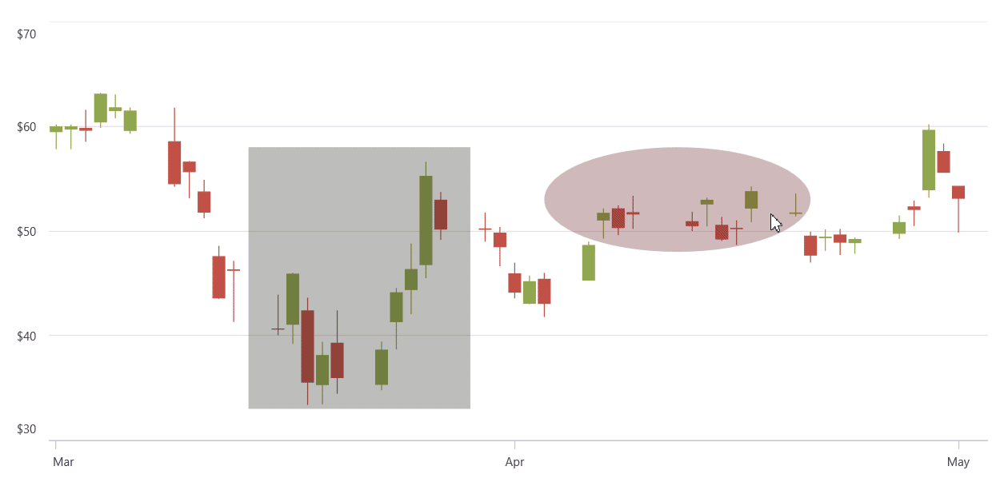

# Interactive Annotation Color Customization

The .NET MAUI Cartesian Chart enables **dynamic annotation color customization** through interactive color selection dialogs. By leveraging the [AnnotationTapped](https://help.syncfusion.com/cr/maui/Syncfusion.Maui.Charts.SfCartesianChart.html#Syncfusion_Maui_Charts_SfCartesianChart_AnnotationTapped) event, annotations can be captured on tap interactions and color changes applied to various annotation types including [TextAnnotation](https://help.syncfusion.com/cr/maui/Syncfusion.Maui.Charts.TextAnnotation.html), [ShapeAnnotation](https://help.syncfusion.com/cr/maui/Syncfusion.Maui.Charts.ShapeAnnotation.html), and [ViewAnnotation](https://help.syncfusion.com/cr/maui/Syncfusion.Maui.Charts.ViewAnnotation.html) in real-time, enhancing chart interactivity.

## AnnotationTapped Event

The [AnnotationTapped](https://help.syncfusion.com/cr/maui/Syncfusion.Maui.Charts.SfCartesianChart.html#Syncfusion_Maui_Charts_SfCartesianChart_AnnotationTapped) event is fired when an annotation receives a tap interaction. The event handler receives [AnnotationTappedEventArgs](https://help.syncfusion.com/cr/maui/Syncfusion.Maui.Charts.AnnotationTappedEventArgs.html) which contains a reference to the tapped annotation object, allowing you to identify and modify the annotation's properties.

**[XAML]**

```xml
<ContentPage>
    <chart:SfCartesianChart x:Name="Chart" AnnotationTapped="Chart_AnnotationTapped">
        .....
        <chart:SfCartesianChart.Annotations>
            .........
        </chart:SfCartesianChart.Annotations>    
    </chart:SfCartesianChart>
</ContentPage>
```

**[C#]**

```csharp
private void Chart_AnnotationTapped(object sender, AnnotationTappedEventArgs e)
{
    // Apply selected color to annotation.
}
```



## See also

[How to customize annotation colors interactively in .NET MAUI Cartesian Chart?](https://support.syncfusion.com/agent/kb/22184)
