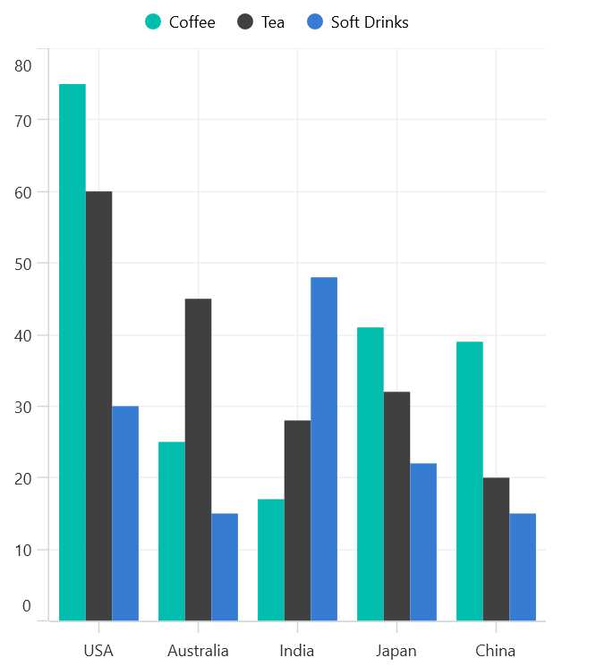
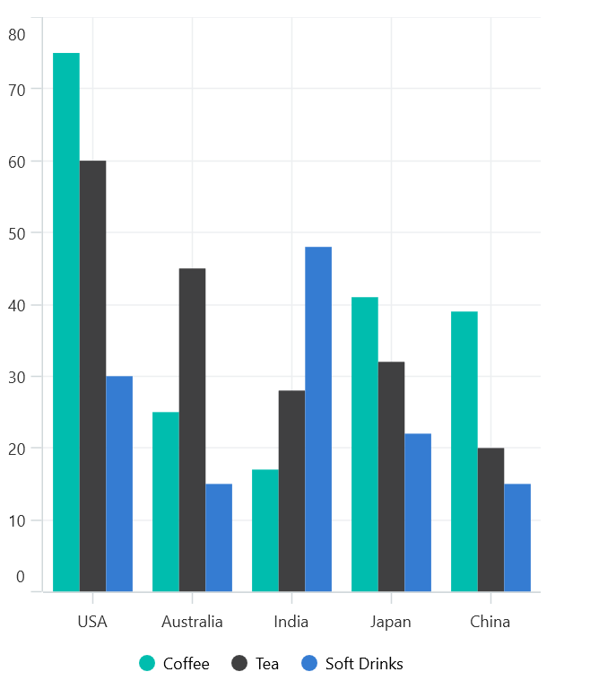
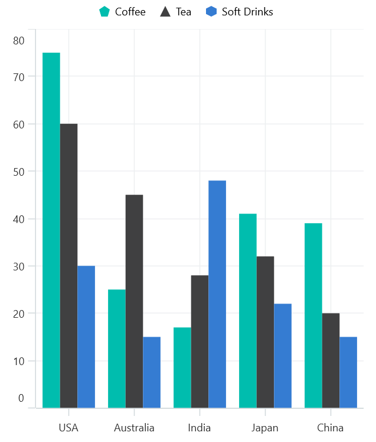
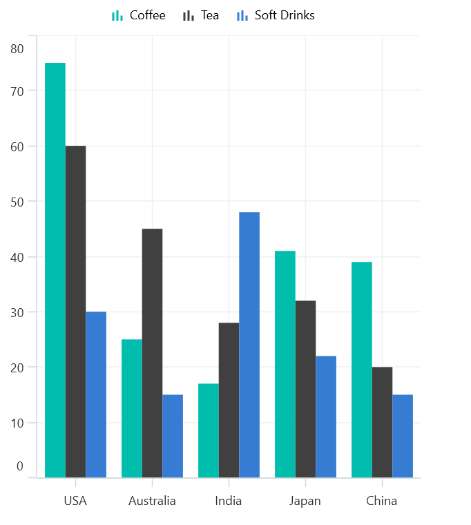

# Legend in .NET MAUI Cartesian Chart

A legend is a graphical representation that explains the meaning of the data series in a chart. It typically consists of a key or symbol associated with each data series and a label that describes what that series represents. The legend helps users understand the data being presented in the chart by providing a visual reference for the different categories or data points.





    <chart:SfCartesianChart>
            <chart:SfCartesianChart.XAxes>
                <chart:CategoryAxis/>
            </chart:SfCartesianChart.XAxes>
            <chart:SfCartesianChart.YAxes>
                <chart:NumericalAxis/>
            </chart:SfCartesianChart.YAxes>

            <chart:ColumnSeries ItemsSource="{Binding Product}"
                                XBindingPath="Country"
                                YBindingPath="Value"
                                Label="Cofee"></chart:ColumnSeries>

            <chart:ColumnSeries ItemsSource="{Binding Import}"
                                XBindingPath="Country"
                                YBindingPath="Value"
                                Label="Tea"></chart:ColumnSeries>

            <chart:ColumnSeries ItemsSource="{Binding Export}"
                                XBindingPath="Country"
                                YBindingPath="Value"
                                Label="Soft Drinks"></chart:ColumnSeries>

            <chart:SfCartesianChart.Legend>
                <chart:ChartLegend></chart:ChartLegend>
            </chart:SfCartesianChart.Legend>
    </chart:SfCartesianChart>




 SfCartesianChart chart = new SfCartesianChart();

        CategoryAxis xAxes = new CategoryAxis();
        chart.XAxes.Add(xAxes);

        NumericalAxis yAxes = new NumericalAxis();
        chart.YAxes.Add(yAxes);

        ColumnSeries coffeeSeries = new ColumnSeries()
        {
            ItemsSource = this.Product,
            XBindingPath = "Country",
            YBindingPath = "Value",
            Label = "Coffee"
        };
        chart.Series.Add(coffeeSeries);

        ColumnSeries teaSeries = new ColumnSeries()
        {
            ItemsSource = this.Import,
            XBindingPath = "Country",
            YBindingPath = "Value",
            Label = "Tea"
        };
        chart.Series.Add(teaSeries);

        ColumnSeries softDrinksSeries = new ColumnSeries()
        {
            ItemsSource = this.Export,
            XBindingPath = "Country",
            YBindingPath = "Value",
            Label = "Soft Drinks"
        };
        chart.Series.Add(softDrinksSeries);

        ChartLegend legend = new ChartLegend();
        chart.Legend = legend;

        Content = chart;





## Legend Visibility

To control the visibility of the legend in a chart control, the [IsVisible]() property can be used. Here is an example of how to define the legend visibility in a chart control:





    <chart:SfCartesianChart>
        ...
            <chart:SfCartesianChart.Legend>
                <chart:ChartLegend IsVisible="True"></chart:ChartLegend>
            </chart:SfCartesianChart.Legend>

    </chart:SfCartesianChart>




 SfCartesianChart chart = new SfCartesianChart();
        ...

        ChartLegend legend = new ChartLegend();
        legend.IsVisible = true;
        chart.Legend = legend;

        Content = chart;





## Legend Placement

The Legend were Placed anywhere in the Chart using the [LegendPlacement]() Property.
We can adjust the placement by assigning one of the following values to [legendPlacement]().

* [LegendPlacement.Top]()- Places the legend at the top of the chart.
* [LegendPlacement.Bottom]()- Places the legend at the Bottom of the chart.
* [LegendPlacement.Right]()- Places the legend on the right side of the chart.
* [LegendPlacement.Left]()- Places the legend on the left side of the chart.

N> By default, the [LegendPlacement]() is [LegendPlacement.Top]()





    <chart:SfCartesianChart>
        ...
            <chart:SfCartesianChart.Legend>
                <chart:ChartLegend Placement="Bottom" ></chart:ChartLegend>
            </chart:SfCartesianChart.Legend>

    </chart:SfCartesianChart>




 SfCartesianChart chart = new SfCartesianChart();
        ...
        ChartLegend legend = new ChartLegend();
        legend.Placement= LegendPlacement.Bottom;
        chart.Legend = legend;

        Content = chart;





## Legend Toggle Series Visibility

We can control the visibility of the series by enabling the [ToggleSeriesVisibility]() property of the ChartLegend. This allows us to toggle the visibility of the series when the legend items are tapped.





    <chart:SfCartesianChart>
        ...
            <chart:SfCartesianChart.Legend>
                <chart:ChartLegend ToggleSeriesVisibility="True" ></chart:ChartLegend>
            </chart:SfCartesianChart.Legend>

    </chart:SfCartesianChart>




 SfCartesianChart chart = new SfCartesianChart();
        ...

        ChartLegend legend = new ChartLegend();
        legend.ToggleSeriesVisibility = true;
        chart.Legend = legend;

        Content = chart;





## Legend Icon Customization

We can be able to customize the appearance of the Legend Icon using the [LegendIcon]() in the series.
In the [LegendIcon]() property, we can use the following listed Shapes to Customize the Legend Icon:

| Icon Shapes | Icon Shapes       | Icon Shapes   |
| --------    | --------          | --------      |
| Circle      | Horizontal Line   | Rectangle     |
| Cross       | Inverted Triangle | Triangle      |
| Diamond     | Pentagon          | Vertical Line |
| Hexagon     | Plus              |        |

N> The default value for the LegendIcon in the Series is circular in shape.





    <chart:SfCartesianChart>
        ...
            <chart:ColumnSeries ItemsSource="{Binding Product}"
                                XBindingPath="Country"
                                YBindingPath="Value"
                                Label="Cofee"
                                LegendIcon="Hexagon"></chart:ColumnSeries>

            <chart:ColumnSeries ItemsSource="{Binding Import}"
                                XBindingPath="Country"
                                YBindingPath="Value"
                                Label="Tea"
                                LegendIcon="Triangle"></chart:ColumnSeries>

            <chart:ColumnSeries ItemsSource="{Binding Export}"
                                XBindingPath="Country"
                                YBindingPath="Value"
                                Label="Soft Drinks"
                                LegendIcon="Pentagon"></chart:ColumnSeries>

    </chart:SfCartesianChart>




 SfCartesianChart chart = new SfCartesianChart();
        ...
        ColumnSeries coffeeSeries = new ColumnSeries()
        {
            ItemsSource = this.Product,
            XBindingPath = "Country",
            YBindingPath = "Value",
            LegendIcon = ChartLegendIconType.Hexagon,
            Label = "Coffee"
        };
        chart.Series.Add(coffeeSeries);

        ColumnSeries teaSeries = new ColumnSeries()
        {
            ItemsSource = this.Import,
            XBindingPath = "Country",
            YBindingPath = "Value",
            LegendIcon = ChartLegendIconType.Triangle,
            Label = "Tea"
        };
        chart.Series.Add(teaSeries);

        ColumnSeries softDrinksSeries = new ColumnSeries()
        {
            ItemsSource = this.Export,
            XBindingPath = "Country",
            YBindingPath = "Value",
            LegendIcon = ChartLegendIconType.Pentagon,
            Label = "Soft Drinks"
            
        };
        chart.Series.Add(softDrinksSeries);





### Series Type Legend Icon

We can Customize the Legend Icon based on the Series type in the Chart.
Each series has its own legend icon. This can be achieved through the [LegendIcon]() of the series is set to be [SeriesType]().





    <chart:SfCartesianChart>
        ...
            <chart:ColumnSeries ItemsSource="{Binding Product}"
                                XBindingPath="Country"
                                YBindingPath="Value"
                                Label="Cofee"
                                LegendIcon="SeriesType" ></chart:ColumnSeries>

            <chart:ColumnSeries ItemsSource="{Binding Import}"
                                XBindingPath="Country"
                                YBindingPath="Value"
                                Label="Tea"
                                LegendIcon="SeriesType" ></chart:ColumnSeries>

            <chart:ColumnSeries ItemsSource="{Binding Export}"
                                XBindingPath="Country"
                                YBindingPath="Value"
                                Label="Soft Drinks"
                                LegendIcon="SeriesType" ></chart:ColumnSeries>

    </chart:SfCartesianChart>




 SfCartesianChart chart = new SfCartesianChart();
        ...
        ColumnSeries coffeeSeries = new ColumnSeries()
        {
            ItemsSource = this.Product,
            XBindingPath = "Country",
            YBindingPath = "Value",
            LegendIcon = ChartLegendIconType.SeriesType,
            Label = "Coffee"
        };
        chart.Series.Add(coffeeSeries);

        ColumnSeries teaSeries = new ColumnSeries()
        {
            ItemsSource = this.Import,
            XBindingPath = "Country",
            YBindingPath = "Value",
            LegendIcon = ChartLegendIconType.SeriesType,
            Label = "Tea"
        };
        chart.Series.Add(teaSeries);

        ColumnSeries softDrinksSeries = new ColumnSeries()
        {
            ItemsSource = this.Export,
            XBindingPath = "Country",
            YBindingPath = "Value",
            LegendIcon = ChartLegendIconType.SeriesType,
            Label = "Soft Drinks"          
        };
        chart.Series.Add(softDrinksSeries);





