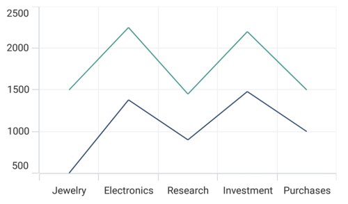
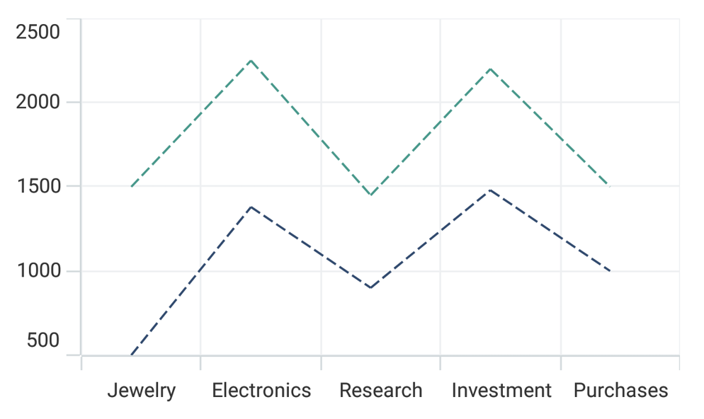
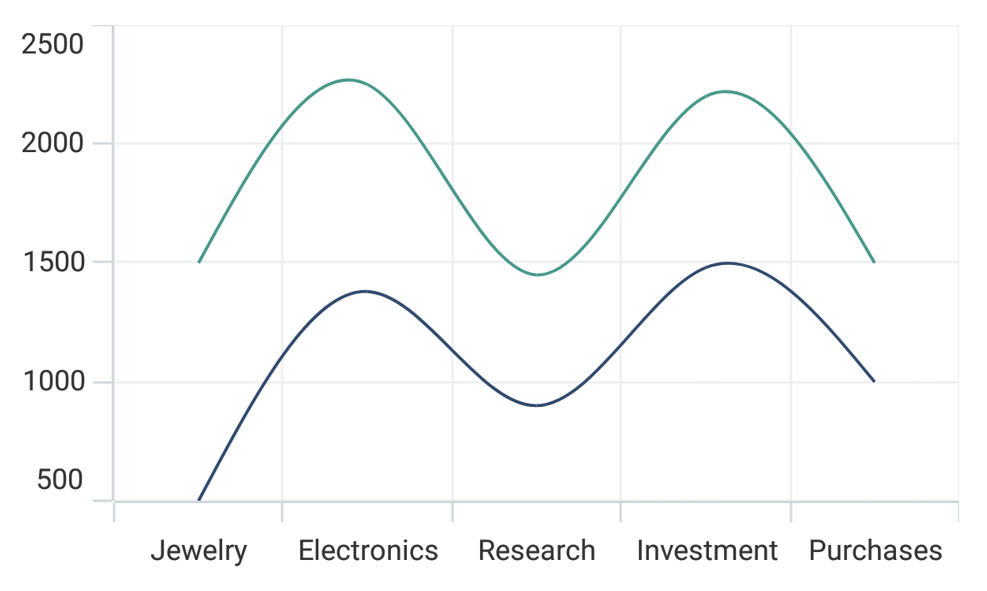
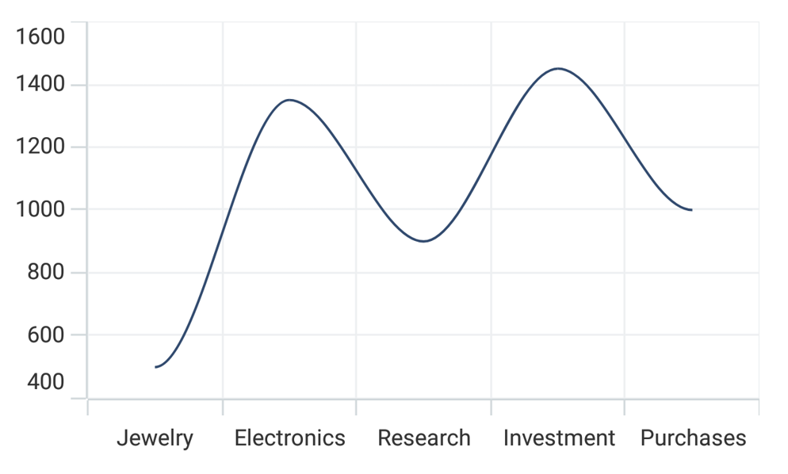
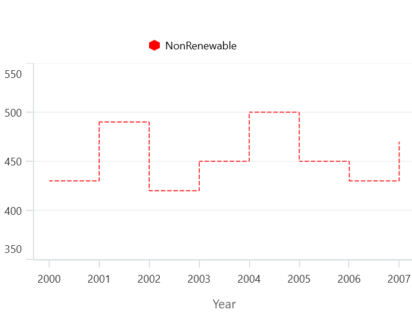
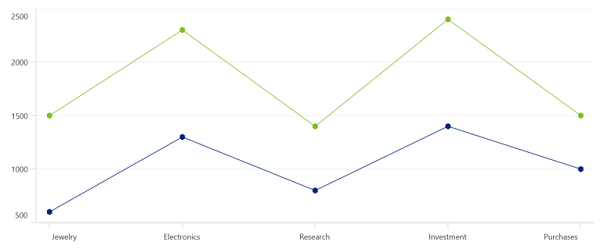

# Line Chart in .NET MAUI Chart

## Line Chart

Line chart is used to represent the data trends at equal intervals by connecting points on a plot with straight lines. To render a line chart, create an instance of [LineSeries](https://help.syncfusion.com/cr/maui/Syncfusion.Maui.Charts.LineSeries.html?tabs=tabid-1), and add it to the [Series](https://help.syncfusion.com/cr/maui/Syncfusion.Maui.Charts.SfCartesianChart.html#Syncfusion_Maui_Charts_SfCartesianChart_Series) collection property of [SfCartesianChart](https://help.syncfusion.com/cr/maui/Syncfusion.Maui.Charts.SfCartesianChart.html?tabs=tabid-1).

N> The Cartesian chart has [Series](https://help.syncfusion.com/cr/maui/Syncfusion.Maui.Charts.SfCartesianChart.html#Syncfusion_Maui_Charts_SfCartesianChart_Series) as its default content.





<chart:SfCartesianChart>
    <chart:SfCartesianChart.XAxes>
        <chart:CategoryAxis />
    </chart:SfCartesianChart.XAxes>

    <chart:SfCartesianChart.YAxes>
        <chart:NumericalAxis />
    </chart:SfCartesianChart.YAxes>  

    <chart:LineSeries XBindingPath="Demand"
					  ItemsSource="{Binding Data}"
					  YBindingPath="Year2010"/>
    <chart:LineSeries XBindingPath="Demand"
					  ItemsSource="{Binding Data}"
					  YBindingPath="Year2011"/>
</chart:SfCartesianChart>





SfCartesianChart chart = new SfCartesianChart();
CategoryAxis primaryAxis = new CategoryAxis();
chart.XAxes.Add(primaryAxis);
NumericalAxis secondaryAxis = new NumericalAxis();
chart.YAxes.Add(secondaryAxis);

LineSeries series1 = new LineSeries()
{
    ItemsSource = new ViewModel().Data,
    XBindingPath = "Demand",
    YBindingPath = "Year2010",
};

LineSeries series2 = new LineSeries()
{
    ItemsSource = new ViewModel().Data,
    XBindingPath = "Demand",
    YBindingPath = "Year2011",

};

chart.Series.Add(series1);
chart.Series.Add(series2);

this.Content = chart;





### Dashed line

The [StrokeDashArray](https://help.syncfusion.com/cr/maui/Syncfusion.Maui.Charts.LineSeries.html#Syncfusion_Maui_Charts_LineSeries_StrokeDashArray) property of [LineSeries](https://help.syncfusion.com/cr/maui/Syncfusion.Maui.Charts.LineSeries.html?tabs=tabid-1) is used to render the line series with dashes. Odd value is considered as rendering size and even value is considered as gap.





<chart:SfCartesianChart>
    <chart:SfCartesianChart.Resources>
        <DoubleCollection x:Key="dashArray">
            <x:Double>5</x:Double>
            <x:Double>2</x:Double>
        </DoubleCollection>
    </chart:SfCartesianChart.Resources>

    <chart:SfCartesianChart.XAxes>
        <chart:CategoryAxis />
    </chart:SfCartesianChart.XAxes>

    <chart:SfCartesianChart.YAxes>
        <chart:NumericalAxis />
    </chart:SfCartesianChart.YAxes>  

    <chart:LineSeries XBindingPath="Demand"
					  ItemsSource="{Binding Data}"
					  YBindingPath="Year2010"
					  StrokeDashArray="{StaticResource dashArray}"/>
    <chart:LineSeries XBindingPath="Demand"
					  ItemsSource="{Binding Data}" 
					  YBindingPath="Year2011"
					  StrokeDashArray="{StaticResource dashArray}"/>
</chart:SfCartesianChart>





SfCartesianChart chart = new SfCartesianChart();
CategoryAxis primaryAxis = new CategoryAxis();
chart.XAxes.Add(primaryAxis);
NumericalAxis secondaryAxis = new NumericalAxis();
chart.YAxes.Add(secondaryAxis);

DoubleCollection doubleCollection = new DoubleCollection();
doubleCollection.Add(5);
doubleCollection.Add(2);
. . .
LineSeries series1 = new LineSeries()
{
    ItemsSource = new ViewModel().Data,
    XBindingPath = "Demand",
    YBindingPath = "Year2010",
    StrokeDashArray = doubleCollection

};

LineSeries series2 = new LineSeries()
{
    ItemsSource = new ViewModel().Data,
    XBindingPath = "Demand",
    YBindingPath = "Year2011",
    StrokeDashArray = doubleCollection
};

chart.Series.Add(series1);
chart.Series.Add(series2);

this.Content = chart;





## Spline Chart 

The [SplineSeries](https://help.syncfusion.com/cr/maui/Syncfusion.Maui.Charts.SplineSeries.html?tabs=tabid-1) resembles line series, but instead of connecting the data points with line segments, the data points are connected by smooth bezier curves.





<chart:SfCartesianChart>
    <chart:SfCartesianChart.XAxes>
        <chart:CategoryAxis />
    </chart:SfCartesianChart.XAxes>

    <chart:SfCartesianChart.YAxes>
        <chart:NumericalAxis />
    </chart:SfCartesianChart.YAxes>  

    <chart:SplineSeries XBindingPath="Demand"
						ItemsSource="{Binding Data}"
						YBindingPath="Year2010"/>
    <chart:SplineSeries XBindingPath="Demand"
						ItemsSource="{Binding Data}"
						YBindingPath="Year2011"/>
</chart:SfCartesianChart>





SfCartesianChart chart = new SfCartesianChart();
CategoryAxis primaryAxis = new CategoryAxis();
chart.XAxes.Add(primaryAxis);
NumericalAxis secondaryAxis = new NumericalAxis();
chart.YAxes.Add(secondaryAxis);

SplineSeries series1 = new SplineSeries()
{
    ItemsSource = new ViewModel().Data,
    XBindingPath = "Demand",
    YBindingPath = "Year2010",
};

SplineSeries series2 = new SplineSeries()
{
    ItemsSource = new ViewModel().Data,
    XBindingPath = "Demand",
    YBindingPath = "Year2011",
};

chart.Series.Add(series1);
chart.Series.Add(series2);

this.Content = chart;





### Spline rendering types

The [Type](https://help.syncfusion.com/cr/maui/Syncfusion.Maui.Charts.SplineSeries.html#Syncfusion_Maui_Charts_SplineSeries_Type) property allows to change the rendering type of spline curve in series. The default value of [Type](https://help.syncfusion.com/cr/maui/Syncfusion.Maui.Charts.SplineSeries.html#Syncfusion_Maui_Charts_SplineSeries_Type) is [Natural](https://help.syncfusion.com/cr/maui/Syncfusion.Maui.Charts.SplineType.html#Syncfusion_Maui_Charts_SplineType_Natural).

The following types are used in SplineSeries:

* `Natural`
* `Monotonic`
* `Cardinal`
* `Clamped`





<chart:SfCartesianChart>
    <chart:SfCartesianChart.XAxes>
        <chart:CategoryAxis />
    </chart:SfCartesianChart.XAxes>

    <chart:SfCartesianChart.YAxes>
        <chart:NumericalAxis />
    </chart:SfCartesianChart.YAxes>  

    <chart:SplineSeries XBindingPath="Demand"
						ItemsSource="{Binding Data}"
						YBindingPath="Year2010"
						Type="Cardinal"/>
</chart:SfCartesianChart>





SfCartesianChart chart = new SfCartesianChart();
CategoryAxis primaryAxis = new CategoryAxis();
chart.XAxes.Add(primaryAxis);
NumericalAxis secondaryAxis = new NumericalAxis();
chart.YAxes.Add(secondaryAxis);

SplineSeries series = new SplineSeries()
{
    ItemsSource = new ViewModel().Data,
    XBindingPath = "Demand",
    YBindingPath = "Year2010",
    Type = SplineType.Cardinal
};

chart.Series.Add(series);

this.Content = chart;





## Step Line Chart

Step line chart is used to display the data showing changes in values over time by connecting points on plots with a combination of horizontal and vertical lines. And it's used when it is necessary to highlight the irregularity changes. It appears to be steps.

To render the Step line chart, create an instance of the [StepLineSeries](https://help.syncfusion.com/cr/maui/Syncfusion.Maui.Charts.StepLineSeries.html), and add it to the [Series](https://help.syncfusion.com/cr/maui/Syncfusion.Maui.Charts.SfCartesianChart.html#Syncfusion_Maui_Charts_SfCartesianChart_Series) collection property of the [SfCartesianChart](https://help.syncfusion.com/cr/maui/Syncfusion.Maui.Charts.SfCartesianChart.html?tabs=tabid-1).

N> The cartesian chart has [Series](https://help.syncfusion.com/cr/maui/Syncfusion.Maui.Charts.SfCartesianChart.html#Syncfusion_Maui_Charts_SfCartesianChart_Series) as its default content.





<chart:SfCartesianChart>

    <chart:SfCartesianChart.XAxes>
        <chart:DatetimeAxis/>
    </chart:SfCartesianChart.XAxes>

    <chart:SfCartesianChart.YAxes>
        <chart:NumericalAxis/>
    </chart:SfCartesianChart.YAxes>   

    <chart:StepLineSeries ItemsSource="{Binding Data}"
                          XBindingPath="Date"
                          YBindingPath="Value"/>

    <chart:StepLineSeries ItemsSource="{Binding Data1}"
                          XBindingPath="Date"
                          YBindingPath="Value"/>

</chart:SfCartesianChart>





    SfCartesianChart chart = new SfCartesianChart();
    DatetimeAxis primaryAxis = new DatetimeAxis();
    chart.XAxes.Add(primaryAxis);
    NumericalAxis secondaryAxis = new NumericalAxis();
    chart.YAxes.Add(secondaryAxis);

    StepLineSeries series = new StepLineSeries()
    {
        ItemsSource = new ViewModel().Data,
        XBindingPath = "Date",
        YBindingPath = "Value",
    };

    StepLineSeries series1 = new StepLineSeries()
    {
        ItemsSource = new ViewModel().Data1,
        XBindingPath = "Date",
        YBindingPath = "Value",
    };

    chart.Series.Add(series);
    chart.Series.Add(series1);
    this.Content = chart;





### Dashed Step Line Chart

The [StrokeDashArray](https://help.syncfusion.com/cr/maui/Syncfusion.Maui.Charts.LineSeries.html#Syncfusion_Maui_Charts_LineSeries_StrokeDashArray) property of the [StepLineSeries](https://help.syncfusion.com/cr/maui/Syncfusion.Maui.Charts.StepLineSeries.html) is used to render the Step line series with dashes. An odd value is considered as rendering size, and an Even value is considered a gap.





<Chart:SfCartesianChart>

    <chart:SfCartesianChart.Resource>
        <DoubleCollection x:Key="DashArray">
            <x:Double>5</x:Double>
            <x:Double>2</x:Double>
        </DoubleCollection>
    </chart:SfCartesianChart.Resource>

    <chart:SfCartesianChart.XAxes>
        <chart:DatetimeAxis/>
    </chart:SfCartesianChart.XAxes>

    <chart:SfCartesianChart.YAxes>
        <chart:NumericalAxis/>
    </chart:SfCartesianChart.YAxes>   

    <chart:StepLineSeries ItemsSource="{Binding Data}"
                          StrokeDashArray="DashArray"
                          XBindingPath="Date"
                          YBindingPath="Value"/>

    <Chart:SfCartesianChart>





    SfCartesianChart chart = new SfCartesianChart();

    DatetimeAxis primaryAxis = new DatetimeAxis();
    chart.XAxes.Add(primaryAxis);
    NumericalAxis secondaryAxis = new NumericalAxis();
    chart.YAxes.Add(secondaryAxis);

    DoubleCollection doubleCollection = new DoubleCollection();
    doubleCollection.Add(5);
    doubleCollection.Add(2);

    StepLineSeries steplineSeries = new StepLineSeries()
    {
        itemSource = new ViewModel().Data;
        XBindingPath = "Date";
        YBindingPath = "Value";
        StrokeDashArray = doubleCollection;
    }

    chart.Series.Add(steplineSeries);
    this.Content = chart;





### Vertical Step Line Chart 

The [IsTransposed](https://help.syncfusion.com/cr/maui/Syncfusion.Maui.Charts.SfCartesianChart.html#Syncfusion_Maui_Charts_SfCartesianChart_IsTransposedProperty) property of the [SfCartesianChart](https://help.syncfusion.com/cr/maui/Syncfusion.Maui.Charts.SfCartesianChart.html?tabs=tabid-1) is used to render the Step line series vertically. To enable the Step line series vertically, set the IsTransposed property to true.





<Chart:SfCartesianChart IsTransposed="True">

    <chart:SfCartesianChart.XAxes>
        <chart:DatetimeAxis/>
    </chart:SfCartesianChart.XAxes>

    <chart:SfCartesianChart.YAxes>
        <chart:NumericalAxis/>
    </chart:SfCartesianChart.YAxes>   

    <chart:StepLineSeries ItemsSource=""{Binding Data}
                          XBindingPath="Year"
                          YBindingPath="Value"/>

    <chart:StepLineSeries ItemsSource="{Binding Data1}"
                          XBindingPath="Year"
                          YBindingPath="Value"/>

    <Chart:SfCartesianChart>





    SfCartesianChart chart = new SfCartesianChart();

    chart.isTransposed = True;

    DatetimeAxis primaryAxis = new DatetimeAxis();
    chart.XAxes.Add(primaryAxis);
    NumericalAxis secondaryAxis = new NumericalAxis();
    chart.YAxes.Add(secondaryAxis);

    StepLineSeries steplineSeries = new StepLineSeries()
    {
        itemSource = new ViewModel().Data;
        XBindingPath = "Year";
        YBindingPath = "Value";
    };

    StepLineSeries steplineSeries1 = new StepLineSeries()
    {
        itemSource = new ViewModel().Data;
        XBindingPath = "Year";
        YBindingPath = "Value";
    };

    chart.Series.Add(steplineSeries);
    chart.Series.Add(steplineSeries1);
    this.Content = chart;





## Enable Marker

A marker, also known as a symbol, is used to determine or highlight the position of the data point. To enable markers in the series, set the [ShowMarkers](https://help.syncfusion.com/cr/maui/Syncfusion.Maui.Charts.LineSeries.html#Syncfusion_Maui_Charts_LineSeries_ShowMarkers) property to true.





<chart:SfCartesianChart>
...
 <chart:LineSeries XBindingPath="Demand"
                   YBindingPath="Year2010"
                   ItemsSource="{Binding Data}"
                   ShowMarkers="True"/>

 <chart:LineSeries XBindingPath="Demand"
                   YBindingPath="Year2011"
                   ItemsSource="{Binding Data}"
                   ShowMarkers="True"/>                  

</chart:SfCartesianChart>





SfCartesianChart chart = new SfCartesianChart();

...
LineSeries series = new LineSeries()
{
    XBindingPath = "Demand",
    YBindingPath = "Year2010",
    ItemsSource = new ViewModel().Data,
    ShowMarkers= true,
 };

LineSeries series = new LineSeries()
{
    XBindingPath = "Demand",
    YBindingPath = "Year2011",
    ItemsSource = new ViewModel().Data,
    ShowMarkers= true,
 };

chart.Series.Add(series);
this.Content= chart;





### Marker customization

In order to change the series markers appearance, create an instance of the [MarkerSettings](https://help.syncfusion.com/cr/maui/Syncfusion.Maui.Charts.LineSeries.html#Syncfusion_Maui_Charts_LineSeries_MarkerSettings) property. The following properties are used to customize marker appearance.

* [Type](https://help.syncfusion.com/cr/maui/Syncfusion.Maui.Charts.ChartMarkerSettings.html#Syncfusion_Maui_Charts_ChartMarkerSettings_Type), of type `ShapeType`, describes the shape of the series marker. The default value of this property is [ShapeType.Circle]().
* [Stroke](https://help.syncfusion.com/cr/maui/Syncfusion.Maui.Charts.ChartMarkerSettings.html#Syncfusion_Maui_Charts_ChartMarkerSettings_Stroke), of type `Brush`, indicates the brush used to paint the marker border.
* [StrokeWidth](https://help.syncfusion.com/cr/maui/Syncfusion.Maui.Charts.ChartMarkerSettings.html#Syncfusion_Maui_Charts_ChartMarkerSettings_StrokeWidth), of type `double`, indicates the width of the marker border.
* [Fill](https://help.syncfusion.com/cr/maui/Syncfusion.Maui.Charts.ChartMarkerSettings.html#Syncfusion_Maui_Charts_ChartMarkerSettings_Fill), of type `Brush`, indicates the color of the marker.
* [Width](https://help.syncfusion.com/cr/maui/Syncfusion.Maui.Charts.ChartMarkerSettings.html#Syncfusion_Maui_Charts_ChartMarkerSettings_Width), of type `double`, indicates the width of the marker.
* [Height](https://help.syncfusion.com/cr/maui/Syncfusion.Maui.Charts.ChartMarkerSettings.html#Syncfusion_Maui_Charts_ChartMarkerSettings_Height), of type `double`, indicates the height of the marker.





<chart:SfCartesianChart>
...
 <chart:LineSeries XBindingPath="Year"
                   YBindingPath="Percentage"
                   ItemsSource="{Binding Data}"
                   ShowMarkers="True">
    <chart:LineSeries.MarkerSettings>
        <chart:ChartMarkerSettings Type="Diamond"
                                   Fill="Brown"
                                   Stroke="Black"
                                   StrokeWidth="1"
                                   Height="8"
                                   Width="8"/>
    </chart:LineSeries.MarkerSettings>
 </chart:LineSeries>
</chart:SfCartesianChart>





SfCartesianChart chart = new SfCartesianChart();

...
ChartMarkerSettings chartMarker= new ChartMarkerSettings();
        chartMarker.Type = ShapeType.Diamond;
        chartMarker.Fill = Colors.Brown;
        chartMarker.Stroke = Colors.Black;
        chartMarker.StrokeWidth= 1;
        chartMarker.Height = 8;
        chartMarker.Width = 8;

LineSeries series = new LineSeries()
{
   XBindingPath = "Year",
   YBindingPath = "Percentage",
   ItemsSource = new ViewModel().Data,
   ShowMarkers = true,
   MarkerSettings = chartMarker,
 };

chart.Series.Add(series);
this.Content = chart;





