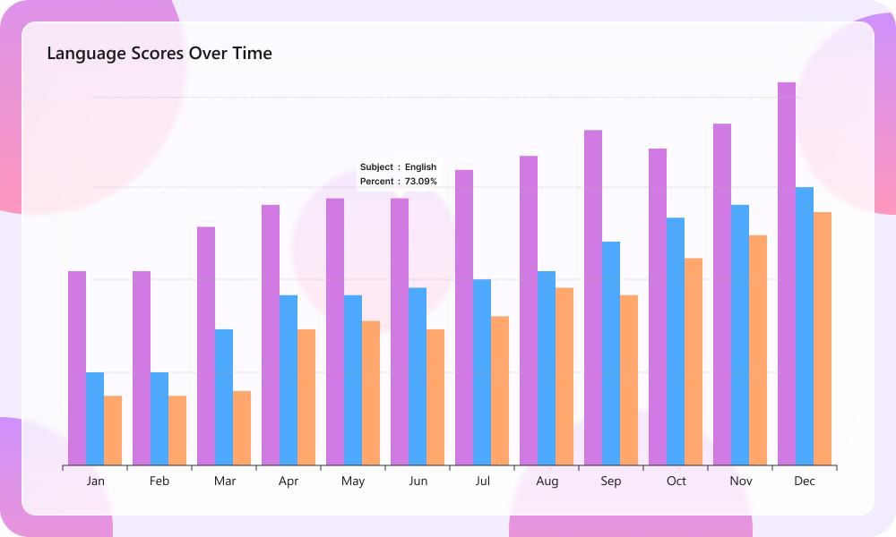
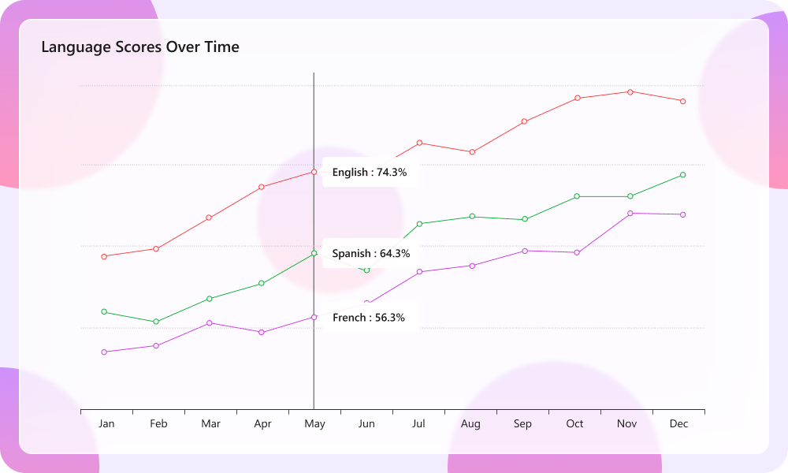

# Liquid Glass Effect in .NET MAUI Cartesian Chart

The Liquid Glass Effect is a modern design style that provides a sleek, minimalist appearance with clean lines, subtle visual effects, and elegant styling. It features smooth rounded corners and sophisticated visual treatments that create a polished, professional look for your charts.

N> The liquid glass effect is supported only on `.NET 10` and on `iOS` and `macOS` versions 26 or later

## How it Enhances Chart UI on macOS and iOS

The Liquid Glass Effect enhances MAUI SfCartesianChart with a sleek, glassy look and improved interactivity.

- **Tooltip:** Applies a glassy appearance to tooltips for clearer data highlights.
- **Trackball:** Adds a glassy style to trackball labels for precise value inspection.
- **Chart Background:** Wrap the chart in an SfGlassEffectView to give the chart surface a blurred or clear glass background.

## Apply Liquid Glass Effect to SfCartesianChart Background

Wrap the SfCartesianChart inside an [SfGlassEffectView](https://help.syncfusion.com/cr/maui/Syncfusion.Maui.Core.SfGlassEffectView.html) to give the chart surface a glass (blurred or clear) appearance. SfGlassEffectView is available in the [Syncfusion.Maui.Core](https://www.nuget.org/packages/Syncfusion.Maui.Core/) package.





<core:SfGlassEffectView CornerRadius="20"
                        Padding="12"
                        EffectType="Regular"
                        EnableShadowEffect="True">

    <chart:SfCartesianChart>

        <chart:SfCartesianChart.XAxes>
            <chart:CategoryAxis />
        </chart:SfCartesianChart.XAxes>
        <chart:SfCartesianChart.YAxes>
            <chart:NumericalAxis />
        </chart:SfCartesianChart.YAxes>

        <chart:ColumnSeries
            ItemsSource="{Binding Data}"
            XBindingPath="Category"
            YBindingPath="Value" />

    </chart:SfCartesianChart>
</core:SfGlassEffectView>





SfCartesianChart chart = new SfCartesianChart();

chart.XAxes.Add(new CategoryAxis());
chart.YAxes.Add(new NumericalAxis());

chart.Series.Add(new ColumnSeries
{
    ItemsSource = viewModel.Data,
    XBindingPath = "Category",
    YBindingPath = "Value"
});

var glass = new SfGlassEffectView
{
    CornerRadius = 20,
    Padding = 12,
    EffectType = GlassEffectType.Regular, // Regular (blurrier) or Clear (glassy)
    EnableShadowEffect = true,
    Content = chart
};





For detailed guidance on SfGlassEffectView, refer to the Getting Started [documentation](https://help.syncfusion.com/maui/liquid-glass-ui/getting-started).

## Enable Liquid Glass Effect to SfCartesianChart Elements

### Tooltip

To Enable Liquid Glass effect to the tooltip, set `True` to [EnableLiquidGlassEffect](https://help.syncfusion.com/cr/maui/Syncfusion.Maui.Charts.ChartBase.html#Syncfusion_Maui_Charts_ChartBase_EnableLiquidGlassEffect) property of SfCartesianChart and [EnableTooltip](https://help.syncfusion.com/cr/maui/Syncfusion.Maui.Charts.ChartSeries.html#Syncfusion_Maui_Charts_ChartSeries_EnableTooltip) property of ChartSeries.





<chart:SfCartesianChart EnableLiquidGlassEffect="True">
    . . .
    <chart:ColumnSeries ItemsSource="{Binding Data}" 
                        XBindingPath="Category"
                        YBindingPath="Value"
                        EnableTooltip="True">
    </chart:ColumnSeries>
</chart:SfCartesianChart>





SfCartesianChart chart = new SfCartesianChart();
chart.EnableLiquidGlassEffect = true;
. . .
ColumnSeries series = new ColumnSeries()
{
    ItemsSource = viewModel.Data,
    XBindingPath = "Category",
    YBindingPath = "Value",
    EnableTooltip = true
};

chart.Series.Add(series);
this.Content = chart;





### Trackball

To Enable Liquid Glass effect to the trackball, set `True` to [EnableLiquidGlassEffect](https://help.syncfusion.com/cr/maui/Syncfusion.Maui.Charts.ChartBase.html#Syncfusion_Maui_Charts_ChartBase_EnableLiquidGlassEffect) property of SfCartesianChart and [ShowTrackballLabel](https://help.syncfusion.com/cr/maui/Syncfusion.Maui.Charts.CartesianSeries.html#Syncfusion_Maui_Charts_CartesianSeries_ShowTrackballLabel) property of ChartSeries





<chart:SfCartesianChart EnableLiquidGlassEffect="True">
    . . .
    <chart:LineSeries ItemsSource="{Binding Data}" 
                      XBindingPath="Category"
                      YBindingPath="Value"
                      ShowTrackballLabel="True">
    </chart:LineSeries>
</chart:SfCartesianChart>





SfCartesianChart chart = new SfCartesianChart();
chart.EnableLiquidGlassEffect = true;
. . .
LineSeries series = new LineSeries()
{
    ItemsSource = viewModel.Data,
    XBindingPath = "Category",
    YBindingPath = "Value",
    ShowTrackballLabel = true
};

chart.Series.Add(series);
this.Content = chart;





### Best Practices and Tips

- Host the chart inside an [SfGlassEffectView](https://help.syncfusion.com/cr/maui/Syncfusion.Maui.Core.SfGlassEffectView.html) to give the chart body a glass appearance.
- Liquid glass effects are most visible over images or colorful backgrounds.
- Set [EffectType](https://help.syncfusion.com/cr/maui/Syncfusion.Maui.Core.SfGlassEffectView.html#Syncfusion_Maui_Core_SfGlassEffectView_EffectType) property of SfGlassEffectView as `Regular` for a blurrier look and `Clear` for a crisper, glassy look.
- Tune CornerRadius and Padding to balance content density and visual polish.
- When using a custom template for tooltip and trackball using [TooltipTemplate](https://help.syncfusion.com/cr/maui/Syncfusion.Maui.Charts.ChartSeries.html#Syncfusion_Maui_Charts_ChartSeries_TooltipTemplate) and [TrackballLabelTemplate](https://help.syncfusion.com/cr/maui/Syncfusion.Maui.Charts.CartesianSeries.html#Syncfusion_Maui_Charts_CartesianSeries_TrackballLabelTemplate), set the background to `Transparent` to display the liquid glass effect.