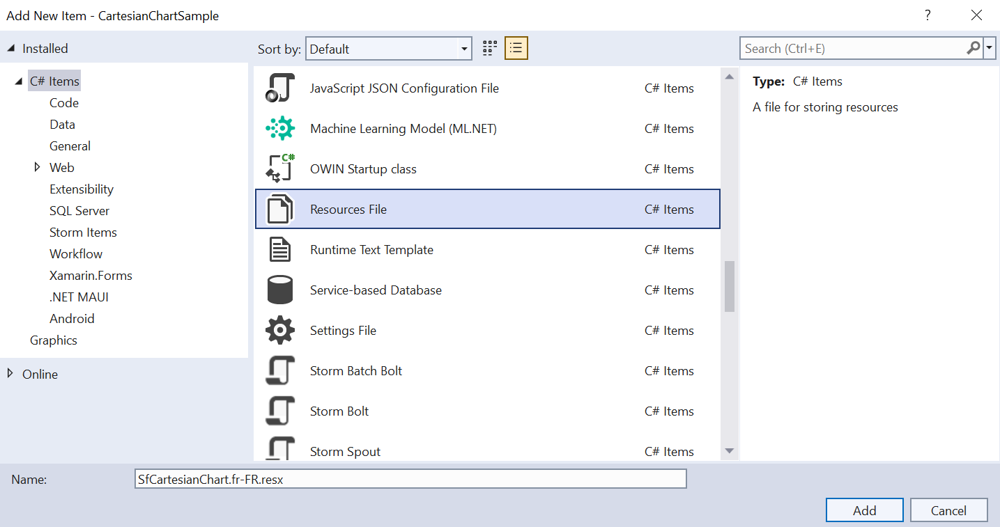
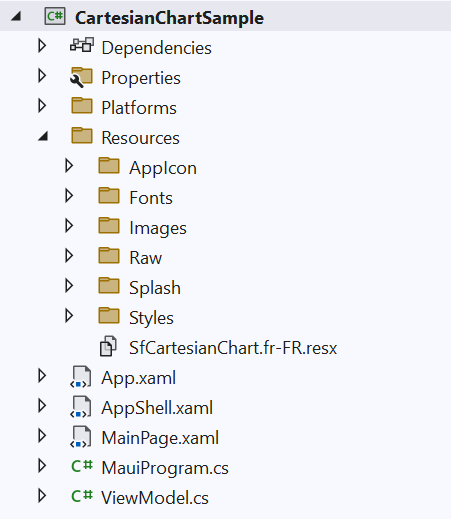
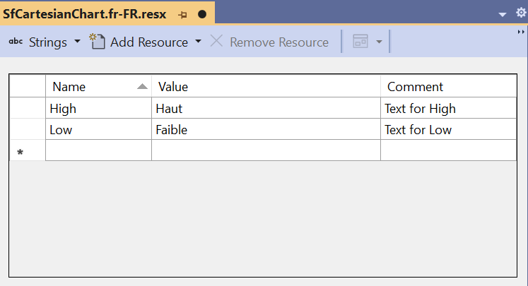
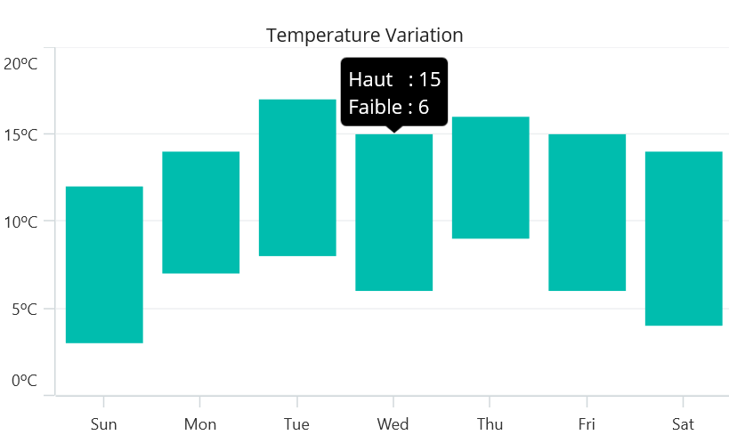

# Localization in .NET MAUI Cartesian Chart

Localization is the process of translating the application resources into different languages for the specific cultures. The `SfCartesianChart` can be localized by adding `resource` file. 

N> **Prerequisite:** Ensure that the required NuGet package is installed, the necessary namespaces are imported, and the **SfCartesianChart** control is properly configured in your application. For detailed setup and configuration instructions, refer to the **[Getting Started](https://help.syncfusion.com/maui/cartesian-charts/getting-started)** guide.

## Setting CurrentUICulture to the application

Application culture can be changed by setting `CurrentUICulture.` in `App.xaml.cs` file.




using Syncfusion.Maui.Charts;
using System.Resources;

public partial class App : Application
{
	public App()
	{
		InitializeComponent();
		CultureInfo.CurrentUICulture = new CultureInfo("fr-FR");
		// ResXPath => Full path of the resx file; For example : 
		//SfCartesianChartResources.ResourceManager = new ResourceManager
		// ("CartesianChartSample.Resources.SfCartesianChart", Application.Current.GetType().Assembly);
        
		var ResXPath= "CartesianChartSample.Resources.SfCartesianChart";
		SfCartesianChartResources.ResourceManager = new ResourceManager(ResXPath, Application.Current.GetType().Assembly);
		MainPage = new MainPage();
	}
}




N> The required `resx` files with `Build Action` as `EmbeddedResource` (File name should contain culture code) into the `Resources` folder.

## Localize application level

To localize the `Chart` based on `CurrentUICulture` using `resource` files, follow the below steps.

   1. Right-click on the `Resources` folder, select `Add` and then `New Item`.

   2. In Add New Item, select the Resource File option and name the filename as `SfCartesianChart.<culture name>.resx`. For example, give the name as `SfCartesianChart.fr-FR.resx` for French culture.

   3. The culture name indicates the name of the language and country.

   

   4. Now, select `Add` option to add the resource file in **Resources** folder.

   

   5. Add the Name/Value pair in Resource Designer of `SfCartesianChart.fr-FR.resx` file and change its corresponding value to corresponding culture.

   

Here, you can see how localization was performed for the tooltip.
   
