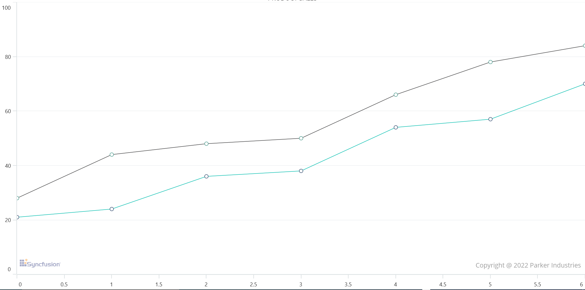

# Plot Area Background View in .NET MAUI Chart

[SfCartesianChart](https://help.syncfusion.com/cr/maui/Syncfusion.Maui.Charts.SfCartesianChart.html?tabs=tabid-1) allows you to add a view to the chart plot area . The [PlotAreaBackGroundView]() will be visible behind the grid line and series.





  <chart:SfCartesianChart>
        <chart:SfCartesianChart.PlotAreaBackgroundView>
            <Image Source="https://cdn.syncfusion.com/content/images/company-logos/Syncfusion_Logo_Image.png"  />
        </chart:SfCartesianChart.PlotAreaBackgroundView>
    </chart:SfCartesianChart>





SfCartesianChart chart = new SfCartesianChart();
Image image = new Image { Source = "https://cdn.syncfusion.com/content/images/company-logos/Syncfusion_Logo_Image.png" };
chart.PlotAreaBackgroundView = image;
this.Content = chart;





