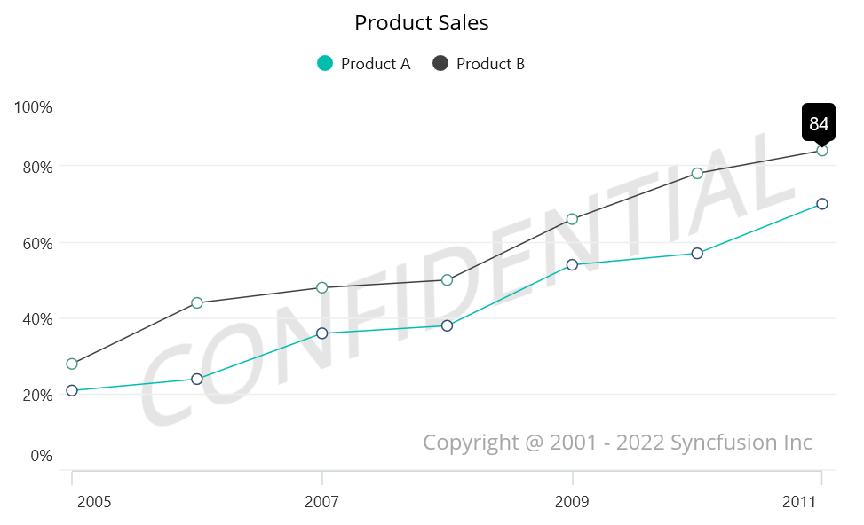

# Plot Area Background View in .NET MAUI Chart

[SfCartesianChart](https://help.syncfusion.com/cr/maui/Syncfusion.Maui.Charts.SfCartesianChart.html?tabs=tabid-1) allows you to add any view to the chart plot area. The PlotAreaBackgroundView will be visible behind the grid line and series.

## Plot Area Customization:
You can customize the plot area using the following:
* Box View - Use a BoxView as a Background if the plot area is expected to be colored.
* Image - Readability would be a problem if you planned to display your own company logo in the plot area. In that situation, an image   may be utilized as the background.
* Label—you can add any text to the plot area background.





  <chart:SfCartesianChart>
     <chart:SfCartesianChart.PlotAreaBackgroundView>
        <AbsoluteLayout>
             <Label Text="Copyright @ 2022 Parker Industries"
                    AbsoluteLayout.LayoutBounds="1,1,240,30"
                    AbsoluteLayout.LayoutFlags="PositionProportional"/>
             <Label Text="Confidential" TextColor="Red"
                       AbsoluteLayout.LayoutBounds="0,1,100,29"
                       AbsoluteLayout.LayoutFlags="PositionProportional" />
         </AbsoluteLayout>
    </chart:SfCartesianChart.PlotAreaBackgroundView>
</chart:SfCartesianChart>





SfCartesianChart chart = new SfCartesianChart(); 
AbsoluteLayout absoluteLayout = new AbsoluteLayout();
var copyRight = new Label() { Text = "Copyright @ 2022 Parker Industries" };
AbsoluteLayout.SetLayoutBounds(copyRight, new Rect(1, 1, 240, 30));
AbsoluteLayout.SetLayoutFlags(copyRight, Microsoft.Maui.Layouts.AbsoluteLayoutFlags.
PositionProportional);
absoluteLayout.Children.Add(copyRight);
var watermark = new Label() { Text = "Confidential" };
AbsoluteLayout.SetLayoutBounds(watermark, new Rect(0, 1, 100, 29));
AbsoluteLayout.SetLayoutFlags(watermark, Microsoft.Maui.Layouts.AbsoluteLayoutFlags.
PositionProportional);
absoluteLayout.Children.Add(watermark);
chart.PlotAreaBackgroundView = absoluteLayout;
this.Content = chart;





