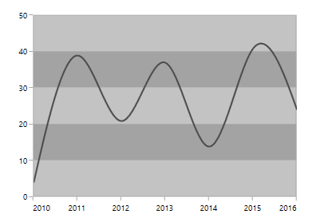

# Plot band in .NET MAUI Chart

Plot bands are also known as strip lines, which are used to shade the different ranges in plot area with different colors to improve the readability of the chart. You can also add a text to indicate what that particular region indicates. You can enable the plot bands to be drawn repeatedly at regular intervals. This will be useful when you need to mark an event that occurs recursively along the timeline of the chart.

Since plot bands are drawn based on the axis, you have to add plot bands using the [PlotBands]() property of the respective axis. You can also add multiple plot bands to an axis.

The following properties are used to configure the plot bands:

* [`Start`]() - change the start position of the plot bands.
* [`End`]() - change the end position of the plot bands.
* [`Size`]() - changes how long plot band should be expanded. This is applicable only when end is not specified.
* [`SizeType`]() - changes the date-time unit of the value specified in the size property. The values can be year, month, day, hour, minute, second, and millisecond.
* [`Text`]()- changes the text of the plot band.
* [`Fill`]() - changes the fill of the plot band.
* [`Stroke`]() - changes the stroke color of the plot band
* [`StStrokeWidthart`]() - changes the stroke width of the plot band
* [`IsVisible`]() - hanges the visibility of the plot band in chart axis.
* [`IsRepeatable`]()- specifies the plot band need to be repeated in specified interval.
* [`RepeatEvery`]() - changes the frequency of the plot band being repeated.
* [`RepeatUntil`]() - Specifies the end value at which the strip line stops repeating.

## Add PlotBand for numerical axis

Plot band can be added to the numerical axis by specifying index values to the [Start]() and [Size]() properties.





    <chart:SfCartesianChart>
        . . .
        <chart:SfCartesianChart.YAxes>
            <chart:NumericalAxis>
                <chart:NumericalAxis.PlotBands>
                    <chart:NumericalPlotBandCollection>
                        <chart:NumericalPlotBand Start="28" 
                                                 Size="10" 
                                                 Fill="Orange"/>
                    </chart:NumericalPlotBandCollection>
                </chart:NumericalAxis.PlotBands>
            </chart:NumericalAxis>
        </chart:SfCartesianChart.YAxes>
        . . .
    </chart:SfCartesianChart>





    SfCartesianChart chart = new SfCartesianChart();
    . . .
    
    NumericalAxis numericalAxis = new NumericalAxis();
    NumericalPlotBandCollection numericalPlotBandCollection = new NumericalPlotBandCollection();
    NumericalPlotBand plotBand = new NumericalPlotBand
    {
        Start = 28,
        Size = 10,
        Fill = Colors.Orange
    };

    numericalPlotBandCollection.Add(plotBand);
    numericalAxis.PlotBands = numericalPlotBandCollection;
    chart.YAxes.Add(numericalAxis);
    ...





## Add plot band for dateTime axis

Plot band can be added to the date-time axis by specifying date values to the [Start]() and [Size]() properties.





    <chart:SfCartesianChart>
        . . .
     <chart:SfCartesianChart.XAxes>
         <chart:DateTimeAxis>
          <chart:DateTimeAxis.PlotBands>
             <chart:DateTimePlotBandCollection >
                 <chart:DateTimePlotBand Start="2024-01-24"
                                         Size="2"
                                         SizeType="Days"
                                         Fill="Orange"/>
                    </chart:DateTimePlotBandCollection >
                </chart:DateTimeAxis.PlotBands>
            </chart:DateTimeAxis>
        </chart:SfCartesianChart.XAxes>

        <chart:SfCartesianChart.YAxes>
            <chart:NumericalAxis/>
        </chart:SfCartesianChart.YAxes>
    </chart:SfCartesianChart>





    SfCartesianChart chart = new SfCartesianChart();
    . . .
    DateTimeAxis dateTimeAxis = new DateTimeAxis();
    DateTimePlotBandCollection dateTimePlotBandCollection = new DateTimePlotBandCollection();
    DateTimePlotBand plotBand = new DateTimePlotBand
    {
        Start = new DateTime(2024, 1, 24),
        Size = 2,
        WidthType = DateTimeUnits.Days,
        Fill = Color.Orange
    };

    dateTimePlotBandCollection.Add(plotBand);
    dateTimeAxis.PlotBands = dateTimePlotBandCollection;
    chart.XAxes.Add(dateTimeAxis);

    NumericalAxis secondaryAxis = new NumericalAxis();
    chart.YAxes.Add(secondaryAxis);
    ...





## Recursive plot band

This feature is used to enable the plot bands to be drawn repeatedly at the regular intervals. This will be useful when you need to mark an event that occurs recursively along the timeline of the chart. The following properties are used to configure this feature:

* [`RepeatEvery`]() - changes the frequency of the plot band being repeated.
* [`RepeatUntil`]() - Specifies the end value at which the strip line stops repeating.





    <chart:SfCartesianChart>
        . . .
        <chart:SfCartesianChart.XAxes>
            <chart:CategoryAxis/>
        </chart:SfCartesianChart.XAxes>

        <chart:SfCartesianChart.YAxes>
          <chart:NumericalAxis>
           <chart:NumericalAxis.PlotBands>
               <chart:NumericalPlotBandCollection>
                   <chart:NumericalPlotBand Start="28"  
                                            Size="2" 
                                            Fill="Orange"
                                            RepeatEvery="10" 
                                            RepeatUntil="55"/>
                    </chart:NumericalPlotBandCollection>
                </chart:NumericalAxis.PlotBands>
            </chart:NumericalAxis>
        </chart:SfCartesianChart.YAxes>
    </chart:SfCartesianChart>





    SfCartesianChart chart = new SfCartesianChart();
    . . .
    CategoryAxis primaryAxis = new CategoryAxis();
    chart.XAxes.Add(primaryAxis);

    NumericalAxis numericalAxis = new NumericalAxis();
    NumericalPlotBandCollection numericalPlotBandCollection = new NumericalPlotBandCollection();
    NumericalPlotBand plotBand = new NumericalPlotBand
    {
        Start = 28,
        Size = 2,
        Fill = Color.Orange,
        RepeatEvery = 10,
        RepeatUntil = 55
    };

    numericalPlotBandCollection.Add(plotBand);
    numericalAxis.PlotBands = numericalPlotBandCollection;
    chart.YAxes.Add(numericalAxis);
    ...





## Segmented Plot Band

Typically, if you draw a plot band for a vertical axis, the height of the plot band is determined by the [Start]() and [Size]() properties, and the end of the plot band is equivalent to the end of its associated horizontal axis, i.e., plot band is drawn horizontally to the entire stretch of its associated horizontal axis. Similarly, for horizontal axis, width is determined by the [Start]() and [Size]() properties, and vertically, it is drawn to the entire stretch of the associated vertical axis.

Suppose, you need to draw a plot band that should not stretch along its associated axis, you have to set the [AssociatedAxisStart]() and [AssociatedAxisEnd]() properties. The values provided in these two properties correspond to its associated axis specified by the [AssociatedAxisName]() property in the axis.





    <chart:SfCartesianChart>
        . . .
    <chart:SfCartesianChart.XAxes>
       <chart:CategoryAxis/>
     </chart:SfCartesianChart.XAxes>

    <chart:SfCartesianChart.YAxes>
      <chart:NumericalAxis>
         <chart:NumericalAxis.PlotBands>
             <chart:NumericalPlotBandCollection>
                  <chart:NumericalPlotBand Start="28" 
                                           Size="2"
                                           RepeatEvery="10" 
                                           RepeatUntil="55" 
                                           Fill="Orange"
                                           IsSegmented="True" 
                                     AssociatedAxisStart="0"
                                     AssociatedAxisEnd="1"/>
                    </chart:NumericalPlotBandCollection>
                </chart:NumericalAxis.PlotBands>
            </chart:NumericalAxis>
        </chart:SfCartesianChart.YAxes>
        . . .
    </chart:SfCartesianChart>





    SfCartesianChart chart = new SfCartesianChart();
    . . .
    CategoryAxis primaryAxis = new CategoryAxis();
    chart.XAxes.Add(primaryAxis);

    NumericalAxis numericalAxis = new NumericalAxis();
    NumericalPlotBandCollection numericalPlotBandCollection =  new NumericalPlotBandCollection();
    NumericalPlotBand plotBand = new NumericalPlotBand
    {
        Start = 28,
        Size = 2,
        RepeatEvery = 10,
        RepeatUntil = 55,
        Fill = Color.Orange,
        IsSegmented = true,
        AssociatedAxisStart = 0,
        AssociatedAxisEnd = 1
    };

    numericalPlotBandCollection.Add(plotBand);
    numericalAxis.PlotBands = numericalPlotBandCollection;
    chart.YAxes.Add(numericalAxis);
    ...





## Customized Text

[Text]() can be added to plot bands to indicate the significance of each particular region. The [LabelStyle]() property provides options to customize plot band text.





    <chart:SfCartesianChart>
        . . .
     <chart:SfCartesianChart.XAxes>
       <chart:CategoryAxis/>
      </chart:SfCartesianChart.XAxes>

      <chart:SfCartesianChart.YAxes>
        <chart:NumericalAxis>
          <chart:NumericalAxis.PlotBands>
            <chart:NumericalPlotBandCollection>
             <chart:NumericalPlotBand Start="28" 
                                      Size="10" 
                                      Fill="Orange"
                                      Text="Plot Band">
              <chart:NumericalPlotBand.LabelStyle>
               <chart:ChartPlotBandLabelStyle TextColor="Blue"
                                              FontSize="12" 
                                     FontAttributes="Bold"/>
              </chart:NumericalPlotBand.LabelStyle>
           </chart:NumericalPlotBandCollection>
         </chart:NumericalAxis.PlotBands>
       </chart:NumericalAxis>
     </chart:SfCartesianChart.YAxes>
        . . .
    </chart:SfCartesianChart>





    SfCartesianChart chart = new SfCartesianChart();
    . . .
    CategoryAxis primaryAxis = new CategoryAxis();
    chart.XAxes.Add(primaryAxis);

    NumericalAxis numericalAxis = new NumericalAxis();
    NumericalPlotBandCollection numericalPlotBandCollection = new NumericalPlotBandCollection();
    NumericalPlotBand plotBand = new NumericalPlotBand
    {
        Start = 28,
        Width = 10,
        Fill = Color.Orange,
        Text = "Plot Band"
    };

    ChartPlotBandLabelStyle labelStyle = new ChartPlotBandLabelStyle
    {
        TextColor = Color.Blue,
        FontSize = 12,
        FontAttributes = FontAttributes.Bold
    };

    plotBand.LabelStyle = labelStyle;
    numericalPlotBandCollection.Add(plotBand);
    numericalAxis.PlotBands= numericalPlotBandCollection;
    chart.YAxes.Add(numericalAxis);
    ...



