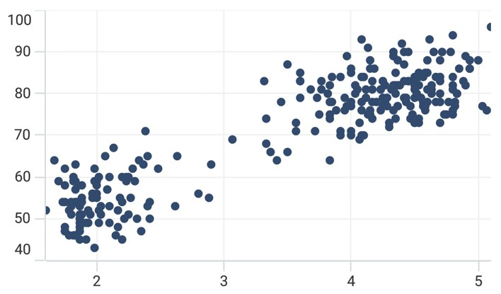

# Scatter Chart in .NET MAUI Chart

The scatter chart is used to represent the each data point by a dot or circle with equal size.

## Scatter Chart

To render a scatter chart, create an instance of [ScatterSeries](https://help.syncfusion.com/cr/maui/Syncfusion.Maui.Charts.ScatterSeries.html?tabs=tabid-1), and add it to the [Series](https://help.syncfusion.com/cr/maui/Syncfusion.Maui.Charts.SfCartesianChart.html#Syncfusion_Maui_Charts_SfCartesianChart_Series) collection property of [SfCartesianChart](https://help.syncfusion.com/cr/maui/Syncfusion.Maui.Charts.SfCartesianChart.html?tabs=tabid-1)
. The segment size can be defined by using the [Height](https://help.syncfusion.com/cr/maui/Syncfusion.Maui.Charts.ScatterSeries.html#Syncfusion_Maui_Charts_ScatterSeries_Height) and [Width](https://help.syncfusion.com/cr/maui/Syncfusion.Maui.Charts.ScatterSeries.html#Syncfusion_Maui_Charts_ScatterSeries_Width) properties.





    <chart:SfCartesianChart>

        <chart:SfCartesianChart.PrimaryAxis>
            <chart:NumericalAxis />
        </chart:SfCartesianChart.PrimaryAxis>

        <chart:SfCartesianChart.SecondaryAxis>
            <chart:NumericalAxis />
        </chart:SfCartesianChart.SecondaryAxis>  
                    
        <chart:SfCartesianChart.Series>
            <chart:ScatterSeries Height="7" Width="7" ItemsSource="{Binding Data}" XBindingPath="XValue" YBindingPath="YValue"/>
        </chart:SfCartesianChart.Series>

    </chart:SfCartesianChart>





    SfCartesianChart chart = new SfCartesianChart();
    NumericalAxis primaryAxis = new NumericalAxis();
    chart.PrimaryAxis = primaryAxis;
    NumericalAxis secondaryAxis = new NumericalAxis();
    chart.SecondaryAxis = secondaryAxis;

    ScatterSeries series = new ScatterSeries()
    {
        ItemsSource = new ViewModel().Data,
        XBindingPath = "XValue",
        YBindingPath = "YValue",
        Height = 7,
        Width = 7,
    };

    chart.Series.Add(series);
    this.Content = chart;





