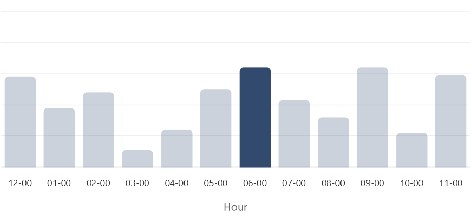
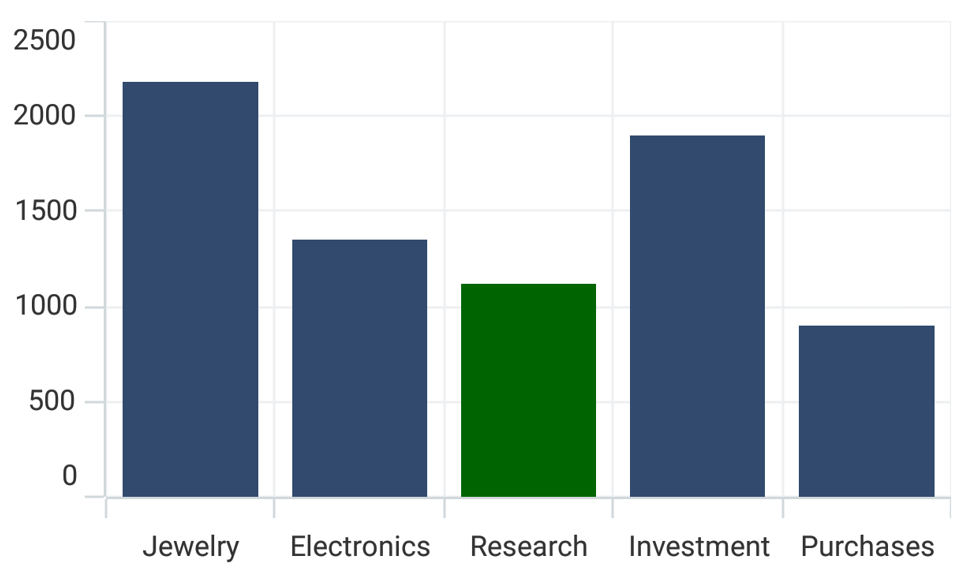

# Selection in .NET MAUI Chart

Cartesian chart supports selection that allows to select or highlight a segment in the chart by using [ChartSelectionBehavior](https://help.syncfusion.com/cr/maui/Syncfusion.Maui.Charts.ChartSelectionBehavior.html).

## Enable Selection

To enable the selection in chart, create an instance of [ChartSelectionBehavior](https://help.syncfusion.com/cr/maui/Syncfusion.Maui.Charts.ChartSelectionBehavior.html) and add it to the [ChartBehaviors](https://help.syncfusion.com/cr/maui/Syncfusion.Maui.Charts.ChartBase.html#Syncfusion_Maui_Charts_ChartBase_ChartBehaviors) collection of [SfCartesianChart](https://help.syncfusion.com/cr/maui/Syncfusion.Maui.Charts.SfCartesianChart.html?tabs=tabid-1). And also need to set the `SelectionBrush` property to highlight the segment in the chart.





<chart:SfCartesianChart>
. . .
    <chart:SfCartesianChart.ChartBehaviors>
        <chart:ChartSelectionBehavior />
    </chart:SfCartesianChart.ChartBehaviors>

    <chart:ColumnSeries ItemsSource="{Binding Data}" 
                        XBindingPath="Demand"
                        YBindingPath="Year2010"
                        SelectionBrush="Green"/>
</chart:SfCartesianChart>





SfCartesianChart chart = new SfCartesianChart();
. . .
ChartSelectionBehavior selection = new ChartSelectionBehavior();
chart.ChartBehaviors.Add(selection);

ColumnSeries series = new ColumnSeries()
{
    ItemsSource = new ViewModel().Data,
    XBindingPath = "Demand",
    YBindingPath = "Year2010",
    SelectionBrush = Brush.Green
};

chart.Series.Add(series);
this.Content = chart;





## Selection Type

The [Type](https://help.syncfusion.com/cr/maui/Syncfusion.Maui.Charts.ChartSelectionBehavior.html#Syncfusion_Maui_Charts_ChartSelectionBehavior_Type) property allows users to set selection type of series, which includes [Point](https://help.syncfusion.com/cr/maui/Syncfusion.Maui.Charts.SelectionType.html#Syncfusion_Maui_Charts_SelectionType_Point) and [None](https://help.syncfusion.com/cr/maui/Syncfusion.Maui.Charts.SelectionType.html#Syncfusion_Maui_Charts_SelectionType_None). [Type](https://help.syncfusion.com/cr/maui/Syncfusion.Maui.Charts.ChartSelectionBehavior.html#Syncfusion_Maui_Charts_ChartSelectionBehavior_Type) property with [Point](https://help.syncfusion.com/cr/maui/Syncfusion.Maui.Charts.SelectionType.html#Syncfusion_Maui_Charts_SelectionType_Point) value is used to select segment in a series and [None](https://help.syncfusion.com/cr/maui/Syncfusion.Maui.Charts.SelectionType.html) is used to set deselect state for all segments. 





<chart:SfCartesianChart>
    . . .
    <chart:SfCartesianChart.ChartBehaviors>
        <chart:ChartSelectionBehavior  Type="Point"/>
    </chart:SfCartesianChart.ChartBehaviors>

    <chart:SfCartesianChart.Series>
        <chart:ColumnSeries ItemsSource="{Binding Data}"  
                            XBindingPath="Demand"
                            YBindingPath="Year2010" 
                            SelectionBrush="Green"/>
    </chart:SfCartesianChart.Series>

</chart:SfCartesianChart>





SfCartesianChart chart = new SfCartesianChart();
. . .
ChartSelectionBehavior selection = new ChartSelectionBehavior();
selection.Type = SelectionType.Point;
chart.ChartBehaviors.Add(selection);

ColumnSeries series = new ColumnSeries()
{
    ItemsSource = new ViewModel().Data,
    XBindingPath = "Demand",
    YBindingPath = "Year2010",
    SelectionBrush = Brush.Green
};
chart.Series.Add(series);
this.Content = chart;





## Selection on initial rendering

Cartesian chart provides support to select a point programmatically on a chart using the [SelectedIndex](https://help.syncfusion.com/cr/maui/Syncfusion.Maui.Charts.ChartSeries.html#Syncfusion_Maui_Charts_ChartSeries_SelectedIndex) property of series.





<chart:SfCartesianChart>
. . .
    <chart:SfCartesianChart.ChartBehaviors>
        <chart:ChartSelectionBehavior/>
    </chart:SfCartesianChart.ChartBehaviors>

    <chart:SfCartesianChart.Series>
        <chart:ColumnSeries ItemsSource="{Binding Data}" 
                            XBindingPath="Demand"
                            YBindingPath="Year2010" 
                            SelectionBrush="Green"
                            SelectedIndex="3"/>
    </chart:SfCartesianChart.Series>
</chart:SfCartesianChart>





SfCartesianChart chart = new SfCartesianChart();
. . .
ChartSelectionBehavior selection = new ChartSelectionBehavior();
chart.ChartBehaviors.Add(selection);

ColumnSeries series = new ColumnSeries()
{
    ItemsSource = new ViewModel().Data,
    XBindingPath = "Demand",
    YBindingPath = "Year2010",
    SelectionBrush = Brush.Green,
    SelectedIndex = 3
};
chart.Series.Add(series);
this.Content = chart;





## Events

The following selection events are available in the [SfCartesianChart](https://help.syncfusion.com/cr/maui/Syncfusion.Maui.Charts.SfCartesianChart.html?tabs=tabid-1).

### SelectionChanging

The [SelectionChanging](https://help.syncfusion.com/cr/maui/Syncfusion.Maui.Charts.ChartBase.html#Syncfusion_Maui_Charts_ChartBase_SelectionChanging) event occurs before the data point is being selected. This is a cancelable event. This argument contains the following information.

* [CurrentIndex](https://help.syncfusion.com/cr/maui/Syncfusion.Maui.Charts.SelectionEventArgs.html#Syncfusion_Maui_Charts_SelectionEventArgs_CurrentIndex) - Gets the index of currently selected data point.
* [PreviousIndex](https://help.syncfusion.com/cr/maui/Syncfusion.Maui.Charts.SelectionEventArgs.html#Syncfusion_Maui_Charts_SelectionEventArgs_PreviousIndex) - Gets the index of previously selected data point.
* [Series](https://help.syncfusion.com/cr/maui/Syncfusion.Maui.Charts.SelectionEventArgs.html#Syncfusion_Maui_Charts_SelectionEventArgs_Series) - Gets the selected series.
* [Cancel](https://help.syncfusion.com/cr/maui/Syncfusion.Maui.Charts.SelectionChangingEventArgs.html#Syncfusion_Maui_Charts_SelectionChangingEventArgs_Cancel) - Gets or sets a value indicating whether to continue the segment selection.

### SelectionChanged

The [SelectionChanged](https://help.syncfusion.com/cr/maui/Syncfusion.Maui.Charts.ChartBase.html#Syncfusion_Maui_Charts_ChartBase_SelectionChanged) event occurs after a data point has been selected. This argument contains the following information.

* [CurrentIndex](https://help.syncfusion.com/cr/maui/Syncfusion.Maui.Charts.SelectionEventArgs.html#Syncfusion_Maui_Charts_SelectionEventArgs_CurrentIndex) - Gets the index of currently selected data point.
* [PreviousIndex](https://help.syncfusion.com/cr/maui/Syncfusion.Maui.Charts.SelectionEventArgs.html#Syncfusion_Maui_Charts_SelectionEventArgs_PreviousIndex) - Gets the index of previously selected data point.
* [Series](https://help.syncfusion.com/cr/maui/Syncfusion.Maui.Charts.SelectionEventArgs.html#Syncfusion_Maui_Charts_SelectionEventArgs_Series) - Gets the selected series.

