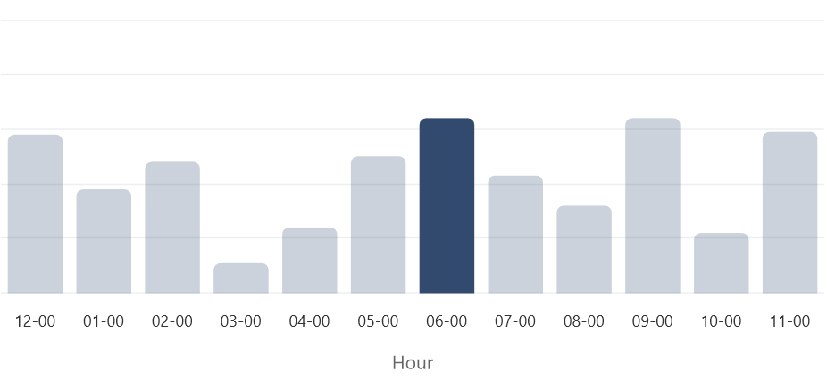
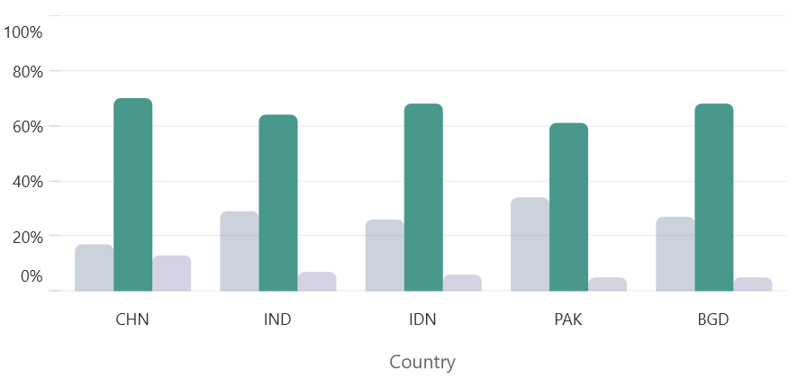

# Selection in .NET MAUI Chart

[SfCartesianChart]() provides selection behavior support, which allows you to select or highlight a segment (data points) or a series in the chart using the [DataPointSelectionBehavior]() and [SeriesSelectionBehavior]().

## Enable data point selection

To enable the data point selection, create an instance for the series [SelectionBehavior]()] property. And the following code example shows how to configure and specify the brush for the highlighted segment using [DataPointSelectionBehavior]()].





<chart:SfCartesianChart>
. . .
    <chart:SfCartesianChart.Series>
        <chart:ColumnSeries ItemsSource="{Binding Data}" 
                        XBindingPath="Time"
                        YBindingPath="FootStepsCount">
                <chart:ColumnSeries.SelectionBehavior>
                        <chart:DataPointSelectionBehavior SelectionBrush="#314A6E"/>
                </chart:ColumnSeries.SelectionBehavior>
        </chart:ColumnSeries>
    </chart:SfCartesianChart.Series>
</chart:SfCartesianChart>





SfCartesianChart chart = new SfCartesianChart();
. . .
DataPointSelectionBehavior selection = new DataPointSelectionBehavior();
selection.SelectionBrush=Color.FromArgb("#314A6E");

ColumnSeries series = new ColumnSeries()
{
    ItemsSource = new ViewModel().Data,
    XBindingPath = "Demand",
    YBindingPath = "Year2010",
    SelectionBehavior = selection
};
chart.Series.Add(series);





## Enable series selection

To enable the series selection, create an instance for the cartesian chart [SelectionBehavior]() property. And the following code example shows how to configure and specify the brush for the highlighted series using [SeriesSelectionBehavior]().





<chart:SfCartesianChart>
. . .
    <chart:SfCartesianChart.SelectionBehavior>
        <chart:SeriesSelectionBehavior SelectionBrush="#314A6E"/>
    </chart:SfCartesianChart.SelectionBehavior>
    <chart:SfCartesianChart.Series>
        <chart:ColumnSeries ItemsSource="{Binding Data}" 
                        XBindingPath="Country"
                        YBindingPath="Kids"/>
        <chart:ColumnSeries ItemsSource="{Binding Data}" 
                        XBindingPath="Country"
                        YBindingPath="Adults"/>
        <chart:ColumnSeries ItemsSource="{Binding Data}" 
                        XBindingPath="Country"
                        YBindingPath="Seniors"/>
    </chart:SfCartesianChart.Series>
</chart:SfCartesianChart>





SfCartesianChart chart = new SfCartesianChart();
. . .
SeriesSelectionBehavior selection = new SeriesSelectionBehavior();
selection.SelectionBrush=Color.FromArgb("#314A6E");
chart.SelectionBehavior = selection;

ColumnSeries series1 = new ColumnSeries()
{
    ItemsSource = new ViewModel().Data,
    XBindingPath = "Country",
    YBindingPath = "Kids",
};
ColumnSeries series2 = new ColumnSeries()
{ . . . };
ColumnSeries series3 = new ColumnSeries()
{ . . . };

chart.Series.Add(series1);
chart.Series.Add(series2);
chart.Series.Add(series3);





## Behavior customization 

The following properties are used to customize the [ChartSelectionBehavior]():

* [Type]() - Gets or sets the [ChartSelectionType]() for the selection behavior.     
Chart selection types:
    * Single - The user can select only one item at a time
    * SingleDeselect - The user can select and deselect only one item at a time.
    * Multiple - The user can select and deselect multiple items at a time.
    * None - The user can't select any item.
* [SelectionBrush]() - Gets or sets the SelectionBrush color for the selection behavior.
* [SelectedIndex]() - Gets or sets the index value of the segment or series.
* [SelectedIndexes]() - Gets or sets the list of indexes of the segments or series.

## Clear selection

Resets all the selection customization to default. The following code example shows how to use [ClearSelection]():





Button button = new Button
{
    Text = "Click to Rotate Text!",
    VerticalOptions = LayoutOptions.Center,
    HorizontalOptions = LayoutOptions.Center
};
button.Clicked += Button_Clicked(sender, args);

SfCartesianChart chart = new SfCartesianChart();
DataPointSelectionBehavior selection = new DataPointSelectionBehavior();
selection.SelectionBrush = Color.FromArgb("#314A6E");

ColumnSeries series = new ColumnSeries();
series.SelectionBehavior = selection;
chart.Series.Add(series);

private void Button_Clicked(object sender, EventArgs e)
{
    selection.ClearSelection();
}





## Events

The following selection events are available in the [ChartSelectionBehavior]().

### SelectionChanging

The [SelectionChanging]() event occurs before the data point is being selected. This is a cancelable event. The following properties are contained in the event arguments:

* [NewIndexes]() - Gets the index of the selected data point.
* [OldIndexes]() - Gets the index of the deselected data point.
* [Cancel]() - Gets or sets a value indicating whether to continue the selection.

### SelectionChanged

The [SelectionChanged]() event occurs after a data point has been selected. The following properties are contained in the event arguments:

* [NewIndexes]() - Gets the index of the selected data point.
* [OldIndexes]() - Gets the index of the deselected data point.