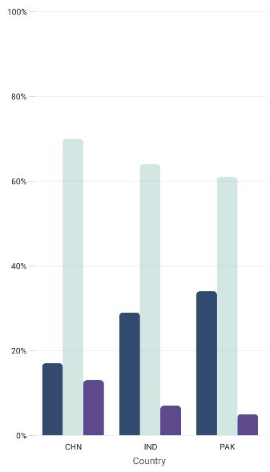
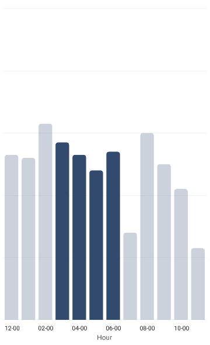

# Selection in .NET MAUI SfCartesianChart

[SfCartesianChart]() provides selection behavior support, which allows you to select or highlight a segment in a series or a series in the Chart using the [DataPointSelectionBehavior]() or [SeriesSelectionBehavior]().

## Enable DataPointSelection

To enable the data point selection in the [SfCartesianChart](), create an instance of [DataPointSelectionBehavior]() and specify a color value for the [SelectionBrush]() property to highlight the selected segment in the series. The selection instance should then be set to the chart series [SelectionBehavior]() property.





<chart:SfCartesianChart>
. . .
    <chart:SfCartesianChart.Series>
        <chart:ColumnSeries ItemsSource="{Binding Data}" 
                        XBindingPath="Time"
                        YBindingPath="FootStepsCount">
                <chart:ColumnSeries.SelectionBehavior>
                        <chart:DataPointSelectionBehavior/>
                </chart:ColumnSeries.SelectionBehavior>
        </chart:ColumnSeries>
    </chart:SfCartesianChart.Series>
</chart:SfCartesianChart>





SfCartesianChart chart = new SfCartesianChart();
. . .
DataPointSelectionBehavior selection = new DataPointSelectionBehavior();

ColumnSeries series = new ColumnSeries()
{
    ItemsSource = new ViewModel().Data,
    XBindingPath = "Demand",
    YBindingPath = "Year2010",
    SelectionBehavior = selection
};
chart.Series.Add(series);





## Enable SeriesSelection

To enable the series selection in the [SfCartesianChart](), create an instance of [SeriesSelectionBehavior]() and specify a color value for the [SelectionBrush]() property to highlight the entire selected series. The selection instance should then be set to the SfCartesianChart [SelectionBehavior]() property.





<chart:SfCartesianChart>
. . .
    <chart:SfCartesianChart.SelectionBehavior>
        <chart:SeriesSelectionBehavior/>
    </chart:SfCartesianChart.SelectionBehavior>
    <chart:SfCartesianChart.Series>
        <chart:ColumnSeries ItemsSource="{Binding Data}" 
                        XBindingPath="Country"
                        YBindingPath="Kids"/>
        <chart:ColumnSeries ItemsSource="{Binding Data}" 
                        XBindingPath="Country"
                        YBindingPath="Adults"/>
        <chart:ColumnSeries ItemsSource="{Binding Data}" 
                        XBindingPath="Country"
                        YBindingPath="Seniors"/>
    </chart:SfCartesianChart.Series>
</chart:SfCartesianChart>





SfCartesianChart chart = new SfCartesianChart();
. . .
SeriesSelectionBehavior selection = new SeriesSelectionBehavior();
chart.SelectionBehavior = selection;

ColumnSeries series1 = new ColumnSeries()
{
    ItemsSource = new ViewModel().Data,
    XBindingPath = "Country",
    YBindingPath = "Kids",
};
ColumnSeries series2 = new ColumnSeries()
{ . . . };
ColumnSeries series3 = new ColumnSeries()
{ . . . };

chart.Series.Add(series1);
chart.Series.Add(series2);
chart.Series.Add(series3);





## Properties

The following properties are common for both Selection Behaviors in [SfCartesianChart]() and [ChartSeries](), and the Selection feature can be configured using the following properties:

* [Type]() - Gets or sets the ChartSelectionType Enum value for the Selection Behavior.     
The following ChartSelectionType can be achieved during Selection:
    * Single
    * SingleDeselect
    * Multiple
    * None
* [SelectionBrush]() - Gets or sets the SelectionBrush color value for the Selection Behavior.
* [SelectedIndex]() - Gets or sets the index value of the segment or series that should be selected during the Selection.
* [SelectedIndexes]() - Gets or sets the list of indexes of the segments or series that should be selected during the Selection.

## Enable MultiSelection

In [SfCartesianChart](), we can perform Multiple Selection for both DataPointSelection and SeriesSelection by selecting more than one segment in a series or more than one series in the chart by setting [SelectionBrush]() color and ChartSelectionType as Multiple, else by setting the [SelectedIndexes]() value from the ViewModel and set ChartSelectionType as Multiple to either [DataPointSelectionBehavior]() or [SeriesSelectionBehavior]() for load time selection changes.





<chart:SfCartesianChart>
. . .
    <chart:SfCartesianChart.BindingContext>
        <model:ViewModel/>
    </chart:SfCartesianChart.BindingContext>
    <chart:SfCartesianChart.SelectionBehavior>
        <chart:SeriesSelectionBehavior SelectionBrush="Green" Type = Multiple SelectedIndexes = "{Binding Indexes}" />
    </chart:SfCartesianChart.SelectionBehavior>
. . .
</chart:SfCartesianChart>





SfCartesianChart chart = new SfCartesianChart();
. . .
ViewModel model = new ViewModel();
chart.BindingContext = model;

SeriesSelectionBehavior selection = new SeriesSelectionBehavior();
selection.SelectionBrush = Brush.Green;
selection.SelectedIndexes = model.Indexes;
selection.Type = ChartSelectionType.Multiple;
chart.SelectionBehavior = selection;
. . .





N> The Multiple Selection in [DataPointSelectionBehavior]() can also be performed by using the ChartSeries SelectionBehavior property.

## ClearSelection Method

Both the SelectionBehavior has a public method called [ClearSelection ()](), which resets all current Selection Behavior property values to their default values and resets the color of the selected element to default.





SfCartesianChart chart = new SfCartesianChart();

DataPointSelectionBehavior selection = new DataPointSelectionBehavior();

ColumnSeries series = new ColumnSeries();
series.SelectionBehavior = selection;
chart.Series.Add(series);

selection.ClearSelection();





N> The [ClearSelection ()]() method can also be performed in [SeriesSelectionBehavior]() by using the SfCartesianChart SelectionBehavior property. 

## Events

The following public Chart Selection Events are available in [ChartSelectionBehavior]() and are common for both [DataPointSelectionBehavior]() and [SeriesSelectionBehavior]().

### SelectionChanging

The [SelectionChanging]() event is triggered before any data point has been selected. This event is cancelable because it inherits CancelEventArgs, which has a public property [Cancel]() that holds a Boolean value indicating whether to continue the selection or not. The following properties are contained in the event arguments:

* [NewIndexes]() - Gets or sets the index of the selected data point before selection changes occurs.
* [OldIndexes]() - Gets or sets the index of the deselected data point before selection changes occurs.

### SelectionChanged

The [SelectionChanged]() event is triggered after a data point has been selected. The following properties are contained in the event arguments:

* [NewIndexes]() - Gets or sets the index of the selected data point after selection changes occurs.
* [OldIndexes]() - Gets or sets the index of the deselected data point after selection changes occurs.