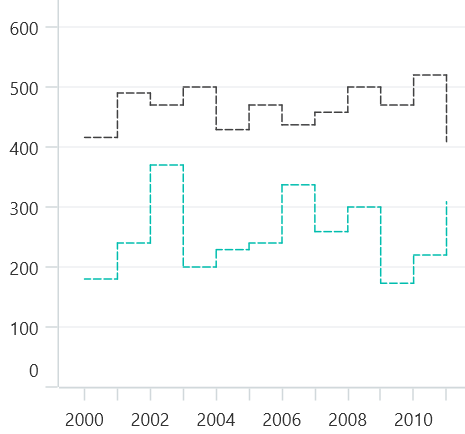

# StepLine Chart in .NET MAUI Chart

StepLine chart is used to display the data showing changes in values over time by connecting points on plots with a combination of horizontal and vertical lines. And it's used to when it necessary to highight the irreqularity changes. It appears to be steps.

## StepLine Chart

To render the StepLine chart,create an instance of [StepLineSeries](),and add it to the [Series](https://help.syncfusion.com/cr/maui/Syncfusion.Maui.Charts.SfCartesianChart.html#Syncfusion_Maui_Charts_SfCartesianChart_Series) collection property of [SfCartesianChart](https://help.syncfusion.com/cr/maui/Syncfusion.Maui.Charts.SfCartesianChart.html?tabs=tabid-1).

N> The cartesian chart has [Series](https://help.syncfusion.com/cr/maui/Syncfusion.Maui.Charts.SfCartesianChart.html#Syncfusion_Maui_Charts_SfCartesianChart_Series) as its default content.





<chart:SfCartesianChart>

    <chart:SfCartesianChart.XAxes>
        <chart:DatetimeAxis />
    </chart:SfCartesianChart.XAxes>

    <chart:SfCartesianChart.YAxes>
        <chart:NumericalAxis />
    </chart:SfCartesianChart.YAxes>   

    <chart:StepLineSeries ItemSource="{Binding Data}"
                          XBindingPath="Date"
                          YBindingPath="Value"
                          />

    <chart:StepLineSeries ItemSource="{Binding Data1}"
                          XBindingPath="Date"
                          YBindingPath="Value"
                          />

</chart:SfCartesianChart>





    SfCartesianChart chart = new SfCartesianChart();
    DatetimeAxis primaryAxis = new DatetimeAxis();
    chart.XAxes.Add(primaryAxis);
    NumericalAxis secondaryAxis = new NumericalAxis();
    chart.YAxes.Add(secondaryAxis);

    StepLineSeries series = new StepLineSeries()
    {
        ItemsSource = new ViewModel().Data,
        XBindingPath = "Date",
        YBindingPath = "Value",
    };

    StepLineSeries series1 = new StepLineSeries()
    {
        ItemsSource = new ViewModel().Data1,
        XBindingPath = "Date",
        YBindingPath = "Value",
    };

    chart.Series.Add(series);
    chart.Series.Add(series1);
    this.Content = chart;





## Dashed StepLine Chart

The [StrokeDashArray](https://help.syncfusion.com/cr/maui/Syncfusion.Maui.Charts.LineSeries.html#Syncfusion_Maui_Charts_LineSeries_StrokeDashArray) property of [StepLineSeries]() is used to render the StepLine series with dashes. Odd value considered as rendering size and Even value considered as gap.





<Chart:SfCartesianChart>

    <chart:SfCartesianChart.Resource>
        <DoubleCollection x:Key="DashArray">
            <x:Double>5</x:Double>
            <x:Double>2</x:Double>
        </DoubleCollection>
    </chart:SfCartesianChart.Resource>

    <chart:SfCartesianChart.XAxes>
        <chart:DatetimeAxis />
    </chart:SfCartesianChart.XAxes>

    <chart:SfCartesianChart.YAxes>
        <chart:NumericalAxis />
    </chart:SfCartesianChart.YAxes>   

    <chart:StepLineSeries ItemsSource="{Binding Data}"
                          StrokeDashArray="DashArray"
                          XBindingPath="Date"
                          YBindingPath="Value"
                        
                        />

    <Chart:SfCartesianChart>





    SfCartesianChart chart = new SfCartesianChart();

    DatetimeAxis primaryAxis = new DatetimeAxis();
    chart.XAxes.Add(primaryAxis);
    NumericalAxis secondaryAxis = new NumericalAxis();
    chart.YAxes.Add(secondaryAxis);

    DoubleCollection doubleCollection = new DoubleCollection();
    doubleCollection.Add(5);
    doubleCollection.Add(2);

    StepLineSeries steplineSeries = new StepLineSeries()
    {
        itemSource = new ViewModel().Data;
        XBindingPath = "Date";
        YBindingPath = "Value";
        StrokeDashArray = doubleCollection;
    }

    chart.Series.Add(steplineSeries);
    this.Content = chart;





## Vertical StepLine Chart 

The [IsTransposed](https://help.syncfusion.com/cr/maui/Syncfusion.Maui.Charts.SfCartesianChart.html#Syncfusion_Maui_Charts_SfCartesianChart_IsTransposedProperty) property of [SfCartesianChart](https://help.syncfusion.com/cr/maui/Syncfusion.Maui.Charts.SfCartesianChart.html?tabs=tabid-1) is used to render the StepLine series in vertically.To enable the StepLine series in vertically , set the IsTransposed property to true.  





<Chart:SfCartesianChart IsTransposed="True">

    <chart:SfCartesianChart.XAxes>
        <chart:DatetimeAxis />
    </chart:SfCartesianChart.XAxes>

    <chart:SfCartesianChart.YAxes>
        <chart:NumericalAxis />
    </chart:SfCartesianChart.YAxes>   

    <chart:StepLineSeries ItemSource=""{Binding Data}
                          XBindingPath="Year"
                          YBindingPath="Value"
                          />
    <chart:StepLineSeries ItemSource="{Binding Data1}"
                          XBindingPath="Year"
                          YBindingPath="Value"
                          />

    <Chart:SfCartesianChart>





    SfCartesianChart chart = new SfCartesianChart();

    chart.isTransposed = True;

    DatetimeAxis primaryAxis = new DatetimeAxis();
    chart.XAxes.Add(primaryAxis);
    NumericalAxis secondaryAxis = new NumericalAxis();
    chart.YAxes.Add(secondaryAxis);

    StepLineSeries steplineSeries = new StepLineSeries()
    {
        itemSource = new ViewModel().Data;
        XBindingPath = "Year";
        YBindingPath = "Value";
    };

    StepLineSeries steplineSeries1 = new StepLineSeries()
    {
        itemSource = new ViewModel().Data;
        XBindingPath = "Year";
        YBindingPath = "Value";
    };

    chart.Series.Add(steplineSeries);
    chart.Series.Add(steplineSeries1);
    this.Content = chart;





