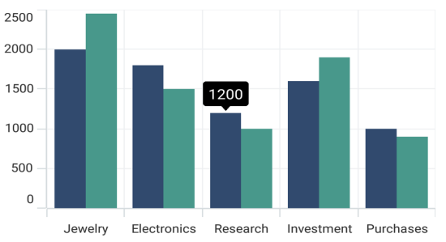
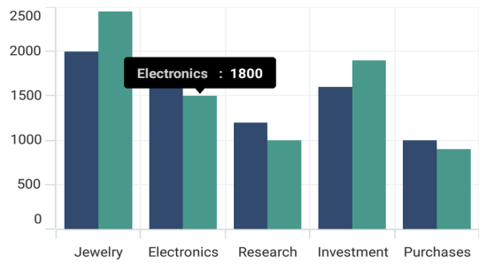

# Tooltip in .NET MAUI Chart

Tooltip is used to display any information or metadata of the tapped segment. The Cartesian chart provides tooltip support for all series. 

## Define Tooltip

To define the tooltip in the series, set the [EnableTooltip](https://help.syncfusion.com/cr/maui/Syncfusion.Maui.Charts.ChartSeries.html#Syncfusion_Maui_Charts_ChartSeries_EnableTooltip) property to true. The default value of [EnableTooltip](https://help.syncfusion.com/cr/maui/Syncfusion.Maui.Charts.ChartSeries.html#Syncfusion_Maui_Charts_ChartSeries_EnableTooltip) property is `false`.





<chart:SfCartesianChart>
    . . .
    <chart:ColumnSeries ItemsSource="{Binding Data}" 
                        XBindingPath="Demand"
                        YBindingPath="Year2010" 
                        EnableTooltip="True"/>

    <chart:ColumnSeries ItemsSource="{Binding Data}" 
                        XBindingPath="Demand"
                        YBindingPath="Year2011"
                        EnableTooltip="True"/>
</chart:SfCartesianChart>





SfCartesianChart chart = new SfCartesianChart();
. . .
ColumnSeries series1 = new ColumnSeries()
{
    ItemsSource = new ViewModel().Data,
    XBindingPath = "Demand",
    YBindingPath = "Year2010",
    EnableTooltip = true
};

ColumnSeries series2 = new ColumnSeries()
{
    ItemsSource = new ViewModel().Data,
    XBindingPath = "Demand",
    YBindingPath = "Year2011",
    EnableTooltip = true
};

chart.Series.Add(series1);
chart.Series.Add(series2);
this.Content = chart;





The [ChartTooltipBehavior](https://help.syncfusion.com/cr/maui/Syncfusion.Maui.Charts.ChartTooltipBehavior.html) is used to customize the tooltip. For customizing the tooltip, create an instance [ChartTooltipBehavior](https://help.syncfusion.com/cr/maui/Syncfusion.Maui.Charts.ChartTooltipBehavior.html) and set it to the [TooltipBehavior](https://help.syncfusion.com/cr/maui/Syncfusion.Maui.Charts.ChartBase.html#Syncfusion_Maui_Charts_ChartBase_TooltipBehavior) property of [SfCartesianChart](https://help.syncfusion.com/cr/maui/Syncfusion.Maui.Charts.SfCartesianChart.html?tabs=tabid-1). The following properties are used to customize the tooltip:

* [Background](https://help.syncfusion.com/cr/maui/Syncfusion.Maui.Charts.ChartTooltipBehavior.html#Syncfusion_Maui_Charts_ChartTooltipBehavior_Background) - Gets or sets the background color to the tooltip label.
* [FontAttributes](https://help.syncfusion.com/cr/maui/Syncfusion.Maui.Charts.ChartTooltipBehavior.html#Syncfusion_Maui_Charts_ChartTooltipBehavior_FontAttributes) - Gets or sets the font style for the label.
* [FontFamily](https://help.syncfusion.com/cr/maui/Syncfusion.Maui.Charts.ChartTooltipBehavior.html#Syncfusion_Maui_Charts_ChartTooltipBehavior_FontFamily) - Gets or sets the font family name for the label.
* [FontSize](https://help.syncfusion.com/cr/maui/Syncfusion.Maui.Charts.ChartTooltipBehavior.html#Syncfusion_Maui_Charts_ChartTooltipBehavior_FontSize) - Gets or sets the font size for the label.
* [Duration](https://help.syncfusion.com/cr/maui/Syncfusion.Maui.Charts.ChartTooltipBehavior.html#Syncfusion_Maui_Charts_ChartTooltipBehavior_Duration) - Gets or sets the duration of the tooltip text in seconds.
* [Margin](https://help.syncfusion.com/cr/maui/Syncfusion.Maui.Charts.ChartTooltipBehavior.html#Syncfusion_Maui_Charts_ChartTooltipBehavior_Margin) - Gets or sets the margin of the label to customize the appearance of label.
* [TextColor](https://help.syncfusion.com/cr/maui/Syncfusion.Maui.Charts.ChartTooltipBehavior.html#Syncfusion_Maui_Charts_ChartTooltipBehavior_TextColor) - Used to set the color for the text of the label.





<chart:SfCartesianChart.TooltipBehavior>
    <chart:ChartTooltipBehavior/>
</chart:SfCartesianChart.TooltipBehavior>





SfCartesianChart chart = new SfCartesianChart();
chart.TooltipBehavior = new ChartTooltipBehavior();





## Duration

The [Duration](https://help.syncfusion.com/cr/maui/Syncfusion.Maui.Charts.ChartTooltipBehavior.html#Syncfusion_Maui_Charts_ChartTooltipBehavior_Duration) property is used to specify the duration time in milliseconds for which tooltip will be displayed.





<chart:SfCartesianChart>
    . . .
    <chart:SfCartesianChart.TooltipBehavior>
        <chart:ChartTooltipBehavior Duration="5000"/>
    </chart:SfCartesianChart.TooltipBehavior>

    <chart:ColumnSeries ItemsSource="{Binding Data}" 
                        XBindingPath="Demand"
                        YBindingPath="Year2010" 
                        EnableTooltip="True"/>
                
    <chart:ColumnSeries ItemsSource="{Binding Data}" 
                        XBindingPath="Demand"
                        YBindingPath="Year2011"
                        EnableTooltip="True"/>
</chart:SfCartesianChart>





SfCartesianChart chart = new SfCartesianChart();
. . .
chart.TooltipBehavior = new ChartTooltipBehavior();
chart.TooltipBehavior.Duration = 5000;

ColumnSeries series1 = new ColumnSeries()
{
    ItemsSource = new ViewModel().Data,
    XBindingPath = "Demand",
    YBindingPath = "Year2010",
    EnableTooltip = true
};

ColumnSeries series2 = new ColumnSeries()
{
    ItemsSource = new ViewModel().Data,
    XBindingPath = "Demand",
    YBindingPath = "Year2011",
    EnableTooltip = true
};

chart.Series.Add(series1);
chart.Series.Add(series2);
this.Content = chart;





## Template

The [SfCartesianChart](https://help.syncfusion.com/cr/maui/Syncfusion.Maui.Charts.SfCartesianChart.html?tabs=tabid-1) provides support to customize the appearance of the tooltip by using the [TooltipTemplate](https://help.syncfusion.com/cr/maui/Syncfusion.Maui.Charts.ChartSeries.html#Syncfusion_Maui_Charts_ChartSeries_TooltipTemplate) property.





<chart:SfCartesianChart >
    <chart:SfCartesianChart.Resources>
        <DataTemplate x:Key="tooltipTemplate1">
            <StackLayout Orientation="Horizontal">
                <Label Text="{Binding Item.Category}"
					   TextColor="Black"
					   FontAttributes="Bold"
					   FontSize="12"
					   HorizontalOptions="Center"
					   VerticalOptions="Center"/>
                <Label Text=" : "
					   TextColor="Black"
					   FontAttributes="Bold"
					   FontSize="12"
					   HorizontalOptions="Center"
					   VerticalOptions="Center"/>
                <Label Text="{Binding Item.Value}"
					   TextColor="Black"
					   FontAttributes="Bold"
					   FontSize="12"
					   HorizontalOptions="Center"
					   VerticalOptions="Center"/>
            </StackLayout>
        </DataTemplate>
        . . .          
    </chart:SfCartesianChart.Resources>
    . . .
    <chart:SfCartesianChart.TooltipBehavior>
        <chart:ChartTooltipBehavior/>
    </chart:SfCartesianChart.TooltipBehavior>

    <chart:ColumnSeries ItemsSource="{Binding Data}" TooltipTemplate="{StaticResource tooltipTemplate1}"
                            XBindingPath="Demand"
                            YBindingPath="Year2010" 
                            EnableTooltip="True"/>

</chart:SfCartesianChart>





SfCartesianChart chart = new SfCartesianChart();
. . .
ColumnSeries series1 = new ColumnSeries()
{
    ItemsSource = new ViewModel().Data,
    XBindingPath = "Demand",
    YBindingPath = "Year2010",
    EnableTooltip = true,
    TooltipTemplate = chart.Resources["tooltipTemplate1"] as DataTemplate
};

chart.Series.Add(series1);
this.Content = chart;
        




## Methods

You can show or hide the chart tooltip programmatically by using the show or hide method.

### Show method

The [Show]() method is used to activate the tooltip at the specified location.





    <chart:SfCartesianChart>
        .....
        <chart:SfCartesianChart.TooltipBehavior>
            <chart:ChartTooltipBehavior x:Name="tooltip"></chart:ChartTooltipBehavior>
        </chart:SfCartesianChart.TooltipBehavior>
        .....
    </chart:SfCartesianChart>

    <Button Text="Show tooltip" Clicked="Button_Clicked"></Button>









    public partial class MainPage : ContentPage
    {

        public MainPage()
        {
            InitializeComponent();
            BindingContext = this;
        }

        private void Button_Clicked(object sender, EventArgs e)
        {
            //pointX - determines the x position of tooltip, pointY - determines the y position of tooltip and bool value determines whether the tooltip should be animated while displaying.
            tooltip.Show(pointX,pointY,true);
        }
    }

        




N> The tooltip will be activated at the specified location only if there is any data point under the specified location.

### Hide method

The [Hide]() method is used to hide the tooltip programmatically.





        //The argument determines whether the tooltip should be animated while hiding.

        tooltip.Hide(true);
        




