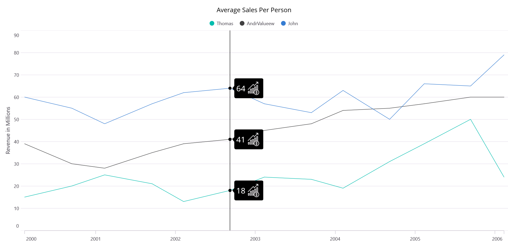
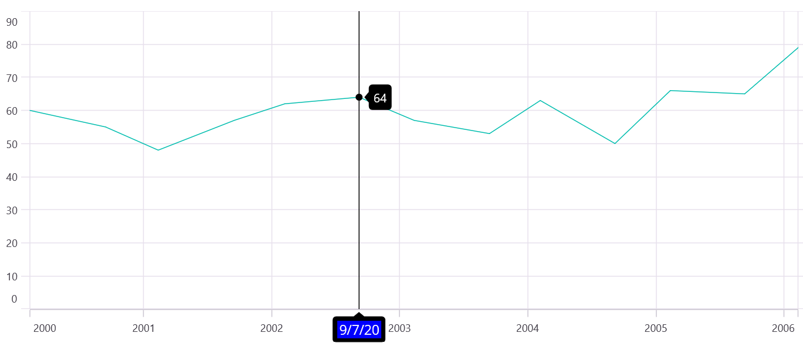

# Trackball in .NET MAUI Cartesian Chart

The trackball allows you to show a tooltip for the nearest data points when you interact with the chart area. On mobile, long-press the chart to show the trackball, and drag the chart to change the trackball's location constantly. To display the trackball on the desktop, move the cursor over the chart area.

N> **Prerequisite:** Ensure that the required NuGet package is installed, the necessary namespaces are imported, and the **SfCartesianChart** control is properly configured in your application. For detailed setup and configuration instructions, refer to the **[Getting Started](https://help.syncfusion.com/maui/cartesian-charts/getting-started)** guide.

## Enable trackball

To enable the trackball in the chart, create an instance of the [ChartTrackballBehavior](https://help.syncfusion.com/cr/maui/Syncfusion.Maui.Charts.ChartTrackballBehavior.html) and set it to the [TrackballBehavior](https://help.syncfusion.com/cr/maui/Syncfusion.Maui.Charts.SfCartesianChart.html#Syncfusion_Maui_Charts_SfCartesianChart_TrackballBehavior) property. The following properties are used to show or hide the line and tooltip.

* [ShowLabel](https://help.syncfusion.com/cr/maui/Syncfusion.Maui.Charts.ChartTrackballBehavior.html#Syncfusion_Maui_Charts_ChartTrackballBehavior_ShowLabel), of type `bool`, shows or hides the trackball label. The default value is `True`.
* [ShowMarkers](https://help.syncfusion.com/cr/maui/Syncfusion.Maui.Charts.ChartTrackballBehavior.html#Syncfusion_Maui_Charts_ChartTrackballBehavior_ShowMarkers), of type `bool`, shows or hides trackball markers. The default value is `True`.
* [ShowLine](https://help.syncfusion.com/cr/maui/Syncfusion.Maui.Charts.ChartTrackballBehavior.html#Syncfusion_Maui_Charts_ChartTrackballBehavior_ShowLine), of type `bool`, shows or hides the trackball line. The default value is `True`.





<chart:SfCartesianChart>
    <!-- code omitted for brevity -->
    <chart:SfCartesianChart.TrackballBehavior>
        <chart:ChartTrackballBehavior/>
    </chart:SfCartesianChart.TrackballBehavior>
    <!-- code omitted for brevity -->
</chart:SfCartesianChart>





SfCartesianChart chart = new SfCartesianChart();
// code omitted for brevity
ChartTrackballBehavior trackball = new ChartTrackballBehavior();
chart.TrackballBehavior = trackball;
// code omitted for brevity
this.Content = chart;





## Enable label display mode

The [DisplayMode](https://help.syncfusion.com/cr/maui/Syncfusion.Maui.Charts.ChartTrackballBehavior.html#Syncfusion_Maui_Charts_ChartTrackballBehavior_DisplayMode) property specifies whether a label should be displayed for all data points along the trackball line or only the nearest data point label. The default value is `FloatAllPoints`. The following choices are available for this property.

* `FloatAllPoints` – Displays labels for all the data points along the vertical line.
* `NearestPoint` – Displays a label for a single data point nearer to the touch point on the chart area.
* `GroupAllPoints` – Displays all the data point labels grouped at the top of the chart area.





<chart:SfCartesianChart>
    <!-- code omitted for brevity -->
    <chart:SfCartesianChart.TrackballBehavior>
        <chart:ChartTrackballBehavior ShowLine="True" 
                                      DisplayMode="NearestPoint"/>
    </chart:SfCartesianChart.TrackballBehavior>
    <!-- code omitted for brevity -->
</chart:SfCartesianChart>





SfCartesianChart chart = new SfCartesianChart();
// code omitted for brevity
ChartTrackballBehavior trackball = new ChartTrackballBehavior()
{
    ShowLine = true,
    DisplayMode = LabelDisplayMode.NearestPoint
};
chart.TrackballBehavior = trackball;
// code omitted for brevity
this.Content = chart;





## Activation mode

The [ActivationMode](https://help.syncfusion.com/cr/maui/Syncfusion.Maui.Charts.ChartTrackballBehavior.html#Syncfusion_Maui_Charts_ChartTrackballBehavior_ActivationMode) property is used to restrict the visibility of the trackball based on the touch actions.

The [ChartTrackballActivationMode](https://help.syncfusion.com/cr/maui/Syncfusion.Maui.Charts.ChartTrackballActivationMode.html) enum contains the following values:

* `LongPress` – Activates the trackball only when performing the long-press action.
* `TouchMove` – Activates the trackball only when performing a touch-move action.
* `None` – Hides the trackball when the activation mode is set to `None`. It will be activated when calling the `Show` method.





<chart:SfCartesianChart>
    <!-- code omitted for brevity -->
    <chart:SfCartesianChart.TrackballBehavior>
        <chart:ChartTrackballBehavior ActivationMode="LongPress"/>
    </chart:SfCartesianChart.TrackballBehavior>
    <!-- code omitted for brevity -->
</chart:SfCartesianChart>





SfCartesianChart chart = new SfCartesianChart();
// code omitted for brevity
ChartTrackballBehavior trackball = new ChartTrackballBehavior()
{
    ActivationMode = ChartTrackballActivationMode.LongPress
};
chart.TrackballBehavior = trackball;
// code omitted for brevity
this.Content = chart;





N> The default value of the [ActivationMode](https://help.syncfusion.com/cr/maui/Syncfusion.Maui.Charts.ChartTrackballBehavior.html#Syncfusion_Maui_Charts_ChartTrackballBehavior_ActivationMode) property is `ChartTrackballActivationMode.LongPress` for the Android and iOS platforms, and the default value for the macOS and Windows platforms is `ChartTrackballActivationMode.TouchMove`.

N> On Windows, LongPress gestures are supported only through touch input, not with a mouse. Consequently, when ActivationMode is set to LongPress, the trackball activates only via touch interaction, not with mouse interaction.

## Appearance customization

### Trackball label customization

The [LabelStyle](https://help.syncfusion.com/cr/maui/Syncfusion.Maui.Charts.ChartTrackballBehavior.html#Syncfusion_Maui_Charts_ChartTrackballBehavior_LabelStyle) property is used to customize the trackball labels, of the [ChartLabelStyle](https://help.syncfusion.com/cr/maui/Syncfusion.Maui.Charts.ChartLabelStyle.html) class. These options are:

* [Background](https://help.syncfusion.com/cr/maui/Syncfusion.Maui.Charts.ChartLabelStyle.html#Syncfusion_Maui_Charts_ChartLabelStyle_Background), of type `Brush`, is used to change the label background color.
* [Margin](https://help.syncfusion.com/cr/maui/Syncfusion.Maui.Charts.ChartLabelStyle.html#Syncfusion_Maui_Charts_ChartLabelStyle_Margin), of type `Thickness`, is used to change the margin of the label.
* [TextColor](https://help.syncfusion.com/cr/maui/Syncfusion.Maui.Charts.ChartLabelStyle.html#Syncfusion_Maui_Charts_ChartLabelStyle_TextColor), of type `Color`, is used to change the text color.
* [StrokeWidth](https://help.syncfusion.com/cr/maui/Syncfusion.Maui.Charts.ChartLabelStyle.html#Syncfusion_Maui_Charts_ChartLabelStyle_StrokeWidth), of type `double`, is used to change the stroke thickness of the label.
* [Stroke](https://help.syncfusion.com/cr/maui/Syncfusion.Maui.Charts.ChartLabelStyle.html#Syncfusion_Maui_Charts_ChartLabelStyle_Stroke), of type `Brush`, is used to customize the border of the label.
* [LabelFormat](https://help.syncfusion.com/cr/maui/Syncfusion.Maui.Charts.ChartLabelStyle.html#Syncfusion_Maui_Charts_ChartLabelStyle_LabelFormat), of type `string`, is used to change the format of the label.
* [FontFamily](https://help.syncfusion.com/cr/maui/Syncfusion.Maui.Charts.ChartLabelStyle.html#Syncfusion_Maui_Charts_ChartLabelStyle_FontFamily), of type `string`, is used to change the font family for the trackball label.
* [FontAttributes](https://help.syncfusion.com/cr/maui/Syncfusion.Maui.Charts.ChartLabelStyle.html#Syncfusion_Maui_Charts_ChartLabelStyle_FontAttributes), of type `FontAttributes`, is used to change the font style for the trackball label.
* [FontSize](https://help.syncfusion.com/cr/maui/Syncfusion.Maui.Charts.ChartLabelStyle.html#Syncfusion_Maui_Charts_ChartLabelStyle_FontSize), of type `double`, is used to change the font size for the trackball label.
* [CornerRadius](https://help.syncfusion.com/cr/maui/Syncfusion.Maui.Charts.ChartLabelStyle.html#Syncfusion_Maui_Charts_ChartLabelStyle_CornerRadius), of type `CornerRadius`, is used to set the rounded corners for labels.





<chart:SfCartesianChart>
    <!-- code omitted for brevity -->
    <chart:ChartTrackballBehavior.LabelStyle>
        <chart:ChartLabelStyle Background="LightBlue"
                               FontSize="15"
                               CornerRadius="5"
                               StrokeWidth="2"
                               Stroke="Gray"/>
    </chart:ChartTrackballBehavior.LabelStyle>
    <!-- code omitted for brevity -->
</chart:SfCartesianChart>





SfCartesianChart chart = new SfCartesianChart();
// code omitted for brevity
ChartTrackballBehavior trackball = new ChartTrackballBehavior();
ChartLabelStyle labelStyle = new ChartLabelStyle()
{
    Background = new SolidColorBrush(Colors.LightBlue),
    FontSize = 15,
    CornerRadius = 5,
    StrokeWidth = 2,
    Stroke = new SolidColorBrush(Colors.Gray)
};
trackball.LabelStyle = labelStyle;
chart.TrackballBehavior = trackball;
// code omitted for brevity
this.Content = chart;





### Trackball line customization

The [LineStyle](https://help.syncfusion.com/cr/maui/Syncfusion.Maui.Charts.ChartTrackballBehavior.html#Syncfusion_Maui_Charts_ChartTrackballBehavior_LineStyle) property is used to customize the trackball line, of the [ChartLineStyle](https://help.syncfusion.com/cr/maui/Syncfusion.Maui.Charts.ChartLineStyle.html) class. These options are:

* [StrokeWidth](https://help.syncfusion.com/cr/maui/Syncfusion.Maui.Charts.ChartLineStyle.html#Syncfusion_Maui_Charts_ChartLineStyle_StrokeWidth), of type `double`, is used to change the stroke width of the line.
* [Stroke](https://help.syncfusion.com/cr/maui/Syncfusion.Maui.Charts.ChartLineStyle.html#Syncfusion_Maui_Charts_ChartLineStyle_Stroke), of type `Brush`, is used to change the stroke color of the line.
* [StrokeDashArray](https://help.syncfusion.com/cr/maui/Syncfusion.Maui.Charts.ChartLineStyle.html#Syncfusion_Maui_Charts_ChartLineStyle_StrokeDashArray), of type `DoubleCollection`, specifies the dashes to be applied on the line.





<chart:SfCartesianChart>
    <!-- code omitted for brevity -->
    <chart:ChartTrackballBehavior.LineStyle>
        <chart:ChartLineStyle Stroke="Gray"
                              StrokeWidth="4"/>
    </chart:ChartTrackballBehavior.LineStyle>
    <!-- code omitted for brevity -->
</chart:SfCartesianChart>





SfCartesianChart chart = new SfCartesianChart();
// code omitted for brevity
ChartTrackballBehavior trackball = new ChartTrackballBehavior();
ChartLineStyle lineStyle = new ChartLineStyle()
{
    Stroke = new SolidColorBrush(Colors.Gray),
    StrokeWidth = 4
};
trackball.LineStyle = lineStyle;
chart.TrackballBehavior = trackball;
// code omitted for brevity
this.Content = chart;





### Trackball marker customization

The [MarkerSettings](https://help.syncfusion.com/cr/maui/Syncfusion.Maui.Charts.ChartTrackballBehavior.html#Syncfusion_Maui_Charts_ChartTrackballBehavior_MarkerSettings) property is used to customize the trackball markers, of the [ChartMarkerSettings](https://help.syncfusion.com/cr/maui/Syncfusion.Maui.Charts.ChartMarkerSettings.html) class. The trackball marker can be customized using the following properties.

* [Type](https://help.syncfusion.com/cr/maui/Syncfusion.Maui.Charts.ChartMarkerSettings.html#Syncfusion_Maui_Charts_ChartMarkerSettings_Type), of type `ShapeType`, is used to set the marker shape type.
* [Stroke](https://help.syncfusion.com/cr/maui/Syncfusion.Maui.Charts.ChartMarkerSettings.html#Syncfusion_Maui_Charts_ChartMarkerSettings_Stroke), of type `Brush`, is used to change the marker border color.
* [Fill](https://help.syncfusion.com/cr/maui/Syncfusion.Maui.Charts.ChartMarkerSettings.html#Syncfusion_Maui_Charts_ChartMarkerSettings_Fill), of type `Brush`, is used to change the marker background color.
* [StrokeWidth](https://help.syncfusion.com/cr/maui/Syncfusion.Maui.Charts.ChartMarkerSettings.html#Syncfusion_Maui_Charts_ChartMarkerSettings_StrokeWidth), of type `double`, is used to change the width of the marker border.
* [Width](https://help.syncfusion.com/cr/maui/Syncfusion.Maui.Charts.ChartMarkerSettings.html#Syncfusion_Maui_Charts_ChartMarkerSettings_Width), of type `double`, is used to change the width of the marker.
* [Height](https://help.syncfusion.com/cr/maui/Syncfusion.Maui.Charts.ChartMarkerSettings.html#Syncfusion_Maui_Charts_ChartMarkerSettings_Height), of type `double`, is used to change the height of the marker.





<chart:SfCartesianChart>
    <!-- code omitted for brevity -->
    <chart:SfCartesianChart.TrackballBehavior>
        <chart:ChartTrackballBehavior>
            <chart:ChartTrackballBehavior.MarkerSettings>
                <chart:ChartMarkerSettings Height="10" Width="10" Fill="Red"/>
            </chart:ChartTrackballBehavior.MarkerSettings>
        </chart:ChartTrackballBehavior>
    </chart:SfCartesianChart.TrackballBehavior>
    <!-- code omitted for brevity -->
</chart:SfCartesianChart>





SfCartesianChart chart = new SfCartesianChart();
// code omitted for brevity
ChartTrackballBehavior trackball = new ChartTrackballBehavior();
ChartMarkerSettings markerSettings = new ChartMarkerSettings()
{
    Height = 10,
    Width = 10,
    Fill = new SolidColorBrush(Colors.Red)
};
trackball.MarkerSettings = markerSettings;
chart.TrackballBehavior = trackball;
// code omitted for brevity
this.Content = chart;





## Series trackball label template

Trackball labels can be customized by adding any view as its template by using [TrackballLabelTemplate](https://help.syncfusion.com/cr/maui/Syncfusion.Maui.Charts.CartesianSeries.html#Syncfusion_Maui_Charts_CartesianSeries_TrackballLabelTemplate) of [CartesianSeries](https://help.syncfusion.com/cr/maui/Syncfusion.Maui.Charts.CartesianSeries.html).

T> The `DataItem` can be used to access the data linked to the associated business model. The binding context for `TrackballLabelTemplate` is `TrackballPointInfo`, which provides the necessary data for the labels.





<chart:SfCartesianChart>
    <chart:SfCartesianChart.Resources>
        <DataTemplate x:Key="trackballLabelTemplate">
            <HorizontalStackLayout>
                <Image Source="image.png" WidthRequest="20" HeightRequest="20"/>
                <Label Text="{Binding Series.Label, StringFormat=' {0}'}" FontSize="12" HorizontalOptions="Center"  TextColor="White"/>
                <Label Text="{Binding DataItem.YValues,StringFormat=': {0}M'}" FontSize="12" HorizontalOptions="Center" TextColor="White"/>
            </HorizontalStackLayout>
        </DataTemplate>
    </chart:SfCartesianChart.Resources>

    <chart:SfCartesianChart.TrackballBehavior>
        <chart:ChartTrackballBehavior/>
    </chart:SfCartesianChart.TrackballBehavior>
    <!-- code omitted for brevity -->
    <chart:LineSeries ItemsSource="{Binding Data1}" 
                      TrackballLabelTemplate="{StaticResource trackballLabelTemplate}"
                      XBindingPath="XValues"
                      YBindingPath="YValues"
                      Label="Thomas"/>

    <chart:LineSeries ItemsSource="{Binding Data2}" 
                      TrackballLabelTemplate="{StaticResource trackballLabelTemplate}"
                      XBindingPath="XValues"
                      YBindingPath="YValues"
                      Label="Elizabeth"/>

    <chart:LineSeries ItemsSource="{Binding Data3}" 
                      TrackballLabelTemplate="{StaticResource trackballLabelTemplate}"
                      XBindingPath="XValues"
                      YBindingPath="YValues"
                      Label="Andrew"/>
    <!-- code omitted for brevity -->
</chart:SfCartesianChart>





SfCartesianChart chart = new SfCartesianChart();

ChartTrackballBehavior trackball = new ChartTrackballBehavior();
chart.TrackballBehavior = trackball;
// code omitted for brevity
LineSeries series1 = new LineSeries();
series1.ItemsSource = new ViewModel().Data1;
series1.XBindingPath = "XValues";
series1.YBindingPath = "YValues";
series1.Label = "Thomas";

LineSeries series2 = new LineSeries();
series2.ItemsSource = new ViewModel().Data2;
series2.XBindingPath = "XValues";
series2.YBindingPath = "YValues";
series2.Label = "Elizabeth";

LineSeries series3 = new LineSeries();
series3.ItemsSource = new ViewModel().Data3;
series3.XBindingPath = "XValues";
series3.YBindingPath = "YValues";
series3.Label = "Andrew";

DataTemplate trackballLabelTemplate = new DataTemplate(() =>
{
    HorizontalStackLayout horizontalStackLayout = new HorizontalStackLayout();

    Image image = new Image()
    {
        Source = "image.png",
        WidthRequest = 20,
        HeightRequest = 20
    };

    Label label1 = new Label()
    {
        FontSize = 15,
        HorizontalOptions = LayoutOptions.Center,
        TextColor = Colors.White
    };
    label1.SetBinding(Label.TextProperty, new Binding("Series.Label", stringFormat: " {0}"));

    Label label2 = new Label()
    {
        FontSize = 15,
        HorizontalOptions = LayoutOptions.Center,
        TextColor = Colors.White
    };
    label2.SetBinding(Label.TextProperty, new Binding("DataItem.YValues", stringFormat: ": {0}M"));

    horizontalStackLayout.Add(image);
    horizontalStackLayout.Add(label1);
    horizontalStackLayout.Add(label2);

    return horizontalStackLayout;
});

series1.TrackballLabelTemplate = trackballLabelTemplate;
series2.TrackballLabelTemplate = trackballLabelTemplate;
series3.TrackballLabelTemplate = trackballLabelTemplate;

chart.Series.Add(series1);
chart.Series.Add(series2);
chart.Series.Add(series3);
this.Content = chart;
        




## Axis trackball label template

To customize the appearance of axis labels on the trackball, you can use the [TrackballLabelTemplate](https://help.syncfusion.com/cr/maui/Syncfusion.Maui.Charts.ChartAxis.html#Syncfusion_Maui_Charts_ChartAxis_TrackballLabelTemplate) property of the [ChartAxis](https://help.syncfusion.com/cr/maui/Syncfusion.Maui.Charts.ChartAxis.html).





<chart:SfCartesianChart>
    <chart:SfCartesianChart.Resources>
        <DataTemplate x:Key="axisLabelTemplate">
            <Label WidthRequest="50" HeightRequest="20" HorizontalTextAlignment="Center" Background="Blue" Text="{Binding Date}" TextColor="White" FontSize="15"/>
        </DataTemplate>
    </chart:SfCartesianChart.Resources>

    <chart:SfCartesianChart.TrackballBehavior>
        <chart:ChartTrackballBehavior/>
    </chart:SfCartesianChart.TrackballBehavior>

    <chart:SfCartesianChart.XAxes>
        <chart:DateTimeAxis TrackballLabelTemplate="{StaticResource axisLabelTemplate}" ShowTrackballLabel="True"/>
    </chart:SfCartesianChart.XAxes>

    <chart:SfCartesianChart.YAxes>
        <chart:NumericalAxis/>
    </chart:SfCartesianChart.YAxes>

    <chart:LineSeries ItemsSource="{Binding Data}" 
                      XBindingPath="Date"
                      YBindingPath="Values"/>
</chart:SfCartesianChart>





SfCartesianChart chart = new SfCartesianChart();

ChartTrackballBehavior trackball = new ChartTrackballBehavior();
chart.TrackballBehavior = trackball;

DateTimeAxis primaryAxis = new DateTimeAxis();
primaryAxis.ShowTrackballLabel = true;

DataTemplate axisLabelTemplate = new DataTemplate(() =>
{
    var label = new Label()
    {
        WidthRequest = 50,
        HeightRequest = 20,
        HorizontalTextAlignment = TextAlignment.Center,
        Background = new SolidColorBrush(Colors.Blue),
        TextColor = Colors.White,
        FontSize = 15
    };
    label.SetBinding(Label.TextProperty, "Date");

    return label;
});

primaryAxis.TrackballLabelTemplate = axisLabelTemplate;
chart.XAxes.Add(primaryAxis);

NumericalAxis secondaryAxis = new NumericalAxis();
chart.YAxes.Add(secondaryAxis);

LineSeries series = new LineSeries();
series.ItemsSource = new ViewModel().Data;
series.XBindingPath = "Date";
series.YBindingPath = "Values";

chart.Series.Add(series);

this.Content = chart;





## Show or hide the series label

The [CartesianSeries.ShowTrackballLabel](https://help.syncfusion.com/cr/maui/Syncfusion.Maui.Charts.CartesianSeries.html#Syncfusion_Maui_Charts_CartesianSeries_ShowTrackballLabel) property is used to show or hide the series trackball label. The default value is `True`.





<chart:SfCartesianChart>
    <!-- code omitted for brevity -->
    <chart:LineSeries ShowTrackballLabel="False"
                      ItemsSource="{Binding Data}" 
                      XBindingPath="Name" 
                      YBindingPath="Run"/>
    <!-- code omitted for brevity -->
</chart:SfCartesianChart>





SfCartesianChart chart = new SfCartesianChart();
// code omitted for brevity
LineSeries lineSeries = new LineSeries()
{
    ShowTrackballLabel = false,
    ItemsSource = new ViewModel().Data,
    XBindingPath = "Name",
    YBindingPath = "Run"
};

chart.Series.Add(lineSeries);
// code omitted for brevity
this.Content = chart;





## Show or hide trackball label in axis

When the trackball moves across the axis, this feature highlights the related axis label. The [ChartAxis.ShowTrackballLabel](https://help.syncfusion.com/cr/maui/Syncfusion.Maui.Charts.ChartAxis.html#Syncfusion_Maui_Charts_ChartAxis_ShowTrackballLabel) property is used to show or hide the axis's trackball label. The [ChartAxis.TrackballLabelStyle](https://help.syncfusion.com/cr/maui/Syncfusion.Maui.Charts.ChartAxis.html#Syncfusion_Maui_Charts_ChartAxis_TrackballLabelStyle) property is used to customize the appearance of the label. The default value of the [ChartAxis.ShowTrackballLabel](https://help.syncfusion.com/cr/maui/Syncfusion.Maui.Charts.ChartAxis.html#Syncfusion_Maui_Charts_ChartAxis_ShowTrackballLabel) is `False`.





<chart:SfCartesianChart>
    <!-- code omitted for brevity -->
    <chart:CategoryAxis ShowTrackballLabel="True"/>
    <!-- code omitted for brevity -->
</chart:SfCartesianChart>





SfCartesianChart chart = new SfCartesianChart();
// code omitted for brevity
CategoryAxis chartAxis = new CategoryAxis();
chartAxis.ShowTrackballLabel = true;
chart.XAxes.Add(chartAxis);
// code omitted for brevity
this.Content = chart;





## Methods

* `Show(x, y)` - The [Show](https://help.syncfusion.com/cr/maui/Syncfusion.Maui.Charts.ChartTrackballBehavior.html#Syncfusion_Maui_Charts_ChartTrackballBehavior_Show_System_Single_System_Single_) method is used to activate the trackball at the specified location.
* `Hide()` - The [Hide](https://help.syncfusion.com/cr/maui/Syncfusion.Maui.Charts.ChartTrackballBehavior.html#Syncfusion_Maui_Charts_ChartTrackballBehavior_Hide) method hides the trackball that is visible in the chart.

The following code sample illustrates how to call the `Show` and `Hide` methods.





SfCartesianChart chart = new SfCartesianChart();
// code omitted for brevity
ChartTrackballBehavior trackball = new ChartTrackballBehavior();
chart.TrackballBehavior = trackball;
// code omitted for brevity

// Activate the trackball at the specified location
trackball.Show(100, 200);

// Hide the trackball
trackball.Hide();

this.Content = chart;





## Events

### Trackball created

The [TrackballCreated](https://help.syncfusion.com/cr/maui/Syncfusion.Maui.Charts.SfCartesianChart.html#Syncfusion_Maui_Charts_SfCartesianChart_TrackballCreated) event occurs when the trackball moves from one data point to another. The event argument contains an object of the [TrackballPointInfo](https://help.syncfusion.com/cr/maui/Syncfusion.Maui.Charts.TrackballPointInfo.html) class. The following properties are available in the [TrackballPointInfo](https://help.syncfusion.com/cr/maui/Syncfusion.Maui.Charts.TrackballPointInfo.html) class to customize the appearance of the trackball label based on a condition:

* [Label](https://help.syncfusion.com/cr/maui/Syncfusion.Maui.Charts.TrackballPointInfo.html#Syncfusion_Maui_Charts_TrackballPointInfo_Label), of type `string`, is used to change the text of the trackball label.
* [LabelStyle](https://help.syncfusion.com/cr/maui/Syncfusion.Maui.Charts.TrackballPointInfo.html#Syncfusion_Maui_Charts_TrackballPointInfo_LabelStyle), of type [ChartLabelStyle](https://help.syncfusion.com/cr/maui/Syncfusion.Maui.Charts.ChartLabelStyle.html), is used to customize the appearance of the trackball label.
* [MarkerSettings](https://help.syncfusion.com/cr/maui/Syncfusion.Maui.Charts.TrackballPointInfo.html#Syncfusion_Maui_Charts_TrackballPointInfo_MarkerSettings), of type [ChartMarkerSettings](https://help.syncfusion.com/cr/maui/Syncfusion.Maui.Charts.ChartMarkerSettings.html), is used to customize the trackball markers.
* [Series](https://help.syncfusion.com/cr/maui/Syncfusion.Maui.Charts.TrackballPointInfo.html#Syncfusion_Maui_Charts_TrackballPointInfo_Series), of type [CartesianSeries](https://help.syncfusion.com/cr/maui/Syncfusion.Maui.Charts.CartesianSeries.html), is used to get the series of the data point in which the trackball is activated.
* [DataItem](https://help.syncfusion.com/cr/maui/Syncfusion.Maui.Charts.TrackballPointInfo.html#Syncfusion_Maui_Charts_TrackballPointInfo_DataItem), of type `object`, is used to get the data associated with the specific point where the trackball is activated.

The following code sample illustrates how to subscribe to the [TrackballCreated](https://help.syncfusion.com/cr/maui/Syncfusion.Maui.Charts.SfCartesianChart.html#Syncfusion_Maui_Charts_SfCartesianChart_TrackballCreated) event.





SfCartesianChart chart = new SfCartesianChart();
// code omitted for brevity

chart.TrackballCreated += (sender, args) =>
{
    foreach (var pointInfo in args.TrackballPointInfos)
    {
        // Access the data associated with the trackball point
        var data = pointInfo.DataItem;
        // Customize the label text based on a condition
        pointInfo.Label = "Custom label";
    }
};

this.Content = chart;



