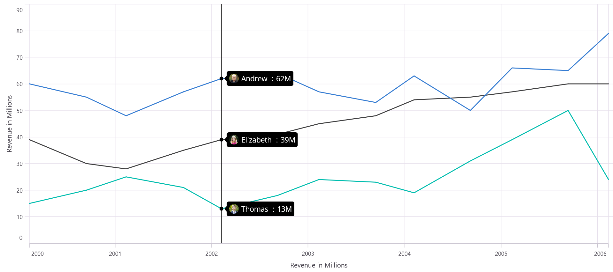

# Trackball in .NET MAUI Chart

Trackball, which allows you to show the tooltip for the nearest data points when you interact with the chart area. On mobile, long press the chart to show the trackball, and drag the chart to change the trackball's location constantly. To display the trackball on the desktop, move the cursor over the chart area.

## Enable Trackball 

To enable the trackball in the chart, create an instance of the [ChartTrackballBehavior](https://help.syncfusion.com/cr/maui/Syncfusion.Maui.Charts.ChartTrackballBehavior.html) and set it to the [TrackballBehavior](https://help.syncfusion.com/cr/maui/Syncfusion.Maui.Charts.SfCartesianChart.html#Syncfusion_Maui_Charts_SfCartesianChart_TrackballBehavior) property. The following properties are used to show or hide the line and tooltip.

* [ShowLabel](), of type `bool`, indicates the shows or hides the trackball label. The default value is `True`.
* [ShowMarkers](https://help.syncfusion.com/cr/maui/Syncfusion.Maui.Charts.ChartTrackballBehavior.html#Syncfusion_Maui_Charts_ChartTrackballBehavior_ShowMarkers), of type `bool`, indicates the shows or hides trackball markers. The default value is `True`.
* [ShowLine](https://help.syncfusion.com/cr/maui/Syncfusion.Maui.Charts.ChartTrackballBehavior.html#Syncfusion_Maui_Charts_ChartTrackballBehavior_ShowLine), of type `bool`, indicates the shows or hides the trackball line. The default value is `True`.





<chart:SfCartesianChart>
  ...
   <chart:SfCartesianChart.TrackballBehavior>
      <chart:ChartTrackballBehavior/>
   </chart:SfCartesianChart.TrackballBehavior>
     ...
</chart:SfCartesianChart>





 SfCartesianChart chart = new SfCartesianChart();
 ...
 ChartTrackballBehavior trackball = new ChartTrackballBehavior();
 chart.TrackballBehavior= trackball;

this.Content = chart;





## Enable Label Display Mode

The [DisplayMode](https://help.syncfusion.com/cr/maui/Syncfusion.Maui.Charts.ChartTrackballBehavior.html#Syncfusion_Maui_Charts_ChartTrackballBehavior_DisplayMode) property specifies whether a label should be displayed for all data points along the trackball line or only the nearest data point label. The following choices are available for this property.

* `FloatAllPoints` – Displays labels for all the data points along the vertical line.
* `NearestPoint` – Displays label for a single data point nearer to the touch point on the chart area.
* `GroupAllPoints` – Displays label for all the data points grouped and positioned at the top of the chart area.





<chart:SfCartesianChart>
  ...
 <chart:SfCartesianChart.TrackballBehavior>
    <chart:ChartTrackballBehavior ShowLine="True" 
                                  DisplayMode="NearestPoint"/>
 </chart:SfCartesianChart.TrackballBehavior>
     ...
</chart:SfCartesianChart>





 SfCartesianChart chart = new SfCartesianChart();
 ...
 ChartTrackballBehavior trackball = new ChartTrackballBehavior();
 trackball.ShowLine = true;
 trackball.DisplayMode = LabelDisplayMode.NearestPoint;
 . . . 





## Appearance customization

### Trackball Labels customization

The [LabelStyle](https://help.syncfusion.com/cr/maui/Syncfusion.Maui.Charts.ChartTrackballBehavior.html#Syncfusion_Maui_Charts_ChartTrackballBehavior_LabelStyle) property provides to customize the trackball labels. These options are:

* `Background`, of type `Brush`, used to change the label background color.
* `Margin`, of type `Thickness`, used to change the margin of the label.
* `TextColor`, of type `Color`, used to change the text color.
* `StrokeWidth`, of type `double`, used to change the stroke thickness of the label.
* `Stroke`, of type `Brush`, used to customize the border of the label.
* `LabelFormat`, of type `string`, used to change the format of the label.
* `FontFamily`, of type `string`, used to change the font family for the trackball label.
* `FontAttributes`, of type `FontAttributes`, used to change the font style for the trackball label.
* `FontSize`, of type `double`, used to change the font size for the trackball label.
* `CornerRadius`, of type `CornerRadius`, used to set the rounded corners for labels.





<chart:SfCartesianChart>
  ...
   <chart:ChartTrackballBehavior.LabelStyle>
       <chart:ChartLabelStyle Background="LightBlue"   
                              FontSize="15" 
                              CornerRadius="5"
                              StrokeWidth="2" 
                              Stroke="Gray" />
   </chart:ChartTrackballBehavior.LabelStyle>
  ...
</chart:SfCartesianChart>





SfCartesianChart chart = new SfCartesianChart();
. . .
ChartLabelStyle labelStyle = new ChartLabelStyle();
labelStyle.Background = Colors.LightBlue;
labelStyle.FontSize = 15;
labelStyle.CornerRadius = 5;
labelStyle.StrokeWidth = 2;
labelStyle.Stroke = Colors.Gray;

this.Content = chart;





### Trackball Line Customization

 The [LineStyle](https://help.syncfusion.com/cr/maui/Syncfusion.Maui.Charts.ChartTrackballBehavior.html#Syncfusion_Maui_Charts_ChartTrackballBehavior_LineStyle) property provides to customize the trackball line. These options are:

* `StrokeWidth`, of type `double`, used to change the stroke width of the line.
* `Stroke`, of type `Brush`, used to change the stroke color of the line.
* `StrokeDashArray`, of type `DoubleCollection`, specifies the dashes to be applied on the line.





<chart:SfCartesianChart>
   ...
    <chart:ChartTrackballBehavior.LineStyle>
        <chart:ChartLineStyle Stroke="Gray"   
                              StrokeDashArray="4"/>     
    </chart:ChartTrackballBehavior.LineStyle>
...
</chart:SfCartesianChart>





SfCartesianChart chart = new SfCartesianChart();
. . .
ChartLineStyle lineStyle = new ChartLineStyle();
lineStyle.Stroke = Colors.Gray;
lineStyle.StrokeDashArray = 4;

this.Content = chart;
        




### Trackball Markers Customization

The [MarkerSettings](https://help.syncfusion.com/cr/maui/Syncfusion.Maui.Charts.ChartTrackballBehavior.html#Syncfusion_Maui_Charts_ChartTrackballBehavior_MarkerSettings) property provides to customize the trackball markers. The trackball marker can be customized using the following properties.

* `Type`, of type `ShapeType`, used to set the marker shape type.
* `Stroke`, of type `Brush`, used to change the marker border color.
* `Fill`, of type `Brush`, used to change the marker background color.
* `StrokeWidth`, of type `double`, used to change the width of the marker border.
* `Width`, of type `double`, used to change the width of the marker.
* `Height`, of type `double`, used to change the height of the marker.





<chart:SfCartesianChart>
   ...
    <chart:ChartMarkerSettings Type="InvertedTriangle"  
                               Fill="Brown" 
                               Stroke="Red" 
                               StrokeWidth="1.5"
                               Width="15" 
                               Height="15"/>

...
</chart:SfCartesianChart>





SfCartesianChart chart = new SfCartesianChart();
. . .
ChartMarkerSettings markerStyle = new ChartMarkerSettings()
{
   markerStyle.Type = ShapeType.InvertedTriangle,
   markerStyle.Fill = Colors.Brown,
   markerStyle.Stroke = Colors.Red,
   markerStyle.StrokeWidth = 1.5,
   markerStyle.Width = 15,
   markerStyle.Height = 15,
};

this.Content = chart;
        




### Trackball Label Template

You can customize the appearance of the Trackball label with your own template by using [TrackballLabelTemplate]() property of [CartesianSeries](https://help.syncfusion.com/cr/maui/Syncfusion.Maui.Charts.CartesianSeries.html).





<chart:SfCartesianChart>
    <chart:SfCartesianChart.Resources>
        <DataTemplate x:Key="trackballLabelTemplate">
            <HorizontalStackLayout>
                <Label Text="{Binding DataItem.Values}" FontSize="20" VerticalOptions="Center" TextColor="White"/>
                <Image Source="image.png" WidthRequest="40" HeightRequest="40"/>
            </HorizontalStackLayout>          
        </DataTemplate>
    </chart:SfCartesianChart.Resources>

   <chart:SfCartesianChart.TrackballBehavior>
      <chart:ChartTrackballBehavior/>
   </chart:SfCartesianChart.TrackballBehavior>
    . . .
    <chart:LineSeries ItemsSource="{Binding Data1}" 
                      TrackballLabelTemplate ="{StaticResource trackballLabelTemplate}"
                      XBindingPath="Name"
                      YBindingPath="Values"/>

    <chart:LineSeries ItemsSource="{Binding Data2}" 
                      TrackballLabelTemplate ="{StaticResource trackballLabelTemplate}"
                      XBindingPath="Name"
                      YBindingPath="Values"/>

    <chart:LineSeries ItemsSource="{Binding Data3}" 
                      TrackballLabelTemplate ="{StaticResource trackballLabelTemplate}"
                      XBindingPath="Name"
                      YBindingPath="Values"/>
                      
</chart:SfCartesianChart>





SfCartesianChart chart = new SfCartesianChart();

ChartTrackballBehavior trackball = new ChartTrackballBehavior();
chart.TrackballBehavior= trackball;
. . .
LineSeries series1 = new LineSeries();
series1.ItemsSource = new ViewModel().Data1;
series1.XBindingPath = "Name";
series1.YBindingPath = "Values";

LineSeries series2 = new LineSeries();
series2.ItemsSource = new ViewModel().Data2;
series2.XBindingPath = "Name";
series2.YBindingPath = "Values";

LineSeries series3 = new LineSeries();
series3.ItemsSource = new ViewModel().Data3;
series3.XBindingPath = "Name";
series3.YBindingPath = "Values";

DataTemplate trackballLabelTemplate = new DataTemplate(() =>
{
    HorizontalStackLayout horizontalStackLayout = new HorizontalStackLayout();

    Label label = new Label
    {
        FontSize = 20,
        VerticalOptions = LayoutOptions.Center,
        TextColor = Colors.White
    };
    label.SetBinding(Label.TextProperty, "DataItem.Values");

    Image image = new Image
    {
        Source = "image.png",
        WidthRequest = 40,
        HeightRequest = 40
    };

    horizontalStackLayout.Add(label);
    horizontalStackLayout.Add(image);

    return horizontalStackLayout;
});

series1.TrackballLabelTemplate = trackballLabelTemplate;
series2.TrackballLabelTemplate = trackballLabelTemplate;
series3.TrackballLabelTemplate = trackballLabelTemplate;

chart.Series.Add(series1);
chart.Series.Add(series2);
chart.Series.Add(series3);
this.Content = chart;
        




## Customize the Axis Label with DataTemplate

Customize the appearance of axis label of trackball using [TrackballLabelTemplate property of [ChartAxis](https://help.syncfusion.com/cr/maui/Syncfusion.Maui.Charts.ChartAxis.html).





<chart:SfCartesianChart>
    <chart:SfCartesianChart.Resources>
            <DataTemplate x:Key="axisLabelTemplate">
                <Label WidthRequest="50" HeightRequest="20" HorizontalTextAlignment="Center" BackgroundColor="Blue" Text="{Binding ValueX}" TextColor="White" FontSize ="15"/>
            </DataTemplate>
    </chart:SfCartesianChart.Resources>

   <chart:SfCartesianChart.TrackballBehavior>
      <chart:ChartTrackballBehavior/>
   </chart:SfCartesianChart.TrackballBehavior>

    <chart:SfCartesianChart.XAxes>
        <chart:DateTimeAxis TrackballLabelTemplate="{StaticResource axisLabelTemplate}" ShowTrackballLabel="True"/>
    </chart:SfCartesianChart.XAxes>  

    <chart:LineSeries ItemsSource="{Binding Data}" 
                      XBindingPath="Name"
                      YBindingPath="Values"/>
                      
</chart:SfCartesianChart>





SfCartesianChart chart = new SfCartesianChart();

ChartTrackballBehavior trackball = new ChartTrackballBehavior();
chart.TrackballBehavior= trackball;

DateTimeAxis primaryAxis = new DateTimeAxis();
primaryAxis.ShowTrackballLabel = true;

DataTemplate axisLabelTemplate = new DataTemplate(() =>
{
    var label = new Label
    {
        WidthRequest = 50,
        HeightRequest = 20,
        HorizontalTextAlignment = TextAlignment.Center,
        BackgroundColor = Colors.Blue,
        TextColor = Colors.White,
        FontSize = 15
    };
    label.SetBinding(Label.TextProperty, "ValueX");

    return label;
});

primaryAxis.TrackballLabelTemplate = axisLabelTemplate;
. . .
LineSeries series = new LineSeries();
series.ItemsSource = new ViewModel().Data;
series.XBindingPath = "Name";
series.YBindingPath = "Values";

chart.Series.Add(series);

this.Content = chart;
        




## Show or Hide the Series Label

The [CartesianSeries.ShowTrackballLabel](https://help.syncfusion.com/cr/maui/Syncfusion.Maui.Charts.CartesianSeries.html#Syncfusion_Maui_Charts_CartesianSeries_ShowTrackballLabel) property is used to show or hide the series trackball label. The default value is `True`.





<chart:SfCartesianChart>
   ...
  <chart:LineSeries ShowTrackballLabel="False"
                    ItemsSource="{Binding Data}" 
                    XBindingPath="Name" 
                    YBindingPath="Run"/>  

</chart:SfCartesianChart>





SfCartesianChart chart = new SfCartesianChart();
. . .
LineSeries lineSeries = new LineSeries()
{
  ShowTrackballLabel = false,
  XBindingPath = "Name",
  YBindingPath = "Run",
  ItemsSource = new ViewModel().Data

};

this.Content = chart;
        




## Show or Hide Trackball Label in Axis

When the trackball moves across the axis, this feature highlights the related axis label. The [ChartAxis.ShowTrackballLabel](https://help.syncfusion.com/cr/maui/Syncfusion.Maui.Charts.ChartAxis.html#Syncfusion_Maui_Charts_ChartAxis_ShowTrackballLabel) property is used to show or hide the axis's trackball label. The [ChartAxis.TrackballLabelStyle](https://help.syncfusion.com/cr/maui/Syncfusion.Maui.Charts.ChartAxis.html#Syncfusion_Maui_Charts_ChartAxis_TrackballLabelStyle) property is used to customize the appearance of the label. The default value of the [ChartAxis.ShowTrackballLabel](https://help.syncfusion.com/cr/maui/Syncfusion.Maui.Charts.ChartAxis.html#Syncfusion_Maui_Charts_ChartAxis_ShowTrackballLabel) is `False`.





<chart:SfCartesianChart>
   ...
    <chart:CategoryAxis  IsInversed="False" 
                         ShowTrackballLabel="False"/> 

</chart:SfCartesianChart>





SfCartesianChart chart = new SfCartesianChart();
. . .
CategoryAxis chartAxis = new CategoryAxis()
{
  chartAxis.IsInversed= false,
  chartAxis.ShowTrackballLabel = false
}

this.Content = chart;
        




## Methods

* `Show(x, y)` - The [Show](https://help.syncfusion.com/cr/maui/Syncfusion.Maui.Charts.ChartTrackballBehavior.html#Syncfusion_Maui_Charts_ChartTrackballBehavior_Show_System_Single_System_Single_) method is used to activate the trackball at the specified location.
* `Hide()` - The [Hide](https://help.syncfusion.com/cr/maui/Syncfusion.Maui.Charts.ChartTrackballBehavior.html#Syncfusion_Maui_Charts_ChartTrackballBehavior_Hide) method hides the trackball that is visible in the chart.

## Events

### TrackballCreated

The [`TrackballCreated`](https://help.syncfusion.com/cr/maui/Syncfusion.Maui.Charts.SfCartesianChart.html#Syncfusion_Maui_Charts_SfCartesianChart_TrackballCreated) event occurs when the trackball moves from one data point to another. This argument contains an object of the ChartPointsInfo. The following properties are available in the `ChartPointInfo` class to customize the appearance of the trackball label based on a condition.

* [Label](https://help.syncfusion.com/cr/maui/Syncfusion.Maui.Charts.TrackballPointInfo.html#Syncfusion_Maui_Charts_TrackballPointInfo_Label) of type `string`: Used to change the text of the trackball label.
* [LabelStyle](https://help.syncfusion.com/cr/maui/Syncfusion.Maui.Charts.TrackballPointInfo.html#Syncfusion_Maui_Charts_TrackballPointInfo_LabelStyle) of type `ChartLabelStyle`: Used to customize the appearance of the trackball label.
* [MarkerSettings](https://help.syncfusion.com/cr/maui/Syncfusion.Maui.Charts.TrackballPointInfo.html#Syncfusion_Maui_Charts_TrackballPointInfo_MarkerSettings) of type `ChartMarkerSettings`: Used to customize the trackball markers.
* [Series](https://help.syncfusion.com/cr/maui/Syncfusion.Maui.Charts.TrackballPointInfo.html#Syncfusion_Maui_Charts_TrackballPointInfo_Series) of type `CartesianSeries`: Used to get the series of the data point in which the trackball is activated.
* [DataItem](https://help.syncfusion.com/cr/maui/Syncfusion.Maui.Charts.TrackballPointInfo.html#Syncfusion_Maui_Charts_TrackballPointInfo_DataItem) of type `object`: Used to get the data associated with the specific point where the trackball is activated.