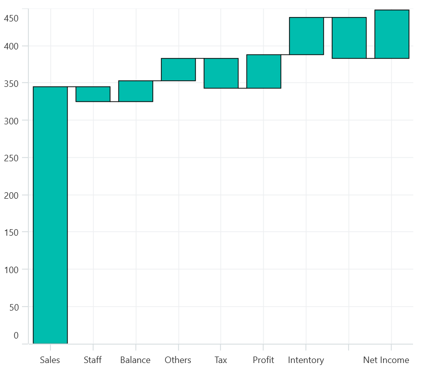
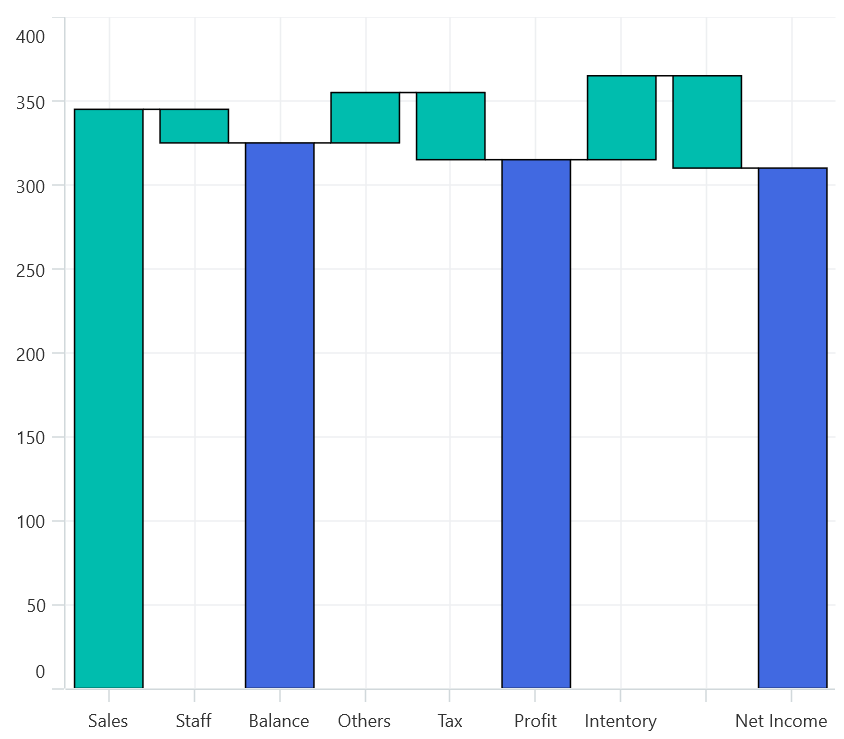
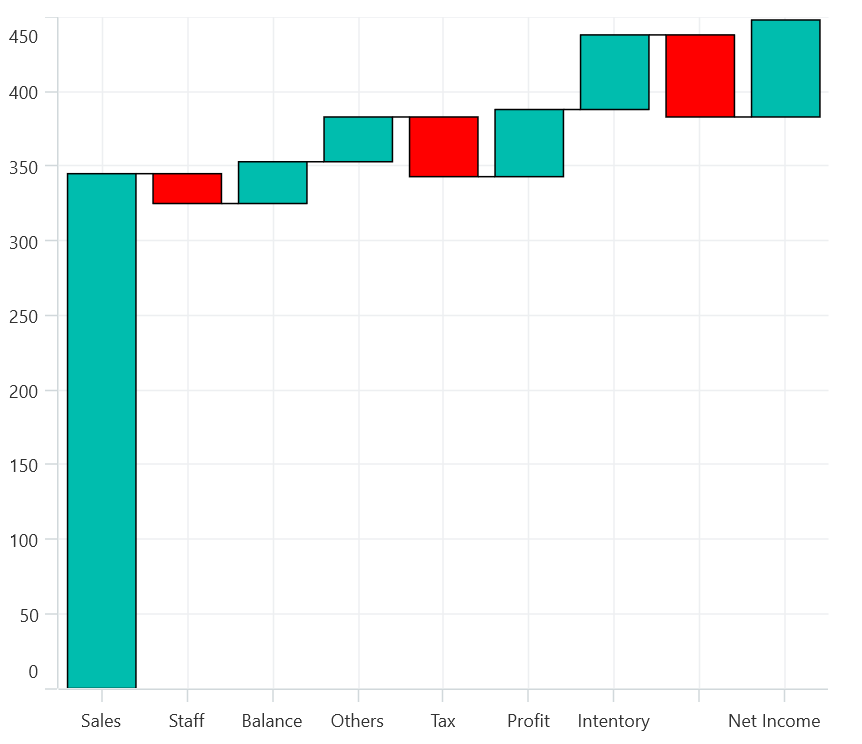
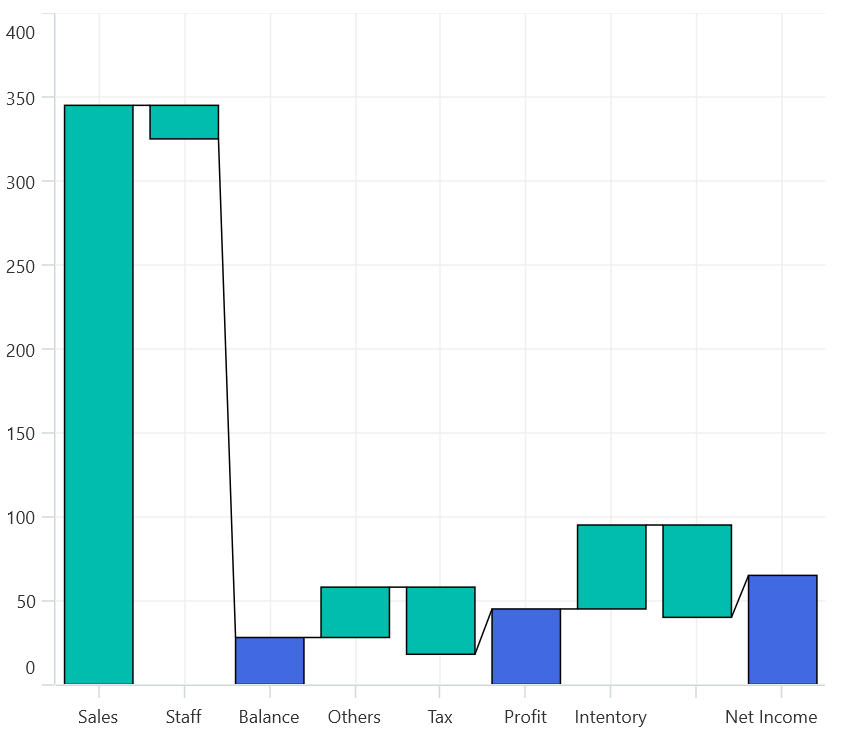
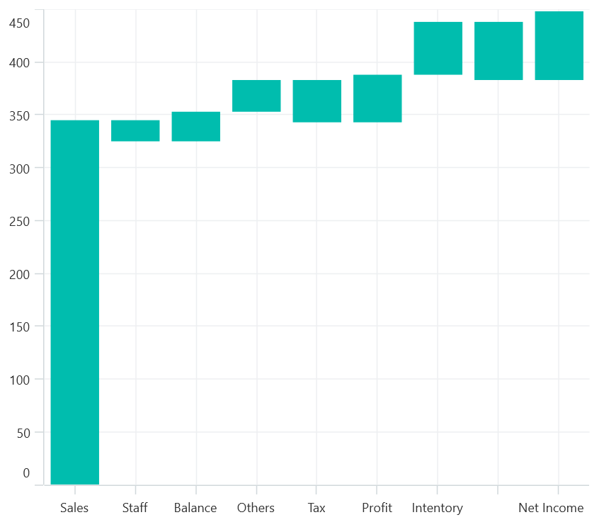
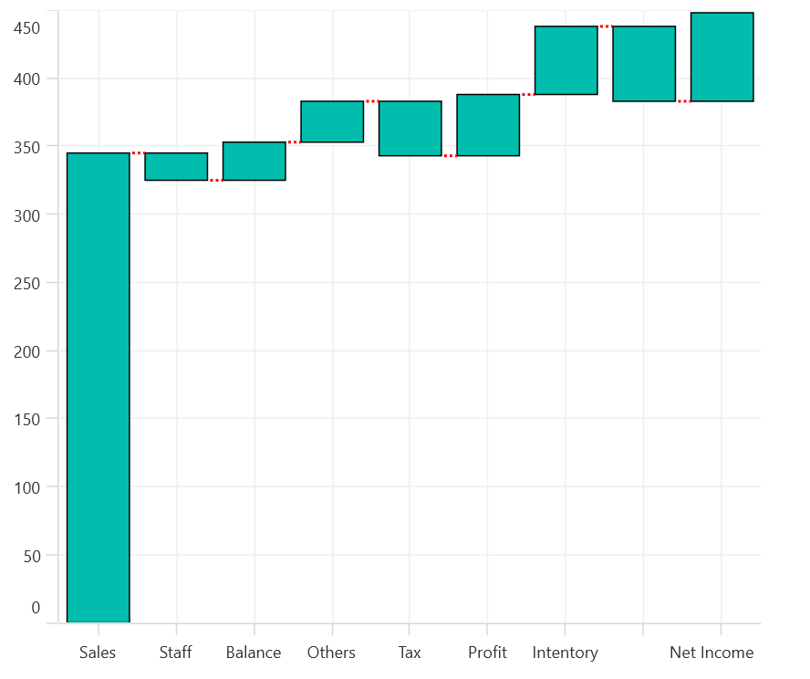

# Waterfall Series Chart in .NET MAUI Chart

## Waterfall Series Chart

[WaterfallSeries]() clarifies the cumulative effect of set of provided positive and negative values. The series is represented by a rectangle and a connector between the rectangles.

The following code illustrates how to use the series in chart.





    <chart:WaterfallSeries ItemsSource="{Binding RevenueDetails}"  
                           XBindingPath="Category" 
                           YBindingPath="Value">
    </chart:WaterfallSeries>





    WaterfallSeries waterfallSeries = new WaterfallSeries();
    waterfallSeries.ItemsSource = new ViewModel().RevenueDetails;
    waterfallSeries.XBindingPath = "Category";
    waterfallSeries.YBindingPath = "Value";
    chart.Series.Add(waterfallSeries);





### SummarySegmentPath and SummarySegmentBrush

[SummaryBindingPath]() gets or sets the string value that indicates the sum of previous segments in series.

The summary segment can be differentiated by applying the [SummarySegmentBrush]() in series.





    <chart:WaterfallSeries ItemsSource="{Binding RevenueDetails}"  
                                    XBindingPath="Category"
                                    YBindingPath="Value" 
                                    Interior="Gray"
                                    SummaryBindingPath="IsSummary"
                                    SummarySegmentBrush="RoyalBlue">
    </chart:WaterfallSeries>




    WaterfallSeries waterfallSeries = new WaterfallSeries();
    waterfallSeries.ItemsSource = new ViewModel().RevenueDetails;
    waterfallSeries.XBindingPath = "Category";
    waterfallSeries.YBindingPath = "Value";
    waterfallSeries.SummaryBindingPath = "IsSummary";
    waterfallSeries.SummarySegmentBrush = new SolidColorBrush(Colors.RoyalBlue);
    chart.Series.Add(waterfallSeries);




### NegativeSegmentBrush

The appearance of the negative segment can be changed by using the [NegativeSegmentBrush]() property of series.

The following code illustrates how to change the appearance of the negative segment.





    <chart:WaterfallSeries NegativeSegmentBrush="Red">

    </chart:WaterfallSeries>





    WaterfallSeries waterfallSeries = new WaterfallSeries();
    waterfallSeries.NegativeSegmentBrush = new SolidColorBrush(Colors.Red);





### AllowAutoSum

The summary segment calculation can be changed by using the [AllowAutoSum]() property. By default, the property is true. When disabling this property, it renders the segment by using the y value of provided ItemsSource collection.

The following code example illustrates how the AllowAutoSum property value can be set.





    <chart:WaterfallSeries AllowAutoSum="False"        
                        SummaryBindingPath="IsSummary"
                        SummarySegmentBrush="RoyalBlue">
    </chart:WaterfallSeries>





    WaterfallSeries waterfallSeries = new WaterfallSeries();
    waterfallSeries.AllowAutoSum = true;
    waterfallSeries.SummaryBindingPath = "IsSummary";
    waterfallSeries.SummarySegmentBrush = new SolidColorBrush(Colors.RoyalBlue);
    chart.Series.Add(waterfallSeries);





### ConnectorLine

The connector line of series can be enabled or disabled by using its [ShowConnector]() line property. By default, the property value is true.
The following code example illustrates how the AllowAutoSum property value can be set.





    <chart:WaterfallSeries ShowConnector="False">
    </chart:WaterfallSeries>





    WaterfallSeries waterfallSeries = new WaterfallSeries();
    waterfallSeries.ShowConnector = false;





### Connector line customization

The connector line can be customized by applying [ConnectorLineStyle]() property of the series. The following code example illustrates how to apply style for connector line.





    <chart:WaterfallSeries.ConnectorLineStyle>
    
    </chart:WaterfallSeries.ConnectorLineStyle>





    Style style = new Style(typeof(Line));
    style.Setters.Add(new Setter(Line.StrokeProperty, new SolidColorBrush(Colors.Red)));
    style.Setters.Add(new Setter(Line.StrokeDashArrayProperty, new DoubleCollection() { 1 }));
    style.Setters.Add(new Setter(Line.StrokeThicknessProperty, 2));
    WaterfallSeries series = new WaterfallSeries();
    series.ConnectorLineStyle = style;





N> You can explore our [WPF Waterfall Chart]() feature tour page for its groundbreaking features. You can also explore our [WPF Waterfall Chart]() example to know how to represent time-dependent data, showing trends in data at equal intervals.