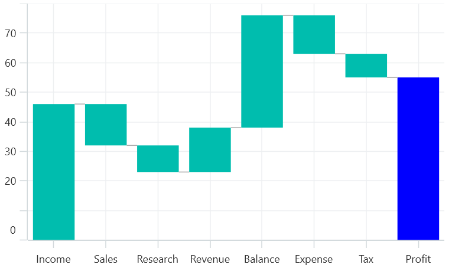
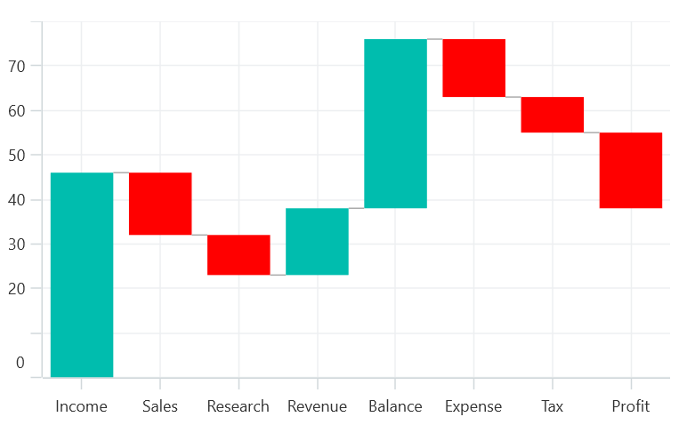
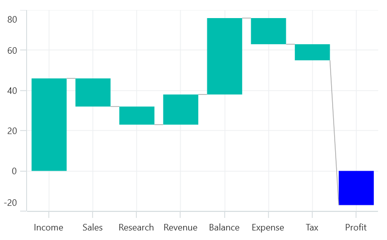
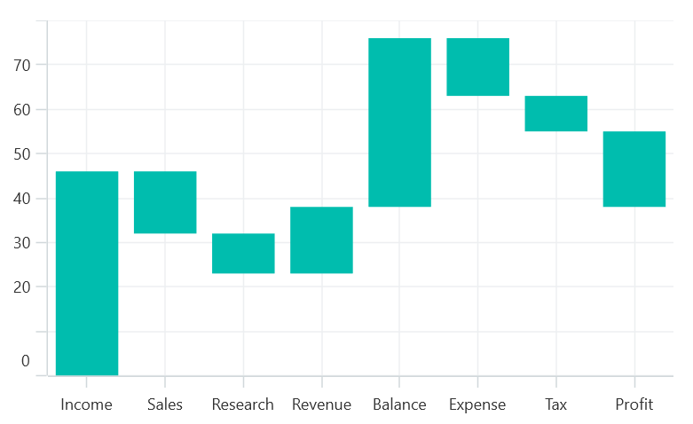

# Waterfall Series in .NET MAUI Chart

## Waterfall Series

[WaterfallSeries]() clarifies the cumulative effect of a set of provided positive and negative values. The series is represented by a rectangle and a connector between the rectangles. To render a waterfall chart, create an instance of [WaterfallSeries](), and add it to the [Series](https://help.syncfusion.com/cr/maui/Syncfusion.Maui.Charts.SfCartesianChart.html#Syncfusion_Maui_Charts_SfCartesianChart_Series) collection property of the [SfCartesianChart](https://help.syncfusion.com/cr/maui/Syncfusion.Maui.Charts.SfCartesianChart.html?tabs=tabid-1)

The following code illustrates how to use the series in chart.





    <chart:SfCartesianChart>
        <chart:SfCartesianChart.XAxes>
            <chart:CategoryAxis/>
        </chart:SfCartesianChart.XAxes>

        <chart:SfCartesianChart.YAxes>
            <chart:NumericalAxis/>
        </chart:SfCartesianChart.YAxes>
    
        <chart:SfCartesianChart.Series>
            <chart:WaterfallSeries ItemsSource="{Binding Sales}"
                                   XBindingPath="Department"
                                   YBindingPath="Value"/>
             </chart:SfCartesianChart.Series>   
    </chart:SfCartesianChart>





    SfCartesianChart chart = new SfCartesianChart();
    NumericalAxis xAxis = new CategoryAxis();
    NumericalAxis yAxis = new NumericalAxis();
    chart.XAxes.Add(xAxis);
    chart.YAxes.Add(yAxis);
   
    ViewModel viewModel = new ViewModel();

    WaterfallSeries series = new WaterfallSeries();
    series.ItemsSource =new viewModel().Sales;
    series.XBindingPath = "Department";
    series.YBindingPath = "Value";
    chart.Series.Add(series);





### SummarySegmentPath and SummaryPointsBrush

[SummaryBindingPath]() gets or sets the string value that indicates the sum of previous segments in the series.

The summary segment can be differentiated by applying the [SummaryPointsBrush]() in series.





    <chart:WaterfallSeries ItemsSource="{Binding Sales}"  
                           XBindingPath="Department" 
                           YBindingPath="Value"
                           Interior="Blue"
                           SummaryBindingPath="IsSummary"
                           SummaryPointsBrush="RoyalBlue">
    </chart:WaterfallSeries>




    WaterfallSeries waterfallSeries = new WaterfallSeries();
    waterfallSeries.ItemsSource =new ViewModel().RevenueDetails;

    waterfallSeries.XBindingPath = "Department";
    waterfallSeries.YBindingPath = "Value";
    waterfallSeries.SummaryBindingPath = "IsSummary";
    waterfallSeries.SummaryPointsBrush = new SolidColorBrush(Colors.Blue);
    chart.Series.Add(waterfallSeries);




### NegativePointsBrush

The appearance of the negative segment can be changed by using the [NegativePointsBrush]() property of series.

The following code illustrates how to change the appearance of the negative segment.





    <chart:WaterfallSeries NegativePointsBrush="Red">
    </chart:WaterfallSeries>





    WaterfallSeries series = new WaterfallSeries();
    series.NegativePointsBrush = new SolidColorBrush(Colors.Red);





### AllowAutoSum

The summary segment calculation can be changed by using the [AllowAutoSum]() property. By default, the property is true. When disabling this property, it renders the segment by using the y value of provided ItemsSource collection.

The following code example illustrates how the AllowAutoSum property value can be set.





    <chart:WaterfallSeries  AllowAutoSum="False"
                            SummaryBindingPath="IsSummary"
                            SummarySegmentBrush="Blue">
    </chart:WaterfallSeries>





    WaterfallSeries series = new WaterfallSeries();
    series.AllowAutoSum = true;
    series.SummaryBindingPath = "IsSummary";
    series.SummarySegmentBrush = new SolidColorBrush(Colors.Blue);
    chart.Series.Add(waterfallSeries);





### ConnectorLine

The connector line of series can be enabled or disabled by using its [ShowConnectorLine]() line property. By default, the property value is true.
The following code example illustrates how the ShowConnectorLine value can be set.





    <chart:WaterfallSeries ShowConnectorLine="False">
    </chart:WaterfallSeries>





    WaterfallSeries series = new WaterfallSeries();
    series.ShowConnectorLine = false;





### Connector line customization

The connector line can be customized by applying the[ConnectorLineStyle]() property of the series. The following code example illustrates how to apply style for connector line.





    <chart:WaterfallSeries.ConnectorLineStyle>
    <chart:ChartLineStyle Stroke="Green"
                          StrokeWidth=2>
    </chart:WaterfallSeries.ConnectorLineStyle>





    WaterfallSeries.ConnectorLineStyle = new ChartLineStyle
    {
        Stroke = Brushes.Green,
        StrokeThickness = 2
    };
    




