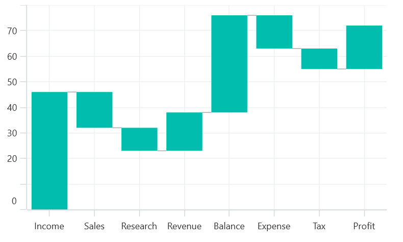
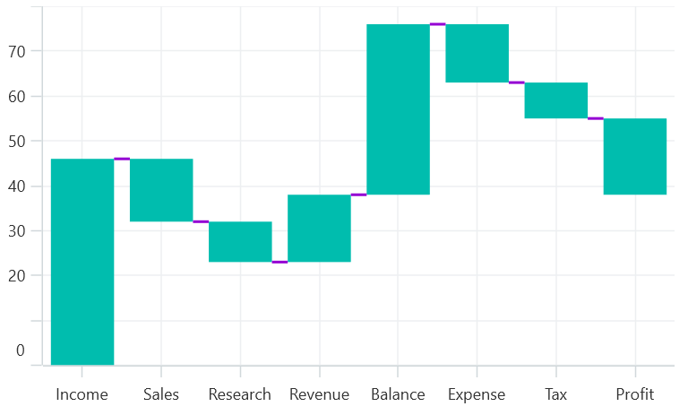

# Waterfall Series in .NET MAUI Chart

## Waterfall Series

[WaterfallSeries]() clarifies the cumulative effect of a set of provided positive and negative values. The series is represented by a rectangle and a connector between the rectangles. To render a waterfall chart, create an instance of [WaterfallSeries](), and add it to the [Series](https://help.syncfusion.com/cr/maui/Syncfusion.Maui.Charts.SfCartesianChart.html#Syncfusion_Maui_Charts_SfCartesianChart_Series) collection property of the [SfCartesianChart](https://help.syncfusion.com/cr/maui/Syncfusion.Maui.Charts.SfCartesianChart.html?tabs=tabid-1)

*`SummaryBindingPath`- gets or sets the string value that indicates the sum of previous segments in the series.

*`SummaryPointsBrush`- Appearance of the summary segment can be differentiated by applying the [SummaryPointsBrush]() in series.

*`NegativePointsBrush`- Appearance of the negative segment can be changed by using the [NegativePointsBrush]() property of series.

*`AllowAutoSum`- The summary segment calculation can be changed by using the [AllowAutoSum]() property. By default, the property is true. When disabling this property, it renders the segment by using the y value of provided ItemsSource collection.

*`ShowConnectorLine`- The connector line of series can be enabled or disabled by using its [ShowConnectorLine]() line property. By default, the property value is true.





    <chart:SfCartesianChart>
        <chart:SfCartesianChart.XAxes>
            <chart:CategoryAxis/>
        </chart:SfCartesianChart.XAxes>

        <chart:SfCartesianChart.YAxes>
            <chart:NumericalAxis/>
        </chart:SfCartesianChart.YAxes>
    
        <chart:SfCartesianChart.Series>
            <chart:WaterfallSeries ItemsSource="{Binding Sales}"
                                   XBindingPath="Department"
                                   YBindingPath="Value"
                                   AllowAutoSum="False"
                                   NegativePointsBrush="Red"
                                   SummaryBindingPath="IsSummary"
                                   SummaryPointsBrush="RoyalBlue"
                                   ShowConnectorLine="True"/>
             </chart:SfCartesianChart.Series>   
    </chart:SfCartesianChart>





    SfCartesianChart chart = new SfCartesianChart();
    CategoryAxis xAxis = new CategoryAxis();
    NumericalAxis yAxis = new NumericalAxis();
    chart.XAxes.Add(xAxis);
    chart.YAxes.Add(yAxis);
   
    ViewModel viewModel = new ViewModel();

    WaterfallSeries series = new WaterfallSeries()
    {
        ItemsSource =new viewModel().Sales;
        XBindingPath = "Department";
        YBindingPath = "Value";
        SummaryBindingPath = "IsSummary";
        SummaryPointsBrush = new SolidColorBrush(Colors.Blue);
        NegativePointsBrush = new SolidColorBrush(Colors.Red);
        AllowAutoSum = False;
        ShowConnectorLine = True;
    }
    
    chart.Series.Add(series);





### Connector line customization

The connector line can be customized by applying the[ConnectorLineStyle]() property of the series.
The following code example illustrates how to apply style for connector line.





        <chart:SfCartesianChart.Series>
            <chart:WaterfallSeries ItemsSource="{Binding Sales}"
                                   XBindingPath="Department"
                                   YBindingPath="Value">
                <chart:WaterfallSeries.ConnectorLineStyle>
                    <chart:ChartLineStyle Stroke="Violet" StrokeWidth=2>
                    </chart:WaterfallSeries.ConnectorLineStyle>
            </chart:WaterfallSeries>
        </chart:SfCartesianChart.Series>   
    




    WaterfallSeries series = new WaterfallSeries()
    {
        ItemsSource =new viewModel().Sales;
        XBindingPath = "Department";
        YBindingPath = "Value"
    };

    WaterfallSeries.ConnectorLineStyle = new ChartLineStyle
    {
        Stroke = new SolidColorBrush(Colors.Violet),
        StrokeThickness = 2
    };

    chart.Series.Add(series);
    




