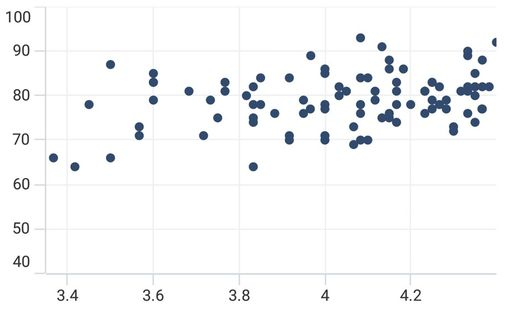
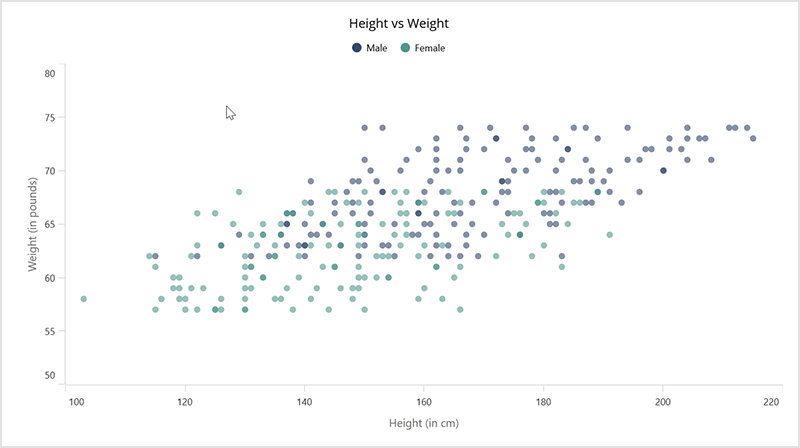

# Zooming and Panning in .NET MAUI Chart

[SfCartesianChart](https://help.syncfusion.com/cr/maui/Syncfusion.Maui.Charts.SfCartesianChart.html?tabs=tabid-1) allows you to zoom the chart area with the help of the zoom feature. This behavior is mostly used to view the data point in the specific area, when there are large number of data points inside the chart.

Zooming and panning provides you to take a close-up look of the data point plotted in the series

## Enable Zooming

To enable the zooming and panning in the chart, create an instance of [ChartZoomPanBehavior](https://help.syncfusion.com/cr/maui/Syncfusion.Maui.Charts.ChartZoomPanBehavior.html?tabs=tabid-1) and set it to the [ZoomPanBehavior](https://help.syncfusion.com/cr/maui/Syncfusion.Maui.Charts.SfCartesianChart.html#Syncfusion_Maui_Charts_SfCartesianChart_ZoomPanBehavior) property of [SfCartesianChart](https://help.syncfusion.com/cr/maui/Syncfusion.Maui.Charts.SfCartesianChart.html?tabs=tabid-1).





<chart:SfCartesianChart>
    ...
<chart:SfCartesianChart.ZoomPanBehavior>
        <chart:ChartZoomPanBehavior />
    </chart:SfCartesianChart.ZoomPanBehavior>
</chart:SfCartesianChart>





SfCartesianChart chart = new SfCartesianChart();
...
ChartZoomPanBehavior zooming = new ChartZoomPanBehavior();
chart.ZoomPanBehavior = zooming;
...





## Zooming the Plot Area

Zooming the plot area can be achieved by pinch zooming, and also using the properties [ZoomFactor](https://help.syncfusion.com/cr/maui/Syncfusion.Maui.Charts.ChartAxis.html#Syncfusion_Maui_Charts_ChartAxis_ZoomFactor) and [ZoomPosition](https://help.syncfusion.com/cr/maui/Syncfusion.Maui.Charts.ChartAxis.html#Syncfusion_Maui_Charts_ChartAxis_ZoomPosition).

### Pinch Zooming

Pinch zooming is enable by using the [EnablePinchZooming](https://help.syncfusion.com/cr/maui/Syncfusion.Maui.Charts.ChartZoomPanBehavior.html#Syncfusion_Maui_Charts_ChartZoomPanBehavior_EnablePinchZooming) property to `true` as shown in the below code snippet.





<chart:SfCartesianChart>
    <chart:SfCartesianChart.ZoomPanBehavior>
        <chart:ChartZoomPanBehavior EnablePinchZooming="True"/>
    </chart:SfCartesianChart.ZoomPanBehavior>
    ...
</chart:SfCartesianChart>





SfCartesianChart chart = new SfCartesianChart();
...
ChartZoomPanBehavior zooming = new ChartZoomPanBehavior()
{
    EnablePinchZooming = true
};

chart.ZoomPanBehavior = zooming;
...





### Directional Zooming

The directional Zooming feature enhances your zooming experience by allowing you to zoom in and out in a specific direction. This feature is enabled by setting the [EnableDirectionalZooming]() property to `true` as shown in the following code sample. The default value of this property is false.





    <chart:SfCartesianChart>
        ...
        <chart:SfCartesianChart.ZoomPanBehavior>
            <chart:ChartZoomPanBehavior EnablePinchZooming="True"
                                        EnableDirectionalZooming="True"/>
        </chart:SfCartesianChart.ZoomPanBehavior>
        ...
    </chart:SfCartesianChart>





    SfCartesianChart chart = new SfCartesianChart();
    ...
    ChartZoomPanBehavior zooming = new ChartZoomPanBehavior()
    {
        EnablePinchZooming = true,
        EnableDirectionalZooming = true
    };

    chart.ZoomPanBehavior = zooming;





T> [EnablePinchZooming](https://help.syncfusion.com/cr/maui/Syncfusion.Maui.Charts.ChartZoomPanBehavior.html#Syncfusion_Maui_Charts_ChartZoomPanBehavior_EnablePinchZooming) should be set as `true`, because directional Zooming relies on the pinch gesture direction.

N> The directional Zooming Feature is not supported in the macOS platform.

### Zooming by setting ZoomFactor and ZoomPosition

[ZoomFactor](https://help.syncfusion.com/cr/maui/Syncfusion.Maui.Charts.ChartAxis.html#Syncfusion_Maui_Charts_ChartAxis_ZoomFactor) defines the percentage of visible range from the total range of axis values. [ZoomPosition](https://help.syncfusion.com/cr/maui/Syncfusion.Maui.Charts.ChartAxis.html#Syncfusion_Maui_Charts_ChartAxis_ZoomPosition) defines the position for ranges of values that need to be displayed as a result of [ZoomFactor](https://help.syncfusion.com/cr/maui/Syncfusion.Maui.Charts.ChartAxis.html#Syncfusion_Maui_Charts_ChartAxis_ZoomFactor). 





<chart:SfCartesianChart>
    <chart:SfCartesianChart.XAxes>
        <chart:CategoryAxis ZoomFactor="0.3"
							ZoomPosition="0.5"/>
    </chart:SfCartesianChart.XAxes>
    ...
</chart:SfCartesianChart>





SfCartesianChart chart = new SfCartesianChart();
CategoryAxis primaryAxis = new CategoryAxis()
{
    ZoomFactor = 0.3,
    ZoomPosition = 0.5
};
chart.XAxes.Add(primaryAxis);
...





## Zooming Mode

The zooming can be done both horizontally and vertically. The zooming direction is defined by using the [ZoomMode](https://help.syncfusion.com/cr/maui/Syncfusion.Maui.Charts.ChartZoomPanBehavior.html#Syncfusion_Maui_Charts_ChartZoomPanBehavior_ZoomMode) property.

Following code example illustrates how to restrict the chart to be zoomed only along horizontal axis.





<chart:SfCartesianChart>
    <chart:SfCartesianChart.ZoomPanBehavior>
        <chart:ChartZoomPanBehavior ZoomMode="X" />
    </chart:SfCartesianChart.ZoomPanBehavior>
    ...
</chart:SfCartesianChart>





SfCartesianChart chart = new SfCartesianChart();
...
ChartZoomPanBehavior zooming = new ChartZoomPanBehavior()
{
    ZoomMode = ZoomMode.X
};

chart.ZoomPanBehavior = zooming;
...





Following code example illustrates how to restrict the chart to be zoomed only along vertical axis.





<chart:SfCartesianChart>
    <chart:SfCartesianChart.ZoomPanBehavior>
        <chart:ChartZoomPanBehavior ZoomMode="Y" />
    </chart:SfCartesianChart.ZoomPanBehavior>
    ...
</chart:SfCartesianChart>





SfCartesianChart chart = new SfCartesianChart();
ChartZoomPanBehavior zooming = new ChartZoomPanBehavior()
{
    ZoomMode = ZoomMode.Y
};

chart.ZoomPanBehavior = zooming;
...





## Enable Panning

Panning feature allows moving the visible area of the chart when it is zoomed in. To enable panning, you have to set [EnablePanning](https://help.syncfusion.com/cr/maui/Syncfusion.Maui.Charts.ChartZoomPanBehavior.html#Syncfusion_Maui_Charts_ChartZoomPanBehavior_EnablePanning) property to `true`.





<chart:SfCartesianChart>
    <chart:SfCartesianChart.ZoomPanBehavior>
        <chart:ChartZoomPanBehavior EnablePanning="True"/>
    </chart:SfCartesianChart.ZoomPanBehavior>
    ...
</chart:SfCartesianChart>





SfCartesianChart chart = new SfCartesianChart();
ChartZoomPanBehavior zooming = new ChartZoomPanBehavior()
{
    EnablePanning = true
};

chart.ZoomPanBehavior = zooming;
...





## Selection zooming

Selection zooming feature allows users to interactively choose a particular area of the chart and zoom in. By specifying [EnableSelectionZooming]() property to `true` as shown in the following code snippet, you can double tap and drag to select a range on the chart to be zoomed in. The default value of this property is false.





<chart:SfCartesianChart>
    <chart:SfCartesianChart.ZoomPanBehavior>
        <chart:ChartZoomPanBehavior EnableSelectionZooming ="True"/>
    </chart:SfCartesianChart.ZoomPanBehavior>
    ...
</chart:SfCartesianChart>





SfCartesianChart chart = new SfCartesianChart();
ChartZoomPanBehavior zooming = new ChartZoomPanBehavior()
{
    EnableSelectionZooming = true
};

chart.ZoomPanBehavior = zooming;
...





### Selection rectangle customization

You can customize the selection rectangle using the below properties.

* [SelectionRectStrokeWidth]() - Gets or sets the stroke width for selection rectangle.

* [SelectionRectStroke]() -  Gets or set the stroke color for selection rectangle.

* [SelectionRectStrokeDashArray]() - Gets or set the stroke dashes for selection rectangle.

* [SelectionRectFill]() - Gets or sets the fill color for the selection rectangle.

### Show trackball axis label
The selection zooming trackball axis label is enabled by setting the [ShowTrackballLabel](https://help.syncfusion.com/cr/maui/Syncfusion.Maui.Charts.ChartAxis.html#Syncfusion_Maui_Charts_ChartAxis_ShowTrackballLabel) property to `true`. The default value of the [ShowTrackballLabel](https://help.syncfusion.com/cr/maui/Syncfusion.Maui.Charts.ChartAxis.html#Syncfusion_Maui_Charts_ChartAxis_ShowTrackballLabel) is `false`. The TrackballLabelStyle[] property provides to customize the trackball axis labels. These options are:

* `Background` - Gets or sets the background color of the labels.
* `CornerRadius` - Gets or sets a value that defines the rounded corners for labels.
* `FontAttributes` - Gets or sets the font style for the label.
* `FontFamily` - Gets or sets the font family name for the label.
* `FontSize` - Gets or sets the font size for the label.
* `Margin` - Gets or sets the margin of the label to customize the appearance of label. 
* `Stroke` - Gets or sets the border stroke color of the labels.
* `StrokeWidth` - Gets or sets the border thickness of the label.
* `TextColor` - Gets or sets the color for the text of the label.
* `LabelFormat` - Gets or sets the label format. This property is used to set numeric or date-time format to the chart axis label.

N> If the axis labels in the selection zooming trackball are cropped or hidden, you should use the [LabelExtent]() property to extend the space between the axis labels and the axis title accordingly.

Following code snippet illustrates how enable to axis trackball label while selection zooming.





<chart:SfCartesianChart>
    . . .
        <chart:SfCartesianChart.XAxes>
            <chart:NumericalAxis ShowTrackballLabel="True">
                <chart:NumericalAxis.TrackballLabelStyle>
                    <chart:ChartLabelStyle Background="LightBlue"   
                              FontSize="15" 
                              CornerRadius="5"
                              StrokeWidth="2" 
                              Stroke="Gray" />
                </chart:NumericalAxis.TrackballLabelStyle>
            </chart:NumericalAxis>
        </chart:SfCartesianChart.XAxes>
        <chart:SfCartesianChart.YAxes>
            <chart:NumericalAxis ShowTrackballLabel="True">
                <chart:NumericalAxis.TrackballLabelStyle>
                    <chart:ChartLabelStyle Background="LightBlue"   
                              FontSize="15" 
                              CornerRadius="5"
                              StrokeWidth="2" 
                              Stroke="Gray" />
                </chart:NumericalAxis.TrackballLabelStyle>
            </chart:NumericalAxis>
        </chart:SfCartesianChart.YAxes>
        
</chart:SfCartesianChart>





SfCartesianChart chart = new SfCartesianChart();
. . .
NumericalAxis primaryAxis = new NumericalAxis();
primaryAxis.ShowTrackballLabel = true;
ChartLabelStyle primaryAxisTrackballLabelStyle = new ChartLabelStyle();
primaryAxisTrackballLabelStyle.Background = Colors.LightBlue;
primaryAxisTrackballLabelStyle.FontSize = 15;
primaryAxisTrackballLabelStyle.CornerRadius = 5;
primaryAxisTrackballLabelStyle.StrokeWidth = 2;
primaryAxisTrackballLabelStyle.Stroke = Colors.Gray;
primaryAxis.TrackballLabelStyle = primaryAxisTrackballLabelStyle;
chart.XAxes.Add(primaryAxis);

NumericalAxis secondaryAxis = new NumericalAxis();
secondaryAxis.ShowTrackballLabel = true;
ChartLabelStyle secondaryAxisTrackballLabelStyle = new ChartLabelStyle();
secondaryAxisTrackballLabelStyle.Background = Colors.LightBlue;
secondaryAxisTrackballLabelStyle.FontSize = 15;
secondaryAxisTrackballLabelStyle.CornerRadius = 5;
secondaryAxisTrackballLabelStyle.StrokeWidth = 2;
secondaryAxisTrackballLabelStyle.Stroke = Colors.Gray;
secondaryAxis.TrackballLabelStyle = secondaryAxisTrackballLabelStyle;
chart.YAxes.Add(secondaryAxis);



