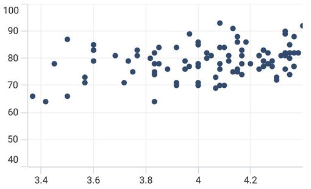
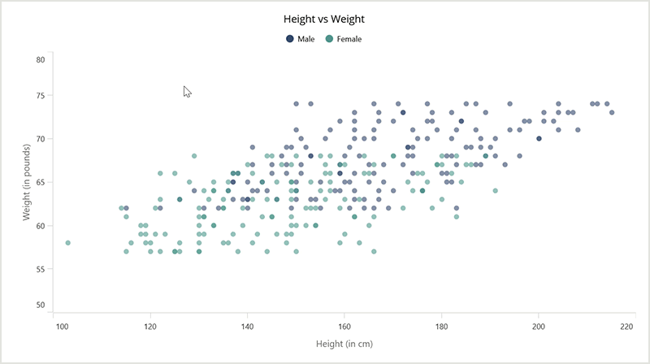

# Zooming and Panning in .NET MAUI Cartesian Chart

[SfCartesianChart](https://help.syncfusion.com/cr/maui/Syncfusion.Maui.Charts.SfCartesianChart.html) allows you to zoom the chart area with the help of the zoom feature. This behavior is mostly used to view the data points in a specific area, when there are a large number of data points inside the chart.

Zooming and panning allow you to take a close-up look at the data points plotted in the series.

N> **Prerequisite:** Ensure that the required NuGet package is installed, the necessary namespaces are imported, and the **SfCartesianChart** control is properly configured in your application. For detailed setup and configuration instructions, refer to the **[Getting Started](https://help.syncfusion.com/maui/cartesian-charts/getting-started)** guide.

## Enable zooming

To enable zooming and panning in the chart, create an instance of [ChartZoomPanBehavior](https://help.syncfusion.com/cr/maui/Syncfusion.Maui.Charts.ChartZoomPanBehavior.html) and set it to the [ZoomPanBehavior](https://help.syncfusion.com/cr/maui/Syncfusion.Maui.Charts.SfCartesianChart.html#Syncfusion_Maui_Charts_SfCartesianChart_ZoomPanBehavior) property of [SfCartesianChart](https://help.syncfusion.com/cr/maui/Syncfusion.Maui.Charts.SfCartesianChart.html).





<chart:SfCartesianChart>
    <!-- code omitted for brevity -->
    <chart:SfCartesianChart.ZoomPanBehavior>
        <chart:ChartZoomPanBehavior/>
    </chart:SfCartesianChart.ZoomPanBehavior>
</chart:SfCartesianChart>





SfCartesianChart chart = new SfCartesianChart();

ChartZoomPanBehavior zooming = new ChartZoomPanBehavior();
chart.ZoomPanBehavior = zooming;
// code omitted for brevity
this.Content = chart;





## Zooming the plot area

Zooming the plot area can be achieved by pinch zooming, and also using the properties [ZoomFactor](https://help.syncfusion.com/cr/maui/Syncfusion.Maui.Charts.ChartAxis.html#Syncfusion_Maui_Charts_ChartAxis_ZoomFactor) and [ZoomPosition](https://help.syncfusion.com/cr/maui/Syncfusion.Maui.Charts.ChartAxis.html#Syncfusion_Maui_Charts_ChartAxis_ZoomPosition).

### Pinch zooming

Pinch zooming is enabled by setting the [EnablePinchZooming](https://help.syncfusion.com/cr/maui/Syncfusion.Maui.Charts.ChartZoomPanBehavior.html#Syncfusion_Maui_Charts_ChartZoomPanBehavior_EnablePinchZooming) property to `true` as shown in the below code snippet. The default value of this property is `true`.





<chart:SfCartesianChart>
    <chart:SfCartesianChart.ZoomPanBehavior>
        <chart:ChartZoomPanBehavior EnablePinchZooming="True"/>
    </chart:SfCartesianChart.ZoomPanBehavior>
    <!-- code omitted for brevity -->
</chart:SfCartesianChart>





SfCartesianChart chart = new SfCartesianChart();

ChartZoomPanBehavior zooming = new ChartZoomPanBehavior()
{
    EnablePinchZooming = true
};

chart.ZoomPanBehavior = zooming;
// code omitted for brevity
this.Content = chart;





### Directional zooming

The directional zooming feature enhances your zooming experience by allowing you to zoom in and out in a specific direction. This feature is enabled by setting the [EnableDirectionalZooming](https://help.syncfusion.com/cr/maui/Syncfusion.Maui.Charts.ChartZoomPanBehavior.html#Syncfusion_Maui_Charts_ChartZoomPanBehavior_EnableDirectionalZooming) property to `true` as shown in the following code sample. The default value of this property is `false`.





<chart:SfCartesianChart>
    <!-- code omitted for brevity -->
    <chart:SfCartesianChart.ZoomPanBehavior>
        <chart:ChartZoomPanBehavior EnablePinchZooming="True"
                                    EnableDirectionalZooming="True"/>
    </chart:SfCartesianChart.ZoomPanBehavior>
</chart:SfCartesianChart>





SfCartesianChart chart = new SfCartesianChart();
// code omitted for brevity
ChartZoomPanBehavior zooming = new ChartZoomPanBehavior()
{
    EnablePinchZooming = true,
    EnableDirectionalZooming = true
};

chart.ZoomPanBehavior = zooming;
this.Content = chart;





T> [EnablePinchZooming](https://help.syncfusion.com/cr/maui/Syncfusion.Maui.Charts.ChartZoomPanBehavior.html#Syncfusion_Maui_Charts_ChartZoomPanBehavior_EnablePinchZooming) should be set to `true`, because directional zooming relies on the pinch gesture direction.

N> The directional zooming feature is not supported on the macOS platform.

### Zooming by setting ZoomFactor and ZoomPosition

[ZoomFactor](https://help.syncfusion.com/cr/maui/Syncfusion.Maui.Charts.ChartAxis.html#Syncfusion_Maui_Charts_ChartAxis_ZoomFactor), of type `double`, defines the percentage of the visible range from the total range of axis values. The default value is `1` (no zoom). [ZoomPosition](https://help.syncfusion.com/cr/maui/Syncfusion.Maui.Charts.ChartAxis.html#Syncfusion_Maui_Charts_ChartAxis_ZoomPosition), of type `double`, defines the position for the range of values that need to be displayed as a result of [ZoomFactor](https://help.syncfusion.com/cr/maui/Syncfusion.Maui.Charts.ChartAxis.html#Syncfusion_Maui_Charts_ChartAxis_ZoomFactor). The default value is `0`.





<chart:SfCartesianChart>
    <chart:SfCartesianChart.XAxes>
        <chart:CategoryAxis ZoomFactor="0.3"
                            ZoomPosition="0.5"/>
    </chart:SfCartesianChart.XAxes>
    <!-- code omitted for brevity -->
</chart:SfCartesianChart>





SfCartesianChart chart = new SfCartesianChart();
CategoryAxis primaryAxis = new CategoryAxis()
{
    ZoomFactor = 0.3,
    ZoomPosition = 0.5
};

chart.XAxes.Add(primaryAxis);
// code omitted for brevity
this.Content = chart;





## Zooming mode

Zooming can be done both horizontally and vertically. The zooming direction is defined by using the [ZoomMode](https://help.syncfusion.com/cr/maui/Syncfusion.Maui.Charts.ChartZoomPanBehavior.html#Syncfusion_Maui_Charts_ChartZoomPanBehavior_ZoomMode) property, which uses the [ZoomMode](https://help.syncfusion.com/cr/maui/Syncfusion.Maui.Charts.ZoomMode.html) enum with the following values. The default value is `XY`:

* `X` - Zooms the chart only along the horizontal (x) axis.
* `Y` - Zooms the chart only along the vertical (y) axis.
* `XY` - Zooms the chart along both axes.

The following code example illustrates how to restrict the chart to be zoomed only along the horizontal axis.





<chart:SfCartesianChart>
    <chart:SfCartesianChart.ZoomPanBehavior>
        <chart:ChartZoomPanBehavior ZoomMode="X"/>
    </chart:SfCartesianChart.ZoomPanBehavior>
    <!-- code omitted for brevity -->
</chart:SfCartesianChart>





SfCartesianChart chart = new SfCartesianChart();
// code omitted for brevity
ChartZoomPanBehavior zooming = new ChartZoomPanBehavior()
{
    ZoomMode = ZoomMode.X
};

chart.ZoomPanBehavior = zooming;

this.Content = chart;





The following code example illustrates how to restrict the chart to be zoomed only along the vertical axis.





<chart:SfCartesianChart>
    <chart:SfCartesianChart.ZoomPanBehavior>
        <chart:ChartZoomPanBehavior ZoomMode="Y"/>
    </chart:SfCartesianChart.ZoomPanBehavior>
    <!-- code omitted for brevity -->
</chart:SfCartesianChart>





SfCartesianChart chart = new SfCartesianChart();
ChartZoomPanBehavior zooming = new ChartZoomPanBehavior()
{
    ZoomMode = ZoomMode.Y
};

chart.ZoomPanBehavior = zooming;
// code omitted for brevity
this.Content = chart;





## Maximum zoom level

The [MaximumZoomLevel](https://help.syncfusion.com/cr/maui/Syncfusion.Maui.Charts.ChartZoomPanBehavior.html#Syncfusion_Maui_Charts_ChartZoomPanBehavior_MaximumZoomLevel), of type `double`, property is used to determine the maximum limit for zooming within the chart. The value represents the maximum magnification factor applied to the visible range (for example, `2` allows zooming in up to twice the default view). Once the zooming operation reaches its limit, further zooming actions are not carried out. The default value of this property is `double.NaN`.





<chart:SfCartesianChart>
    <chart:SfCartesianChart.ZoomPanBehavior>
        <chart:ChartZoomPanBehavior MaximumZoomLevel="2"/>
    </chart:SfCartesianChart.ZoomPanBehavior>
    <!-- code omitted for brevity -->
</chart:SfCartesianChart>





SfCartesianChart chart = new SfCartesianChart();
// code omitted for brevity
ChartZoomPanBehavior zooming = new ChartZoomPanBehavior()
{
    MaximumZoomLevel = 2
};

chart.ZoomPanBehavior = zooming;
// code omitted for brevity
this.Content = chart;





## Enable panning

The panning feature allows moving the visible area of the chart when it is zoomed in. To enable panning, set the [EnablePanning](https://help.syncfusion.com/cr/maui/Syncfusion.Maui.Charts.ChartZoomPanBehavior.html#Syncfusion_Maui_Charts_ChartZoomPanBehavior_EnablePanning) property to `true`. The default value of this property is `true`.





<chart:SfCartesianChart>
    <chart:SfCartesianChart.ZoomPanBehavior>
        <chart:ChartZoomPanBehavior EnablePanning="True"/>
    </chart:SfCartesianChart.ZoomPanBehavior>
    <!-- code omitted for brevity -->
</chart:SfCartesianChart>





SfCartesianChart chart = new SfCartesianChart();
ChartZoomPanBehavior zooming = new ChartZoomPanBehavior()
{
    EnablePanning = true
};

chart.ZoomPanBehavior = zooming;
// code omitted for brevity
this.Content = chart;





## Selection zooming

The selection zooming feature allows users to interactively choose a particular area of the chart and zoom in. By setting the [EnableSelectionZooming](https://help.syncfusion.com/cr/maui/Syncfusion.Maui.Charts.ChartZoomPanBehavior.html#Syncfusion_Maui_Charts_ChartZoomPanBehavior_EnableSelectionZooming) property to `true` as shown in the following code sample, you can double-tap and drag to select a range on the chart to be zoomed in. The default value of this property is `false`.

N> To perform selection zooming on a desktop, hold the left mouse button, double-click, and drag. For mobile, hold your finger, double-click, and drag to create a selection rectangle.





<chart:SfCartesianChart>
    <chart:SfCartesianChart.ZoomPanBehavior>
        <chart:ChartZoomPanBehavior EnableSelectionZooming ="True"/>
    </chart:SfCartesianChart.ZoomPanBehavior>
    <!-- code omitted for brevity -->
</chart:SfCartesianChart>





SfCartesianChart chart = new SfCartesianChart();
ChartZoomPanBehavior zooming = new ChartZoomPanBehavior()
{
    EnableSelectionZooming = true
};

chart.ZoomPanBehavior = zooming;
// code omitted for brevity





### Selection rectangle customization

You can customize the selection rectangle using the following properties, of the [ChartZoomPanBehavior](https://help.syncfusion.com/cr/maui/Syncfusion.Maui.Charts.ChartZoomPanBehavior.html) class:

* [SelectionRectStrokeWidth](https://help.syncfusion.com/cr/maui/Syncfusion.Maui.Charts.ChartZoomPanBehavior.html#Syncfusion_Maui_Charts_ChartZoomPanBehavior_SelectionRectStrokeWidth), of type `double`, describes the stroke width of the selection rectangle.
* [SelectionRectStroke](https://help.syncfusion.com/cr/maui/Syncfusion.Maui.Charts.ChartZoomPanBehavior.html#Syncfusion_Maui_Charts_ChartZoomPanBehavior_SelectionRectStroke), of type `Brush`, describes the stroke color of the selection rectangle.
* [SelectionRectStrokeDashArray](https://help.syncfusion.com/cr/maui/Syncfusion.Maui.Charts.ChartZoomPanBehavior.html#Syncfusion_Maui_Charts_ChartZoomPanBehavior_SelectionRectStrokeDashArray), of type `DoubleCollection`, describes the stroke dashes of the selection rectangle.
* [SelectionRectFill](https://help.syncfusion.com/cr/maui/Syncfusion.Maui.Charts.ChartZoomPanBehavior.html#Syncfusion_Maui_Charts_ChartZoomPanBehavior_SelectionRectFill), of type `Brush`, describes the fill color of the selection rectangle.





<chart:SfCartesianChart>
    <!-- code omitted for brevity -->
    <chart:SfCartesianChart.ZoomPanBehavior>
        <chart:ChartZoomPanBehavior EnableSelectionZooming="True"
                                    SelectionRectStroke="Red"
                                    SelectionRectStrokeWidth="2"
                                    SelectionRectStrokeDashArray="2,2"
                                    SelectionRectFill="#80808080"/>
    </chart:SfCartesianChart.ZoomPanBehavior>
    <!-- code omitted for brevity -->
</chart:SfCartesianChart>





SfCartesianChart chart = new SfCartesianChart();
// code omitted for brevity
ChartZoomPanBehavior zooming = new ChartZoomPanBehavior()
{
    EnableSelectionZooming = true,
    SelectionRectStroke = new SolidColorBrush(Colors.Red),
    SelectionRectStrokeWidth = 2,
    SelectionRectStrokeDashArray = new DoubleCollection() { 2, 2 },
    SelectionRectFill = new SolidColorBrush(Color.FromArgb("#80808080"))
};

chart.ZoomPanBehavior = zooming;
// code omitted for brevity
this.Content = chart;





### Show trackball axis labels
The selection zooming trackball axis labels are enabled by setting the [ShowTrackballLabel](https://help.syncfusion.com/cr/maui/Syncfusion.Maui.Charts.ChartAxis.html#Syncfusion_Maui_Charts_ChartAxis_ShowTrackballLabel) property to `true`. The default value of the [ShowTrackballLabel](https://help.syncfusion.com/cr/maui/Syncfusion.Maui.Charts.ChartAxis.html#Syncfusion_Maui_Charts_ChartAxis_ShowTrackballLabel) is `false`. The [TrackballLabelStyle](https://help.syncfusion.com/cr/maui/Syncfusion.Maui.Charts.ChartAxis.html#Syncfusion_Maui_Charts_ChartAxis_TrackballLabelStyle) property provides customization options for the trackball axis labels, of the [ChartLabelStyle](https://help.syncfusion.com/cr/maui/Syncfusion.Maui.Charts.ChartLabelStyle.html) class:

* [Background](https://help.syncfusion.com/cr/maui/Syncfusion.Maui.Charts.ChartLabelStyle.html#Syncfusion_Maui_Charts_ChartLabelStyle_Background), of type `Brush`, describes the background color of the labels.
* [CornerRadius](https://help.syncfusion.com/cr/maui/Syncfusion.Maui.Charts.ChartLabelStyle.html#Syncfusion_Maui_Charts_ChartLabelStyle_CornerRadius), of type `CornerRadius`, describes the corner radius of the label's border.
* [FontAttributes](https://help.syncfusion.com/cr/maui/Syncfusion.Maui.Charts.ChartLabelStyle.html#Syncfusion_Maui_Charts_ChartLabelStyle_FontAttributes), of type `FontAttributes`, determines the text style.
* [FontFamily](https://help.syncfusion.com/cr/maui/Syncfusion.Maui.Charts.ChartLabelStyle.html#Syncfusion_Maui_Charts_ChartLabelStyle_FontFamily), of type `string`, defines the font family of the label.
* [FontSize](https://help.syncfusion.com/cr/maui/Syncfusion.Maui.Charts.ChartLabelStyle.html#Syncfusion_Maui_Charts_ChartLabelStyle_FontSize), of type `double`, defines the font size of the labels.
* [Margin](https://help.syncfusion.com/cr/maui/Syncfusion.Maui.Charts.ChartLabelStyle.html#Syncfusion_Maui_Charts_ChartLabelStyle_Margin), of type `Thickness`, is used to change the margin of the labels.
* [Stroke](https://help.syncfusion.com/cr/maui/Syncfusion.Maui.Charts.ChartLabelStyle.html#Syncfusion_Maui_Charts_ChartLabelStyle_Stroke), of type `Brush`, describes the border stroke color of the labels.
* [StrokeWidth](https://help.syncfusion.com/cr/maui/Syncfusion.Maui.Charts.ChartLabelStyle.html#Syncfusion_Maui_Charts_ChartLabelStyle_StrokeWidth), of type `double`, defines the border thickness of the label.
* [TextColor](https://help.syncfusion.com/cr/maui/Syncfusion.Maui.Charts.ChartLabelStyle.html#Syncfusion_Maui_Charts_ChartLabelStyle_TextColor), of type `Color`, describes the color of the label's text.
* [LabelFormat](https://help.syncfusion.com/cr/maui/Syncfusion.Maui.Charts.ChartLabelStyle.html#Syncfusion_Maui_Charts_ChartLabelStyle_LabelFormat), of type `string`, defines the label format. This property is used to set a numeric or date-time format for the chart axis label.

N> If the axis labels in the selection zooming trackball are cropped or hidden, use the [LabelExtent](https://help.syncfusion.com/cr/maui/Syncfusion.Maui.Charts.ChartAxis.html#Syncfusion_Maui_Charts_ChartAxis_LabelExtent) property to extend the space between the axis labels and the axis title accordingly.

The following code sample illustrates how to enable axis trackball labels during selection zooming.





<chart:SfCartesianChart>
    <!-- code omitted for brevity -->
    <chart:SfCartesianChart.XAxes>
        <chart:NumericalAxis ShowTrackballLabel="True">
            <chart:NumericalAxis.TrackballLabelStyle>
                <chart:ChartLabelStyle Background="LightBlue"
                                       FontSize="15"
                                       CornerRadius="5"
                                       StrokeWidth="2"
                                       Stroke="Gray"/>
            </chart:NumericalAxis.TrackballLabelStyle>
        </chart:NumericalAxis>
    </chart:SfCartesianChart.XAxes>
    <chart:SfCartesianChart.YAxes>
        <chart:NumericalAxis ShowTrackballLabel="True">
            <chart:NumericalAxis.TrackballLabelStyle>
                <chart:ChartLabelStyle Background="LightBlue"
                                       FontSize="15"
                                       CornerRadius="5"
                                       StrokeWidth="2"
                                       Stroke="Gray"/>
            </chart:NumericalAxis.TrackballLabelStyle>
        </chart:NumericalAxis>
    </chart:SfCartesianChart.YAxes>
    <!-- code omitted for brevity -->
</chart:SfCartesianChart>





SfCartesianChart chart = new SfCartesianChart();
// code omitted for brevity
NumericalAxis primaryAxis = new NumericalAxis();
primaryAxis.ShowTrackballLabel = true;
ChartLabelStyle primaryAxisTrackballLabelStyle = new ChartLabelStyle()
{
    Background = new SolidColorBrush(Colors.LightBlue),
    FontSize = 15,
    CornerRadius = 5,
    StrokeWidth = 2,
    Stroke = new SolidColorBrush(Colors.Gray)
};
primaryAxis.TrackballLabelStyle = primaryAxisTrackballLabelStyle;
chart.XAxes.Add(primaryAxis);

NumericalAxis secondaryAxis = new NumericalAxis();
secondaryAxis.ShowTrackballLabel = true;
ChartLabelStyle secondaryAxisTrackballLabelStyle = new ChartLabelStyle()
{
    Background = new SolidColorBrush(Colors.LightBlue),
    FontSize = 15,
    CornerRadius = 5,
    StrokeWidth = 2,
    Stroke = new SolidColorBrush(Colors.Gray)
};
secondaryAxis.TrackballLabelStyle = secondaryAxisTrackballLabelStyle;
chart.YAxes.Add(secondaryAxis);
// code omitted for brevity
this.Content = chart;





## Events

### ZoomStart

The [ZoomStart](https://help.syncfusion.com/cr/maui/Syncfusion.Maui.Charts.SfCartesianChart.html#Syncfusion_Maui_Charts_SfCartesianChart_ZoomStart) event is triggered when the user initiates a zoom action by using a pinch gesture on the chart. This event can be canceled, allowing its action to be interrupted or stopped.

* [Axis](https://help.syncfusion.com/cr/maui/Syncfusion.Maui.Charts.ChartZoomEventArgs.html#Syncfusion_Maui_Charts_ChartZoomEventArgs_Axis) - The ZoomStart event will be triggered for all the axes within the chart.
* [CurrentZoomFactor](https://help.syncfusion.com/cr/maui/Syncfusion.Maui.Charts.ChartZoomEventArgs.html#Syncfusion_Maui_Charts_ChartZoomEventArgs_CurrentZoomFactor) - Used to get the updated zoom factor of the corresponding axis.
* [CurrentZoomPosition](https://help.syncfusion.com/cr/maui/Syncfusion.Maui.Charts.ChartZoomEventArgs.html#Syncfusion_Maui_Charts_ChartZoomEventArgs_CurrentZoomPosition) - Used to get the updated zoom position of the corresponding axis.
* [Cancel](https://help.syncfusion.com/cr/maui/Syncfusion.Maui.Charts.ChartZoomStartEventArgs.html#Syncfusion_Maui_Charts_ChartZoomStartEventArgs_Cancel) - Used to determine the value indicating whether the zooming process should be cancelled.

### ZoomDelta

The [ZoomDelta](https://help.syncfusion.com/cr/maui/Syncfusion.Maui.Charts.SfCartesianChart.html#Syncfusion_Maui_Charts_SfCartesianChart_ZoomDelta) event is activated during the zooming process, and it is a cancelable event.

* [Axis](https://help.syncfusion.com/cr/maui/Syncfusion.Maui.Charts.ChartZoomEventArgs.html#Syncfusion_Maui_Charts_ChartZoomEventArgs_Axis) - The ZoomDelta event will be triggered for all the axes within the chart.
* [PreviousZoomFactor](https://help.syncfusion.com/cr/maui/Syncfusion.Maui.Charts.ChartZoomDeltaEventArgs.html#Syncfusion_Maui_Charts_ChartZoomDeltaEventArgs_PreviousZoomFactor) - Used to get the previous zoom factor of the axis.
* [PreviousZoomPosition](https://help.syncfusion.com/cr/maui/Syncfusion.Maui.Charts.ChartZoomDeltaEventArgs.html#Syncfusion_Maui_Charts_ChartZoomDeltaEventArgs_PreviousZoomPosition) - Used to get the previous zoom position of the axis.
* [CurrentZoomFactor](https://help.syncfusion.com/cr/maui/Syncfusion.Maui.Charts.ChartZoomEventArgs.html#Syncfusion_Maui_Charts_ChartZoomEventArgs_CurrentZoomFactor) - Used to get the current zoom factor of the axis.
* [CurrentZoomPosition](https://help.syncfusion.com/cr/maui/Syncfusion.Maui.Charts.ChartZoomEventArgs.html#Syncfusion_Maui_Charts_ChartZoomEventArgs_CurrentZoomPosition) - Used to get the current zoom position of the axis.
* [Cancel](https://help.syncfusion.com/cr/maui/Syncfusion.Maui.Charts.ChartZoomDeltaEventArgs.html#Syncfusion_Maui_Charts_ChartZoomDeltaEventArgs_Cancel) - Used to determine the value indicating whether the zooming process should be cancelled.

### ZoomEnd

The [ZoomEnd](https://help.syncfusion.com/cr/maui/Syncfusion.Maui.Charts.SfCartesianChart.html#Syncfusion_Maui_Charts_SfCartesianChart_ZoomEnd) event is triggered once the zooming action finishes.

* [Axis](https://help.syncfusion.com/cr/maui/Syncfusion.Maui.Charts.ChartZoomEventArgs.html#Syncfusion_Maui_Charts_ChartZoomEventArgs_Axis) - The ZoomEnd event will be triggered for all the axes within the chart.
* [CurrentZoomFactor](https://help.syncfusion.com/cr/maui/Syncfusion.Maui.Charts.ChartZoomEventArgs.html#Syncfusion_Maui_Charts_ChartZoomEventArgs_CurrentZoomFactor) - Used to get the zoom factor after zooming process.
* [CurrentZoomPosition](https://help.syncfusion.com/cr/maui/Syncfusion.Maui.Charts.ChartZoomEventArgs.html#Syncfusion_Maui_Charts_ChartZoomEventArgs_CurrentZoomPosition) - Used to get the zoom position after zooming process.

### SelectionZoomStart

The [SelectionZoomStart](https://help.syncfusion.com/cr/maui/Syncfusion.Maui.Charts.SfCartesianChart.html#Syncfusion_Maui_Charts_SfCartesianChart_SelectionZoomStart) event is triggered when the user begins box selection zooming.

* [ZoomRect](https://help.syncfusion.com/cr/maui/Syncfusion.Maui.Charts.ChartSelectionZoomEventArgs.html#Syncfusion_Maui_Charts_ChartSelectionZoomEventArgs_ZoomRect) - Used to get the initial bounds of the box selection. 

### SelectionZoomDelta

The [SelectionZoomDelta](https://help.syncfusion.com/cr/maui/Syncfusion.Maui.Charts.SfCartesianChart.html#Syncfusion_Maui_Charts_SfCartesianChart_SelectionZoomDelta) event is activated during the process of selecting a region for zooming, and it is a cancelable event.

* [ZoomRect](https://help.syncfusion.com/cr/maui/Syncfusion.Maui.Charts.ChartSelectionZoomEventArgs.html#Syncfusion_Maui_Charts_ChartSelectionZoomEventArgs_ZoomRect) - Contains the bounds of the currently selected region.
* [Cancel](https://help.syncfusion.com/cr/maui/Syncfusion.Maui.Charts.ChartSelectionZoomDeltaEventArgs.html#Syncfusion_Maui_Charts_ChartSelectionZoomDeltaEventArgs_Cancel) - Used to set the value indicating whether the box selection zooming process should be cancelled.

### SelectionZoomEnd

The [SelectionZoomEnd](https://help.syncfusion.com/cr/maui/Syncfusion.Maui.Charts.SfCartesianChart.html#Syncfusion_Maui_Charts_SfCartesianChart_SelectionZoomEnd) event is triggered after the selection zooming ends.

* [ZoomRect](https://help.syncfusion.com/cr/maui/Syncfusion.Maui.Charts.ChartSelectionZoomEventArgs.html#Syncfusion_Maui_Charts_ChartSelectionZoomEventArgs_ZoomRect) - Used to obtain the final bounds of the zoomed region.

### Scroll

The [Scroll](https://help.syncfusion.com/cr/maui/Syncfusion.Maui.Charts.SfCartesianChart.html#Syncfusion_Maui_Charts_SfCartesianChart_Scroll) event is triggered during panning, and it is a cancelable event.

* [Axis](https://help.syncfusion.com/cr/maui/Syncfusion.Maui.Charts.ChartScrollEventArgs.html#Syncfusion_Maui_Charts_ChartScrollEventArgs_Axis) - The event will be triggered for all the axes within the chart.
* [ZoomPosition](https://help.syncfusion.com/cr/maui/Syncfusion.Maui.Charts.ChartScrollEventArgs.html#Syncfusion_Maui_Charts_ChartScrollEventArgs_ZoomPosition) - Gets the current zoom position of the axis.
* [Cancel](https://help.syncfusion.com/cr/maui/Syncfusion.Maui.Charts.ChartScrollEventArgs.html#Syncfusion_Maui_Charts_ChartScrollEventArgs_Cancel) - Used to indicate whether the scrolling should be cancelled.

### ResetZoom

The [ResetZoom](https://help.syncfusion.com/cr/maui/Syncfusion.Maui.Charts.SfCartesianChart.html#Syncfusion_Maui_Charts_SfCartesianChart_ResetZoom) event is triggered after the chart is reset by double-tapping.

* [Axis](https://help.syncfusion.com/cr/maui/Syncfusion.Maui.Charts.ChartResetZoomEventArgs.html#Syncfusion_Maui_Charts_ChartResetZoomEventArgs_Axis) - The event will be triggered for all the axes within the chart.
* [PreviousZoomFactor](https://help.syncfusion.com/cr/maui/Syncfusion.Maui.Charts.ChartResetZoomEventArgs.html#Syncfusion_Maui_Charts_ChartResetZoomEventArgs_PreviousZoomFactor) - Used to get the previous zoom factor of the axis.
* [PreviousZoomPosition](https://help.syncfusion.com/cr/maui/Syncfusion.Maui.Charts.ChartResetZoomEventArgs.html#Syncfusion_Maui_Charts_ChartResetZoomEventArgs_PreviousZoomPosition) - Used to get the previous zoom position of the axis.

The following code sample illustrates how to subscribe to the zoom and selection zoom events.





SfCartesianChart chart = new SfCartesianChart();
// code omitted for brevity

chart.ZoomStart += (sender, args) =>
{
    // Handle zoom start
};

chart.ZoomDelta += (sender, args) =>
{
    // Handle zoom delta; set args.Cancel = true to cancel
};

chart.ZoomEnd += (sender, args) =>
{
    // Handle zoom end
};

chart.SelectionZoomStart += (sender, args) =>
{
    // Handle selection zoom start
};

chart.SelectionZoomDelta += (sender, args) =>
{
    // Handle selection zoom delta; set args.Cancel = true to cancel
};

chart.SelectionZoomEnd += (sender, args) =>
{
    // Handle selection zoom end
};

this.Content = chart;



