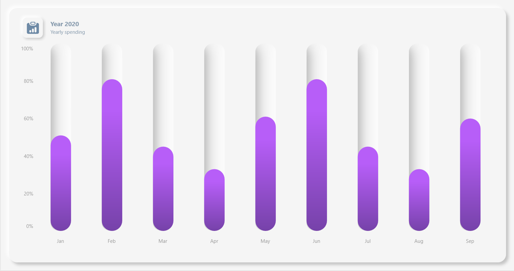

# Neumorphic UI Chart using Syncfusion .NET MAUI Column Chart

Learn to create visually stunning Neumorphic charts in using Syncfusion [.NET MAUI Column Chart](). Follow a step-by-step tutorial utilizing a custom class that inherits from `IDrawable` and `Graphics view` for a seamless blend of design and data representation in your application.

## Step 1: Implementing SfShadowDrawer Class

The `SfShadowDrawer` class is a base class that implements the `IDrawable` interface. It serves as a foundation for creating drawable elements with shadow effects. This class provides properties and methods to control shadow properties, such as offset, blur, color, and opacity.

## Step 2: Implementing Draw Method

Implements the `IDrawable` interface method `Draw`. This method is responsible for drawing the shadow by applying the shadow effect and filling the rounded rectangle.





    public void Draw(ICanvas canvas, RectF dirtyRect)
    {
        double radius = CornerRadius > dirtyRect.Width / 2 ? dirtyRect.Width / 2 : CornerRadius;

        canvas.SaveState();
        canvas.ClipPath(GetDrawPath(dirtyRect, (float)radius));
        DrawShadow(canvas, dirtyRect);
        canvas.RestoreState();
    }





## Step 3: Implement a Method to Apply shadow

Applies the shadow effect to the canvas based on the provided parameters.





    internal void ApplyShadow(ICanvas canvas, RectF dirtyRect, SizeF offset, Color shadowColor, float opacity, double cornerRadius)
    {
        canvas.SaveState();
        canvas.FillColor = BackgroundColor;
        canvas.SetShadow(offset, Blur, shadowColor.WithAlpha(opacity));
        canvas.FillRoundedRectangle(dirtyRect, cornerRadius);
        canvas.RestoreState();
    }




 
## Step 4: Implementing SfNeumorphismDrawer Class

The `SfNeumorphismDrawer` class is a custom drawable class that extends `SfShadowDrawer` and implements the `IDrawable` interface. It is specifically designed for creating a neumorphic (soft shadow) effect in user interfaces. This class provides properties and methods to control various aspects of the neumorphic shadow, such as color, offset, and opacity.

It overrides the `DrawShadow` method from the base class `SfShadowDrawer` to implement the neumorphic shadow drawing logic. The shadow is drawn based on the pressed state, adjusting the offset and shadow positions accordingly.





    protected override void DrawShadow(ICanvas canvas, RectF dirtyRect)
    {
        if (IsPressedState)
        {
            double radius = CornerRadius > dirtyRect.Width / 2 ? dirtyRect.Width / 2 : CornerRadius;
            if (dirtyRect.Width / 3 < radius)
            {
                ApplyShadow(canvas, new RectF(dirtyRect.Left, dirtyRect.Top, -dirtyRect.Width, dirtyRect.Height), Offset, ShadowColor, Opacity, radius);
                ApplyShadow(canvas, new RectF(dirtyRect.Right, dirtyRect.Top, dirtyRect.Width, dirtyRect.Height), LightOffSet, lightShadowColor, LightOpacity, radius);
            }

            else
            {
                ApplyShadow(canvas, new RectF(dirtyRect.Left, dirtyRect.Top, -dirtyRect.Width, dirtyRect.Height), Offset, ShadowColor, Opacity, radius);
                ApplyShadow(canvas, new RectF(dirtyRect.Left - 10, dirtyRect.Top, dirtyRect.Width + 10, -dirtyRect.Height), Offset, ShadowColor, Opacity, radius);
                ApplyShadow(canvas, new RectF(dirtyRect.Right, dirtyRect.Top, dirtyRect.Width, dirtyRect.Height), LightOffSet, lightShadowColor, LightOpacity, radius);
                ApplyShadow(canvas, new RectF(dirtyRect.Left, dirtyRect.Bottom, dirtyRect.Width, dirtyRect.Height), LightOffSet, lightShadowColor, LightOpacity, radius);
            }
        }
        else
        {

            var paddingRect = new RectF() { Left = dirtyRect.Left + Padding, Top = dirtyRect.Top + Padding, Right = dirtyRect.Right - Padding, Bottom = dirtyRect.Bottom - Padding };
            double radius = CornerRadius > paddingRect.Width / 2 ? paddingRect.Width / 2 : CornerRadius;
            ApplyShadow(canvas, paddingRect, Offset, ShadowColor, Opacity, radius);
            ApplyShadow(canvas, paddingRect, LightOffSet, lightShadowColor, LightOpacity, radius);
        }
    }





## Step 5: Implementing a SfNeumorphismView Class

The `SfNeumorphismView` class extends `ContentView` and provides a container for displaying a neumorphic (soft shadow) effect. It includes a `Grid` and a `GraphicsView` for rendering the neumorphic shadow based on the provided `SfNeumorphismDrawer`. Additionally, it exposes properties and methods to manage the drawable content and handle property changes.





    public SfNeumorphismView()
    {
        Drawable = new SfNeumorphismDrawer();

        grid = new Grid();
        grid.Margin = new Thickness(0);

        graphicsView = new GraphicsView();
        graphicsView.Margin = new Thickness(0);
        graphicsView.BackgroundColor = Colors.Transparent;
        graphicsView.SetBinding(GraphicsView.DrawableProperty, new Binding() { Path = nameof(Drawable), Source = this });

        grid.Children.Add(graphicsView);
        base.Content = grid;
    }
    public void Invalidate()
    {
        graphicsView.Invalidate();
    }





## Step 6: Implementing the SfNeumorphismColumnSeries and SfNeumorphismColumnSegment Classes

The `SfNeumorphismColumnSeries` class is a custom implementation of the `ColumnSeries` in the Syncfusion.Maui.Charts library. It introduces a neumorphic (soft shadow) effect to column series by associating a `SfNeumorphismDrawer` with each column segment.

This class overrides the base method to create a custom `SfNeumorphismColumnSegment` instead of the default `ColumnSegment`. Associates the `Drawable` property with the newly created segment.





    public class SfNeumorphismColumnSeries : ColumnSeries
    {
    protected override ChartSegment CreateSegment()
    {
        return new SfNeumorphismColumnSegment(Drawable);
    }
    }





The `SfNeumorphismColumnSegment` class is a custom implementation of the `ColumnSegment` in the Syncfusion.Maui.Charts library. It enhances the default column segment by incorporating a neumorphic shadow effect using the associated `SfNeumorphismDrawer`.

It Overrides the base method to implement custom drawing logic. Draws the neumorphic shadow using the `SfNeumorphismDrawer` associated with the segment.





    public class SfNeumorphismColumnSegment : ColumnSegment
    {
    protected override void Draw(ICanvas canvas)
    {
        if (Series is ColumnSeries series && series.ActualYAxis is NumericalAxis yAxis)
        {
            var top = yAxis.ValueToPoint(Convert.ToDouble(yAxis.Maximum ?? double.NaN));
    
            var trackRect = new RectF() { Left = Left, Top = top, Right = Right, Bottom = Bottom };
    
            Drawable.Draw(canvas, trackRect);
        }
    }
    }





## Step 7: Define Different styles for the Neumorphic Drawer

Defines styles for neumorphic drawers with varying configurations such as outer view, normal, and pressed states. These styles are then referenced throughout the UI for consistent appearance.



{% highlight MainPage.xaml}

    <ContentPage.Resources>
        <control:SfNeumorphismDrawer BackgroundColor="#F5F5F5" Padding="20" LightOpacity="0.8" CornerRadius="20" x:Key="outerViewDrawable">
        </control:SfNeumorphismDrawer>

        <control:SfNeumorphismDrawer BackgroundColor="#F5F5F5" Padding="8" LightOpacity="1" Offset="3,3" 
                                LightOffSet="-4,-4" 
                                CornerRadius="{OnPlatform Android='8',iOS='8',WinUI='10',MacCatalyst='10'}" x:Key="drawable" />

        <control:SfNeumorphismDrawer Blur="40"
                                IsPressedState="True" Opacity="0.3" 
                                LightOpacity="1" CornerRadius="20" 
                                BackgroundColor="#F5F5F5" x:Key="pressedDrawable" />
    </ContentPage.Resources>

{% endhighlight MainPage.xaml}



## Step 8: Applying the styles.



{% highlight MainPage.xaml}

    <control:SfNeumorphismView Drawable="{StaticResource outerViewDrawable}">
        <chart:SfCartesianChart>
            <chart:SfCartesianChart.Title>
                <HorizontalStackLayout HorizontalOptions="Start">
                    <control:SfNeumorphismView Drawable="{StaticResource drawable}">
                    </control:SfNeumorphismView>
                    <VerticalStackLayout Margin="10,0,0,0">
                        <Label Text="Year 2020"/>
                        <Label Text="Yearly spending"/>
                    </VerticalStackLayout>
                </HorizontalStackLayout>
            </chart:SfCartesianChart.Title>

            <chart:SfCartesianChart.Series>
                <control:SfNeumorphismColumnSeries Drawable="{StaticResource pressedDrawable}" ItemsSource="{Binding NeumorphismColumnData}" XBindingPath="Month" YBindingPath="Value">
                </control:SfNeumorphismColumnSeries>
            </chart:SfCartesianChart.Series>
        </chart:SfCartesianChart>
    </control:SfNeumorphismView>

{% endhighlight MainPage.xaml}



Here is the final output of the Syncfusion .NET MAUI Neumorphic Column Chart.

