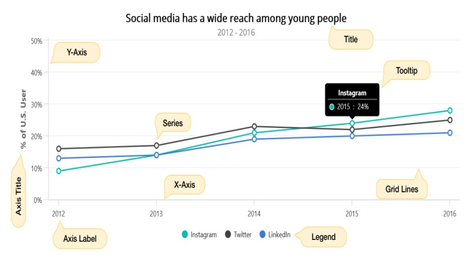

# Visual structure of the .NET MAUI Chart

The following image shows the most common elements of the Cartesian chart.

## Description of the chart elements

* `Title` - The text that will be used to describe the chart's use case. 
* `Legend` - The name of the field described by each series in the chart is listed in the chart legend, which is visible next to the chart plot area (can be placed at the top, right, bottom, or left).
* `Series` - The actual visual representation of data
* `X-Axis` & `Y-Axis`- The value axis and the category axis are used to measure and categorise data.
* `Axis Title` - Description text for axes.
* `Axis Label` - labels on the axes which relate to specific value.
* `Grid Lines` - Grid lines on the chart area that represent specific values.
* `Tooltip` -  A text element known as a tooltip appears when the cursor is over a data point. used to show more details about the point.
