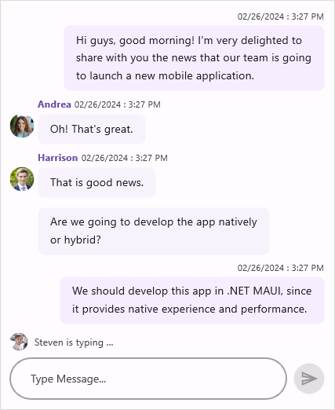

# Maui Chat (SfChat) Overview

The Syncfusion chat control for Maui offers a contemporary conversational chatbot experience, allowing for flexible customization of the layout to display conversations between two or more users.

## Key features

* **Message types:** Built-in support for various message types such as text, calendar, date picker, time picker, and hyperlink to show different types of messages.
* **Message input area:** Send messages to users by interacting with the built-in editor and button at the bottom of the chat control.
* **Time break:** Shows the chat messages under groups based on the `System.DateTime` in which the messages were created.
* **Typing indicator:** Indicates the users of, who are currently typing with an animation.
* **Suggestions :** Add a set of suggestions to be chosen from, as a reply to a user message.

