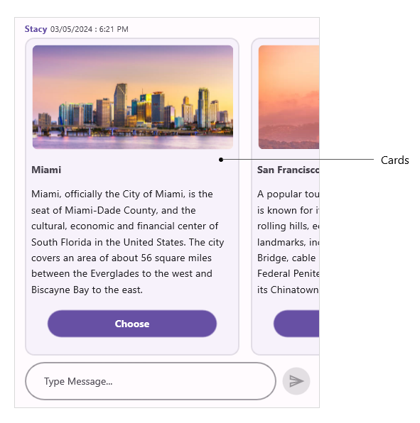
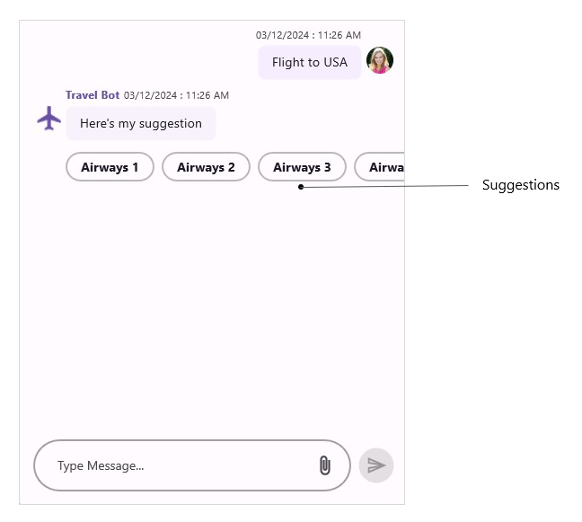

# Accessibility in .NET MAUI Chat (SfChat)

Enhance [SfChat](https://help.syncfusion.com/cr/maui/Syncfusion.Maui.Chat.SfChat.html) accessibility with a user-friendly design, ensuring inclusive features for seamless navigation and usability for all users. Please find the table of elements along with their formats and examples.

## Avatar

<table>
<tr>
<th>Element</th>
<th>Value</th>
</tr>
<tr>
<td>AvatarView</td>
<td>Avatar</td>
</tr>
</table>

## LoadMore

<table>
<tr>
<th>Element</th>
<th>Value</th>
</tr>
<tr>
<td>loadMoreView</td>
<td>Load more button, Double tap to load more messages</td>
</tr>
</table>

## Attachment button

<table>
<tr>
<th>Element</th>
<th>Value</th>
</tr>
<tr>
<td>AttachmentIconView</td>
<td>Attachment Button, Double tap to activate</td>
</tr>
</table>

## Send icon

<table>
<tr>
<th>Element</th>
<th>Value</th>
</tr>
<tr>
<td>SendIconView</td>
<td>Send Button, Double tap to send message</td>
</tr>
</table>

## Calendar

<table>
<tr>
<th>Element</th>
<th>Value</th>
</tr>
<tr>
<td>Calendar View</td>
<td>Calendar</td>
</tr>
</table>

## Cards

<table>
<tr>
<th>Element</th>
<th>Value</th>
</tr>
<tr>
<td>Card View</td>
<td>Cards</td>
</tr>
</table>

## Suggestion

<table>
<tr>
<th>Element</th>
<th>Value</th>
</tr>
<tr>
<td>Suggestions View</td>
<td>Suggestions</td>
</tr>
</table>

