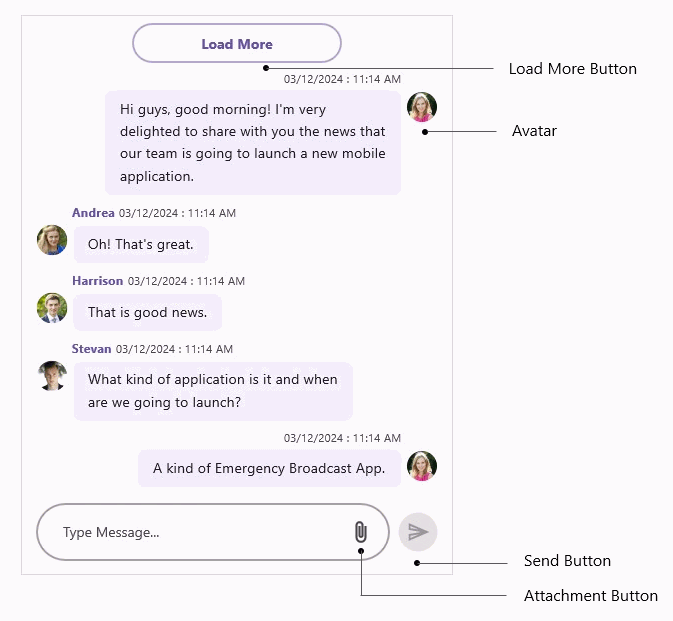
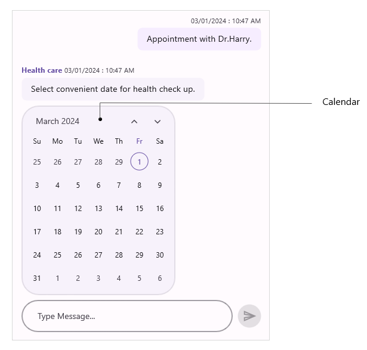

# Accessibility in .NET MAUI Chat (SfChat)

[SfChat](https://help.syncfusion.com/cr/maui/Syncfusion.Maui.Chat.SfChat.html) provides built-in accessibility support, exposing its UI elements to assistive technologies such as screen readers. The following tables list each element along with the value announced by the screen reader.

## Avatar

<table>
<tr>
<th>Element</th>
<th>Value</th>
</tr>
<tr>
<td>AvatarView</td>
<td>Avatar</td>
</tr>
</table>

## LoadMore Button

<table>
<tr>
<th>Element</th>
<th>Value</th>
</tr>
<tr>
<td>LoadMoreView</td>
<td>Load More Button, Double Tap to Load More Messages</td>
</tr>
</table>

## Attachment Button

<table>
<tr>
<th>Element</th>
<th>Value</th>
</tr>
<tr>
<td>AttachmentIconView</td>
<td>Attachment Button, Double Tap to Activate</td>
</tr>
</table>

## Send Icon

<table>
<tr>
<th>Element</th>
<th>Value</th>
</tr>
<tr>
<td>SendIconView</td>
<td>Send Button, Double Tap to Send Message</td>
</tr>
</table>

## Calendar Message

<table>
<tr>
<th>Element</th>
<th>Value</th>
</tr>
<tr>
<td>CalendarView</td>
<td>Calendar</td>
</tr>
</table>

## Card Message

<table>
<tr>
<th>Element</th>
<th>Value</th>
</tr>
<tr>
<td>CardView</td>
<td>Cards</td>
</tr>
</table>

## Suggestion Message

<table>
<tr>
<th>Element</th>
<th>Value</th>
</tr>
<tr>
<td>SuggestionsView</td>
<td>Suggestions</td>
</tr>
</table>

