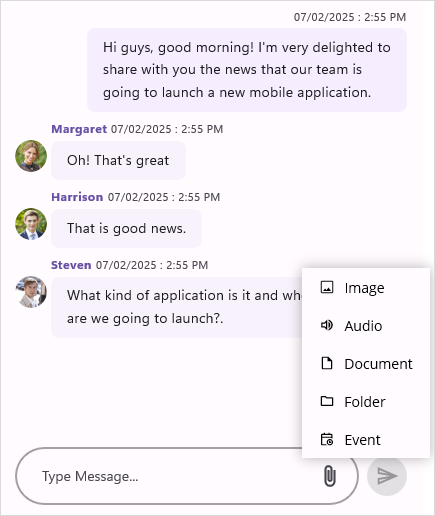

# Attachment button in .NET MAUI Chat (SfChat)

In `SfChat`, you can show the attachment button by setting the [ShowAttachmentButton](https://help.syncfusion.com/cr/maui/Syncfusion.Maui.Chat.SfChat.html#Syncfusion_Maui_Chat_SfChat_ShowAttachmentButton) to `true`.



<?xml version="1.0" encoding="utf-8" ?>
<ContentPage xmlns="http://schemas.microsoft.com/dotnet/2021/maui"
             xmlns:x="http://schemas.microsoft.com/winfx/2009/xaml"
             xmlns:sfChat="clr-namespace:Syncfusion.Maui.Chat;assembly=Syncfusion.Maui.Chat"
             xmlns:local="clr-namespace:AttachmentButton"
             x:Class="AttachmentButton.MainPage">
    <ContentPage.BindingContext>
        <local:ViewModel/>
    </ContentPage.BindingContext>
    <ContentPage.Content>
        <sfChat:SfChat x:Name="chat" 
                       ShowAttachmentButton="True"
                       CurrentUser="{Binding CurrentUser}" 
                       Messages="{Binding Messages}">
        </sfChat:SfChat>
    </ContentPage.Content>
</ContentPage>




public partial class MainPage : ContentPage
{      
    SfChat sfChat;
    ViewModel viewModel = new ViewModel();
    public MainPage()
    {
        InitializeComponent();
        sfChat.Messages = viewModel.Messages;
        sfChat.CurrentUser = viewModel.CurrentUser;
        sfChat.ShowAttachmentButton = true;
        this.Content = sfChat;
    }
}




## Event and command

The [AttachmentButtonClicked](https://help.syncfusion.com/cr/maui/Syncfusion.Maui.Chat.SfChat.html#Syncfusion_Maui_Chat_SfChat_AttachmentButtonClicked) event and [AttachmentButtonCommand](https://help.syncfusion.com/cr/maui/Syncfusion.Maui.Chat.SfChat.html#Syncfusion_Maui_Chat_SfChat_AttachmentButtonCommand) will be executed upon tapping the attachment button. You can pass parameter to the `AttachmentButtonCommand` using the [AttachmentButtonCommandParameter](https://help.syncfusion.com/cr/maui/Syncfusion.Maui.Chat.SfChat.html#Syncfusion_Maui_Chat_SfChat_AttachmentButtonCommandParameter). You can provide options for the users to upload files, images, pdf and other media as messages in SfChat from the event handler and action of the `AttachmentButtonClicked` event and `AttachmentButtonCommand` respectively.

**AttachmentButtonClicked Event**



<?xml version="1.0" encoding="utf-8" ?>
<ContentPage xmlns="http://schemas.microsoft.com/dotnet/2021/maui"
             xmlns:x="http://schemas.microsoft.com/winfx/2009/xaml"
             xmlns:sfChat="clr-namespace:Syncfusion.Maui.Chat;assembly=Syncfusion.Maui.Chat"
             xmlns:local="clr-namespace:AttachmentButton"
             x:Class="AttachmentButton.MainPage">
    <ContentPage.BindingContext>
        <local:ViewModel/>
    </ContentPage.BindingContext>
    <ContentPage.Content>
        <sfChat:SfChat x:Name="chat" 
                       ShowAttachmentButton="True"
                       CurrentUser="{Binding CurrentUser}" 
                       Messages="{Binding Messages}"
                       AttachmentButtonClicked="Chat_AttachmentButtonClicked">
        </sfChat:SfChat>
    </ContentPage.Content>
</ContentPage>






 public partial class MainPage : ContentPage
 {
     public MainPage()
     {
         InitializeComponent();
     }

     private void chat_AttachmentButtonClicked(object sender, EventArgs e)
     {
         this.chat.Messages.Add(new ImageMessage()
         {
             Source = "Car1.jpg",
             Author = new Author() { Name = "Andrea", Avatar = "People_Circle23.png" },
             Text = "Sports Car Type-1",
         }) ;
     }
 }




**AttachmentButtonCommand**



<?xml version="1.0" encoding="utf-8" ?>
<ContentPage xmlns="http://schemas.microsoft.com/dotnet/2021/maui"
             xmlns:x="http://schemas.microsoft.com/winfx/2009/xaml"
             xmlns:sfChat="clr-namespace:Syncfusion.Maui.Chat;assembly=Syncfusion.Maui.Chat"
             xmlns:local="clr-namespace:AttachmentButton"
             x:Class="AttachmentButton.MainPage">
    <ContentPage.BindingContext>
        <local:ViewModel/>
    </ContentPage.BindingContext>
    <ContentPage.Content>
            <sfChat:SfChat x:Name="chat"
                           Messages="{Binding Messages}"
                           CurrentUser="{Binding CurrentUser}"
                           ShowAttachmentButton="True"
                           AttachmentButtonCommand="{Binding AttachmentButtonCommand}">
        </sfChat:SfChat>
    </ContentPage.Content>
</ContentPage>





...
public ICommand AttachmentButtonCommand { get; set; }

public ViewModel()
{
    this.messages = new ObservableCollection<object>();
    this.CurrentUser = new Author() { Name = "Nancy" };
    AttachmentButtonCommand = new Command(Tapped);
    this.GenerateMessages();
}

private void Tapped(object args)
{
    //Adding an image message to the chat.
    this.Messages.Add(new ImageMessage()
    {
        Source = "Car1.jpg",
        Author = new Author() { Name = "Andrea", Avatar = "People_Circle23.png" },
        Text = "Sports Car Type-1",
    });
}
...




## Attachment button template 

In SfChat, you can load custom view or buttons as attachment button using [AttachmentButtonTemplate](https://help.syncfusion.com/cr/maui/Syncfusion.Maui.Chat.SfChat.html#Syncfusion_Maui_Chat_SfChat_AttachmentButtonTemplate) property. You can also specify the width of your template view to load more than one button.



<?xml version="1.0" encoding="utf-8" ?>
<ContentPage xmlns="http://schemas.microsoft.com/dotnet/2021/maui"
             xmlns:x="http://schemas.microsoft.com/winfx/2009/xaml"
             xmlns:sfChat="clr-namespace:Syncfusion.Maui.Chat;assembly=Syncfusion.Maui.Chat"
             xmlns:local="clr-namespace:AttachmentButton"
             x:Class="AttachmentButton.MainPage">
    <ContentPage.BindingContext>
        <local:ChatViewModel/>
    </ContentPage.BindingContext>
        <ContentPage.Content>
        <sfChat:SfChat x:Name="chat" 
                       ShowAttachmentButton="True"
                       CurrentUser="{Binding CurrentUser}" 
                       Messages="{Binding Messages}">
            <sfChat:SfChat.AttachmentButtonTemplate>
                <DataTemplate>
                     <StackLayout WidthRequest="58" HeightRequest="17" Orientation="Horizontal">
                            <Image Source="AttachmentIcon.jpg" WidthRequest="22" HeightRequest="17" Margin="0,0,8,0"/>
                            <Image Source="CameraIcon.jpg" WidthRequest="22" HeightRequest="17"/>
                     </StackLayout>
                </DataTemplate>
            </sfChat:SfChat.AttachmentButtonTemplate>
        </sfChat:SfChat>
    </ContentPage.Content>
</ContentPage>




public partial class MainPage : ContentPage
{
    DataTemplate attachmentDataTemplate;
    Image image = new Image();
    SfChat sfChat = new SfChat();
    ChatViewModel viewModel = new ChatViewModel();
    public MainPage()
    {
        InitializeComponent();
        sfChat.Messages = viewModel.Messages;
        sfChat.CurrentUser = viewModel.CurrentUser;
        sfChat.ShowAttachmentButton = true;
        attachmentDataTemplate = new DataTemplate(() =>
        {
            StackLayout layout = new StackLayout();
            
            Image cameraImage = new Image();
            cameraImage.Source = "CameraIcon.jpg";
            cameraImage.WidthRequest = 22;
            cameraImage.HeightRequest = 17;

            Image attachmentImage = new Image();
            attachmentImage.Source = AttachmentIcon.jpg;
            attachmentImage.WidthRequest = 22;
            attachmentImage.HeightRequest = 17;
            attachmentImage.Margin = new Thickness(0,0,8,0);          

            layout.Orientation =StackOrientation.Horizontal;
            layout.HeightRequest = 17;
            layout.WidthRequest = 58;
            
            layout.Children.Add(attachmentImage);
            layout.Children.Add(cameraImage);
            return layout;
        });
        sfChat.AttachmentButtonTemplate = attachmentDataTemplate;
        this.Content = sfChat;
    }
}




## Attach image from gallery in .NET MAUI Chat

You can add the desired image in to the chat by opening the device’s gallery when attachment button is tapped. You can download the entire project demo of adding an image from gallery in to `SfChat` from GitHub here.

