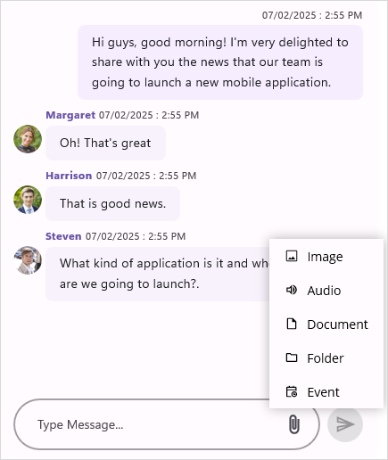

# Attachment button in .NET MAUI Chat (SfChat)

In `SfChat`, you can show the attachment button by setting the [ShowAttachmentButton](https://help.syncfusion.com/cr/maui/Syncfusion.Maui.Chat.SfChat.html#Syncfusion_Maui_Chat_SfChat_ShowAttachmentButton) property to `true`. The default value of `ShowAttachmentButton` is `false`, so the attachment button is hidden until you opt in.

N> `ShowAttachmentButton`, `AttachmentButtonClicked`, `AttachmentButtonCommand`, `AttachmentButtonCommandParameter`, and `AttachmentButtonTemplate` are available starting in Syncfusion® MAUI Chat (`SfChat`) v25.2.7 and later.



<?xml version="1.0" encoding="utf-8" ?>
<ContentPage xmlns="http://schemas.microsoft.com/dotnet/2021/maui"
             xmlns:x="http://schemas.microsoft.com/winfx/2009/xaml"
             xmlns:sfChat="clr-namespace:Syncfusion.Maui.Chat;assembly=Syncfusion.Maui.Chat"
             xmlns:local="clr-namespace:AttachmentButton"
             x:Class="AttachmentButton.MainPage">
    <ContentPage.BindingContext>
        <local:ViewModel/>
    </ContentPage.BindingContext>
    <ContentPage.Content>
        <sfChat:SfChat x:Name="chat" 
                       ShowAttachmentButton="True"
                       CurrentUser="{Binding CurrentUser}" 
                       Messages="{Binding Messages}">
        </sfChat:SfChat>
    </ContentPage.Content>
</ContentPage>





using Syncfusion.Maui.Chat;

namespace AttachmentButton
{
    public partial class MainPage : ContentPage
    {      
        SfChat sfChat = new SfChat();
        ViewModel viewModel = new ViewModel();
        public MainPage()
        {
            InitializeComponent();
            sfChat.Messages = viewModel.Messages;
            sfChat.CurrentUser = viewModel.CurrentUser;
            sfChat.ShowAttachmentButton = true;
            this.Content = sfChat;
        }
    }
}







public class ViewModel : INotifyPropertyChanged
{
    private ObservableCollection<object> messages;
    private Author currentUser;

    public Author CurrentUser
    {
        get { return this.currentUser; }
        set { this.currentUser = value; RaisePropertyChanged("CurrentUser"); }
    }

    public ObservableCollection<object> Messages
    {
        get { return this.messages; }
        set { this.messages = value; }
    }

    public ViewModel()
    {
        this.Messages = new ObservableCollection<object>();
        this.CurrentUser = new Author() { Name = "Nancy" };
        this.GenerateMessages();
    }

    public event PropertyChangedEventHandler? PropertyChanged;
    public void RaisePropertyChanged(string propName)
    {
        if (PropertyChanged != null)
            PropertyChanged(this, new PropertyChangedEventArgs(propName));
    }

    private void GenerateMessages()
    {
        this.Messages.Add(new TextMessage()
        {
            Author = this.CurrentUser,
            Text = "Hi guys, good morning!",
        });
    }
}




N> Place the image assets (`Car1.jpg`, `People_Circle23.png`, `AttachmentIcon.jpg`, `CameraIcon.jpg`) in the `Resources/Images` folder of your .NET MAUI project.

## Event and command

The [AttachmentButtonClicked](https://help.syncfusion.com/cr/maui/Syncfusion.Maui.Chat.SfChat.html#Syncfusion_Maui_Chat_SfChat_AttachmentButtonClicked) event and [AttachmentButtonCommand](https://help.syncfusion.com/cr/maui/Syncfusion.Maui.Chat.SfChat.html#Syncfusion_Maui_Chat_SfChat_AttachmentButtonCommand) will be executed upon tapping the attachment button. The event uses the standard `EventHandler` signature — the `sender` argument is the `SfChat` instance, and the `EventArgs` payload carries no additional data. You can pass a parameter to the `AttachmentButtonCommand` using the [AttachmentButtonCommandParameter](https://help.syncfusion.com/cr/maui/Syncfusion.Maui.Chat.SfChat.html#Syncfusion_Maui_Chat_SfChat_AttachmentButtonCommandParameter). You can provide options for users to upload files, images, PDF, and other media as messages in SfChat from the `AttachmentButtonClicked` event handler and the `AttachmentButtonCommand` action.

In the examples below, the uploaded media is added to the chat as an [ImageMessage](https://help.syncfusion.com/cr/maui/Syncfusion.Maui.Chat.ImageMessage.html), which is a message type that renders an image with an optional caption via the `Text` property.

N> The attachment button, its event, command, and template behave consistently on all supported platforms (Android, iOS, Windows, and macOS (Mac Catalyst)). No platform-specific code is required to display or respond to the button.

**AttachmentButtonClicked Event**



<?xml version="1.0" encoding="utf-8" ?>
<ContentPage xmlns="http://schemas.microsoft.com/dotnet/2021/maui"
             xmlns:x="http://schemas.microsoft.com/winfx/2009/xaml"
             xmlns:sfChat="clr-namespace:Syncfusion.Maui.Chat;assembly=Syncfusion.Maui.Chat"
             xmlns:local="clr-namespace:AttachmentButton"
             x:Class="AttachmentButton.MainPage">
    <ContentPage.BindingContext>
        <local:ViewModel/>
    </ContentPage.BindingContext>
    <ContentPage.Content>
        <sfChat:SfChat x:Name="chat" 
                       ShowAttachmentButton="True"
                       CurrentUser="{Binding CurrentUser}" 
                       Messages="{Binding Messages}"
                       AttachmentButtonClicked="Chat_AttachmentButtonClicked">
        </sfChat:SfChat>
    </ContentPage.Content>
</ContentPage>







using Syncfusion.Maui.Chat;

namespace AttachmentButton
{
    public partial class MainPage : ContentPage
    {
        public MainPage()
        {
            InitializeComponent();
        }

        private void Chat_AttachmentButtonClicked(object sender, EventArgs e)
        {
            this.chat.Messages.Add(new ImageMessage()
            {
                Source = "Car1.jpg",
                Author = new Author() { Name = "Andrea", Avatar = "People_Circle23.png" },
                Text = "Sports Car Type-1",
            }) ;
        }
    }
}




**AttachmentButtonCommand**



<?xml version="1.0" encoding="utf-8" ?>
<ContentPage xmlns="http://schemas.microsoft.com/dotnet/2021/maui"
             xmlns:x="http://schemas.microsoft.com/winfx/2009/xaml"
             xmlns:sfChat="clr-namespace:Syncfusion.Maui.Chat;assembly=Syncfusion.Maui.Chat"
             xmlns:local="clr-namespace:AttachmentButton"
             x:Class="AttachmentButton.MainPage">
    <ContentPage.BindingContext>
        <local:ViewModel/>
    </ContentPage.BindingContext>
    <ContentPage.Content>
            <sfChat:SfChat x:Name="chat"
                           Messages="{Binding Messages}"
                           CurrentUser="{Binding CurrentUser}"
                           ShowAttachmentButton="True"
                           AttachmentButtonCommand="{Binding AttachmentButtonCommand}">
        </sfChat:SfChat>
    </ContentPage.Content>
</ContentPage>






using System.ComponentModel;
using System.Windows.Input;
using System.Collections.ObjectModel;
using Syncfusion.Maui.Chat;

public class ViewModel : INotifyPropertyChanged
{
    private ObservableCollection<object> messages;
    private Author currentUser;

    public ICommand AttachmentButtonCommand { get; set; }

    public Author CurrentUser
    {
        get { return this.currentUser; }
        set { this.currentUser = value; RaisePropertyChanged("CurrentUser"); }
    }

    public ObservableCollection<object> Messages
    {
        get { return this.messages; }
        set { this.messages = value; }
    }

    public ViewModel()
    {
        this.messages = new ObservableCollection<object>();
        this.CurrentUser = new Author() { Name = "Nancy" };
        this.AttachmentButtonCommand = new Command(Tapped);
        this.GenerateMessages();
    }

    public event PropertyChangedEventHandler? PropertyChanged;
    public void RaisePropertyChanged(string propName)
    {
        if (PropertyChanged != null)
            PropertyChanged(this, new PropertyChangedEventArgs(propName));
    }

    private void GenerateMessages()
    {
        this.Messages.Add(new TextMessage()
        {
            Author = this.CurrentUser,
            Text = "Hi guys, good morning!",
        });
    }

    private void Tapped()
    {
        //Adding an image message to the chat.
        this.Messages.Add(new ImageMessage()
        {
            Source = "Car1.jpg",
            Author = new Author() { Name = "Andrea", Avatar = "People_Circle23.png" },
            Text = "Sports Car Type-1",
        });
    }
}




**AttachmentButtonCommandParameter**

Pass a value to the `AttachmentButtonCommand` by binding it to the `AttachmentButtonCommandParameter` property. The parameter is forwarded to the command's `Execute` method.



<?xml version="1.0" encoding="utf-8" ?>
<ContentPage xmlns="http://schemas.microsoft.com/dotnet/2021/maui"
             xmlns:x="http://schemas.microsoft.com/winfx/2009/xaml"
             xmlns:sfChat="clr-namespace:Syncfusion.Maui.Chat;assembly=Syncfusion.Maui.Chat"
             xmlns:local="clr-namespace:AttachmentButton"
             x:Class="AttachmentButton.MainPage">
    <ContentPage.BindingContext>
        <local:ViewModel/>
    </ContentPage.BindingContext>
    <ContentPage.Content>
        <sfChat:SfChat x:Name="chat"
                       Messages="{Binding Messages}"
                       CurrentUser="{Binding CurrentUser}"
                       ShowAttachmentButton="True"
                       AttachmentButtonCommand="{Binding AttachmentButtonCommand}"
                       AttachmentButtonCommandParameter="Attach">
        </sfChat:SfChat>
    </ContentPage.Content>
</ContentPage>






using System.ComponentModel;
using System.Windows.Input;
using System.Collections.ObjectModel;
using Syncfusion.Maui.Chat;

public class ViewModel : INotifyPropertyChanged
{
    private ObservableCollection<object> messages;
    private Author currentUser;

    public ICommand AttachmentButtonCommand { get; set; }

    public Author CurrentUser { get { return this.currentUser; } set { this.currentUser = value; RaisePropertyChanged("CurrentUser"); } }
    public ObservableCollection<object> Messages { get { return this.messages; } set { this.messages = value; } }

    public ViewModel()
    {
        this.messages = new ObservableCollection<object>();
        this.CurrentUser = new Author() { Name = "Nancy" };
        this.AttachmentButtonCommand = new Command<string>(Tapped);
        this.GenerateMessages();
    }

    public event PropertyChangedEventHandler? PropertyChanged;
    public void RaisePropertyChanged(string propName)
    {
        if (PropertyChanged != null)
            PropertyChanged(this, new PropertyChangedEventArgs(propName));
    }

    private void GenerateMessages()
    {
        this.Messages.Add(new TextMessage()
        {
            Author = this.CurrentUser,
            Text = "Hi guys, good morning!",
        });
    }

    private void Tapped(string parameter)
    {
        //The 'parameter' argument receives the value of AttachmentButtonCommandParameter ("Attach").
        this.Messages.Add(new ImageMessage()
        {
            Source = "Car1.jpg",
            Author = new Author() { Name = "Andrea", Avatar = "People_Circle23.png" },
            Text = parameter,
        });
    }
}




## Attachment button template

In SfChat, you can load a custom view or buttons as the attachment button using the [AttachmentButtonTemplate](https://help.syncfusion.com/cr/maui/Syncfusion.Maui.Chat.SfChat.html#Syncfusion_Maui_Chat_SfChat_AttachmentButtonTemplate) property. The template accepts any single .NET MAUI `View` (for example, a `StackLayout`, `Grid`, `Image`, or `Button`) and is hosted in the composer area next to the message input box.

N> **Template expectations:**
> - The template's `BindingContext` is the `SfChat` instance, not the `ViewModel` bound to the page.
> - Use a layout (such as `StackLayout` or `Grid`) when you want to host more than one child view.
> - The built-in default attachment icon occupies a width of 22 device-independent units. To host two icons with spacing (for example, an attachment icon plus a camera icon) without clipping, set the template root's `WidthRequest` to roughly **2 × 22 + spacing**. The `58` used in the sample below accommodates two 22-unit icons plus an 8-unit margin between them with a small safety buffer.
> - Tap handling for the custom view is not wired up automatically; attach a `TapGestureRecognizer` (or use a `Button`) on the children if you need a click action.



<?xml version="1.0" encoding="utf-8" ?>
<ContentPage xmlns="http://schemas.microsoft.com/dotnet/2021/maui"
             xmlns:x="http://schemas.microsoft.com/winfx/2009/xaml"
             xmlns:sfChat="clr-namespace:Syncfusion.Maui.Chat;assembly=Syncfusion.Maui.Chat"
             xmlns:local="clr-namespace:AttachmentButton"
             x:Class="AttachmentButton.MainPage">
    <ContentPage.BindingContext>
        <local:ViewModel/>
    </ContentPage.BindingContext>
    <ContentPage.Content>
        <sfChat:SfChat x:Name="chat"
                       ShowAttachmentButton="True"
                       CurrentUser="{Binding CurrentUser}"
                       Messages="{Binding Messages}">
            <sfChat:SfChat.AttachmentButtonTemplate>
                <DataTemplate>
                    <StackLayout WidthRequest="58" HeightRequest="17" Orientation="Horizontal">
                        <Image Source="AttachmentIcon.jpg" WidthRequest="22" HeightRequest="17" Margin="0,0,8,0"/>
                        <Image Source="CameraIcon.jpg" WidthRequest="22" HeightRequest="17"/>
                    </StackLayout>
                </DataTemplate>
            </sfChat:SfChat.AttachmentButtonTemplate>
        </sfChat:SfChat>
    </ContentPage.Content>
</ContentPage>





using Syncfusion.Maui.Chat;

namespace AttachmentButton
{
    public partial class MainPage : ContentPage
    {
        DataTemplate attachmentDataTemplate;
        Image image = new Image();
        SfChat sfChat = new SfChat();
        ViewModel viewModel = new ViewModel();
        public MainPage()
        {
            InitializeComponent();
            sfChat.Messages = viewModel.Messages;
            sfChat.CurrentUser = viewModel.CurrentUser;
            sfChat.ShowAttachmentButton = true;
            attachmentDataTemplate = new DataTemplate(() =>
            {
                StackLayout layout = new StackLayout();

                Image cameraImage = new Image();
                cameraImage.Source = "CameraIcon.jpg";
                cameraImage.WidthRequest = 22;
                cameraImage.HeightRequest = 17;

                Image attachmentImage = new Image();
                attachmentImage.Source = "AttachmentIcon.jpg";
                attachmentImage.WidthRequest = 22;
                attachmentImage.HeightRequest = 17;
                attachmentImage.Margin = new Thickness(0,0,8,0);

                layout.Orientation =StackOrientation.Horizontal;
                layout.HeightRequest = 17;
                layout.WidthRequest = 58;

                layout.Children.Add(attachmentImage);
                layout.Children.Add(cameraImage);
                return layout;
            });
            sfChat.AttachmentButtonTemplate = attachmentDataTemplate;
            this.Content = sfChat;
        }
    }
}




## Attach image from gallery in .NET MAUI Chat

You can add the desired image in to the chat by opening the device’s gallery when attachment button is tapped.

N> [View Sample in GitHub](https://github.com/SyncfusionExamples/how-to-attach-image-from-gallery-in-.net-maui-chat)
