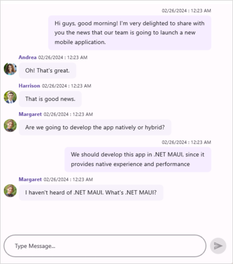

# Getting Started with .NET MAUI Chat

This section guides you through setting up and configuring a [Chat](https://help.syncfusion.com/cr/maui/Syncfusion.Maui.Chat.SfChat.html) in your .NET MAUI application. Follow the steps below to add a basic Chat to your project.

To quickly get started with the .NET MAUI Chat, watch this video:

 <iframe id='MAUIChatVideoTutorial' src='https://www.youtube.com/embed/Ha9jx1bq2Ws'></iframe>




## Prerequisites
Before proceeding, ensure the following are in place:

 1. Install [.NET 9 SDK](https://dotnet.microsoft.com/en-us/download/dotnet/9.0) or later.
 2. Set up a .NET MAUI environment with Visual Studio 2026 (v18.0.0 or later).

## Step 1: Create a .NET MAUI project

1. Go to **File > New > Project** and choose the **.NET MAUI App** template.
2. Name the project and choose a location. Then, click **Next.**
3. Select the .NET framework version and click **Create.**
 
## Step 2: Install the Syncfusion® MAUI Chat NuGet package
 
 1. In **Solution Explorer**, right-click the project and choose **Manage NuGet Packages**.
 2. Search for [Syncfusion.Maui.Chat](https://www.nuget.org/packages/Syncfusion.Maui.Chat) and install the latest version.
 3. Ensure the necessary dependencies are installed correctly, and the project is restored.
 
## Step 3: Register the handler

The [Syncfusion.Maui.Core](https://www.nuget.org/packages/Syncfusion.Maui.Core) is a dependent package for all the Syncfusion controls of .NET MAUI. In the `MauiProgram.cs` file, register the handler for Syncfusion core.



    using Microsoft.Maui.Controls.Hosting;
    using Microsoft.Maui.Controls.Xaml;
    using Microsoft.Maui.Hosting;
    using Syncfusion.Maui.Core.Hosting;

    namespace GettingStarted
    {
      public class MauiProgram 
      {
        public static MauiApp CreateMauiApp()
        {
            var builder = MauiApp.CreateBuilder();
            builder
            .UseMauiApp<App>()
            .ConfigureFonts(fonts =>
            {
              fonts.AddFont("OpenSans-Regular.ttf", "OpenSansRegular");
            });

            builder.ConfigureSyncfusionCore();
            return builder.Build();
          }
        }
     }

 


## Step 4: Add a basic chat

 1. To initialize the control, import the `Syncfusion.Maui.Chat` namespace into your code.
 2. Initialize [SfChat](https://help.syncfusion.com/cr/maui/Syncfusion.Maui.Chat.SfChat.html).




    <ContentPage> 
      . . .
      xmlns:syncfusion="clr-namespace:Syncfusion.Maui.Chat;assembly=Syncfusion.Maui.Chat">
      <syncfusion:SfChat />
    </ContentPage>




    using Syncfusion.Maui.Chat;
    . . .

    public partial class MainPage : ContentPage
    {
        public MainPage()
        {
          InitializeComponent();
          SfChat chat = new SfChat();
          this.Content = chat;
        }
    }




## Step 5: Define the view model

The `SfChat` control is data-bound and displays a collection of messages exchanged between users. Hence, messages should be created and bound to the control.

Create a simple message collection as shown in the following code example in a new class file. Save it as `ViewModel.cs` file.




  using Syncfusion.Maui.Chat;
  public class GettingStartedViewModel : INotifyPropertyChanged
  {
      /// 

      /// Collection of messages in a conversation.
      /// 

      private ObservableCollection<object> messages;

      /// 

      /// Current user of chat.
      /// 

      private Author currentUser;

      public GettingStartedViewModel()
      {
          this.messages = new ObservableCollection<object>();
          this.currentUser = new Author() { Name = "Nancy" };
          this.GenerateMessages();
      }

      /// 

      /// Gets or sets the collection of messages of a conversation.
      /// 

      public ObservableCollection<object> Messages
      {
          get
          {
              return this.messages;
          }

          set
          {
              this.messages = value;
          }
      }

      /// 

      /// Gets or sets the current user of the message.
      /// 

      public Author CurrentUser
      {
          get
          {
              return this.currentUser;
          }
          set
          {
              this.currentUser = value;
              RaisePropertyChanged("CurrentUser");
          }
      }

      /// 

      /// Property changed handler.
      /// 

      public event PropertyChangedEventHandler PropertyChanged;

      /// 

      /// Occurs when property is changed.
      /// 

      /// <param name="propName">changed property name</param>
      public void RaisePropertyChanged(string propName)
      {
          if (this.PropertyChanged != null)
          {
              this.PropertyChanged(this, new PropertyChangedEventArgs(propName));
          }
      }

      private void GenerateMessages()
      {
          this.messages.Add(new TextMessage()
          {
              Author = currentUser,
              Text = "Hi guys, good morning! I'm very delighted to share with you the news that our team is going to launch a new mobile application.",
          });

          this.messages.Add(new TextMessage()
          {
              Author = new Author() { Name = "Andrea", Avatar = "Andrea.png" },
              Text = "Oh! That's great.",
          });

          this.messages.Add(new TextMessage()
          {
              Author = new Author() { Name = "Harrison", Avatar = "Harrison.png" },
              Text = "That is good news.",
          });

          this.messages.Add(new TextMessage()
          {
              Author = new Author() { Name = "Margaret", Avatar = "Margaret.png" },
              Text = "Are we going to develop the app natively or hybrid?",
          });

          this.messages.Add(new TextMessage()
          {
              Author = currentUser,
              Text = "We should develop this app in .NET MAUI, since it provides native experience and performance.\",",
          });
      }
   }




### Bind messages to chat 

Create a `ViewModel` instance and set it as the Chat's `BindingContext`. This enables property binding from `ViewModel` class.

To load the messages to SfChat, bind the message collection to the [Messages](https://help.syncfusion.com/cr/maui/Syncfusion.Maui.Chat.SfChat.html#Syncfusion_Maui_Chat_SfChat_Messages) property of Chat and bind the [CurrentUser](https://help.syncfusion.com/cr/maui/Syncfusion.Maui.Chat.SfChat.html#Syncfusion_Maui_Chat_SfChat_CurrentUser) to differentiate the incoming & outgoing messages.

 

<?xml version="1.0" encoding="utf-8" ?>
<ContentPage xmlns="http://schemas.microsoft.com/dotnet/2021/maui"
             xmlns:x="http://schemas.microsoft.com/winfx/2009/xaml"
             xmlns:syncfusion="clr-namespace:Syncfusion.Maui.Chat;assembly=Syncfusion.Maui.Chat"
             xmlns:local="clr-namespace:GettingStarted.ViewModel"
             x:Class="GettingStarted.MainPage">

    <ContentPage.BindingContext>
      <local:GettingStartedViewModel/>
    </ContentPage.BindingContext>

    <ContentPage.Content>
        <syncfusion:SfChat x:Name="sfChat"
                       Messages="{Binding Messages}"
                       CurrentUser="{Binding CurrentUser}"/>
    </ContentPage.Content>	
</Content>

 

 
 public partial class MainPage : ContentPage 
 { 
    public MainPage() 
    { 
        InitializeComponent(); 
        SfChat sfChat = new SfChat();
        GettingStartedViewModel viewModel = new GettingStartedViewModel(); 
        this.sfChat.Messages = viewModel.Messages; 
        this.sfChat.CurrentUser = viewModel.CurrentUser; 
        this.Content = sfChat; 
     } 
  } 
    
 


## Step 6: Running the application

Press **F5** to build and run the application. Once compiled, the Chat will be displayed with the data provided.

Here is the result of the previous codes,

N> [View Sample in GitHub](https://github.com/SyncfusionExamples/getting-started-with-.net-maui-chat)




## Prerequisites
Before proceeding, ensure the following are in place:

1. Install [.NET 8 SDK](https://dotnet.microsoft.com/en-us/download/dotnet/8.0) or later is installed.
2. Set up a .NET MAUI environment with Visual Studio Code.
3. Ensure that the .NET MAUI extension is installed and configured as described [here.](https://learn.microsoft.com/en-us/dotnet/maui/get-started/installation?view=net-maui-8.0&tabs=visual-studio-code)

## Step 1: Create a new .NET MAUI project

1. Open the command palette by pressing `Ctrl+Shift+P` and type **.NET:New Project** and enter.
2. Choose the **.NET MAUI App** template.
3. Select the project location, type the project name and press **Enter.**
4. Then choose **Create project.**

## Step 2: Install the Syncfusion® MAUI Chat NuGet package
 
 1. In **Solution Explorer**, right-click the project and choose **Manage NuGet Packages**.
 2. Search for [Syncfusion.Maui.Chat](https://www.nuget.org/packages/Syncfusion.Maui.Chat) and install the latest version.
 3. Ensure the necessary dependencies are installed correctly, and the project is restored.
 
## Step 3: Register the handler

The [Syncfusion.Maui.Core](https://www.nuget.org/packages/Syncfusion.Maui.Core) is a dependent package for all the Syncfusion controls of .NET MAUI. In the `MauiProgram.cs` file, register the handler for Syncfusion core.



    using Microsoft.Maui.Controls.Hosting;
    using Microsoft.Maui.Controls.Xaml;
    using Microsoft.Maui.Hosting;
    using Syncfusion.Maui.Core.Hosting;

    namespace GettingStarted
    {
      public class MauiProgram 
      {
        public static MauiApp CreateMauiApp()
        {
            var builder = MauiApp.CreateBuilder();
            builder
            .UseMauiApp<App>()
            .ConfigureFonts(fonts =>
            {
              fonts.AddFont("OpenSans-Regular.ttf", "OpenSansRegular");
            });

            builder.ConfigureSyncfusionCore();
            return builder.Build();
          }
        }
     }

 


## Step 4: Add a basic chat

 1. To initialize the control, import the `Syncfusion.Maui.Chat` namespace into your code.
 2. Initialize [SfChat](https://help.syncfusion.com/cr/maui/Syncfusion.Maui.Chat.SfChat.html).




    <ContentPage> 
      . . .
      xmlns:syncfusion="clr-namespace:Syncfusion.Maui.Chat;assembly=Syncfusion.Maui.Chat">
      <syncfusion:SfChat />
    </ContentPage>




    using Syncfusion.Maui.Chat;
    . . .

    public partial class MainPage : ContentPage
    {
        public MainPage()
        {
          InitializeComponent();
          SfChat chat = new SfChat();
          this.Content = chat;
        }
    }




## Step 5: Define the view model

The `SfChat` control is data-bound and displays a collection of messages exchanged between users. Hence, messages should be created and bound to the control.

Create a simple message collection as shown in the following code example in a new class file. Save it as `ViewModel.cs` file.




  using Syncfusion.Maui.Chat;
  public class GettingStartedViewModel : INotifyPropertyChanged
  {
      /// 

      /// Collection of messages in a conversation.
      /// 

      private ObservableCollection<object> messages;

      /// 

      /// Current user of chat.
      /// 

      private Author currentUser;

      public GettingStartedViewModel()
      {
          this.messages = new ObservableCollection<object>();
          this.currentUser = new Author() { Name = "Nancy" };
          this.GenerateMessages();
      }

      /// 

      /// Gets or sets the collection of messages of a conversation.
      /// 

      public ObservableCollection<object> Messages
      {
          get
          {
              return this.messages;
          }

          set
          {
              this.messages = value;
          }
      }

      /// 

      /// Gets or sets the current user of the message.
      /// 

      public Author CurrentUser
      {
          get
          {
              return this.currentUser;
          }
          set
          {
              this.currentUser = value;
              RaisePropertyChanged("CurrentUser");
          }
      }

      /// 

      /// Property changed handler.
      /// 

      public event PropertyChangedEventHandler PropertyChanged;

      /// 

      /// Occurs when property is changed.
      /// 

      /// <param name="propName">changed property name</param>
      public void RaisePropertyChanged(string propName)
      {
          if (this.PropertyChanged != null)
          {
              this.PropertyChanged(this, new PropertyChangedEventArgs(propName));
          }
      }

      private void GenerateMessages()
      {
          this.messages.Add(new TextMessage()
          {
              Author = currentUser,
              Text = "Hi guys, good morning! I'm very delighted to share with you the news that our team is going to launch a new mobile application.",
          });

          this.messages.Add(new TextMessage()
          {
              Author = new Author() { Name = "Andrea", Avatar = "Andrea.png" },
              Text = "Oh! That's great.",
          });

          this.messages.Add(new TextMessage()
          {
              Author = new Author() { Name = "Harrison", Avatar = "Harrison.png" },
              Text = "That is good news.",
          });

          this.messages.Add(new TextMessage()
          {
              Author = new Author() { Name = "Margaret", Avatar = "Margaret.png" },
              Text = "Are we going to develop the app natively or hybrid?",
          });

          this.messages.Add(new TextMessage()
          {
              Author = currentUser,
              Text = "We should develop this app in .NET MAUI, since it provides native experience and performance.\",",
          });
      }
   }




### Bind messages to chat 

Create a `ViewModel` instance and set it as the Chat's `BindingContext`. This enables property binding from `ViewModel` class.

To load the messages to SfChat, bind the message collection to the [Messages](https://help.syncfusion.com/cr/maui/Syncfusion.Maui.Chat.SfChat.html#Syncfusion_Maui_Chat_SfChat_Messages) property of Chat and bind the [CurrentUser](https://help.syncfusion.com/cr/maui/Syncfusion.Maui.Chat.SfChat.html#Syncfusion_Maui_Chat_SfChat_CurrentUser) to differentiate the incoming & outgoing messages.

 

<?xml version="1.0" encoding="utf-8" ?>
<ContentPage xmlns="http://schemas.microsoft.com/dotnet/2021/maui"
             xmlns:x="http://schemas.microsoft.com/winfx/2009/xaml"
             xmlns:syncfusion="clr-namespace:Syncfusion.Maui.Chat;assembly=Syncfusion.Maui.Chat"
             xmlns:local="clr-namespace:GettingStarted.ViewModel"
             x:Class="GettingStarted.MainPage">

    <ContentPage.BindingContext>
      <local:GettingStartedViewModel/>
    </ContentPage.BindingContext>

    <ContentPage.Content>
        <syncfusion:SfChat x:Name="sfChat"
                       Messages="{Binding Messages}"
                       CurrentUser="{Binding CurrentUser}"/>
    </ContentPage.Content>	
</Content>

 

 
 public partial class MainPage : ContentPage 
 { 
    public MainPage() 
    { 
        InitializeComponent(); 
        SfChat sfChat = new SfChat();
        GettingStartedViewModel viewModel = new GettingStartedViewModel(); 
        this.sfChat.Messages = viewModel.Messages; 
        this.sfChat.CurrentUser = viewModel.CurrentUser; 
        this.Content = sfChat; 
     } 
  } 
    
 


## Step 6: Running the application

Press **F5** to build and run the application. Once compiled, the Chat will be displayed with the data provided.

Here is the result of the previous codes,

N> [View Sample in GitHub](https://github.com/SyncfusionExamples/getting-started-with-.net-maui-chat)





## Prerequisites

Before proceeding, ensure the following are set up:

1. Ensure you have the latest version of JetBrains Rider.
2. Install [.NET 8 SDK](https://dotnet.microsoft.com/en-us/download/dotnet/8.0) or later is installed.
3. Make sure the MAUI workloads are installed and configured as described [here.](https://www.jetbrains.com/help/rider/MAUI.html#before-you-start)

## Step 1: Create a new .NET MAUI project

1. Go to **File > New Solution,** Select .NET (C#) and choose the .NET MAUI App template.
2. Enter the Project Name, Solution Name, and Location.
3. Select the .NET framework version and click Create.

## Step 2: Install the Syncfusion® MAUI Chat NuGet package

1. In **Solution Explorer,** right-click the project and choose **Manage NuGet Packages.**
2. Search for [Syncfusion.Maui.Chat](https://www.nuget.org/packages/Syncfusion.Maui.Chat/) and install the latest version.
3. Ensure the necessary dependencies are installed correctly, and the project is restored. If not, Open the Terminal in Rider and manually run: `dotnet restore`

## Step 3: Register the handler

The [Syncfusion.Maui.Core](https://www.nuget.org/packages/Syncfusion.Maui.Core) is a dependent package for all the Syncfusion controls of .NET MAUI. In the `MauiProgram.cs` file, register the handler for Syncfusion core.



    using Microsoft.Maui.Controls.Hosting;
    using Microsoft.Maui.Controls.Xaml;
    using Microsoft.Maui.Hosting;
    using Syncfusion.Maui.Core.Hosting;

    namespace GettingStarted
    {
      public class MauiProgram 
      {
        public static MauiApp CreateMauiApp()
        {
            var builder = MauiApp.CreateBuilder();
            builder
            .UseMauiApp<App>()
            .ConfigureFonts(fonts =>
            {
              fonts.AddFont("OpenSans-Regular.ttf", "OpenSansRegular");
            });

            builder.ConfigureSyncfusionCore();
            return builder.Build();
          }
        }
     }

 


## Step 4: Add a basic chat

 1. To initialize the control, import the `Syncfusion.Maui.Chat` namespace into your code.
 2. Initialize [SfChat](https://help.syncfusion.com/cr/maui/Syncfusion.Maui.Chat.SfChat.html).




    <ContentPage> 
      . . .
      xmlns:syncfusion="clr-namespace:Syncfusion.Maui.Chat;assembly=Syncfusion.Maui.Chat">
      <syncfusion:SfChat />
    </ContentPage>




    using Syncfusion.Maui.Chat;
    . . .

    public partial class MainPage : ContentPage
    {
        public MainPage()
        {
          InitializeComponent();
          SfChat chat = new SfChat();
          this.Content = chat;
        }
    }




## Step 5: Define the view model

The `SfChat` control is data-bound and displays a collection of messages exchanged between users. Hence, messages should be created and bound to the control.

Create a simple message collection as shown in the following code example in a new class file. Save it as `ViewModel.cs` file.




  using Syncfusion.Maui.Chat;
  public class GettingStartedViewModel : INotifyPropertyChanged
  {
      /// 

      /// Collection of messages in a conversation.
      /// 

      private ObservableCollection<object> messages;

      /// 

      /// Current user of chat.
      /// 

      private Author currentUser;

      public GettingStartedViewModel()
      {
          this.messages = new ObservableCollection<object>();
          this.currentUser = new Author() { Name = "Nancy" };
          this.GenerateMessages();
      }

      /// 

      /// Gets or sets the collection of messages of a conversation.
      /// 

      public ObservableCollection<object> Messages
      {
          get
          {
              return this.messages;
          }

          set
          {
              this.messages = value;
          }
      }

      /// 

      /// Gets or sets the current user of the message.
      /// 

      public Author CurrentUser
      {
          get
          {
              return this.currentUser;
          }
          set
          {
              this.currentUser = value;
              RaisePropertyChanged("CurrentUser");
          }
      }

      /// 

      /// Property changed handler.
      /// 

      public event PropertyChangedEventHandler PropertyChanged;

      /// 

      /// Occurs when property is changed.
      /// 

      /// <param name="propName">changed property name</param>
      public void RaisePropertyChanged(string propName)
      {
          if (this.PropertyChanged != null)
          {
              this.PropertyChanged(this, new PropertyChangedEventArgs(propName));
          }
      }

      private void GenerateMessages()
      {
          this.messages.Add(new TextMessage()
          {
              Author = currentUser,
              Text = "Hi guys, good morning! I'm very delighted to share with you the news that our team is going to launch a new mobile application.",
          });

          this.messages.Add(new TextMessage()
          {
              Author = new Author() { Name = "Andrea", Avatar = "Andrea.png" },
              Text = "Oh! That's great.",
          });

          this.messages.Add(new TextMessage()
          {
              Author = new Author() { Name = "Harrison", Avatar = "Harrison.png" },
              Text = "That is good news.",
          });

          this.messages.Add(new TextMessage()
          {
              Author = new Author() { Name = "Margaret", Avatar = "Margaret.png" },
              Text = "Are we going to develop the app natively or hybrid?",
          });

          this.messages.Add(new TextMessage()
          {
              Author = currentUser,
              Text = "We should develop this app in .NET MAUI, since it provides native experience and performance.\",",
          });
      }
   }




