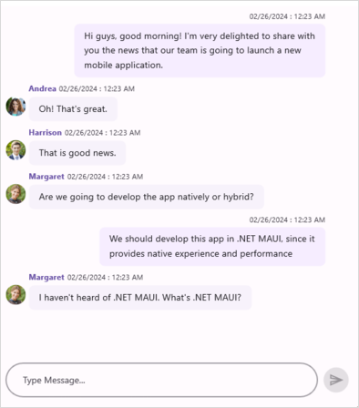

# Getting Started with .NET MAUI Chat

This section guides you through setting up and configuring a [Chat](https://help.syncfusion.com/cr/maui/Syncfusion.Maui.Chat.SfChat.html) in your .NET MAUI application. Follow the steps below to add a basic Chat to your project.

To quickly get started with the .NET MAUI Chat, watch this video:

 <iframe id='MAUIChatVideoTutorial' src='https://www.youtube.com/embed/Ha9jx1bq2Ws'></iframe>




## Prerequisites

Before proceeding, ensure the following are set up:

1. Install [.NET 9 SDK](https://dotnet.microsoft.com/en-us/download/dotnet/9.0) or later.
2. Set up a .NET MAUI environment with Visual Studio 2022 v17.12 or later.

## Step 1: Create a new .NET MAUI project

1. Go to **File > New > Project** and choose the **.NET MAUI App** template.
2. Name the project and choose a location. Then, click **Next.**
3. Select the .NET framework version and click **Create.**
 
## Step 2: Install the Syncfusion® MAUI Chat NuGet package
 
 1. In **Solution Explorer**, right-click the project and choose **Manage NuGet Packages**.
 2. Search for [Syncfusion.Maui.Chat](https://www.nuget.org/packages/Syncfusion.Maui.Chat) and install the latest version.
 3. Ensure the necessary dependencies are installed correctly, and the project is restored.




## Prerequisites

Before proceeding, ensure the following are set up:

1. Install [.NET 9 SDK](https://dotnet.microsoft.com/en-us/download/dotnet/9.0) or later.
2. Set up a .NET MAUI environment with Visual Studio Code.
3. Ensure that the .NET MAUI workloads are installed and configured as described [here](https://learn.microsoft.com/en-us/dotnet/maui/get-started/installation?view=net-maui-9.0&tabs=visual-studio-code).

## Step 1: Create a new .NET MAUI project

1. Open the command palette by pressing `Ctrl+Shift+P` and type **.NET:New Project** and enter.
2. Choose the **.NET MAUI App** template.
3. Select the project location, type the project name and press **Enter.**
4. Then choose **Create project.**

## Step 2: Install the Syncfusion® MAUI Chat NuGet package
 
 1. In **Solution Explorer**, right-click the project and choose **Manage NuGet Packages**.
 2. Search for [Syncfusion.Maui.Chat](https://www.nuget.org/packages/Syncfusion.Maui.Chat) and install the latest version.
 3. Ensure the necessary dependencies are installed correctly, and the project is restored.





## Prerequisites

Before proceeding, ensure the following are set up:

1. Install [.NET 9 SDK](https://dotnet.microsoft.com/en-us/download/dotnet/9.0) or later.
2. Set up a .NET MAUI environment with JetBrains Rider 2024.3 or later.
3. Make sure the MAUI workloads are installed and configured as described [here.](https://www.jetbrains.com/help/rider/MAUI.html#before-you-start)

## Step 1: Create a new .NET MAUI project

1. Go to **File > New Solution,** Select .NET (C#) and choose the .NET MAUI App template.
2. Enter the Project Name, Solution Name, and Location.
3. Select the .NET framework version and click Create.

## Step 2: Install the Syncfusion® MAUI Chat NuGet package

1. In **Solution Explorer,** right-click the project and choose **Manage NuGet Packages.**
2. Search for [Syncfusion.Maui.Chat](https://www.nuget.org/packages/Syncfusion.Maui.Chat/) and install the latest version.
3. Ensure the necessary dependencies are installed correctly, and the project is restored. If not, Open the Terminal in Rider and manually run: `dotnet restore`




## Step 3: Register Syncfusion Core Handler
 
Make sure to add the namespace.
 


using Syncfusion.Maui.Core.Hosting;


 
Register the Syncfusion core handler in your `CreateMauiApp` method of `MauiProgram.cs` file to use Syncfusion controls.
 


builder.ConfigureSyncfusionCore();



## Step 4: Define Model and View Model

The `SfChat` control is data-bound and displays a collection of messages exchanged between users. Hence, messages should be created and bound to the control.

Create a simple message collection as shown in the following code example in a new class file. Save it as `ViewModel.cs` file.



using System.Collections.ObjectModel;

public class GettingStartedViewModel : INotifyPropertyChanged
{
    private ObservableCollection<object> messages;
    private Author currentUser;

    public GettingStartedViewModel()
    {
        this.messages = new ObservableCollection<object>();
        this.currentUser = new Author() { Name = "Nancy" };
        this.GenerateMessages();
    }

    public ObservableCollection<object> Messages
    {
        get
        {
            return this.messages;
        }

        set
        {
            this.messages = value;
        }
    }

    public Author CurrentUser
    {
        get
        {
            return this.currentUser;
        }
        set
        {
            this.currentUser = value;
            RaisePropertyChanged("CurrentUser");
        }
    }

    public event PropertyChangedEventHandler PropertyChanged;

    public void RaisePropertyChanged(string propName)
    {
        if (this.PropertyChanged != null)
        {
            this.PropertyChanged(this, new PropertyChangedEventArgs(propName));
        }
    }

    private void GenerateMessages()
    {
        this.messages.Add(new TextMessage()
        {
            Author = currentUser,
            Text = "Hi guys, good morning! I'm very delighted to share with you the news that our team is going to launch a new mobile application.",
        });

        this.messages.Add(new TextMessage()
        {
            Author = new Author() { Name = "Andrea", Avatar = "Andrea.png" },
            Text = "Oh! That's great.",
        });

        this.messages.Add(new TextMessage()
        {
            Author = new Author() { Name = "Harrison", Avatar = "Harrison.png" },
            Text = "That is good news.",
        });

        this.messages.Add(new TextMessage()
        {
            Author = new Author() { Name = "Margaret", Avatar = "Margaret.png" },
            Text = "Are we going to develop the app natively or hybrid?",
        });

        this.messages.Add(new TextMessage()
        {
            Author = currentUser,
            Text = "We should develop this app in .NET MAUI, since it provides native experience and performance.",
        });
    }
}




## Step 5: Import the Chat namespace

Add the following namespace in your XAML or C#.



xmlns:syncfusion="clr-namespace:Syncfusion.Maui.Chat;assembly=Syncfusion.Maui.Chat"


using Syncfusion.Maui.Chat;



## Step 6: Add the Chat component

Create a `ViewModel` instance and set it as the Chat's `BindingContext`. This enables property binding from `ViewModel` class.

To load the messages to SfChat, bind the message collection to the [Messages](https://help.syncfusion.com/cr/maui/Syncfusion.Maui.Chat.SfChat.html#Syncfusion_Maui_Chat_SfChat_Messages) property of Chat and bind the [CurrentUser](https://help.syncfusion.com/cr/maui/Syncfusion.Maui.Chat.SfChat.html#Syncfusion_Maui_Chat_SfChat_CurrentUser) to differentiate the incoming and outgoing messages.

 

<ContentPage xmlns="http://schemas.microsoft.com/dotnet/2021/maui"
            xmlns:x="http://schemas.microsoft.com/winfx/2009/xaml"
            xmlns:syncfusion="clr-namespace:Syncfusion.Maui.Chat;assembly=Syncfusion.Maui.Chat"
            xmlns:local="clr-namespace:MauiChat"             
            x:Class="MauiChat.MainPage">

    <ContentPage.BindingContext>
        <local:GettingStartedViewModel />
    </ContentPage.BindingContext>

    <syncfusion:SfChat x:Name="sfChat"
                    Messages="{Binding Messages}"
                    CurrentUser="{Binding CurrentUser}">
    </syncfusion:SfChat>
</ContentPage>
 


SfChat sfChat = new SfChat();
GettingStartedViewModel viewModel = new GettingStartedViewModel(); 
this.sfChat.Messages = viewModel.Messages; 
this.sfChat.CurrentUser = viewModel.CurrentUser;
 


The following screenshot illustrates the result of the above code.

You can download the Chat Getting Started sample from [GitHub](https://github.com/SyncfusionExamples/getting-started-with-.net-maui-chat)
