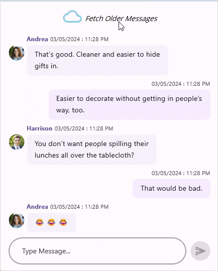

# Load More in .NET MAUI Chat (SfChat)

In `SfChat`, scroll to the top of the message list to fetch the old messages on demand in run-time either automatically or manually(by tapping the load more button) by setting the `SfChat.LoadMoreBehavior` as `LoadMoreOption.Auto` or `LoadMoreOption.Manual` respectively. You can also pass the parameter to the `SfChat.LoadMoreCommand` using the `SfChat.LoadMoreCommandParameter` property. Use the `SfChat.LazyLoading` property to show the busy indicator denoting the loading operation in SfChat.

N> SfChat does not support LoadMore when `SfChat.ShowTimeBreak` is enabled. Because SfListView has a limitation that `LoadMoreOption.Auto` or `LoadMoreOption.AutoOnScroll` works only when `LoadMorePosition.Bottom` is `enabled`.

## Load more manually

By default, upon reaching the top of the chat list, a load more button will be displayed if `SfChat.LoadMoreBehavior` is set as `LoadMoreOption.Manual`. Clicking on this button triggers the `SfChat.LoadMoreCommand`. In the command's action, set the `IsLazyLoading` as `true` to show the busy indicator and hide the load more button. Once the messages are loaded, set the `IsLazyLoading` back to `false` to hide the busy indicator.



<?xml version="1.0" encoding="utf-8" ?>
<ContentPage xmlns="http://schemas.microsoft.com/dotnet/2021/maui"
             xmlns:x="http://schemas.microsoft.com/winfx/2009/xaml"
             xmlns:sfChat="clr-namespace:Syncfusion.Maui.Chat;assembly=Syncfusion.Maui.Chat"
             xmlns:local="clr-namespace:GettingStarted"
             x:Class="GettingStarted.MainPage">
    
    <ContentPage.BindingContext>
        <local:LoadMoreViewModel x:Name="viewModel"/>
    </ContentPage.BindingContext>   
    
    <ContentPage.Content>       
            <sfChat:SfChat x:Name="sfChat" 
                           LoadMoreBehavior="Manual"
                           LoadMoreCommand="{Binding LoadMoreCommand}"
                           IsLazyLoading="{Binding IsBusy}"  
                           Messages="{Binding Messages}" 
                           CurrentUser="{Binding CurrentUser}" > 
            </sfChat:SfChat>        
    </ContentPage.Content>
</ContentPage>







public partial class LoadMoreViewModel : INotifyPropertyChanged
{      
        private bool isBusy = false;
        private ObservableCollection<object> messages;

        /// 

        /// Gets or sets the load more command of SfChat.
        /// 

        public ICommand LoadMoreCommand { get; set; }

        /// 

        /// Gets or sets the IsBusy of the chat control.
        /// 

        public bool IsBusy
        {
            get { return this.isBusy; }
            set
            {
                this.isBusy = value;
                RaisePropertyChanged("IsBusy");
            }
        }

        /// 

        /// Gets or sets the message conversation of SfChat.
        /// 

        public ObservableCollection<object> Messages
        {
            get{ return this.messages; }
            set
            {
                this.messages = value;
                RaisePropertyChanged("Messages");
            }
        }

        public LoadMoreViewModel()
        {
            this.Messages = CreateMessages();
            LoadMoreCommand = new Command<object>(LoadMoreItems, CanLoadMoreItems);
        }

        /// 

        /// Returns whether the load more command can execute.
        /// 
        
        private bool CanLoadMoreItems(object obj)
        {
            // If messages are still there in the old message collection, then execute the load more command.
            if (this.OldMessages.Count > 0)
            {
                return true;
            }
            else
            {
                IsBusy = false;
                return false;
            }

            return true;
        }

        /// 

        /// Action raised when the load more command is executed.
        /// 

        private async void LoadMoreItems(object obj)
        {
            try
            {
                // Set is busy as true to show the busy indicator.
                IsBusy = true;
                await Task.Delay(3000);
                LoadMoreMessages();
            }
            catch{ }
            finally
            {
                // Set is busy as false to hide the busy indicator.
                IsBusy = false;
            }
        }

        /// 

        /// Adds the next ten messages from the older messages of the conversation to see the messages.
        /// 

        private void LoadMoreMessages()
        {        
            for (int i = 1; i <= 10 ; i++)
            {
                var oldMessage = this.OldMessages[this.OldMessages.Count - 1];
                this.Messages.Insert(0, oldMessage);
                this.OldMessages.Remove(oldMessage);
            }
        }
}




## Load more automatically

Set the `SfChat.LoadMoreBehavior` to `LoadMoreOption.Auto`, a busy indicator will appear automatically when you reach the top of the chat list. Unlike `LoadMoreOption.Manual`, `SfChat.LoadMoreCommand` executes automatically without needing any additional clicks when you reach the top of the chat list. 

N> The `SfChat.IsLazyLoading` will always be `true` if `SfChat.LoadMoreBehavior` is `Auto`. So, to cancel the load more operation and remove the load more view from the chat, set the `LoadMoreBehavior` as `LoadMoreOption.None`.



<?xml version="1.0" encoding="utf-8" ?>
<ContentPage xmlns="http://schemas.microsoft.com/dotnet/2021/maui"
             xmlns:x="http://schemas.microsoft.com/winfx/2009/xaml"
             xmlns:sfChat="clr-namespace:Syncfusion.Maui.Chat;assembly=Syncfusion.Maui.Chat"
             xmlns:local="clr-namespace:GettingStarted"
             x:Class="GettingStarted.MainPage">
    
    <ContentPage.BindingContext>
        <local:LoadMoreViewModel x:Name="viewModel"/>
    </ContentPage.BindingContext>   
    
    <ContentPage.Content>       
            <sfChat:SfChat x:Name="sfChat" 
                           LoadMoreCommand="{Binding LoadMoreCommand}"
                           IsLazyLoading="{Binding IsBusy}"
                           LoadMoreBehavior="{Binding LoadMoreBehavior}"
                           Messages="{Binding Messages}" 
                           CurrentUser="{Binding CurrentUser}" > 
            </sfChat:SfChat>        
    </ContentPage.Content>
</ContentPage>






public partial class LoadMoreViewModel : INotifyPropertyChanged
{      
        private LoadMoreOption loadMoreBehavior = LoadMoreOption.Auto;

        /// 

        /// Gets or sets the load more command of SfChat.
        /// 

        public ICommand LoadMoreCommand { get; set; }

        /// 

        /// Gets or sets the load more behavior of the chat control.
        /// 

        public bool LoadMoreBehavior
        {
            get { return this.loadMoreBehavior; }
            set
            {
                this.loadMoreBehavior = value;
                RaisePropertyChanged("LoadMoreBehavior");
            }
        }

        /// 

        /// Gets or sets the message conversation of SfChat.
        /// 

        public ObservableCollection<object> Messages
        {
            get{ return this.messages; }
            set
            {
                this.messages = value;
                RaisePropertyChanged("Messages");
            }
        }

        public LoadMoreViewModel()
        {
            this.Messages = CreateMessages();
            LoadMoreCommand = new Command<object>(LoadMoreItems, CanLoadMoreItems);
        }

        /// 

        /// Returns whether the load more command can execute.
        /// 
        
        private bool CanLoadMoreItems(object obj)
        {
            // If messages are still there in the old message collection, then execute the load more command.
            if (this.OldMessages.Count > 0)
            {
                return true;
            }
            else
            {
                // Set the load more behavior of chat to none from auto to cancel the load more operation.
                this.LoadMoreBehavior = LoadMoreOption.None;
                return false;
            }

            return true;
        }

    
        private async void LoadMoreItems(object obj)
        {
            try
            {
                // Set is busy as true to show the busy indicator.
                IsBusy = true;
                await Task.Delay(3000);
                LoadMoreMessages();
            }
            catch{ }
            finally
            {
                // Set is busy as false to hide the busy indicator.
                IsBusy = false;
            }
        }

    
        /// 

        /// Adds the next ten messages from the older messages of the conversation to see messages.
        /// 

        private void LoadMoreMessages()
        {        
            for (int i = 1; i <= 10 ; i++)
            {
                var oldMessage = this.OldMessages[this.OldMessages.Count - 1];
                this.Messages.Insert(0, oldMessage);
                this.OldMessages.Remove(oldMessage);
            }
        }
}




## Load more template

`SfChat` allows you to customize the load more view to display any custom button or indicator when loading more messages. This feature automatically adjusts the size of the load more view based on the content inside.

You can use the `IsLazyLoading` property to determine whether to display the custom button or the busy indicator. In the code sample below, a custom view and a busy indicator are added as children of a grid, which is then set as the `SfChat.LoadMoreTemplate`. When `IsLazyLoading` is `false`, the custom view is shown, and the busy indicator is hidden. When `IsLazyLoading` is `true`, the custom view is hidden, and the busy indicator is shown. 



<?xml version="1.0" encoding="utf-8" ?>
<ContentPage xmlns="http://schemas.microsoft.com/dotnet/2021/maui"
             xmlns:x="http://schemas.microsoft.com/winfx/2009/xaml"
             xmlns:sfChat="clr-namespace:Syncfusion.Maui.Chat;assembly=Syncfusion.Maui.Chat"
             xmlns:sync="clr-namespace:Syncfusion.Maui.ListView;assembly=Syncfusion.Maui.ListView"
             xmlns:local="clr-namespace:LoadMore"
             x:Class="LoadMore.MainPage">

    <ContentPage.BindingContext>
        <local:LoadMoreViewModel/>
    </ContentPage.BindingContext>

    <ContentPage.Resources>
        <ResourceDictionary>
            <local:InverseBoolConverter x:Key="inverseBoolConverter"/>
        </ResourceDictionary>
    </ContentPage.Resources>

    <ContentPage.Content>
        <sfChat:SfChat x:Name="sfChat" 
                       Messages="{Binding Messages}" 
                       CurrentUser="{Binding CurrentUser}"
                       LoadMoreCommand="{Binding LoadMoreCommand}"  
                       LoadMoreBehavior="{Binding LoadMoreBehavior}" 
                       IsLazyLoading="{Binding IsBusy}" >
            <sfChat:SfChat.LoadMoreTemplate>
                <DataTemplate>
                    <Grid  HeightRequest="50" HorizontalOptions="Center" VerticalOptions="Center">
                        <Grid.RowDefinitions>
                            <RowDefinition Height="50" />
                        </Grid.RowDefinitions>
                        <Grid.ColumnDefinitions>
                            <ColumnDefinition Width="40" />
                            <ColumnDefinition Width="*" />
                        </Grid.ColumnDefinitions>
                        <Image  Source="cloud.jpg"
                                Grid.Row="0" Grid.Column="0"
                                VerticalOptions="Center"
                                HorizontalOptions="End"
                                IsVisible="{Binding IsLazyLoading, Converter={StaticResource inverseBoolConverter}, Source={x:Reference Name=sfChat}}"/>
                        <Label Text="Fetch Older Messages"
                                BackgroundColor="Transparent"
                                VerticalOptions="Center"
                                HorizontalOptions="Start"
                                Grid.Row="0" Grid.Column="1"
                                IsVisible="{Binding IsLazyLoading, Converter={StaticResource inverseBoolConverter}, Source={x:Reference Name=sfChat}}"/>
                        <sync:ListViewLoadMoreIndicator Color="Red" IsRunning="{Binding IsLazyLoading, Source={x:Reference Name=sfChat}}" IsVisible="{Binding IsLazyLoading, Source={x:Reference Name=sfChat}}" VerticalOptions="Center"/>
                    </Grid>
                </DataTemplate>
            </sfChat:SfChat.LoadMoreTemplate>
        </sfChat:SfChat>

    </ContentPage.Content>
</ContentPage>




public partial class MainPage : ContentPage
{
    public MainPage()
    {
        InitializeComponent();
        sfChat.Messages = viewModel.Messages;
        sfChat.CurrentUser = viewModel.CurrentUser;
        Label LoadMoreLabel;
        Image LoadMoreImage;
        sfChat.LoadMoreTemplate = new DataTemplate(() =>
        {
            Grid grid = new Grid
            {
                RowDefinitions =
                {
                    new RowDefinition { Height = 50 },
                },
                ColumnDefinitions =
                {
                    new ColumnDefinition { Width = 40 },
                    new ColumnDefinition { Width = new GridLength(1, GridUnitType.Star) },
                }
            };
            LoadMoreImage = new Image();
            LoadMoreLabel = new Label()
            {
                Text = "Fetch Older Messages",
            };                    
            LoadMoreLabel.VerticalOptions = LayoutOptions.Center;
            LoadMoreLabel.HorizontalOptions = LayoutOptions.Start;
            LoadMoreImage.VerticalOptions = LayoutOptions.Center;
            LoadMoreImage.HorizontalOptions = LayoutOptions.End;
            LoadMoreImage.Source = "cloud.jpg";
            LoadMoreImage.SetBinding(Image.IsVisibleProperty, new Binding("IsBusy", BindingMode.Default, new InverseBoolConverter(), null, null, this.BindingContext as LoadMoreViewModel));
            LoadMoreLabel.SetBinding(Label.IsVisibleProperty, new Binding("IsBusy", BindingMode.Default, new InverseBoolConverter(), null, null, this.BindingContext as LoadMoreViewModel));
            ListViewLoadMoreIndicator indicator = new ListViewLoadMoreIndicator();
            indicator.Color = Colors.Red;
            indicator.SetBinding(ListViewLoadMoreIndicator.IsRunningProperty, new Binding("IsBusy", BindingMode.Default, null, null, null, this.BindingContext as LoadMoreViewModel));
            indicator.SetBinding(ListViewLoadMoreIndicator.IsVisibleProperty, new Binding("IsBusy", BindingMode.Default, null, null, null, this.BindingContext as LoadMoreViewModel));
            grid.HeightRequest = 50;
            grid.VerticalOptions = LayoutOptions.Center;
            grid.HorizontalOptions = LayoutOptions.Center;
            grid.Children.Add(LoadMoreImage);
            Grid.SetColumn(LoadMoreImage, 0);
            grid.Children.Add(LoadMoreLabel);
            Grid.SetColumn(LoadMoreLabel, 1);
            grid.Children.Add(indicator);
            return grid;
        });
        this.Content = sfChat;
    }
}




