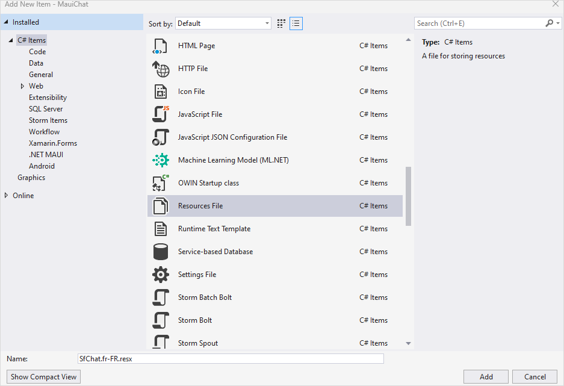
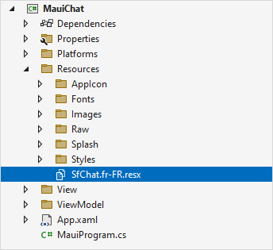
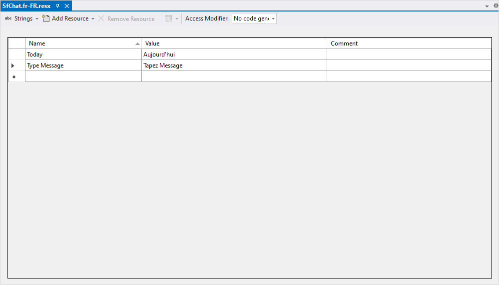
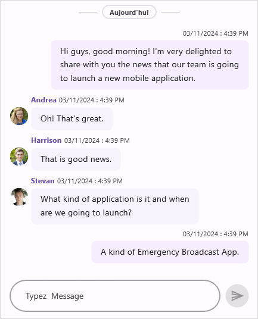

# Localization in .NET MAUI Chat (SfChat)

`Localization` is the process of translating the application resources into different languages for specific cultures. The [SfChat](https://help.syncfusion.com/cr/maui/Syncfusion.Maui.Chat.SfChat.html) can be localized by adding a `resource` file.

## Setting CurrentUICulture to the application

Application culture can be changed by setting the `CurrentUICulture` in the `App.xaml.cs` file.




      using Syncfusion.Maui.Chat;
      using System.Globalization;
      using System.Resources;

      namespace MauiChat
      {
         public partial class App : Application
         {
            public App()
            {
                  InitializeComponent();             
                  CultureInfo.CurrentUICulture = new CultureInfo("fr-FR");   
                  SfChatResources.ResourceManager = new ResourceManager("MauiChat.Resources.SfChat", Application.Current!.GetType().Assembly);
                  MainPage = new MainPage();
            }
         }
      }




N> The required `resx` files with `Build Action` as `EmbeddedResource` (File name should contain culture code) into the `Resources` folder.

## Localize application level

To localize the `Chat` based on the `CurrentUICulture` using the `resource` files, follow these steps.

   1. Create a new folder named `Resources` in the application.

   2. Right-click on the `Resources` folder, select `Add`, then click on `NewItem`.

   3. In the Add New Item wizard, select the Resource File option and name the filename as `SfChat.<culture name>.resx`. For example, give the name as `SfChat.fr-FR.resx` for French culture.

   4. The culture name indicates the name of the language and country.

   

   5. Now, select `Add` option to add the resource file in the **Resources** folder.

   

   6. Add the Name or Value pair in the Resource Designer of `SfChat.fr-FR.resx` file and change its corresponding value to corresponding culture.

   

   

N> [View Sample in GitHub](https://github.com/SyncfusionExamples/localization-for-.net-maui-chat)
