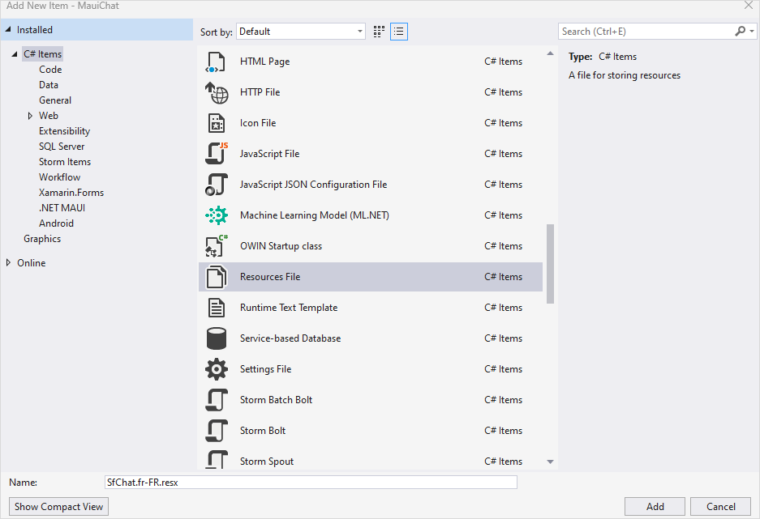
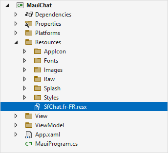
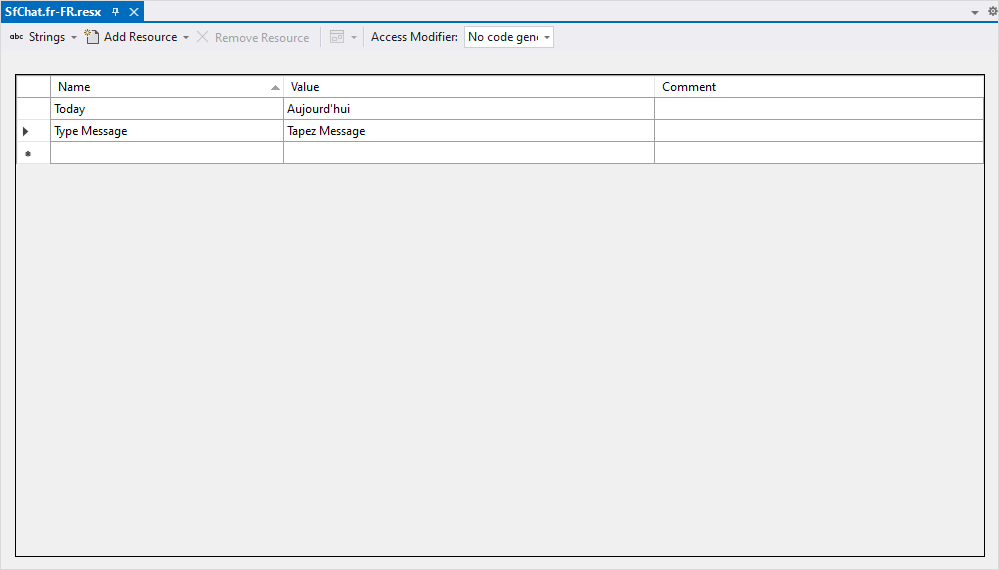
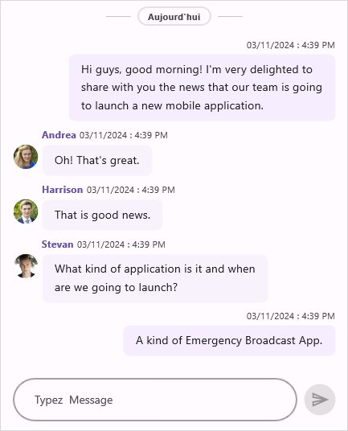

# Localization in .NET MAUI Chat (SfChat)

`Localization` is the process of translating the application resources into different languages for specific cultures. The [SfChat](https://help.syncfusion.com/cr/maui/Syncfusion.Maui.Chat.SfChat.html) can be localized by adding a `resource` file.

## Setting the application's CurrentUICulture

Application culture can be changed by setting the `CurrentUICulture` in the `App.xaml.cs` file.




using Syncfusion.Maui.Chat;
using System.Globalization;
using System.Resources;

namespace MauiChat
{
   public partial class App : Application
   {
      public App()
      {
            InitializeComponent();             
            CultureInfo.CurrentUICulture = new CultureInfo("fr-FR");   
            SfChatResources.ResourceManager = new ResourceManager("MauiChat.Resources.SfChat", typeof(App).Assembly);
            MainPage = new MainPage();
      }
   }
}




N> Add the required `.resx` files with `Build Action` set to `EmbeddedResource` to the `Resources` folder. The file name must contain the culture code (for example, `SfChat.fr-FR.resx`).

## Localize application level

To localize the `Chat` based on the `CurrentUICulture` using the `resource` files, follow these steps.

   1. Create a new folder named `Resources` in the application.

   2. Right-click on the `Resources` folder, select `Add`, then click on `NewItem`.

   3. In the Add New Item wizard, select the Resource File option and name the file as `SfChat.<culture code>.resx`. For example, give the name as `SfChat.fr-FR.resx` for French culture.

   4. The culture code follows the BCP-47 format `<language>-<region>` (for example, `fr-FR` for French (France) or `en-US` for English (United States)).

   

   5. Now, select `Add` option to add the resource file in the `Resources` folder.

   

   6. Add the Name/Value pairs in the Resource Designer of `SfChat.fr-FR.resx` file and change each value to the corresponding culture.

   

   

## Samples

The following sample demonstrates how to localize SfChat strings into the French (fr-FR) culture by adding a resource file and setting `CurrentUICulture` at application startup:

* [Localization for .NET MAUI Chat (SfChat) - GitHub sample](https://github.com/SyncfusionExamples/localization-for-.net-maui-chat)
