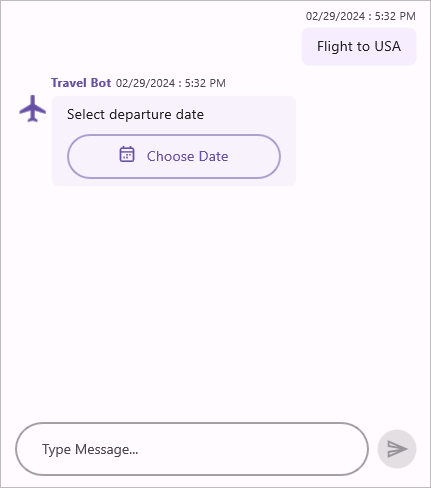
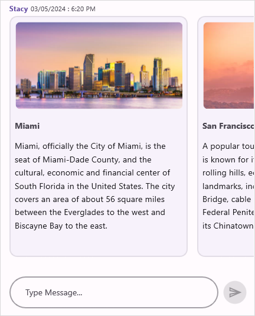

# Messages in .NET Maui Chat (SfChat)

## Configuring common settings for the message

<table>
<tr>
<td>{{'[Message.Author](https://help.syncfusion.com/cr/maui/Syncfusion.Maui.Chat.MessageBase.html#Syncfusion_Maui_Chat_MessageBase_Author)'| markdownify }}</td>
<td>Specify the avatar and name of the message sender using {{'[Author.Avatar](https://help.syncfusion.com/cr/maui/Syncfusion.Maui.Chat.Author.html#Syncfusion_Maui_Chat_Author_Avatar)'| markdownify }} and {{'[Author.Name](https://help.syncfusion.com/cr/maui/Syncfusion.Maui.Chat.Author.html#Syncfusion_Maui_Chat_Author_Name)'| markdownify }} properties respectively.</td>
</tr>
<tr>
<td>{{'[Message.DateTime](https://help.syncfusion.com/cr/maui/Syncfusion.Maui.Chat.MessageBase.html#Syncfusion_Maui_Chat_MessageBase_DateTime)'| markdownify }}</td>
<td>To display message created or received time.</td>
</tr>
</table>

## Setting current user for conversation

The [CurrentUser](https://help.syncfusion.com/cr/maui/Syncfusion.Maui.Chat.SfChat.html#Syncfusion_Maui_Chat_SfChat_CurrentUser) helps differentiate between the sender and receiver of the messages. On any given chat window, the `CurrentUser` is meant to be the sender (author of outgoing messages). Refer to the below code example to set up a current user in a chat.



    
    <?xml version="1.0" encoding="utf-8" ?>
    <ContentPage xmlns="http://schemas.microsoft.com/dotnet/2021/maui"
                xmlns:x="http://schemas.microsoft.com/winfx/2009/xaml"
                xmlns:sfChat="clr-namespace:Syncfusion.Maui.Chat;assembly=Syncfusion.Maui.Chat"
                xmlns:local="clr-namespace:MauiChat"             
                x:Class="MauiChat.MainPage">

        <ContentPage.BindingContext>
            <local:ViewModel/>
        </ContentPage.BindingContext>

        <ContentPage.Content>
            <sfChat:SfChat x:Name="sfChat"
                            Messages="{Binding Messages}"                          
                            CurrentUser="{Binding CurrentUser}" />
        </ContentPage.Content>
    </ContentPage>




    using Syncfusion.Maui.Chat;

    namespace MauiChat
    {
        public partial class MainPage : ContentPage
        {
            SfChat sfChat;
            ViewModel viewModel;
            public MainPage()
            {
                InitializeComponent();
                this.sfChat = new SfChat();
                this.viewModel = new ViewModel();
                this.sfChat.Messages = viewModel.Messages;
                this.sfChat.CurrentUser = viewModel.CurrentUser;
                this.Content = sfChat;
            }
        }
    }





    
    public class ViewModel : INotifyPropertyChanged
    {
        private ObservableCollection<object> messages;
        private Author currentUser;

        public ViewModel()
        {
            this.Messages = new ObservableCollection<object>();
            this.CurrentUser = new Author() { Name = "Nancy" };
            this.GenerateMessages();
        }

        public Author CurrentUser
        {
            get
            {
                return this.currentUser;
            }
            set
            {
                this.currentUser = value;
                RaisePropertyChanged("CurrentUser");
            }
        }

        public ObservableCollection<object> Messages
        {
            get
            {
                return this.messages;
            }
            set
            {
                this.messages = value;
            }
        }  

        public event PropertyChangedEventHandler? PropertyChanged;
        
        public void RaisePropertyChanged(string propName)
        {
            if (PropertyChanged != null)
            {
                PropertyChanged(this, new PropertyChangedEventArgs(propName));
            }
        }    

        private void GenerateMessages()
        {
            this.Messages.Add(new TextMessage()
            {
                Author = CurrentUser,
                Text = "Hi guys, good morning! I'm very delighted to share with you the news that our team is going to launch a new mobile application.",
            });
        }
    }




## Text message

[TextMessage](https://help.syncfusion.com/cr/maui/Syncfusion.Maui.Chat.TextMessage.html) is used to display plain text as a message. The following code example explains how to add a simple text message.



    
    <?xml version="1.0" encoding="utf-8" ?>
    <ContentPage xmlns="http://schemas.microsoft.com/dotnet/2021/maui"
                xmlns:x="http://schemas.microsoft.com/winfx/2009/xaml"
                xmlns:sfChat="clr-namespace:Syncfusion.Maui.Chat;assembly=Syncfusion.Maui.Chat"
                xmlns:local="clr-namespace:MauiChat"             
                x:Class="MauiChat.MainPage">

        <ContentPage.BindingContext>
            <local:ViewModel/>
        </ContentPage.BindingContext>

        <ContentPage.Content>
            <sfChat:SfChat x:Name="sfChat"
                        Messages="{Binding Messages}"                          
                        CurrentUser="{Binding CurrentUser}" />
        </ContentPage.Content>
    </ContentPage>




    using Syncfusion.Maui.Chat;

    namespace MauiChat
    {
        public partial class MainPage : ContentPage
        {
            SfChat sfChat;
            ViewModel viewModel;
            public MainPage()
            {
                InitializeComponent();
                this.sfChat = new SfChat();
                this.viewModel = new ViewModel();
                this.sfChat.Messages = viewModel.Messages;
                this.sfChat.CurrentUser = viewModel.CurrentUser;
                this.Content = sfChat;
            }
        }
    }





    
        public class ViewModel : INotifyPropertyChanged
        {
            ...
            private void GenerateMessages()
            {
                this.Messages.Add(new TextMessage()
                {
                    Author = CurrentUser,
                    Text = "Hi guys, good morning! I'm very delighted to share with you the news that our team is going to launch a new mobile application.",
                });
                this.Messages.Add(new TextMessage()
                {
                    Author = new Author() { Name = "Andrea",Avatar = "peoplecircle2.png" },
                    Text = "Oh! That's great.",
                });
                this.Messages.Add(new TextMessage()
                {
                    Author = new Author() { Name = "Harrison",Avatar = "peoplecircle14.png" },
                    Text = "That is good news.",
                });
                this.Messages.Add(new TextMessage()
                {
                    Author = new Author() { Name = "Margaret",Avatar = "peoplecircle7.png" },
                    Text = "What kind of application is it, and when are we going to launch?",
                });
            }
            ...
        }
    



## Date picker message

[DatePickerMessage](https://help.syncfusion.com/cr/maui/Syncfusion.Maui.Chat.DatePickerMessage.html) is used to display a date picker as a message, allowing users to select a date. When a date is selected, it will be added as a `TextMessage` to the chat window. When you select a date from the date picker, the [SendMessage](https://help.syncfusion.com/cr/maui/Syncfusion.Maui.Chat.SfChat.html#Syncfusion_Maui_Chat_SfChat_SendMessage) event and [SendMessageCommand](https://help.syncfusion.com/cr/maui/Syncfusion.Maui.Chat.SfChat.html#Syncfusion_Maui_Chat_SfChat_SendMessageCommand) will be executed.



    
    <?xml version="1.0" encoding="utf-8" ?>
    <ContentPage xmlns="http://schemas.microsoft.com/dotnet/2021/maui"
                xmlns:x="http://schemas.microsoft.com/winfx/2009/xaml"
                xmlns:sfChat="clr-namespace:Syncfusion.Maui.Chat;assembly=Syncfusion.Maui.Chat"
                xmlns:local="clr-namespace:MauiChat"             
                x:Class="MauiChat.MainPage">

        <ContentPage.BindingContext>
            <local:ViewModel/>
        </ContentPage.BindingContext>

        <ContentPage.Content>
            <sfChat:SfChat x:Name="sfChat"
                        Messages="{Binding Messages}"                          
                        CurrentUser="{Binding CurrentUser}"
                        SendMessage="sfChat_SendMessage" />
        </ContentPage.Content>
    </ContentPage>                        




    using Syncfusion.Maui.Chat;

    namespace MauiChat
    {
        public partial class MainPage : ContentPage
        {
            SfChat sfChat;
            ViewModel viewModel;
            public MainPage()
            {
                InitializeComponent();
                this.sfChat = new SfChat();
                this.viewModel = new ViewModel();
                this.sfChat.Messages = viewModel.Messages;
                this.sfChat.CurrentUser = viewModel.CurrentUser;
                this.sfChat.SendMessage += this.SfChat_SendMessage;
                this.Content = sfChat;
            }

            private void sfChat_SendMessage(object sender, SendMessageEventArgs e)
            {
                // Denotes the date selected from the date picker.
                var selectedDate = e.Message.Text;
            }  
        }
    } 






    public class ViewModel : INotifyPropertyChanged
    {
        ...
        private void GenerateMessages()
        {
            this.Messages.Add(new TextMessage()
            {
                Author = CurrentUser,
                Text = "Flight to USA",
            });

            this.Messages.Add(new DatePickerMessage()
            {
                Author = new Author() { Name = "Travel Bot",Avatar = "flight.png" },
                Text = "Select departure date",
                SelectedDate = DateTime.Now
            });
        }
        ...
    }




## Time picker message

[TimePickerMessage](https://help.syncfusion.com/cr/maui/Syncfusion.Maui.Chat.TimePickerMessage.html) is used to display a time picker as a message, allowing users to select a time. Once a time has been specified, it will be added as a `TextMessage`. When you select a time from the time picker, the [SendMessage](https://help.syncfusion.com/cr/maui/Syncfusion.Maui.Chat.SfChat.html#Syncfusion_Maui_Chat_SfChat_SendMessage) event and [SendMessageCommand](https://help.syncfusion.com/cr/maui/Syncfusion.Maui.Chat.SfChat.html#Syncfusion_Maui_Chat_SfChat_SendMessageCommand) will be executed.



    
    <?xml version="1.0" encoding="utf-8" ?>
    <ContentPage xmlns="http://schemas.microsoft.com/dotnet/2021/maui"
                xmlns:x="http://schemas.microsoft.com/winfx/2009/xaml"
                xmlns:sfChat="clr-namespace:Syncfusion.Maui.Chat;assembly=Syncfusion.Maui.Chat"
                xmlns:local="clr-namespace:MauiChat"             
                x:Class="MauiChat.MainPage">

        <ContentPage.BindingContext>
            <local:ViewModel/>
        </ContentPage.BindingContext>

        <ContentPage.Content>
            <sfChat:SfChat x:Name="sfChat"
                        Messages="{Binding Messages}"                          
                        CurrentUser="{Binding CurrentUser}"
                        SendMessage="sfChat_SendMessage" />
        </ContentPage.Content>
    </ContentPage>                                                 




    using Syncfusion.Maui.Chat;

    namespace MauiChat
    {
        public partial class MainPage : ContentPage
        {
            SfChat sfChat;
            ViewModel viewModel;
            public MainPage()
            {
                InitializeComponent();
                this.sfChat = new SfChat();
                this.viewModel = new ViewModel();
                this.sfChat.Messages = viewModel.Messages;
                this.sfChat.CurrentUser = viewModel.CurrentUser;
                this.sfChat.SendMessage += this.SfChat_SendMessage;
                this.Content = sfChat;
            }

            private void sfChat_SendMessage(object sender, SendMessageEventArgs e)
            {
                // Denotes the time selected from the time picker.
                var selectedTime =  e.Message.Text;
            }
        }
    }



 



    public class ViewModel : INotifyPropertyChanged
    {
        ...
        private void GenerateMessages()
        {
            this.Messages.Add(new TextMessage()
            {
                Author = CurrentUser,
                Text = "Consultation with Dr.Harry tomorrow.",
            });

            this.Messages.Add(new TimePickerMessage()
            {
                Author = new Author() { Name = "Health care", Avatar = "Healthcare.png" },
                Text = "Select a convenient time to meet Dr.Harry for a health check-up.",
                // Time picker display time.
                SelectedTime = new TimeSpan(8, 30, 00),
            });
        } 
        ... 
    }



## Calendar message

[CalendarMessage](https://help.syncfusion.com/cr/xamarin/Syncfusion.XForms.Chat.CalendarMessage.html) is used to display a calendar as a message, allowing users to choose a date. The date chosen from the calendar will be added as a `TextMessage`. When you select a date from the calendar, the [SendMessage](https://help.syncfusion.com/cr/maui/Syncfusion.Maui.Chat.SfChat.html#Syncfusion_Maui_Chat_SfChat_SendMessage) event and [SendMessageCommand](https://help.syncfusion.com/cr/maui/Syncfusion.Maui.Chat.SfChat.html#Syncfusion_Maui_Chat_SfChat_SendMessageCommand) will be executed.



    
    <?xml version="1.0" encoding="utf-8" ?>
    <ContentPage xmlns="http://schemas.microsoft.com/dotnet/2021/maui"
                xmlns:x="http://schemas.microsoft.com/winfx/2009/xaml"
                xmlns:sfChat="clr-namespace:Syncfusion.Maui.Chat;assembly=Syncfusion.Maui.Chat"
                xmlns:local="clr-namespace:MauiChat"             
                x:Class="MauiChat.MainPage">

        <ContentPage.BindingContext>
            <local:ViewModel/>
        </ContentPage.BindingContext>

        <ContentPage.Content>
            <sfChat:SfChat x:Name="sfChat"
                        Messages="{Binding Messages}"                          
                        CurrentUser="{Binding CurrentUser}"
                        SendMessage="sfChat_SendMessage" />
        </ContentPage.Content>
    </ContentPage> 




    using Syncfusion.Maui.Chat;

    namespace MauiChat
    {
        public partial class MainPage : ContentPage
        {
            SfChat sfChat;
            ViewModel viewModel;
            public MainPage()
            {
                InitializeComponent();
                this.sfChat = new SfChat();
                this.viewModel = new ViewModel();
                this.sfChat.Messages = viewModel.Messages;
                this.sfChat.CurrentUser = viewModel.CurrentUser;
                this.sfChat.SendMessage += this.SfChat_SendMessage;
                this.Content = sfChat;
            }

            private void sfChat_SendMessage(object sender, SendMessageEventArgs e)
            {
                // Denotes the date selected from the calendar.
                var selectedDate = e.Message.Text;
            }
        }
    }


 

          

    public class ViewModel : INotifyPropertyChanged
    {
        ...
        private void GenerateMessages()
        {
            this.Messages.Add(new TextMessage()
            {
                Author = CurrentUser,
                Text = "Appointment with Dr.Harry.",
            });

            this.Messages.Add(new CalendarMessage()
            {
                Author = new Author() { Name = "Health care" },
                Text = "Select convenient date to meet Dr.Harry for health check up.",
                SelectedDate = DateTime.Now,
            });
        }
        ...
    }
    



## Hyperlink message

[HyperlinkMessage](https://help.syncfusion.com/cr/maui/Syncfusion.Maui.Chat.HyperlinkMessage.html) is used to send a URL as a message. Along with the link, the thumbnail, title, and description of the URL are automatically fetched and displayed. The code example below illustrates how to add a hyperlink message.



    
    <?xml version="1.0" encoding="utf-8" ?>
    <ContentPage xmlns="http://schemas.microsoft.com/dotnet/2021/maui"
                xmlns:x="http://schemas.microsoft.com/winfx/2009/xaml"
                xmlns:sfChat="clr-namespace:Syncfusion.Maui.Chat;assembly=Syncfusion.Maui.Chat"
                xmlns:local="clr-namespace:MauiChat"             
                x:Class="MauiChat.MainPage">

        <ContentPage.BindingContext>
            <local:ViewModel/>
        </ContentPage.BindingContext>

        <ContentPage.Content>
            <sfChat:SfChat x:Name="sfChat"
                        Messages="{Binding Messages}"                          
                        CurrentUser="{Binding CurrentUser}" />
        </ContentPage.Content>
    </ContentPage>




    using Syncfusion.Maui.Chat;

    namespace MauiChat
    {
        public partial class MainPage : ContentPage
        {
            SfChat sfChat;
            ViewModel viewModel;
            public MainPage()
            {
                InitializeComponent();
                this.sfChat = new SfChat();
                this.viewModel = new ViewModel();
                this.sfChat.Messages = viewModel.Messages;
                this.sfChat.CurrentUser = viewModel.CurrentUser;
                this.Content = sfChat;
            }
        }
    }


 



    public class ViewModel : INotifyPropertyChanged
    {
        ...
        private void GenerateMessages()
        {
            this.Messages.Add(new TextMessage()
            {
                Author = new Author() { Name = "Michale", Avatar = "peoplecircle23.png" },
                Text = "We should develop this app in .NET Maui, since it provides native experience and performance.",
            });

            this.Messages.Add(new TextMessage()
            {
                Author = CurrentUser,
                Text = "I haven't heard of .NET Maui. What's Maui?",
            });

            this.Messages.Add(new HyperlinkMessage()
            {
                Author = new Author() { Name = "Michale", Avatar = "peoplecircle23.png" },
                Text = "You can check out this link to get started",
                Url = "https://dotnet.microsoft.com/en-us/apps/maui",
            });
            
            this.Messages.Add(new TextMessage()
            {
                Author = new Author() { Name = "Andrea", Avatar = "peoplecircle7.png" },
                Text = "That's great! I will look into it.",
            });
        }
    }     



### Adding hyperlink message as an outgoing message

Unlike the other messages, the `HyperlinkMessage` can also be shown as an outgoing message. To add an `HyperlinkMessage` as an outgoing message just set the [HyperlinkMessage.Author](https://help.syncfusion.com/cr/maui/Syncfusion.Maui.Chat.MessageBase.html#Syncfusion_Maui_Chat_MessageBase_Author) as [CurrentUser](https://help.syncfusion.com/cr/maui/Syncfusion.Maui.Chat.SfChat.html#Syncfusion_Maui_Chat_SfChat_CurrentUser).

## Image message

[ImageMessage](https://help.syncfusion.com/cr/maui/Syncfusion.Maui.Chat.ImageMessage.html) is used to display an image as a message. Using the [ImageMessage.Source](https://help.syncfusion.com/cr/maui/Syncfusion.Maui.Chat.ImageMessage.html#Syncfusion_Maui_Chat_ImageMessage_Source), [ImageMessage.Size](https://help.syncfusion.com/cr/maui/Syncfusion.Maui.Chat.ImageMessage.html#Syncfusion_Maui_Chat_ImageMessage_Size), and [ImageMessage.Aspect](https://help.syncfusion.com/cr/maui/Syncfusion.Maui.Chat.ImageMessage.html#Syncfusion_Maui_Chat_ImageMessage_Aspect) properties, you can display the desired image in the desired height and width as a message in the chat control.



    
    <?xml version="1.0" encoding="utf-8" ?>
    <ContentPage xmlns="http://schemas.microsoft.com/dotnet/2021/maui"
                xmlns:x="http://schemas.microsoft.com/winfx/2009/xaml"
                xmlns:sfChat="clr-namespace:Syncfusion.Maui.Chat;assembly=Syncfusion.Maui.Chat"
                xmlns:local="clr-namespace:MauiChat"             
                x:Class="MauiChat.MainPage">

        <ContentPage.BindingContext>
            <local:ViewModel/>
        </ContentPage.BindingContext>

        <ContentPage.Content>
            <sfChat:SfChat x:Name="sfChat"
                        Messages="{Binding Messages}"                          
                        CurrentUser="{Binding CurrentUser}" />
        </ContentPage.Content>
    </ContentPage>




    using Syncfusion.Maui.Chat;

    namespace MauiChat
    {
        public partial class MainPage : ContentPage
        {
            SfChat sfChat;
            ViewModel viewModel;
            public MainPage()
            {
                InitializeComponent();
                this.sfChat = new SfChat();
                this.viewModel = new ViewModel();
                this.sfChat.Messages = viewModel.Messages;
                this.sfChat.CurrentUser = viewModel.CurrentUser;
                this.Content = sfChat;
            }
        }
    }



 



    public class ViewModel : INotifyPropertyChanged
    {
        ...
        private void GenerateMessages()
        {
            this.messages.Add(new TextMessage()
            {
                Author = CurrentUser,
                Text = "I was delighted to buy some sports cars, can you suggest some cars",
                DateTime = DateTime.Now,
            });

            this.Messages.Add(new ImageMessage()
            {
                Author = currentUser,
                Aspect = Aspect.AspectFill,
                Source = "car1.jpg",
                DateTime = DateTime.Now,

            });
            this.Messages.Add(new ImageMessage()
            {
                Author = new Author() { Name = "Michale", Avatar = "peoplecircle23.png" },
                Aspect = Aspect.AspectFill,
                Source = "car2.jpg",
                DateTime = DateTime.Now,
            });
        }
        ...
    }



### Event and command

The `ImageMessage` comes with in-built [ImageTapped](https://help.syncfusion.com/cr/maui/Syncfusion.Maui.Chat.SfChat.html#Syncfusion_Maui_Chat_SfChat_ImageTapped) event and [ImageTappedCommand](https://help.syncfusion.com/cr/maui/Syncfusion.Maui.Chat.SfChat.html#Syncfusion_Maui_Chat_SfChat_ImageTappedCommand) that will be fired upon tapping an image message. You can get the instance of the `ImageMessage` that was tapped in the [ImageTappedEventArgs](https://help.syncfusion.com/cr/maui/Syncfusion.Maui.Chat.ImageTappedEventArgs.html) as [ImageTappedEventArgs.Message](https://help.syncfusion.com/cr/maui/Syncfusion.Maui.Chat.ImageTappedEventArgs.html#Syncfusion_Maui_Chat_ImageTappedEventArgs_Message). You can handle this event/command to achieve requirements like showing the image in full screen or showing options for sharing the image, etc.

## ImageTapped event



    
    <?xml version="1.0" encoding="utf-8" ?>
    <ContentPage xmlns="http://schemas.microsoft.com/dotnet/2021/maui"
                xmlns:x="http://schemas.microsoft.com/winfx/2009/xaml"
                xmlns:sfChat="clr-namespace:Syncfusion.Maui.Chat;assembly=Syncfusion.Maui.Chat"
                xmlns:local="clr-namespace:MauiChat"             
                x:Class="MauiChat.MainPage">

        <ContentPage.BindingContext>
            <local:ViewModel/>
        </ContentPage.BindingContext>

        <ContentPage.Content>
            <sfChat:SfChat x:Name="sfChat"
                        Messages="{Binding Messages}"                          
                        CurrentUser="{Binding CurrentUser}" 
                        ImageTapped="chat_ImageTapped"/>
        </ContentPage.Content>
    </ContentPage>




    private void sfChat_ImageTapped(object sender, ImageTappedEventArgs e)
    {
        // Check if a particular image message was tapped.
        if (e.Message.Source == ImageSource.FromFile("car1.png"))
        {
            // Do desired actions like displaying the image in full screen.
        }
    }




## ImageTappedCommand




    <?xml version="1.0" encoding="utf-8" ?>
    <ContentPage xmlns="http://schemas.microsoft.com/dotnet/2021/maui"
                xmlns:x="http://schemas.microsoft.com/winfx/2009/xaml"
                xmlns:sfChat="clr-namespace:Syncfusion.Maui.Chat;assembly=Syncfusion.Maui.Chat"
                xmlns:local="clr-namespace:MauiChat"             
                x:Class="MauiChat.MainPage">

        <ContentPage.BindingContext>
            <local:ViewModel/>
        </ContentPage.BindingContext>

        <ContentPage.Content>
            <sfChat:SfChat x:Name="sfChat"
                        Messages="{Binding Messages}"                          
                        CurrentUser="{Binding CurrentUser}" 
                        ImageTappedCommand="{Binding ImageTappedCommand}"/>
        </ContentPage.Content>
    </ContentPage>




    public class ViewModel : INotifyPropertyChanged
    {
        public ICommand ImageTappedCommand { get; set; }
        ...
        public ViewModel()
        {
            this.messages = new ObservableCollection<object>();
            this.CurrentUser = new Author() { Name = "Nancy" };
            ImageTappedCommand = new Command<object>(ImageTapped);
        }

        private void ImageTapped(object args)
        {
            // Check if a particular image message was tapped.
            if((args as ImageTappedEventArgs).Message.Source == ImageSource.FromFile("car1.png"))
            {
                // Do desired actions like displaying the image in full screen.
            }
        }
        ...
    }



N> [View sample in GitHub](https://github.com/SyncfusionExamples/display-tapped-image-in-full-screen-in-.net-maui-chat)

### Adding image message as an outgoing message

Unlike the other messages, the `ImageMessage` can also be shown as an outgoing message. To add an ImageMessage as an outgoing message, just set the [ImageMessage.Author](https://help.syncfusion.com/cr/maui/Syncfusion.Maui.Chat.MessageBase.html#Syncfusion_Maui_Chat_MessageBase_Author) as [CurrentUser](https://help.syncfusion.com/cr/maui/Syncfusion.Maui.Chat.SfChat.html#Syncfusion_Maui_Chat_SfChat_CurrentUser). You can also add an image message when clicking the attachment button, as shown here.

## Card Message

You can show a list of interactive cards with each card containing an image, a list of buttons, and text (title, subtitle, and description) to tie in with the cards of popular bot frameworks. Use the [Card.Image](https://help.syncfusion.com/cr/maui/Syncfusion.Maui.Chat.Card.html#Syncfusion_Maui_Chat_Card_Image), [Card.Title](https://help.syncfusion.com/cr/maui/Syncfusion.Maui.Chat.Card.html#Syncfusion_Maui_Chat_Card_Title), [Card.Subtitle](https://help.syncfusion.com/cr/maui/Syncfusion.Maui.Chat.Card.html#Syncfusion_Maui_Chat_Card_Subtitle), and [Card.Description](https://help.syncfusion.com/cr/maui/Syncfusion.Maui.Chat.Card.html#Syncfusion_Maui_Chat_Card_Description) properties to display the image, title, subtitle, and description in a card respectively.

You can also show one or more buttons on a card as options to choose from. Create the [CardButton](https://help.syncfusion.com/cr/maui/Syncfusion.Maui.Chat.CardButton.html) with the necessary [CardButton.Title](https://help.syncfusion.com/cr/maui/Syncfusion.Maui.Chat.CardButton.html#Syncfusion_Maui_Chat_CardButton_Title)(the text to be displayed in the button) and [CardButton.Value](https://help.syncfusion.com/cr/maui/Syncfusion.Maui.Chat.CardButton.html#Syncfusion_Maui_Chat_CardButton_Value)(the text value that should be added as a response message when the button is clicked, usually the title of the card) and add it to the [Card.Buttons](https://help.syncfusion.com/cr/maui/Syncfusion.Maui.Chat.Card.html#Syncfusion_Maui_Chat_Card_Buttons) collection.

Upon creating the individual cards, add them to a Card typed collection and assign this collection of cards to the [CardMessage.Cards](https://help.syncfusion.com/cr/maui/Syncfusion.Maui.Chat.CardMessage.html#Syncfusion_Maui_Chat_CardMessage_Cards) property. The card message auto-sizes itself in height based on the card contents (the text and button count) of the largest card in the list of cards.

If you don’t want to display images, buttons, or text(title, subtitle, description) in a card simply do not set values to the required properties. For example, if you don’t want to display the image on a card, do not set any value to the `Card.Image` property.



    
    <?xml version="1.0" encoding="utf-8" ?>
    <ContentPage xmlns="http://schemas.microsoft.com/dotnet/2021/maui"
                xmlns:x="http://schemas.microsoft.com/winfx/2009/xaml"
                xmlns:sfChat="clr-namespace:Syncfusion.Maui.Chat;assembly=Syncfusion.Maui.Chat"
                xmlns:local="clr-namespace:MauiChat"             
                x:Class="MauiChat.MainPage">

        <ContentPage.BindingContext>
            <local:ViewModel/>
        </ContentPage.BindingContext>

        <ContentPage.Content>
            <sfChat:SfChat x:Name="sfChat"
                        Messages="{Binding Messages}"                          
                        CurrentUser="{Binding CurrentUser}" />
        </ContentPage.Content>
    </ContentPage>




    using Syncfusion.Maui.Chat;

    namespace MauiChat
    {
        public partial class MainPage : ContentPage
        {
            SfChat sfChat;
            ViewModel viewModel;
            public MainPage()
            {
                InitializeComponent();
                this.sfChat = new SfChat();
                this.viewModel = new ViewModel();
                this.sfChat.Messages = viewModel.Messages;
                this.sfChat.CurrentUser = viewModel.CurrentUser;
                this.Content = sfChat;
            }
        }
    }


 



    public class ViewModel : INotifyPropertyChanged
    {
        ...
        public ViewModel()
        {
            this.Messages = new ObservableCollection<object>();
            this.CurrentUser = new Author() { Name = "Nancy", Avatar = "peoplecircle16.png" };
            this.GenerateCards();
            this.GenerateMessages();
        }

        private void GenerateCards()
        {
            cardsCollection = new ObservableCollection<Card>();
            Card card1 = new Card()
            {
                Title = "Miami",
                Description = "Miami, officially the City of Miami, is the seat of Miami-Dade County and the cultural, economic and financial center of South Florida in the United States. The city covers an area of about 56 square miles between the Everglades to the west and Biscayne Bay to the east.",
                Image = "miami.png",
            };
            card1.Buttons.Add(new CardButton() { Title = "Choose", Value = "Miammi" });

            Card card2 = new Card()
            {
                Title = "A popular tourist destination, San Francisco is known for its cool summers, fog, steep rolling hills, eclectic mix of architecture, and landmarks, including the Golden Gate Bridge, cable cars, the former Alcatraz Federal Penitentiary, Fisherman's Wharf, and its Chinatown district.",
                Image = "sanfrancisco.png",
            };
            card2.Buttons.Add(new CardButton() { Title = "Choose", Value = "San Francisco" });

            Card card3 = new Card()
            {
                Title = "Las Vegas",
                Description = "Las Vegas is an internationally renowned major resort city, known primarily for its gambling, shopping, fine dining, entertainment, and nightlife. The Las Vegas Valley as a whole serves as the leading financial, commercial, and cultural center for Nevada.",
                Image = "lasvegas.png",
            };
            card3.Buttons.Add(new CardButton() { Title = "Choose", Value = "Las Vegas" });

            Card card4 = new Card()
            {
                Title = "Dallas",
                Description = "Dallas, a modern metropolis in north Texas, is a commercial and cultural hub of the region. The Downtown Sixth Floor Museum at Dealey Plaza commemorates the site of President John F. Kennedy's assassination in 1963. In the Arts District, the Dallas Museum of Art and the Crow Collection of Asian Art cover thousands of years of art. The sleek Nasher Sculpture Center showcases contemporary sculpture.",
                Image = "dallas.png",
            };
            card4.Buttons.Add(new CardButton() { Title = "Choose", Value = "Dallas" });

            this.CardsCollection.Add(card1);
            this.CardsCollection.Add(card2);
            this.CardsCollection.Add(card3);
            this.CardsCollection.Add(card4);
        }   
        
        private void GenerateMessages()
        {
            Messages.Add(new CardMessage()
            {
                Cards = CardsCollection,
                Author = new Author(){Name="Stacy", Avatar= ImageSource.FromResource("Stacy.png")}
            });
        }
        ...  
    }




**Card message with button**

**Card message without button**

### Event and Command

The [CardMessage](https://help.syncfusion.com/cr/maui/Syncfusion.Maui.Chat.CardMessage.html) comes with a built-in [CardTapped](https://help.syncfusion.com/cr/maui/Syncfusion.Maui.Chat.SfChat.html#Syncfusion_Maui_Chat_SfChat_CardTapped) event and [CardCommand](https://help.syncfusion.com/cr/maui/Syncfusion.Maui.Chat.SfChat.html#Syncfusion_Maui_Chat_SfChat_CardCommand) that will be fired upon tapping a button in a card or tapping any card in the message. You can get the selected Card, the clicked CardButton and the actual `CardMessage` via the [CardTappedEventArgs](https://help.syncfusion.com/cr/maui/Syncfusion.Maui.Chat.CardTappedEventArgs.html) as [CardTappedEventArgs.Card](), [CardTappedEventArgs.Action]() and [CardTappedEventArgs.Message](https://help.syncfusion.com/cr/maui/Syncfusion.Maui.Chat.CardTappedEventArgs.html#Syncfusion_Maui_Chat_CardTappedEventArgs_Message) respectively, in both the `CardTapped` event handler and action of `CardCommand`. Handling this event/command by setting [CardTappedEventArgs.Handled](https://help.syncfusion.com/cr/maui/Syncfusion.Maui.Chat.CardTappedEventArgs.html#Syncfusion_Maui_Chat_CardTappedEventArgs_Handled) prevents the `Card.Title` or `CardButton.Value` from getting added as a new message.

N> The Action argument in `CardTappedEventArgs` holds a valid value only when clicking the `CardButton` in a card. Tapping elsewhere inside the card fires the `CardTapped` event and `CardCommand` with `Action` as null in the `CardTappedEventArgs`. If the `CardTappedEventArgs.Action` is null, the `CardTappedEventArgs.Card.Title` is added as a new message, else the `CardTappedEventArgs.Action.Value` is added as a new message.

**Card Tapped Event**


    
    <?xml version="1.0" encoding="utf-8" ?>
    <ContentPage xmlns="http://schemas.microsoft.com/dotnet/2021/maui"
                xmlns:x="http://schemas.microsoft.com/winfx/2009/xaml"
                xmlns:sfChat="clr-namespace:Syncfusion.Maui.Chat;assembly=Syncfusion.Maui.Chat"
                xmlns:local="clr-namespace:MauiChat"             
                x:Class="MauiChat.MainPage">

        <ContentPage.BindingContext>
            <local:ViewModel/>
        </ContentPage.BindingContext>

        <ContentPage.Content>
            <sfChat:SfChat x:Name="sfChat"
                        Messages="{Binding Messages}"                          
                        CurrentUser="{Binding CurrentUser}"
                        CardTapped="sfChat_CardTapped" />
        </ContentPage.Content>
    </ContentPage>
   



    private void sfChat_CardTapped(object sender, CardTappedEventArgs e)
    {
        e.Message.HideAfterSelection = false;           
    }
    



**Card Command**


    
    <?xml version="1.0" encoding="utf-8" ?>
    <ContentPage xmlns="http://schemas.microsoft.com/dotnet/2021/maui"
                xmlns:x="http://schemas.microsoft.com/winfx/2009/xaml"
                xmlns:sfChat="clr-namespace:Syncfusion.Maui.Chat;assembly=Syncfusion.Maui.Chat"
                xmlns:local="clr-namespace:MauiChat"             
                x:Class="MauiChat.MainPage">

        <ContentPage.BindingContext>
            <local:ViewModel/>
        </ContentPage.BindingContext>

        <ContentPage.Content>
            <sfChat:SfChat x:Name="sfChat"
                        Messages="{Binding Messages}"                          
                        CurrentUser="{Binding CurrentUser}"
                        CardCommand="{Binding CardTappedCommand}" />
        </ContentPage.Content>
    </ContentPage>




    public class ViewModel : INotifyPropertyChanged
    {
        ...
        public ViewModel()
        {
            this.Messages = new ObservableCollection<object>();
            this.CurrentUser = new Author() { Name = "Nancy", Avatar = "peoplecircle16.png" };
            this.GenerateCards();
            this.GenerateMessages();
            this.CardTappedCommand = new Command(CardTapped);
        }
        private void CardTapped(object obj)
        {
            (obj as CardTappedEventArgs).Handled = true;
        }
        ...
    }




## Template for message

`SfChat` allows the loading of custom templates for all incoming and outgoing messages using the [MessageTemplate](https://help.syncfusion.com/cr/maui/Syncfusion.Maui.Chat.SfChat.html#Syncfusion_Maui_Chat_SfChat_MessageTemplate) property. You can customize the message views as per your liking with the support to load a template for each individual message by using a custom template selector derived from [ChatMessageTemplateSelector](https://help.syncfusion.com/cr/maui/Syncfusion.Maui.Chat.ChatMessageTemplateSelector.html) and assigning it to `MessageTemplate` as shown below. Load custom templates based on the message type, text, author, etc. The limits are endless.

We have loaded a custom template if the message's text contains a particular text value in the below code example.




    using Syncfusion.Maui.Chat;

    namespace MauiChat
    {
        public partial class MainPage : ContentPage
        {
            SfChat sfChat;
            ViewModel viewModel;
            public MainPage()
            {
                InitializeComponent();
                sfChat = new SfChat();
                viewModel = new ViewModel();
                this.sfChat.Messages = viewModel.Messages;
                this.sfChat.CurrentUser = viewModel.CurrentUser;
                this.sfChat.MessageTemplate = new ChatMessageTemplateSelector(sfChat);
                this.Content = sfChat;
            }       
        }
    }  







    public class ChatMessageTemplateSelector : DataTemplateSelector
    {
        private readonly DataTemplate incomingDataTemplate;
        private readonly DataTemplate outgoingDataTemplate;
        private readonly DataTemplate ratingDataTemplate;
        private SfChat sfChat;

        public ChatMessageTemplateSelector()
        {   
        }
        
        public ChatMessageTemplateSelector(SfChat sfChat)
        {
            this.sfChat = sfChat;
            this.incomingDataTemplate = new DataTemplate(typeof(IncomingMessageTemplate));
            this.outgoingDataTemplate = new DataTemplate(typeof(OutgoingMessageTemplate));
            this.ratingDataTemplate = new DataTemplate(typeof(RatingTemplate));
        }
        
        protected override DataTemplate OnSelectTemplate(object item, BindableObject container)
        {
            var message = item as IMessage;
            if (message == null)
                return null;

            if (message.Author == sfChat.CurrentUser)
            {
                return outgoingDataTemplate;
            }
            else
            {
                if (item as ITextMessage != null)
                {
                    if ((item as ITextMessage).Text == "How would you rate your interaction with our travel bot?")
                    {
                        return ratingDataTemplate;
                    }
                    else
                    {
                        return incomingDataTemplate;
                    }
                }
                else
                {
                    return null;
                }
            }
        }
    }



N> [View sample in GitHub](https://github.com/SyncfusionExamples/message-template-.net-maui-chat)

## Spacing between messages

`SfChat` allows to change the vertical spacing between the messages in view using [MessageSpacing](https://help.syncfusion.com/cr/maui/Syncfusion.Maui.Chat.SfChat.html#Syncfusion_Maui_Chat_SfChat_MessageSpacing) property. The default value is `8`.



    
    <?xml version="1.0" encoding="utf-8" ?>
    <ContentPage xmlns="http://schemas.microsoft.com/dotnet/2021/maui"
                xmlns:x="http://schemas.microsoft.com/winfx/2009/xaml"
                xmlns:sfChat="clr-namespace:Syncfusion.Maui.Chat;assembly=Syncfusion.Maui.Chat"
                xmlns:local="clr-namespace:MauiChat"             
                x:Class="MauiChat.MainPage">

        <ContentPage.BindingContext>
            <local:ViewModel/>
        </ContentPage.BindingContext>

        <ContentPage.Content>
            <sfChat:SfChat x:Name="sfChat"
                            Messages="{Binding Messages}"                          
                            CurrentUser="{Binding CurrentUser}"
                            MessageSpacing="24" />
        </ContentPage.Content>
    </ContentPage>




    using Syncfusion.Maui.Chat;

    namespace MauiChat
    {
        public partial class MainPage : ContentPage
        {
            SfChat sfChat;
            ViewModel viewModel;
            public MainPage()
            {
                InitializeComponent();
                this.sfChat = new SfChat();
                this.viewModel = new ViewModel();
                this.sfChat.Messages = viewModel.Messages;
                this.sfChat.CurrentUser = viewModel.CurrentUser;
                this.sfChat.MessageSpacing = 24;
                this.Content = sfChat;
            }
        }
    }



## Sending message

The [CurrentUser](https://help.syncfusion.com/cr/maui/Syncfusion.Maui.Chat.SfChat.html#Syncfusion_Maui_Chat_SfChat_CurrentUser) can send messages by using the send button located in the message input area at the bottom of the chat control. Tapping the send button or pressing the Enter key (in WinUI & macOS) will generate a new text message with the text entered in the editor and add it to the [Messages](https://help.syncfusion.com/cr/maui/Syncfusion.Maui.Chat.SfChat.html#Syncfusion_Maui_Chat_SfChat_Messages) collection. The [SendMessage event](https://help.syncfusion.com/cr/maui/Syncfusion.Maui.Chat.SfChat.html#Syncfusion_Maui_Chat_SfChat_SendMessage) and [SendMessageCommand](https://help.syncfusion.com/cr/maui/Syncfusion.Maui.Chat.SfChat.html#Syncfusion_Maui_Chat_SfChat_SendMessageCommand) will be triggered upon tapping the send button.

**Cancel the message from sending**

The newly added message can be canceled from sending in the `SendMessage` event handler and `SendMessageCommand` by setting the Handled value as `true` in the provided [SendMessageEventArgs](https://help.syncfusion.com/cr/maui/Syncfusion.Maui.Chat.SendMessageEventArgs.html).

**SendMessage event handler**



 
    using Syncfusion.Maui.Chat;

    namespace MauiChat
    {
        public partial class MainPage : ContentPage
        {
            SfChat sfChat;
            ViewModel viewModel;
            public MainPage()
            {
                InitializeComponent();
                this.sfChat = new SfChat();
                this.viewModel = new ViewModel();
                this.sfChat.Messages = viewModel.Messages;
                this.sfChat.CurrentUser = viewModel.CurrentUser;
                this.sfChat.SendMessage += this.SfChat_SendMessage;
                this.Content = sfChat;
            }

            private void SfChat_SendMessage(object? sender, SendMessageEventArgs e)
            {
                e.Handled = true;
            }
        }
    }



**SendMessageCommand**



    
    <?xml version="1.0" encoding="utf-8" ?>
    <ContentPage xmlns="http://schemas.microsoft.com/dotnet/2021/maui"
                xmlns:x="http://schemas.microsoft.com/winfx/2009/xaml"
                xmlns:sfChat="clr-namespace:Syncfusion.Maui.Chat;assembly=Syncfusion.Maui.Chat"
                xmlns:local="clr-namespace:MauiChat"             
                x:Class="MauiChat.MainPage">

        <ContentPage.BindingContext>
            <local:ViewModel/>
        </ContentPage.BindingContext>

        <ContentPage.Content>
            <sfChat:SfChat x:Name="sfChat"
                            Messages="{Binding Messages}"                          
                            CurrentUser="{Binding CurrentUser}"
                            SendMessageCommand="{Binding SendMessageCommand}" />
        </ContentPage.Content>
    </ContentPage>




    public class ViewModel : INotifyPropertyChanged
    {
        ...
        private ICommand sendMessageCommand;
        
        public ViewModel()
        {
            SendMessageCommand = new SendMessageCommandExt();
        }

        public ICommand SendMessageCommand
        {
            get
            {
                return this.sendMessageCommand;
            }
            set
            {
                this.sendMessageCommand = value;
                RaisePropertyChanged("SendMessageCommand");
            }
        }
        ...
    }
    public class SendMessageCommandExt : ICommand
    {
        public event EventHandler CanExecuteChanged;

        public bool CanExecute(object parameter)
        {
            return true;
        }

        public void Execute(object parameter)
        {
            (parameter as SendMessageEventArgs).Handled = true;
        }
    }




## Show keyboard always

By default, the keyboard will be open in view, even after a message is sent or focus is lost, just like in most mainstream chat applications. To hide the keyboard after the message has been sent or lost focus, set the [ShowKeyboardAlways](https://help.syncfusion.com/cr/maui/Syncfusion.Maui.Chat.SfChat.html#Syncfusion_Maui_Chat_SfChat_ShowKeyboardAlways) property to `false`.



    
    <?xml version="1.0" encoding="utf-8" ?>
    <ContentPage xmlns="http://schemas.microsoft.com/dotnet/2021/maui"
                xmlns:x="http://schemas.microsoft.com/winfx/2009/xaml"
                xmlns:sfChat="clr-namespace:Syncfusion.Maui.Chat;assembly=Syncfusion.Maui.Chat"
                xmlns:local="clr-namespace:MauiChat"             
                x:Class="MauiChat.MainPage">

        <ContentPage.BindingContext>
            <local:ViewModel/>
        </ContentPage.BindingContext>

        <ContentPage.Content>
            <sfChat:SfChat x:Name="sfChat"
                            Messages="{Binding Messages}"                          
                            CurrentUser="{Binding CurrentUser}"
                            ShowKeyboardAlways="False" />
        </ContentPage.Content>
    </ContentPage>




## Restricting multi-line input in editor (single line messages) in Maui chat

By default, users can input multi-line messages by adding new lines in the editor within the chat control for outgoing messages. However, if you wish to limit multi-line input and display a send button on the keyboard instead, you can achieve this by setting the [AllowMultilineInput](https://help.syncfusion.com/cr/maui/Syncfusion.Maui.Chat.SfChat.html#Syncfusion_Maui_Chat_SfChat_AllowMultilineInput) property to `false`.



    
    <?xml version="1.0" encoding="utf-8" ?>
    <ContentPage xmlns="http://schemas.microsoft.com/dotnet/2021/maui"
                xmlns:x="http://schemas.microsoft.com/winfx/2009/xaml"
                xmlns:sfChat="clr-namespace:Syncfusion.Maui.Chat;assembly=Syncfusion.Maui.Chat"
                xmlns:local="clr-namespace:MauiChat"             
                x:Class="MauiChat.MainPage">

        <ContentPage.BindingContext>
            <local:ViewModel/>
        </ContentPage.BindingContext>

        <ContentPage.Content>
            <sfChat:SfChat x:Name="sfChat"
                            Messages="{Binding Messages}"                          
                            CurrentUser="{Binding CurrentUser}"
                            AllowMultilineInput="False" />
        </ContentPage.Content>
    </ContentPage>




N> In iOS, you cannot scroll horizontally on the editor when `AllowMultilineInput` is set as `false`.

## Show avatar and author name for outgoing message

By default, the author’s name and avatar are not shown for outgoing messages sent by the [CurrentUser](https://help.syncfusion.com/cr/maui/Syncfusion.Maui.Chat.SfChat.html#Syncfusion_Maui_Chat_SfChat_CurrentUser). You have the option to display or hide the avatar and name for all outgoing messages by using the [ShowOutgoingMessageAvatar](https://help.syncfusion.com/cr/maui/Syncfusion.Maui.Chat.SfChat.html#Syncfusion_Maui_Chat_SfChat_ShowOutgoingMessageAvatar) and [ShowOutgoingMessageAuthorName](https://help.syncfusion.com/cr/maui/Syncfusion.Maui.Chat.SfChat.html#Syncfusion_Maui_Chat_SfChat_ShowOutgoingMessageAuthorName) properties, respectively.



    
    <?xml version="1.0" encoding="utf-8" ?>
    <ContentPage xmlns="http://schemas.microsoft.com/dotnet/2021/maui"
                xmlns:x="http://schemas.microsoft.com/winfx/2009/xaml"
                xmlns:sfChat="clr-namespace:Syncfusion.Maui.Chat;assembly=Syncfusion.Maui.Chat"
                xmlns:local="clr-namespace:MauiChat"             
                x:Class="MauiChat.MainPage">

        <ContentPage.BindingContext>
            <local:ViewModel/>
        </ContentPage.BindingContext>

        <ContentPage.Content>
            <sfChat:SfChat x:Name="sfChat"
                            Messages="{Binding Messages}"                          
                            CurrentUser="{Binding CurrentUser}"
                            ShowOutgoingMessageAvatar="True"
                            ShowOutgoingMessageAuthorName="True" />
        </ContentPage.Content>
    </ContentPage>




## Hide avatar and author name for incoming messages

By default, the author’s name and avatar are displayed for the incoming messages sent by users other than the `CurrentUser`. You can choose to either show or hide the avatar and name for all incoming messages using the [ShowIncomingMessageAvatar](https://help.syncfusion.com/cr/maui/Syncfusion.Maui.Chat.SfChat.html#Syncfusion_Maui_Chat_SfChat_ShowIncomingMessageAvatar) and [ShowIncomingMessageAuthorName](https://help.syncfusion.com/cr/maui/Syncfusion.Maui.Chat.SfChat.html#Syncfusion_Maui_Chat_SfChat_ShowIncomingMessageAuthorName) properties, respectively.



    
    <?xml version="1.0" encoding="utf-8" ?>
    <ContentPage xmlns="http://schemas.microsoft.com/dotnet/2021/maui"
                xmlns:x="http://schemas.microsoft.com/winfx/2009/xaml"
                xmlns:sfChat="clr-namespace:Syncfusion.Maui.Chat;assembly=Syncfusion.Maui.Chat"
                xmlns:local="clr-namespace:MauiChat"             
                x:Class="MauiChat.MainPage">

        <ContentPage.BindingContext>
            <local:ViewModel/>
        </ContentPage.BindingContext>

        <ContentPage.Content>
            <sfChat:SfChat x:Name="sfChat"
                            Messages="{Binding Messages}"                          
                            CurrentUser="{Binding CurrentUser}"
                            ShowIncomingMessageAuthorName="False"
                            ShowIncomingMessageAvatar="False" />
        </ContentPage.Content>
    </ContentPage>



## MessageTimestampFormat for Incoming and Outgoing messages

The `SfChat` allows you to define the format in which timestamps are displayed for outgoing and incoming messages. [IncomingMessageTimestampFormat](https://help.syncfusion.com/cr/maui/Syncfusion.Maui.Chat.SfChat.html#Syncfusion_Maui_Chat_SfChat_IncomingMessageTimestampFormat) and [OutgoingMessageTimestampFormat](https://help.syncfusion.com/cr/maui/Syncfusion.Maui.Chat.SfChat.html#Syncfusion_Maui_Chat_SfChat_OutgoingMessageTimestampFormat) allow customization of the date and time representation.




    <sfchat:SfChat x:Name="SfChat"              
                   Messages="{Binding Messages}"     
                   CurrentUser="{Binding CurrentUser}"
                   IncomingMessageTimestampFormat="hh:mm tt"
                   OutgoingMessageTimestampFormat="hh:mm tt" />


  SfChat sfChat = new SfChat();
  sfChat.IncomingMessageTimestampFormat = "hh:mm tt";
  sfChat.OutgoingMessageTimestampFormat = "hh:mm tt";



## Customize the shape of the message

The `SfChat` allows to change the shape of the messages by using the [MessageShape](https://help.syncfusion.com/cr/maui/Syncfusion.Maui.Chat.SfChat.html#Syncfusion_Maui_Chat_SfChat_MessageShape) property.




    <?xml version="1.0" encoding="utf-8" ?>
    <ContentPage xmlns="http://schemas.microsoft.com/dotnet/2021/maui"
                xmlns:x="http://schemas.microsoft.com/winfx/2009/xaml"
                xmlns:sfChat="clr-namespace:Syncfusion.Maui.Chat;assembly=Syncfusion.Maui.Chat"
                xmlns:local="clr-namespace:MauiChat"             
                x:Class="MauiChat.MainPage">

        <ContentPage.BindingContext>
            <local:ViewModel/>
        </ContentPage.BindingContext>

        <ContentPage.Content>
            <sfChat:SfChat x:Name="sfChat"
                            Messages="{Binding Messages}"                          
                            CurrentUser="{Binding CurrentUser}"
                            MessageShape="DualTearDrop" />
        </ContentPage.Content>
    </ContentPage>




    using Syncfusion.Maui.Chat;

    namespace MauiChat
    {
        public partial class MainPage : ContentPage
        {
            SfChat sfChat;
            ViewModel viewModel;
            public MainPage()
            {
                InitializeComponent();
                this.sfChat = new SfChat();
                this.viewModel = new ViewModel();
                this.sfChat.Messages = viewModel.Messages;
                this.sfChat.CurrentUser = viewModel.CurrentUser;
                this.sfChat.MessageShape = MessageShape.DualTearDrop;
                this.Content = sfChat;
            }       
        }
    }



## Hide the message input view

The `SfChat` allows to hide the message input view (editor) by setting `false` to [ShowMessageInputView](https://help.syncfusion.com/cr/maui/Syncfusion.Maui.Chat.SfChat.html#Syncfusion_Maui_Chat_SfChat_ShowMessageInputView) property.




    <?xml version="1.0" encoding="utf-8" ?>
    <ContentPage xmlns="http://schemas.microsoft.com/dotnet/2021/maui"
                xmlns:x="http://schemas.microsoft.com/winfx/2009/xaml"
                xmlns:sfChat="clr-namespace:Syncfusion.Maui.Chat;assembly=Syncfusion.Maui.Chat"
                xmlns:local="clr-namespace:MauiChat"             
                x:Class="MauiChat.MainPage">

        <ContentPage.BindingContext>
            <local:ViewModel/>
        </ContentPage.BindingContext>

        <ContentPage.Content>
            <sfChat:SfChat x:Name="sfChat"
                            Messages="{Binding Messages}"                          
                            CurrentUser="{Binding CurrentUser}"
                            ShowMessageInputView="False" />
        </ContentPage.Content>
    </ContentPage>




    using Syncfusion.Maui.Chat;

    namespace MauiChat
    {
        public partial class MainPage : ContentPage
        {
            SfChat sfChat;
            ViewModel viewModel;
            public MainPage()
            {
                InitializeComponent();
                this.sfChat = new SfChat();
                this.viewModel = new ViewModel();
                this.sfChat.Messages = viewModel.Messages;
                this.sfChat.CurrentUser = viewModel.CurrentUser;
                this.sfChat.ShowMessageInputView = false;
                this.Content = sfChat;
            }
        }
    }




## Messages without author (System Generated Messages / Admin messages)

Using templates, you can show messages with any information, similar to security alerts in WhatsApp or admin notifications. These messages can be put into the [Messages](https://help.syncfusion.com/cr/maui/Syncfusion.Maui.Chat.SfChat.html#Syncfusion_Maui_Chat_SfChat_Messages) collection without specifying an author.
In the provided code example, we've set up a custom template to display a security message from an admin when the author of the message is not specified.




    sfChat = new SfChat();
    this.sfChat.Messages = viewModel.Messages;
    this.sfChat.CurrentUser = viewModel.CurrentUser;
    this.sfChat.MessageTemplate = new CustomMessageTemplateSelector(this.sfChat);
    this.Content = sfChat;







    public class MessageTemplateSelector : ChatMessageTemplateSelector
    {
        private readonly DataTemplate customMessageTemplate;

        public MessageTemplateSelector(SfChat sfChat):base(sfChat)
        {
            this.customMessageTemplate = new DataTemplate(typeof(CustomMessageTemplate));
        }

        protected override DataTemplate OnSelectTemplate(object item, BindableObject container)
        {
            var message = item as IMessage;
            if (message == null)
            {
                return null;
            }
            
            if (item as ITextMessage != null)
            {
                if ((item as ITextMessage).Author == null)
                {
                    return customMessageTemplate;
                }
                else
                {
                    return base.OnSelectTemplate(item,container);
                }
            }
            else
            {
                return null;
            }
        }
    }



N> [View sample in GitHub](https://github.com/SyncfusionExamples/system-generated-message-template-.net-maui-chat)
