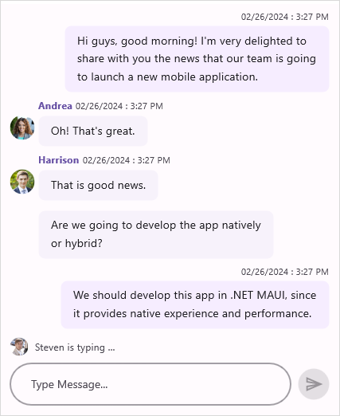

# Overview of .NET MAUI Chat (SfChat)

The Syncfusion .NET MAUI Chat control offers a contemporary conversational chatbot experience, allowing for flexible customization of the layout to display conversations between two or more users.

## Key features

* **Message types:** Incorporated functionality for diverse message formats including text, calendar, date picker, time picker, and clickable hyperlinks to display a range of message types.
* **Message input area:** Send messages to users by interacting with the built-in editor and button at the bottom of the chat control.
* **Time break:** Organizes chat messages into groups according to the timestamp denoted by `System.DateTime` indicating when each message was generated.
* **Typing indicator:** Utilizes animation to signify users currently engaged in typing activity.
* **Suggestions :** Includes a selection of options for users to choose from as a response to their message.

