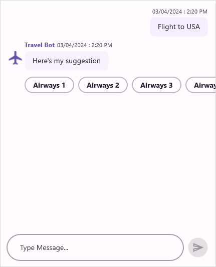

# Suggestions in .NET MAUI Chat (SfChat)

The `SfChat` control allows to display a list of options, as suggestions, either below the current message or at the bottom of the chat control. These suggestions can be presented for all the supported message types in `SfChat`. When a user selects a suggestion item, the [SuggestionItemSelected](https://help.syncfusion.com/cr/maui/Syncfusion.Maui.Chat.SfChat.html#Syncfusion_Maui_Chat_SfChat_SuggestionItemSelected) event and [SuggestionItemSelectedCommand](https://help.syncfusion.com/cr/maui/Syncfusion.Maui.Chat.SfChat.html#Syncfusion_Maui_Chat_SfChat_SuggestionItemSelectedCommand) will be triggered. Both the event and the command will provide the [SuggestionItemSelectedEventArgs](https://help.syncfusion.com/cr/maui/Syncfusion.Maui.Chat.SuggestionItemSelectedEventArgs.html) as arguments, providing the following information about the selected suggestion item.

* [HideAfterSelection](https://help.syncfusion.com/cr/maui/Syncfusion.Maui.Chat.SuggestionItemSelectedEventArgs.html#Syncfusion_Maui_Chat_SuggestionItemSelectedEventArgs_HideAfterSelection): Gets or sets a value indicating whether the suggestions control should be shown or collapsed after an item is selected from the list of suggestions. The default value is true.
* [Message](https://help.syncfusion.com/cr/maui/Syncfusion.Maui.Chat.SuggestionItemSelectedEventArgs.html#Syncfusion_Maui_Chat_SuggestionItemSelectedEventArgs_Message): Gets the instance of the current message for which suggestions was shown.
* [SelectedItem](https://help.syncfusion.com/cr/maui/Syncfusion.Maui.Chat.SuggestionItemSelectedEventArgs.html#Syncfusion_Maui_Chat_SuggestionItemSelectedEventArgs_SelectedItem): Gets the item that was selected from the suggestion control.
* [SuggestionType](https://help.syncfusion.com/cr/maui/Syncfusion.Maui.Chat.SuggestionItemSelectedEventArgs.html#Syncfusion_Maui_Chat_SuggestionItemSelectedEventArgs_SuggestionType): Gets a value that indicates whether the selected item is from an inline suggestion box or from an outline suggestion.

## Showing suggestions in message

Suggestions can be shown in a message by creating a [ChatSuggestion](https://help.syncfusion.com/cr/maui/Syncfusion.Maui.Chat.ChatSuggestions.html) instance and setting it to the desired message's [Message.Suggestions](https://help.syncfusion.com/cr/maui/Syncfusion.Maui.Chat.MessageBase.html#Syncfusion_Maui_Chat_MessageBase_Suggestions) property.




  <?xml version="1.0" encoding="utf-8" ?>
  <ContentPage xmlns="http://schemas.microsoft.com/dotnet/2021/maui"
               xmlns:x="http://schemas.microsoft.com/winfx/2009/xaml"
               xmlns:sfChat="clr-namespace:Syncfusion.Maui.Chat;assembly=Syncfusion.Maui.Chat"
               x:Class="GettingStarted.MainPage">

      <ContentPage.Content>
             <sfChat:SfChat x:Name="sfChat"
                            Messages="{Binding Messages}"
                            CurrentUser="{Binding CurrentUser}"/>
	  <ContentPage.Content>	
  </ContentPage>





   namespace GettingStarted
   {
         public partial class MainPage : ContentPage
         {
            SfChat sfChat;
            SuggestionsViewModel viewModel;
            public MainPage()
            {
              InitializeComponent();
              this.sfChat = new SfChat();
              this.viewModel = new SuggestionsViewModel();
              this.sfChat.Messages = viewModel.Messages;
              this.sfChat.CurrentUser = viewModel.CurrentUser;
              this.Content = sfChat;
             }
         }
    }  






 public class SuggestionsViewModel : INotifyPropertyChanged
 {
      
    /// 

    /// Chat suggestion
    /// 

    private ChatSuggestions chatSuggestions;

    /// 

    /// collection of suggestion items for chat suggestion.
    /// 

    private ObservableCollection<ISuggestion> suggestions;

    public SuggestionsViewModel()
    {
        this.Messages = new ObservableCollection<object>();
        this.CurrentUser = new Author() { Name = "Nancy"};
        
        chatSuggestions = new ChatSuggestions();
        
        suggestions = new ObservableCollection<ISuggestion>();
        suggestions.Add(new Suggestion() { Text = "Airways 1" });
        suggestions.Add(new Suggestion() { Text = "Airways 2" });
        suggestions.Add(new Suggestion() { Text = "Airways 3" });
        suggestions.Add(new Suggestion() { Text = "Airways 4" });
        suggestions.Add(new Suggestion() { Text = "Airways 5" });
        suggestions.Add(new Suggestion() { Text = "Airways 6" });
        chatSuggestions.Items = suggestions;
        this.GenerateMessages();
     }

    ...

    private void GenerateMessages()
    {
        this.Messages.Add(new TextMessage()
        {
            Author = CurrentUser,
            Text = "Flight to USA",
        });

        this.Messages.Add(new TextMessage()
        {
            Author = new Author() { Avatar = "Aeroplane.png", Name = "Travel Bot" },
            Text = "Here's my suggestion",
            Suggestions = chatSuggestions,
        });   
     }
 }




### Add an image in suggestion item

In the SfChat control, you can include an image in the suggestion list by assigning an image source to the [Suggestion.Image](https://help.syncfusion.com/cr/maui/Syncfusion.Maui.Chat.Suggestion.html#Syncfusion_Maui_Chat_Suggestion_Image) property



    public class SuggestionsViewViewModel :INotifyPropertyChanged
    {

       /// Chat suggestion
       /// 

       private ChatSuggestions chatSuggestions;

       /// 

       /// collection of suggestion items for chat suggestion.
       /// 

       private ObservableCollection<ISuggestion> suggestions;

       public SuggestionsViewModel()
       {
           this.messages = new ObservableCollection<object>();
           this.currentUser = new Author() { Name = "Nancy"};
        
           chatSuggestions = new ChatSuggestions();
        
          suggestions = new ObservableCollection<ISuggestion>();
          suggestions.Add(new Suggestion("Airways 1", "Flight1.png"));
          suggestions.Add(new Suggestion("Airways 2", "Flight2.png"));
          suggestions.Add(new Suggestion("Airways 3", "Flight3.png"));
          suggestions.Add(new Suggestion("Airways 4", "Flight4.png"));
          suggestions.Add(new Suggestion("Airways 5", "Flight5.png"));
          suggestions.Add(new Suggestion("Airways 6", "Flight6.png"));
          chatSuggestions.Items = suggestions;
          this.GenerateMessages();
        }

      ...   

      private void GenerateMessages()
      {
         this.Messages.Add(new TextMessage()
         {
             Author = CurrentUser,
             Text = "Flight to USA",
         });

         this.messages.Add(new TextMessage()
         {
             Author = new Author() { Avatar ="Aeroplane.png", Name = "Travel Bot" },
             Text = "Here's my suggestion",
             Suggestions = chatSuggestions,
         });   
       }
    }




### Change the orientation of suggestions

You can choose to show the suggestion items in horizontal or vertical orientation using the [ChatSuggestions.Orientation](https://help.syncfusion.com/cr/maui/Syncfusion.Maui.Chat.ChatSuggestions.html#Syncfusion_Maui_Chat_ChatSuggestions_Orientation) property.



     public SuggestionsViewModel()
     {

        ChatSuggestions = new ChatSuggestions();

        suggestions = new ObservableCollection<ISuggestion>();
        suggestions.Add(new Suggestion("Airways 1", "Flight1.png"));
        suggestions.Add(new Suggestion("Airways 2", "Flight2.png"));
        suggestions.Add(new Suggestion("Airways 3", "Flight3.png"));
        suggestions.Add(new Suggestion("Airways 4", "Flight4.png"));
        suggestions.Add(new Suggestion("Airways 5", "Flight5.png"));
        suggestions.Add(new Suggestion("Airways 6", "Flight6.png"));

        ChatSuggestions.Items = suggestions;
        chatSuggestions.Orientation = SuggestionsOrientation.Vertical;
      
      }
 



## Showing suggestions at bottom of chat control

The SfChat allows to show a list of options as suggestions at the bottom of chat control by creating a [ChatSuggestion](https://help.syncfusion.com/cr/maui/Syncfusion.Maui.Chat.ChatSuggestions.html) instance and setting it to the [Suggestions](https://help.syncfusion.com/cr/maui/Syncfusion.Maui.Chat.SfChat.html#Syncfusion_Maui_Chat_SfChat_Suggestions) property.


   
 ?xml version="1.0" encoding="utf-8" ?>
 <ContentPage xmlns="http://schemas.microsoft.com/dotnet/2021/maui"
              xmlns:x="http://schemas.microsoft.com/winfx/2009/xaml"
              xmlns:sfChat="clr-namespace:Syncfusion.Maui.Chat;assembly=Syncfusion.Maui.Chat"
              x:Class="GettingStarted.MainPage">

        <ContentPage.Content>
            <sfChat:SfChat x:Name="sfChat"
                           Messages="{Binding Messages}"
                           CurrentUser="{Binding CurrentUser}"
                           Suggestions="{Binding ChatSuggestions}"/>
  	    <ContentPage.Content>
 </ContentPage>




   namespace GettingStarted
   {
       public partial class MainPage : ContentPage
       {
           SfChat sfChat;
           SuggestionsViewModel viewModel;
           public MainPage()
            {
               InitializeComponent();
               this.sfChat = new SfChat();
               this.viewModel = new SuggestionsViewModel();
               this.sfChat.Messages = viewModel.Messages;
               this.sfChat.CurrentUser = viewModel.CurrentUser;
               this.sfChat.Suggestions= viewModel.ChatSuggestions;
               this.Content = sfChat;
            }
        }
    }







    public class SuggestionsViewModel : INotifyPropertyChanged
    {
       
        /// 

        /// Chat suggestion
        /// 

        private ChatSuggestions chatSuggestions;

        /// 

        /// collection of suggestion items for chat suggestion.
        /// 

        private ObservableCollection<ISuggestion> suggestions;

        public SuggestionsViewModel()
        {
           this.messages = new ObservableCollection<object>();
           this.currentUser = new Author() { Name = "Nancy" };

           ChatSuggestions = new ChatSuggestions();

           suggestions = new ObservableCollection<ISuggestion>();
           suggestions.Add(new Suggestion("Airways 1", "Flight1.png"));
           suggestions.Add(new Suggestion("Airways 2", "Flight2.png"));
           suggestions.Add(new Suggestion("Airways 3", "Flight3.png"));
           suggestions.Add(new Suggestion("Airways 4", "Flight4.png"));
           suggestions.Add(new Suggestion("Airways 5", "Flight5.png"));
           suggestions.Add(new Suggestion("Airways 6", "Flight6.png"));

           ChatSuggestions.Items = suggestions;
           this.GenerateMessages();
       }

        ...

        private void GenerateMessages()
        {
           this.Messages.Add(new TextMessage()
           {
               Author = CurrentUser,
               Text = "Flight to USA",
           });

           this.Messages.Add(new TextMessage()
           {
               Author = new Author() { Avatar = "Aeroplane.png", Name = "Travel Bot" },
               Text = "Here's my suggestion",
            });   
        }
    }




## Cancel the suggestions from closing

By default, the suggestions list in the `SfChat` closes automatically after the user selects an option from the list. If you wish to prevent this behavior and keep the suggestions list open even after selection, you can set the [SuggestionItemSelectedEventArgs.HideAfterSelection](https://help.syncfusion.com/cr/maui/Syncfusion.Maui.Chat.SuggestionItemSelectedEventArgs.html#Syncfusion_Maui_Chat_SuggestionItemSelectedEventArgs_HideAfterSelection) to `false` within the [SuggestionItemSelected](https://help.syncfusion.com/cr/maui/Syncfusion.Maui.Chat.SfChat.html#Syncfusion_Maui_Chat_SfChat_SuggestionItemSelected) event handler or the [SuggestionItemSelectedCommand](https://help.syncfusion.com/cr/maui/Syncfusion.Maui.Chat.SfChat.html#Syncfusion_Maui_Chat_SfChat_SuggestionItemSelectedCommand) command's execution. This ensures that the suggestions list remains visible for further interaction after an option is chosen by the user.

**SuggestionItemSelected event**



    this.sfChat.SuggestionItemSelected += this.SfChat_SuggestionItemSelected;

    /// 

    /// Raised when current user has selected the suggestion option from suggestion list.
    /// 

    /// <param name="sender"><see cref="SfChat"/> as sender</param>
    /// <param name="e"><see cref="SuggestionItemSelectedEventArgs"/> as parameter</param>
    private void SfChat_SuggestionItemSelected(object sender, SuggestionItemSelectedEventArgs e)
    {
        // Suggestion list not closed after selection.
        e.HideAfterSelection = false;
    }




**SuggestionItemSelectedCommand command**



 <?xml version="1.0" encoding="utf-8" ?>
 <ContentPage xmlns="http://schemas.microsoft.com/dotnet/2021/maui"
              xmlns:x="http://schemas.microsoft.com/winfx/2009/xaml"
              xmlns:sfChat=clr-namespace:Syncfusion.Maui.Chat;assembly=Syncfusion.Maui.Chat"
              x:Class="GettingStarted.MainPage">

        <ContentPage.Content>
             <sfChat:SfChat x:Name="sfChat"
                            Messages="{Binding Messages}"                
                            CurrentUser="{Binding CurrentUser}"
                            SuggestionItemSelectedCommand="{Binding SuggestionItemSelectedCommand}"/>
        </ContentPage.Content>
 </ContentPage>






    public class SuggestionsViewModel : INotifyPropertyChanged
    {
        private ICommand suggestionItemSelectedCommand;

        public SuggestionsViewModel()
        {
            SuggestionItemSelectedCommand = new Command(ExecuteSuggestion,CanExecuteSuggestion);
        }

        /// 

        /// Gets or sets the suggestion item selected command.
        /// 

        public ICommand SuggestionItemSelectedCommand
        {
            get
            {
                return this.suggestionItemSelectedCommand;
            }  
            set
            {
                this.suggestionItemSelectedCommand = value;
            }
        }

        public void Execute(object parameter)
        {
           var args = parameter as SuggestionItemSelectedEventArgs;
           // Suggestion list not closed after selection.
           args.HideAfterSelection = false;
        }
    }




## Prevent the chosen suggestion from being sent automatically.

By default, when tapping or clicking the suggestion item, it will be sent as an outgoing message immediately. So, if you wish to prevent this behavior and show the suggestions list in editor view, you can set the [SuggestionItemSelectedEventArgs.CancelSendMessage](https://help.syncfusion.com/cr/maui/Syncfusion.Maui.Chat.SuggestionItemSelectedEventArgs.html#Syncfusion_Maui_Chat_SuggestionItemSelectedEventArgs_CancelSendMessage) to `true` within the `SuggestionItemSelected` event handler or the `SfChat.SuggestionItemSelectedCommand` command's execution.

**SuggestionItemSelected event**



    this.sfChat.SuggestionItemSelected += this.SfChat_SuggestionItemSelected;

    /// 

    /// Raised when current user has selected the suggestion option from suggestion list.
    /// 

    /// <param name="sender"><see cref="SfChat"/> as sender</param>
    /// <param name="e"><see cref="SuggestionItemSelectedEventArgs"/> as parameter</param>
    private void SfChat_SuggestionItemSelected(object sender, SuggestionItemSelectedEventArgs e)
    {
        // After tapping or clicking the suggestion item,it will be visible in editor view.
        e.CancelSendMessage = true;
    }




**SuggestionItemSelectedCommand command**



 <?xml version="1.0" encoding="utf-8" ?>
 <ContentPage xmlns="http://schemas.microsoft.com/dotnet/2021/maui"
              xmlns:x="http://schemas.microsoft.com/winfx/2009/xaml"
              xmlns:sfChat=clr-namespace:Syncfusion.Maui.Chat;assembly=Syncfusion.Maui.Chat"
              x:Class="GettingStarted.MainPage">

        <ContentPage.Content>
             <sfChat:SfChat x:Name="sfChat"
                            Messages="{Binding Messages}"                
                            CurrentUser="{Binding CurrentUser}"
                            SuggestionItemSelectedCommand="{Binding SuggestionItemSelectedCommand}"/>
        </ContentPage.Content>
 </ContentPage>






    public class SuggestionsViewModel : INotifyPropertyChanged
    {
        private ICommand suggestionItemSelectedCommand;

        public SuggestionsViewModel()
        {
            SuggestionItemSelectedCommand = new Command(ExecuteSuggestion);
        }

        /// 

        /// Gets or sets the suggestion item selected command.
        /// 

        public ICommand SuggestionItemSelectedCommand
        {
            get
            {
                return this.suggestionItemSelectedCommand;
            }  
            set
            {
                this.suggestionItemSelectedCommand = value;
            }
        }

        /// 

        /// Executes the action when a suggestion item is selected.
        /// 

        public void ExecuteSuggestion(object parameter)
        {
           var args = parameter as SuggestionItemSelectedEventArgs;
           // Selected suggestion item will be shown in editor view.
           args.CancelSendMessage = true;
        }
    }



