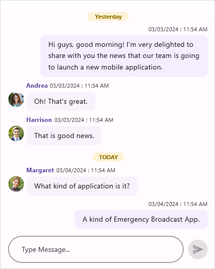

# Time break in .Net MAUI Chat (SfChat)

The SfChat provides a simple way to organize messages by their date and time of creation, allowing users to easily identify messages in the order they were created. To display the time break view in SfChat, set the `ShowTimeBreak` property to `true`.



  <sfChat:SfChat x:Name="sfChat"
                 ShowTimeBreak="True"
                 Messages="{Binding Messages}"
                 CurrentUser="{Binding CurrentUser}" />
    



 this.sfChat.ShowTimeBreak = true;




## Stick time break view

To stick the time break view, enable the `StickyTimeBreak` property. When `StickyTimeBreak` is set to `true`, the time break view will remain displayed until the preceding time break view is no longer visible. Additionally, the time break will adjust its position as another time break appears while scrolling.



  <sfChat:SfChat x:Name="sfChat"
                 ShowTimeBreak="True"
                 StickyTimeBreak="True" />
   



 this.sfChat.ShowTimeBreak = true;
 this.sfChat.StickyTimeBreak = true;
   



## Template for time break view

The `SfChat` allows to load custom template for time break view using the `TimeBreakTemplate` property.



<?xml version="1.0" encoding="utf-8" ?>
<ContentPage xmlns="http://schemas.microsoft.com/dotnet/2021/maui"
             xmlns:x="http://schemas.microsoft.com/winfx/2009/xaml"
             xmlns:sfChat="clr-namespace:Syncfusion.Maui.Chat;assembly=Syncfusion.Maui.Chat"
             xmlns:local="clr-namespace:GettingStarted"
             x:Class="GettingStarted.MainPage">

    <ContentPage.Resources>
        <local:TimeBreakTemplateSelector x:Key="timeBreakTemplateSelector"/>
    </ContentPage.Resources>
    
    <ContentPage.BindingContext>
        <local:GettingStartedViewModel/>
    </ContentPage.BindingContext>

    <ContentPage.Content>
        <sfChat:SfChat x:Name="sfChat"                   
                       ShowTimeBreak="True"
                       Messages="{Binding Messages}"
                       CurrentUser="{Binding CurrentUser}" 
                       TimeBreakTemplate="{StaticResource timeBreakTemplateSelector}"/>
    </ContentPage.Content>
</ContentPage>




    namespace GettingStarted
    {
      public partial class MainPage : ContentPage
      {
          SfChat sfChat;
          GettingStartedViewModel viewModel;
          public MainPage()
          {
              InitializeComponent();
              sfChat = new SfChat();
              viewModel = new GettingStartedViewModel();
              this.sfChat.Messages = viewModel.Messages;
              this.sfChat.CurrentUser = viewModel.CurrentUser;
              this.sfChat.ShowTimeBreak="True";
              this.sfChat.TimeBreakTemplate = new TimeBreakTemplateSelector();
              this.Content = sfChat;
           }
        }
     }







    internal class TimeBreakTemplateSelector : DataTemplateSelector
    {
      /// 

      /// Returns the template based on the message's date time.
      /// 

      /// <param name="item">The <see cref="GroupResult"/> of the grouped row.</param>
      /// <param name="container">The ChatListView as <see cref="BindableObject"/>.</param>
      /// <returns>The <see cref="Border"/> control which contains templates for the grouped row.</returns>

      protected override DataTemplate OnSelectTemplate(object item, BindableObject container)
      {
        string dateString = (item as GroupResult).Key.ToString();
        DateTime groupedDate = DateTime.ParseExact(dateString, "d/M/yyyy", CultureInfo.InvariantCulture);
        string formatDate = string.Format("{0:dd MMMM yyyy}", groupedDate);

       Grid grid = new Grid();
       grid.Padding = new Thickness(3, 4, 2, 0);

       grid.RowDefinitions = new RowDefinitionCollection()
       {
          new RowDefinition(){Height = 20},
       };

      grid.ColumnDefinitions = new ColumnDefinitionCollection()
      {
        new ColumnDefinition(){ Width = GridLength.Star},
        new ColumnDefinition(){ Width = GridLength.Auto},
        new ColumnDefinition(){ Width = GridLength.Star},
      };

     Border border = new Border();
     border.VerticalOptions = LayoutOptions.Center;
     border.HorizontalOptions = LayoutOptions.Center;
     border.Stroke = Color.FromHex("#FDE490");
   
     Label label = new Label();
     label.FontSize = 11;
     label.VerticalOptions = LayoutOptions.Center;
     label.HorizontalOptions = LayoutOptions.Center;
     label.HorizontalTextAlignment = TextAlignment.Center;
     label.TextColor = Color.FromHex("#98770E");
     label.FontAttributes = FontAttributes.Bold;
     label.BackgroundColor = Color.FromHex("#FDF4D6");

     border.Content = label;

     grid.Children.Add(new StackLayout() { HeightRequest = 1, Background =  Colors.LightGray, VerticalOptions = LayoutOptions.Center, Margin= 5 });
     var boxview = new StackLayout() { HeightRequest = 1, Background =   Colors.LightGray, VerticalOptions = LayoutOptions.Center, Margin = 5 };
     grid.Children.Add(boxview);
     Grid.SetColumn(boxview, 2);

     if (groupedDate.Date == DateTime.Now.Date)
     {
        label.WidthRequest = 60;
        label.Text = "TODAY";
        grid.Children.Add(border);
        Grid.SetColumn(border, 1);
        return new DataTemplate(() =>
        {
            return grid;
        });
     }
     else if (groupedDate.Date == new DateTime(DateTime.Now.Year,DateTime.Now.Month, DateTime.Now.Day - 1))
      {
         label.WidthRequest = 80;
         label.Text = "Yesterday";
         grid.Children.Add(border);
         Grid.SetColumn(border, 1);
         return new DataTemplate(() =>
         {
            return grid;
         });
       }
       else
       {
         label.WidthRequest = 120;
         label.Text = formatDate;
         grid.Children.Add(border);
         Grid.SetColumn(border, 1);
         return new DataTemplate(() =>
         {
            return grid;
         });
        }
      }
    }




      